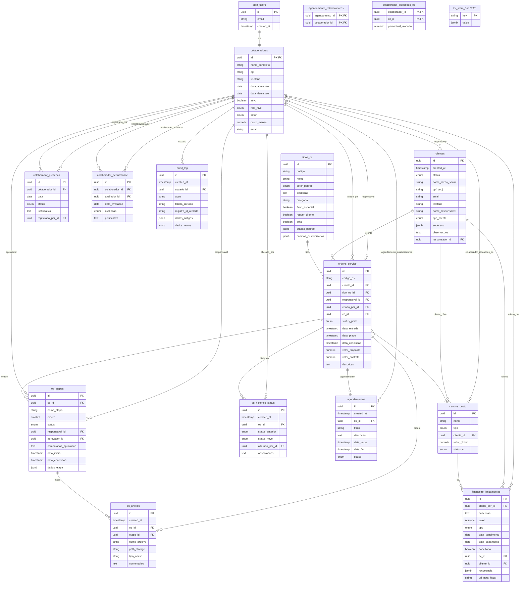

# Diagrama ER - Minerva ERP Backend

**Data:** 18/11/2024
**Análise completa do schema do banco de dados**

---

## Diagrama Entidade-Relacionamento (Mermaid)



---

## Tabelas por Módulo

### 🔐 Autenticação e Usuários
- `auth.users` (Supabase Auth)
- `colaboradores`

### 👥 Clientes e Leads
- `clientes`

### 📋 Ordens de Serviço (Core)
- `tipos_os`
- `ordens_servico`
- `os_etapas`
- `os_anexos`

### 💰 Financeiro
- `centros_custo`
- `financeiro_lancamentos`
- `colaborador_alocacoes_cc`

### 📅 Agendamento
- `agendamentos`
- `agendamento_colaboradores`

### 📊 Auditoria e Histórico
- `audit_log`
- `os_historico_status`
- `colaborador_presenca`
- `colaborador_performance`

### 🗄️ Armazenamento
- `kv_store_5ad7fd2c` (Key-Value Store)

---

## ENUMs Definidos

### user_role_nivel
```
COLABORADOR
COORDENADOR
GESTOR
DIRETOR
```

### setor_colaborador
```
ASSESORIA
OBRAS
FINANCEIRO
COMERCIAL
```

### cliente_status
```
LEAD
CLIENTE_ATIVO
CLIENTE_INATIVO
```

### tipo_cliente
```
PESSOA_FISICA
CONDOMINIO
CONSTRUTORA
INCORPORADORA
INDUSTRIA
COMERCIO
OUTRO
```

### os_status_geral
```
EM_TRIAGEM
AGUARDANDO_INFORMACOES
EM_ANDAMENTO
EM_VALIDACAO
ATRASADA
CONCLUIDA
CANCELADA
```

### os_etapa_status
```
PENDENTE
EM_ANDAMENTO
AGUARDANDO_APROVACAO
APROVADA
REJEITADA
CONCLUIDA
```

### agendamento_status
```
AGENDADO
EM_ANDAMENTO
CONCLUIDO
CANCELADO
```

### tipo_lancamento
```
RECEITA
DESPESA
```

### tipo_centro_custo
```
OBRA
ADMINISTRATIVO
LABORATORIO
COMERCIAL
GERAL
```

### avaliacao_performance
```
EXCELENTE
BOM
REGULAR
INSATISFATORIO
```

### status_presenca
```
PRESENTE
FALTA
FALTA_JUSTIFICADA
ATESTADO
FERIAS
```

---

## Relacionamentos Principais

### 1:1
- `auth.users` ↔ `colaboradores`

### 1:N (Um para Muitos)
- `colaboradores` → `clientes` (responsável)
- `colaboradores` → `ordens_servico` (responsável, criado_por)
- `clientes` → `ordens_servico`
- `tipos_os` → `ordens_servico`
- `ordens_servico` → `os_etapas`
- `ordens_servico` → `os_anexos`
- `os_etapas` → `os_anexos`
- `centros_custo` → `ordens_servico`

### N:M (Muitos para Muitos)
- `agendamentos` ↔ `colaboradores` (via `agendamento_colaboradores`)
- `colaboradores` ↔ `centros_custo` (via `colaborador_alocacoes_cc`)

---

## Índices Recomendados (ainda não implementados)

```sql
-- Performance em queries de OS
CREATE INDEX idx_os_status ON ordens_servico(status_geral);
CREATE INDEX idx_os_cliente ON ordens_servico(cliente_id);
CREATE INDEX idx_os_responsavel ON ordens_servico(responsavel_id);
CREATE INDEX idx_os_created ON ordens_servico(data_entrada);
CREATE INDEX idx_os_tipo ON ordens_servico(tipo_os_id);

-- Performance em etapas
CREATE INDEX idx_etapas_os ON os_etapas(os_id);
CREATE INDEX idx_etapas_status ON os_etapas(status);
CREATE INDEX idx_etapas_responsavel ON os_etapas(responsavel_id);
CREATE INDEX idx_etapas_ordem ON os_etapas(os_id, ordem);

-- Performance em anexos
CREATE INDEX idx_anexos_os ON os_anexos(os_id);
CREATE INDEX idx_anexos_etapa ON os_anexos(etapa_id);

-- Performance em clientes
CREATE INDEX idx_clientes_status ON clientes(status);
CREATE INDEX idx_clientes_responsavel ON clientes(responsavel_id);
CREATE INDEX idx_clientes_cpf_cnpj ON clientes(cpf_cnpj);

-- Performance em financeiro
CREATE INDEX idx_lancamentos_vencimento ON financeiro_lancamentos(data_vencimento);
CREATE INDEX idx_lancamentos_cc ON financeiro_lancamentos(cc_id);
CREATE INDEX idx_lancamentos_tipo ON financeiro_lancamentos(tipo);
CREATE INDEX idx_lancamentos_conciliado ON financeiro_lancamentos(conciliado);

-- Performance em auditoria
CREATE INDEX idx_audit_usuario ON audit_log(usuario_id);
CREATE INDEX idx_audit_tabela ON audit_log(tabela_afetada);
CREATE INDEX idx_audit_data ON audit_log(created_at);
```

---

## Campos JSONB (Estruturas Flexíveis)

### clientes.endereco
```json
{
  "rua": "string",
  "numero": "string",
  "complemento": "string",
  "bairro": "string",
  "cidade": "string",
  "estado": "string",
  "cep": "string"
}
```

### os_etapas.dados_etapa
```json
{
  "campo_custom_1": "valor",
  "campo_custom_2": "valor",
  "anexos_ids": ["uuid1", "uuid2"]
}
```

### tipos_os.etapas_padrao
```json
[
  {
    "ordem": 1,
    "nome": "Follow-up 1",
    "campos": ["idade_edificacao", "motivo_visita"]
  },
  {
    "ordem": 2,
    "nome": "Aprovação Comercial",
    "campos": ["valor_proposta"]
  }
]
```

### financeiro_lancamentos.recorrencia
```json
{
  "tipo": "mensal",
  "dia": 5,
  "meses": 12
}
```

---

**Gerado pela análise automatizada do backend**
