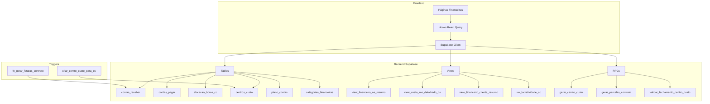
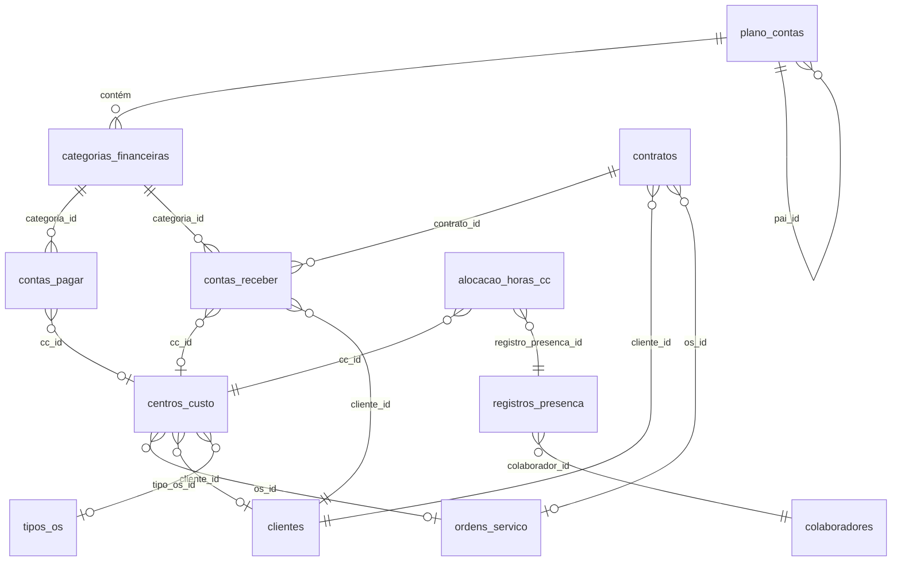

# 🏗️ Arquitetura do Módulo Financeiro

> **Última Atualização:** 2026-01-25

---

## 📊 Visão Geral da Arquitetura

O módulo financeiro segue uma arquitetura em camadas que integra:

1. **Frontend** → React + TanStack Router + React Query
2. **Backend** → Supabase (PostgreSQL + Edge Functions)
3. **Integrações** → OS, Contratos, Presença, Centro de Custo

---

## 🔄 Fluxo de Dados



---

## 🧩 Componentes do Sistema

### Camada de Apresentação (Frontend)

| Componente | Rota | Propósito |
|------------|------|-----------|
| `FinanceiroDashboardPage` | `/financeiro` | KPIs + Gráficos comparativos |
| `ReceitasRecorrentesPage` | `/financeiro/receitas-recorrentes` | Contratos + Parcelas pendentes |
| `FaturasRecorrentesPage` | `/financeiro/faturas-recorrentes` | Despesas + Folha de pagamento |
| `FluxoCaixaPage` | `/financeiro/fluxo-caixa` | Projeção diária + Calendário |
| `CustoMaoDeObraPage` | `/financeiro/custo-mao-de-obra` | Custo MO por CC/Colaborador |
| `CentroCustoDetalhesPage` | `/financeiro/centro-custo/$ccId` | Visão 360° do CC |
| `ConciliacaoBancariaPage` | `/financeiro/conciliacao` | ⏸️ Adiado |

### Camada de Dados (Hooks)

| Hook | Arquivo | Propósito |
|------|---------|-----------|
| `useFinanceiroDashboard` | `use-financeiro-dashboard.ts` | KPIs agregados |
| `useReceitasRecorrentes` | `use-receitas-recorrentes.ts` | Contratos ativos |
| `useParcelasPendentes` | `use-receitas-recorrentes.ts` | Parcelas em aberto |
| `useFaturasRecorrentes` | `use-faturas-recorrentes.ts` | Despesas do mês |
| `useFluxoCaixa` | `use-fluxo-caixa.ts` | Projeção de fluxo |
| `useCustoMODetalhado` | `use-custo-mo.ts` | Custo MO por OS |
| `useCentroCusto` | `use-centro-custo.ts` | CRUD de CC |

### Camada de Banco de Dados



---

## 🔗 Integrações

### Centro de Custo ↔ Ordem de Serviço

A criação de uma OS dispara automaticamente a criação de um Centro de Custo via trigger:

```
OS Criada → Trigger criar_centro_custo_para_os() → CC Gerado
                                                     ↓
                                               OS.cc_id = CC.id
```

**Formato do nome do CC:**
```
CC{NUMERO_TIPO_OS}{SEQUENCIAL_3_DIGITOS}-{APELIDO_CLIENTE}
Exemplo: CC13001-SOLAR_I
```

### Contrato ↔ Parcelas

A ativação de um contrato gera parcelas em `contas_receber`:

```
Contrato status='ativo' → Trigger fn_gerar_faturas_contrato() → Parcelas geradas
```

### Presença ↔ Custo de MO

O custo de mão de obra é calculado através de alocação de horas:

```
Registro Presença → Alocação Horas CC → Custo calculado por CC
         ↓                    ↓
   colaborador_id         percentual + valor_calculado
```

---

## 📁 Estrutura de Arquivos

```
src/
├── components/financeiro/
│   ├── centro-custo-detalhes-page.tsx  (749 linhas)
│   ├── conciliacao-bancaria-page.tsx   (574 linhas) ⏸️
│   ├── custo-mao-de-obra-page.tsx      (480 linhas)
│   ├── faturas-recorrentes-page.tsx    (945 linhas)
│   ├── financeiro-dashboard-page.tsx   (507 linhas)
│   ├── fluxo-caixa-page.tsx            (620 linhas)
│   ├── receitas-recorrentes-page.tsx   (800 linhas)
│   ├── kpi-card-financeiro.tsx         (componente KPI)
│   └── modals/
│       └── nova-despesa-modal.tsx
│
├── lib/hooks/
│   ├── use-financeiro-dashboard.ts     (219 linhas)
│   ├── use-receitas-recorrentes.ts     (298 linhas)
│   ├── use-faturas-recorrentes.ts      (454 linhas)
│   ├── use-fluxo-caixa.ts              (403 linhas)
│   ├── use-custo-mo.ts                 (261 linhas)
│   └── use-centro-custo.ts             (276 linhas)
│
└── routes/_auth/financeiro/
    ├── index.tsx                        → Dashboard
    ├── receitas-recorrentes.tsx
    ├── faturas-recorrentes.tsx
    ├── fluxo-caixa.tsx
    ├── custo-mao-de-obra.tsx
    ├── conciliacao.tsx                  ⏸️
    └── centro-custo.$ccId.tsx
```

---

## 🔐 Considerações de Segurança

1. **RLS (Row Level Security)**: Atualmente desabilitado nas tabelas financeiras. Recomendado habilitar antes de produção.

2. **Funções SECURITY DEFINER**: 
   - `criar_centro_custo_para_os` executa com privilégios elevados para garantir criação automática de CC.

3. **Validações**:
   - Fechamento de CC só permitido com todas as contas conciliadas
   - NF obrigatória para despesas quando `exige_nf=true` no plano de contas
