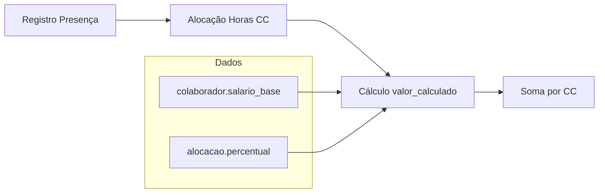
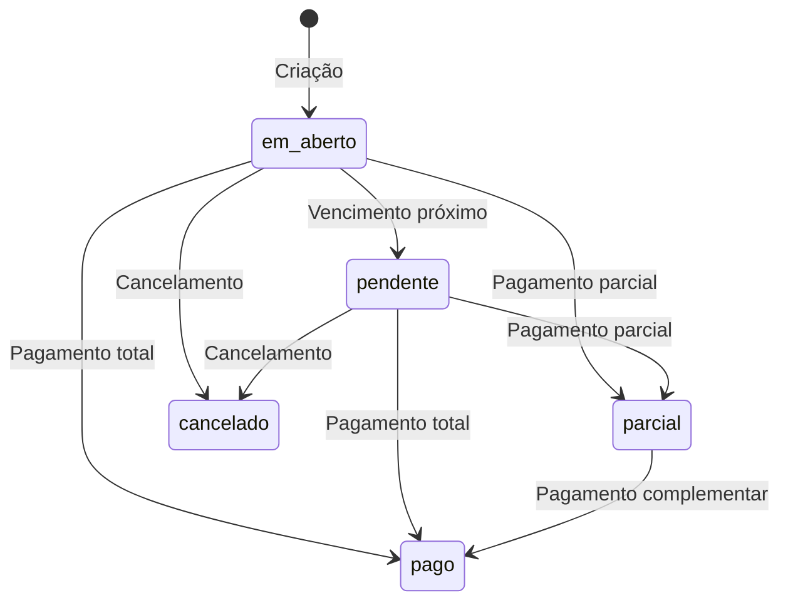
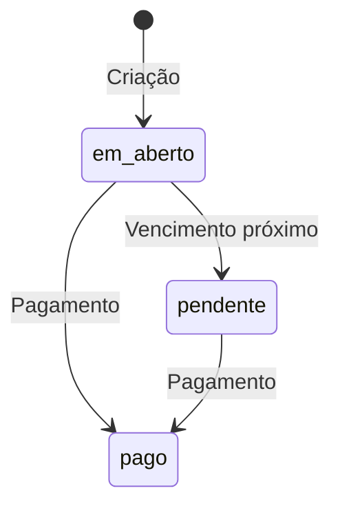

# 📐 Regras de Negócio - Módulo Financeiro

> **Última Atualização:** 2026-01-25

---

## 📋 Índice

1. [Cálculos de Lucratividade](#cálculos-de-lucratividade)
2. [Custo de Mão de Obra](#custo-de-mão-de-obra)
3. [Geração de Parcelas](#geração-de-parcelas)
4. [Fluxo de Caixa](#fluxo-de-caixa)
5. [Encargos e Folha de Pagamento](#encargos-e-folha-de-pagamento)
6. [Status e Transições](#status-e-transições)

---

## Cálculos de Lucratividade

### Fórmulas Principais

```
Custo Total = Despesas Operacionais + Custo MO

Lucro Bruto Previsto = Receita Prevista - Custo Total
Lucro Bruto Realizado = Receita Realizada - (Despesas Pagas + Custo MO)

Margem Prevista (%) = (Lucro Bruto Previsto / Receita Prevista) × 100
Margem Realizada (%) = (Lucro Bruto Realizado / Receita Realizada) × 100
```

### Por Centro de Custo

| Componente | Origem |
|------------|--------|
| Receita Prevista | Soma de `contas_receber.valor_previsto` onde `cc_id = CC` |
| Receita Realizada | Soma de `contas_receber.valor_recebido` onde `cc_id = CC` |
| Despesas Operacionais | Soma de `contas_pagar.valor` onde `cc_id = CC` |
| Despesas Pagas | Soma de `contas_pagar.valor` onde `cc_id = CC` e `status = 'pago'` |
| Custo MO | Soma de `alocacao_horas_cc.valor_calculado` onde `cc_id = CC` |

### Por Cliente

Agregação de todos os CCs vinculados ao cliente.

### Por OS

Agregação do CC vinculado à OS.

---

## Custo de Mão de Obra

### Fórmula de Alocação

```
Custo Dia Colaborador = Salário Base / Dias Úteis do Mês (geralmente 22)

Custo Alocado = Custo Dia × (Percentual Alocado / 100)
```

### Fluxo de Cálculo



### Regras

1. Um registro de presença pode ser alocado em **múltiplos CCs** (rateio)
2. A soma dos percentuais de um registro não precisa ser 100%
3. O `valor_calculado` é calculado no momento da alocação

### Exemplo

```
Colaborador: João
Salário Base: R$ 3.300,00
Custo Dia: R$ 3.300 / 22 = R$ 150,00

Alocações do dia 15/01:
- CC13001-SOLAR_I: 60% → R$ 90,00
- CC13002-PARQUE: 40% → R$ 60,00
```

---

## Geração de Parcelas

### Trigger de Contrato

Quando um contrato muda para `status = 'ativo'`:

1. **Verificar idempotência** - Se já existem parcelas, não duplicar
2. **Gerar entrada** (se `valor_entrada > 0`)
3. **Gerar N parcelas** baseado em `parcelas_total`
4. **Calcular vencimentos** usando `dia_vencimento`

### Fórmulas

```
Valor Parcela = (Valor Total - Valor Entrada) / Parcelas Total

Vencimento Parcela N = data_inicio + (N meses)
                       ajustado para dia_vencimento
```

### Numeração

```
Entrada: Parcela 0/12 (se houver)
Parcela 1: 1/12
Parcela 2: 2/12
...
Parcela 12: 12/12
```

---

## Fluxo de Caixa

### Projeção Diária

Para cada dia no período:

```
Entradas = Soma de contas_receber.valor_previsto com vencimento no dia
Saídas = Soma de contas_pagar.valor com vencimento no dia

Saldo Dia = Entradas - Saídas
Saldo Acumulado = Saldo Anterior + Saldo Dia
```

### Saldo Atual

```
Saldo Atual = Total Recebido até Hoje - Total Pago até Hoje

Total Recebido = Soma de contas_receber.valor_recebido onde status = 'pago'
Total Pago = Soma de contas_pagar.valor onde status = 'pago'
```

### Dias Críticos

Dias onde o `Saldo Acumulado` projetado fica negativo.

---

## Encargos e Folha de Pagamento

### Fórmulas

```
Encargos Estimados = Salário Base × 46%

Benefícios = R$ 450,00 (fixo padrão)

Custo Total Colaborador = Salário Base + Encargos + Benefícios
```

### Composição dos 46% de Encargos

| Encargo | % Aproximado |
|---------|-------------|
| INSS Patronal | 20.0% |
| FGTS | 8.0% |
| SAT/RAT | 3.0% |
| Sistema S | 3.0% |
| Férias + 1/3 | 11.0% |
| 13º Salário | 8.3% |
| Outros | ~3.0% |

### Folha de Pagamento do Mês

```
Folha Total = Σ (Custo Total de cada Colaborador Ativo)
```

---

## Status e Transições

### Contas a Receber (`contas_receber`)



| Status | Descrição |
|--------|-----------|
| `em_aberto` | Aguardando vencimento |
| `pendente` | Vencido, não pago |
| `parcial` | Recebido parcialmente |
| `pago` | Totalmente recebido |
| `cancelado` | Cancelado/Estornado |

### Contas a Pagar (`contas_pagar`)



| Status | Descrição |
|--------|-----------|
| `em_aberto` | Aguardando vencimento |
| `pendente` | Vencido, não pago |
| `pago` | Efetivamente pago |

### Identificação de Atraso

```
isAtrasado = (vencimento < HOJE) AND (status NOT IN ['pago', 'cancelado'])
```

---

## 📊 KPIs Calculados

### Dashboard Financeiro

| KPI | Fórmula |
|-----|---------|
| Previsão Receita Mês | Σ `valor_previsto` do mês |
| Receita Realizada Mês | Σ `valor_recebido` do mês |
| Previsão Despesas Mês | Σ `valor` despesas do mês |
| Despesas Pagas Mês | Σ `valor` despesas pagas do mês |
| A Receber Hoje | Σ `valor_previsto` vencendo hoje, não pago |
| A Pagar Hoje | Σ `valor` vencendo hoje, não pago |
| Lucro Mês | Receita Realizada - Despesas Pagas |
| Margem Mês | (Lucro / Receita Realizada) × 100 |

### Receitas

| KPI | Fórmula |
|-----|---------|
| Total Receitas Mês | Σ `valor_previsto` do mês |
| Recebido Mês | Σ `valor_recebido` do mês |
| Pendente Mês | Σ (`valor_previsto` - `valor_recebido`) não pagos |
| Atrasado | Σ valores vencidos e não pagos |
| Contratos Ativos | Count de contratos com status ativo |
| Ticket Médio | Total Receitas / Contratos Ativos |

### Despesas

| KPI | Fórmula |
|-----|---------|
| Total Faturas Mês | Σ despesas do mês + Folha de Pagamento |
| Pago Mês | Σ despesas pagas do mês |
| Pendente Mês | Σ despesas não pagas do mês + Folha |
| Atrasado | Σ despesas vencidas e não pagas |
| Folha Pagamento | Σ custo total de colaboradores ativos |
| Contas Fixas | Σ despesas do mês (sem folha) |
