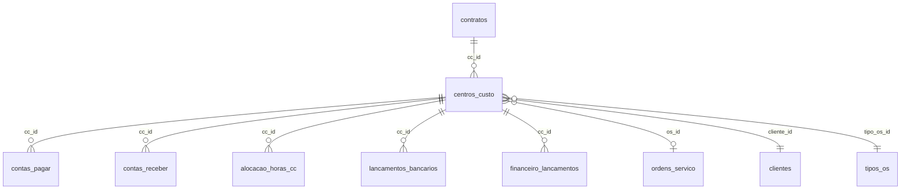
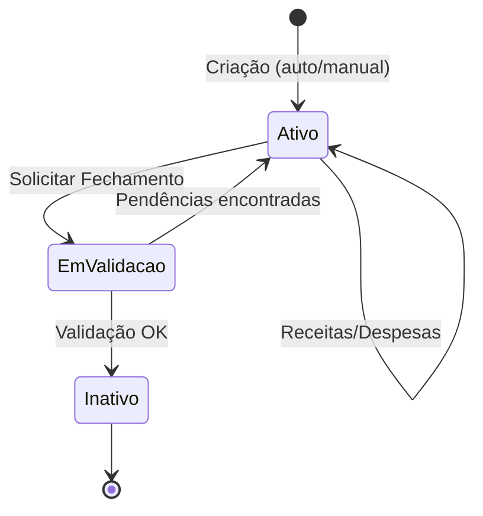

# 🏷️ Centro de Custo - Documentação Técnica e Funcional

> **Última Atualização:** 2026-01-29  
> **Fonte de Dados:** Supabase MCP (Deep Discovery)

---

## 📋 Visão Geral

O **Centro de Custo (CC)** é a entidade central de rastreamento financeiro do sistema Minerva. Todo lançamento financeiro (receita/despesa) e alocação de mão de obra deve estar vinculado a um CC para permitir:

- Cálculo de **lucratividade por OS/Cliente**
- **Rateio de custos** entre projetos
- **Prestação de contas** por contrato

---

## 📊 Arquitetura de Dados

### Tabela Principal: `centros_custo`

| Coluna | Tipo | Nullable | Default | Descrição |
|--------|------|----------|---------|-----------|
| `id` | uuid | NO | `gen_random_uuid()` | Identificador único (pode ser = ID da OS) |
| `nome` | text | NO | - | Código formatado (ex: `CC13001-SOLAR_I`) |
| `tipo` | text | YES | - | `'fixo'` ou `'variavel'` |
| `valor_global` | numeric | YES | `0` | Valor total do contrato |
| `cliente_id` | uuid | YES | FK → `clientes` | Cliente associado |
| `tipo_os_id` | uuid | YES | FK → `tipos_os` | Tipo de OS que originou |
| `os_id` | uuid | YES | FK → `ordens_servico` | OS vinculada |
| `descricao` | text | YES | - | Descrição livre |
| `ativo` | boolean | YES | `true` | Status ativo/inativo |
| `data_inicio` | date | YES | `CURRENT_DATE` | Início do período |
| `data_fim` | date | YES | - | Encerramento |
| `created_at` | timestamptz | YES | `now()` | Data criação |
| `updated_at` | timestamptz | YES | `now()` | Última atualização |

### Relacionamentos (Foreign Keys)



**10 FKs identificadas:**
1. `centros_custo.cliente_id` → `clientes.id`
2. `centros_custo.tipo_os_id` → `tipos_os.id`
3. `centros_custo.os_id` → `ordens_servico.id`
4. `contas_pagar.cc_id` → `centros_custo.id`
5. `contas_receber.cc_id` → `centros_custo.id`
6. `contratos.cc_id` → `centros_custo.id`
7. `alocacao_horas_cc.cc_id` → `centros_custo.id`
8. `lancamentos_bancarios.cc_id` → `centros_custo.id`
9. `financeiro_lancamentos.cc_id` → `centros_custo.id`
10. `ordens_servico.cc_id` → `centros_custo.id`

---

## 🔄 Gatilhos de Criação

### 1. Criação Automática via RPC: `gerar_centro_custo()`

**Trigger:** Chamada direta ou via hook `generateCentroCusto()`

```sql
gerar_centro_custo(
  p_tipo_os_id uuid,
  p_cliente_id uuid,
  p_descricao text DEFAULT NULL
) RETURNS TABLE(cc_id uuid, cc_nome text)
```

**Lógica:**
1. Busca código do `tipo_os` (ex: `OS-13`)
2. Extrai número após hífen → `13`
3. Incrementa sequência atômica via tabela `os_sequences` (UPSERT)
4. Formata nome: `CC{numero}{seq:5}-{apelido}` (ex: `CC1300001`)
5. Insere registro em `centros_custo`
6. Retorna `(cc_id, cc_nome)`

### 2. Criação com ID Específico via Hook

**Uso:** Quando `CC.id` deve ser igual ao `OS.id` (padrão recomendado)

```typescript
const { createCentroCustoWithId } = useCentroCusto();

const cc = await createCentroCustoWithId(
  osId,        // ID a usar para CC (= OS ID)
  tipoOsId,    // Tipo de OS
  clienteId,   // Cliente
  'Descrição'  // Opcional
);
```

**Fluxo:**
1. Busca `tipos_os.codigo` → ex: `OS-13`
2. Busca `clientes.apelido` ou primeira palavra de `nome_razao_social`
3. Normaliza texto (UPPERCASE, sem acentos, max 20 chars)
4. Chama RPC `incrementar_sequencia_cc` para sequencial atômico
5. Formata: `CC{tipo}{seq:3}-{TEXTO}` → ex: `CC13001-SOLAR_I`
6. Insere com `id = ccId` (passado)

### 3. Validação Cliente-CC via Trigger

**Trigger:** `trigger_validar_cc_cliente_os` em `ordens_servico` (BEFORE INSERT/UPDATE)

**Regra:** Se uma OS tem `cc_id` e `cliente_id`:
- CC departamental (`cc.cliente_id IS NULL`) → permite qualquer OS
- CC de cliente → `cc.cliente_id` deve ser igual a `os.cliente_id`

---

## 🏷️ Nomenclatura Padrão

**Formato:** `CC{NUMERO_TIPO_OS}{SEQUENCIAL}-{APELIDO_NORMALIZADO}`

| Componente | Descrição | Exemplo |
|------------|-----------|---------|
| `CC` | Prefixo fixo | `CC` |
| `{NUMERO_TIPO}` | Número do tipo OS (2 dígitos) | `13` |
| `{SEQUENCIAL}` | 3-5 dígitos zero-padded | `001`, `00015` |
| `-` | Separador | `-` |
| `{APELIDO}` | Apelido normalizado (max 20 chars) | `SOLAR_I`, `JOAO` |

**Exemplos:**
- `CC13001-SOLAR_I` → OS-13, 1º CC, cliente "Solar I"
- `CC09015-JOAO` → OS-09, 15º CC, cliente "João Silva"
- `CC11003-COND_VERDE` → OS-11, 3º CC, cliente "Condomínio Verde"

---

## 📈 Views de Lucratividade

### `vw_lucratividade_cc`

View principal que agrega:
- **Receitas** (via `vw_receitas_por_cc`)
- **Custos Operacionais** (via `vw_custos_operacionais_por_cc`)
- **Custos de MO** (via `vw_custos_mo_por_cc`)

| Campo | Tipo | Descrição |
|-------|------|-----------|
| `cc_id` | uuid | ID do Centro de Custo |
| `cc_nome` | text | Nome formatado |
| `os_id` | uuid | OS vinculada |
| `codigo_os` | text | Código da OS |
| `valor_contrato` | numeric | Valor global do CC |
| `receita_prevista` | numeric | Soma de `contas_receber.valor_previsto` |
| `receita_realizada` | numeric | Soma de recebimentos conciliados |
| `custo_operacional_total` | numeric | Total de `contas_pagar` |
| `custo_operacional_pago` | numeric | Pagamentos conciliados |
| `custo_mo_total` | numeric | Custo de mão de obra alocada |
| `lucro_previsto` | numeric | Receita prevista - custos |
| `lucro_realizado` | numeric | Receita realizada - custos pagos |
| `margem_prevista_pct` | numeric | % margem prevista |
| `margem_realizada_pct` | numeric | % margem realizada |

### `vw_receitas_por_cc`

```sql
SELECT 
  cc.id AS cc_id,
  cc.nome AS cc_nome,
  cc.os_id,
  os.codigo_os,
  cc.valor_global AS valor_contrato,
  SUM(cr.valor_previsto) AS receita_prevista,
  SUM(CASE WHEN cr.status = 'conciliado' THEN cr.valor_recebido ELSE 0 END) AS receita_realizada,
  COUNT(cr.id) AS total_parcelas,
  COUNT(CASE WHEN cr.status = 'conciliado' THEN 1 END) AS parcelas_pagas,
  COUNT(CASE WHEN cr.status = 'inadimplente' THEN 1 END) AS parcelas_inadimplentes
FROM centros_custo cc
LEFT JOIN ordens_servico os ON os.id = cc.os_id
LEFT JOIN contas_receber cr ON cr.cc_id = cc.id
WHERE cc.ativo = true
GROUP BY cc.id, cc.nome, cc.os_id, os.codigo_os, cc.valor_global;
```

### `vw_custos_operacionais_por_cc`

```sql
SELECT 
  cc.id AS cc_id,
  SUM(cp.valor) AS custo_total,
  SUM(CASE WHEN cp.status = 'pago' THEN cp.valor ELSE 0 END) AS custo_pago,
  SUM(CASE WHEN cp.status = 'em_aberto' THEN cp.valor ELSE 0 END) AS custo_a_pagar,
  COUNT(cp.id) AS total_lancamentos
FROM centros_custo cc
LEFT JOIN contas_pagar cp ON cp.cc_id = cc.id
WHERE cc.ativo = true
GROUP BY cc.id, cc.nome, cc.os_id;
```

### `vw_custos_mo_por_cc`

```sql
SELECT 
  cc.id AS cc_id,
  SUM(ahc.valor_calculado) AS custo_mo_total,
  COUNT(DISTINCT ahc.registro_presenca_id) AS total_alocacoes,
  COUNT(DISTINCT rp.colaborador_id) AS colaboradores_distintos
FROM centros_custo cc
LEFT JOIN alocacao_horas_cc ahc ON ahc.cc_id = cc.id
LEFT JOIN registros_presenca rp ON rp.id = ahc.registro_presenca_id
WHERE cc.ativo = true
GROUP BY cc.id, cc.nome, cc.os_id;
```

---

## ✅ Validação de Fechamento

### Função: `validar_fechamento_centro_custo(p_cc_id)`

Antes de inativar um CC, valida pendências:

```typescript
const { data: validacao } = await supabase
  .rpc('validar_fechamento_centro_custo', { p_cc_id: ccId });

if (validacao.pode_fechar) {
  await supabase
    .from('centros_custo')
    .update({ ativo: false, data_fim: new Date().toISOString() })
    .eq('id', ccId);
} else {
  console.log('Pendências:', validacao.pendencias);
}
```

**Regras validadas:**

| Regra | Descrição |
|-------|-----------|
| Contas a pagar | Todas com `status = 'pago'` |
| NF anexada | `comprovante_url` preenchido quando plano de contas exige NF |
| Contas a receber | Todas com `status IN ('conciliado', 'cancelado')` |

**Retorno:**
```json
{
  "pode_fechar": false,
  "pendencias_count": 2,
  "pendencias": [
    { "id": "...", "tipo": "conta_pagar", "descricao": "...", "problema": "Não conciliado" },
    { "id": "...", "tipo": "conta_receber", "descricao": "...", "problema": "Parcela em aberto" }
  ]
}
```

---

## 🔗 Integrações por Módulo

### Módulo Comercial (Contratos)

| Tabela | Campo | Relacionamento |
|--------|-------|----------------|
| `contratos` | `cc_id` | FK → `centros_custo.id` |

**Fluxo:** Ao criar contrato, pode-se vincular a um CC existente ou criar novo.

### Módulo Financeiro (Conciliação)

| Tabela | Campo | Uso |
|--------|-------|-----|
| `contas_pagar` | `cc_id` | Despesas vinculadas ao CC |
| `contas_receber` | `cc_id` | Receitas vinculadas ao CC |
| `lancamentos_bancarios` | `cc_id` | Transações bancárias classificadas |
| `financeiro_lancamentos` | `cc_id` | Lançamentos gerais |

### Módulo RH (Mão de Obra)

| Tabela | Campo | Uso |
|--------|-------|-----|
| `alocacao_horas_cc` | `cc_id` | Horas trabalhadas alocadas por CC |

**Cálculo de custo MO:**
```
custo_mo = SUM(alocacao_horas_cc.valor_calculado)
```

### Módulo OSs

| OS | Criação de CC | Seleção Manual |
|----|--------------|----------------|
| OS-09 (Req. Compras) | ❌ | ✅ Via `CentroCustoSelector` |
| OS-10 (Req. MO) | ❌ | ✅ Via `CentroCustoSelector` |
| OS-11 (Laudo Pontual) | ✅ Automático | ❌ |
| OS-12 (Assessoria Anual) | ✅ Automático | ❌ |
| OS-13 (Start Contrato) | ✅ Automático | ❌ |
| OS-01 a 04 (Obras) | ❌ | Herda CC da OS pai |

---

## 📁 Componentes Frontend

### Hook: `useCentroCusto`

**Path:** `src/lib/hooks/use-centro-custo.ts`

| Método | Descrição | Parâmetros |
|--------|-----------|------------|
| `createCentroCustoWithId()` | Cria CC com ID específico | `ccId`, `tipoOsId`, `clienteId`, `descricao?` |
| `generateCentroCusto()` | Cria CC (ID gerado pelo banco) | `tipoOsId`, `clienteId`, `descricao?` |
| `listCentrosCusto()` | Lista CCs ativos | - |

### Componente: `CentroCustoSelector`

**Path:** `src/components/shared/centro-custo-selector.tsx`

```typescript
import { CentroCustoSelector } from '@/components/shared/centro-custo-selector';

<CentroCustoSelector
  value={selectedCCId}
  onChange={(ccId, ccData) => handleChange(ccId)}
  showDetails  // Card de detalhes expandido
  required     // Campo obrigatório
  disabled={false}
  placeholder="Selecione um Centro de Custo"
/>
```

**Variante compacta:**
```typescript
<CentroCustoSelectorCompact value={ccId} onChange={handleChange} />
```

### Página: Centro de Custo Detalhes

**Path:** `src/components/financeiro/centro-custo-detalhes-page.tsx`  
**Rota:** `/financeiro/centro-custo/$ccId`

**Features:**
- Resumo financeiro (receitas, despesas, MO)
- Gráficos de evolução mensal
- Listagem de transações vinculadas
- Ações: Fechamento, Exportação

---

## 🚨 Regras de Negócio Críticas

### 1. CC Departamental vs CC de Cliente

| Tipo | `cliente_id` | Uso |
|------|-------------|-----|
| Departamental | `NULL` | Despesas administrativas (aluguel, salários fixos) |
| De Cliente | Preenchido | Vinculado a OSs/Contratos específicos |

### 2. Inativação de CC

> **Não é possível inativar um CC com:**
> - Contas a pagar em aberto
> - Contas a receber não conciliadas
> - NF obrigatória não anexada

### 3. Unicidade de Sequencial

A sequência de CCs é **por tipo de OS**, gerenciada atomicamente via tabela `os_sequences`:

```sql
INSERT INTO os_sequences (tipo_os_id, current_value)
VALUES (p_tipo_os_id, 1)
ON CONFLICT (tipo_os_id)
DO UPDATE SET current_value = os_sequences.current_value + 1
RETURNING current_value;
```

### 4. ID do CC = ID da OS

**Padrão recomendado:** Usar o mesmo UUID para CC e OS facilita joins e consultas.

```typescript
const osId = crypto.randomUUID();
await createCentroCustoWithId(osId, tipoOsId, clienteId);
await criarOS({ id: osId, cc_id: osId, ... });
```

---

## 📊 Ciclo de Vida do CC



**Estados:**
1. **Ativo** (`ativo = true`, `data_fim = NULL`): Recebendo lançamentos
2. **Em Validação**: Processo de fechamento em andamento
3. **Inativo** (`ativo = false`, `data_fim = DATE`): Fechado, somente leitura

---

## 🔧 Funções de Banco de Dados

| Função | Tipo | Descrição |
|--------|------|-----------|
| `gerar_centro_custo()` | RPC | Cria CC com sequencial atômico |
| `validar_fechamento_centro_custo()` | RPC | Valida pendências antes de fechar |
| `incrementar_sequencia_cc()` | RPC | Incrementa sequência por tipo OS |
| `validar_cc_cliente_os()` | Trigger | Valida CC pertence ao cliente da OS |

---

## 📚 Referências

- [Database Schema](../DATABASE_SCHEMA.md)
- [Hooks and Queries](../HOOKS_AND_QUERIES.md)
- [Business Rules](../BUSINESS_RULES.md)
