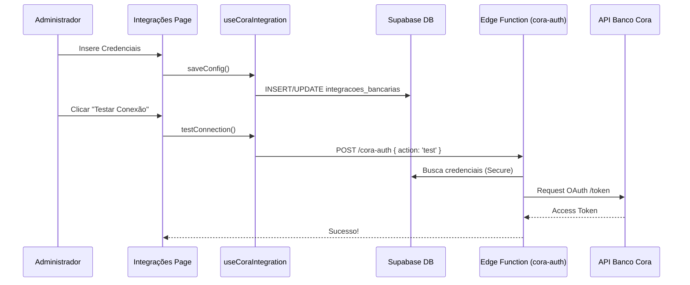
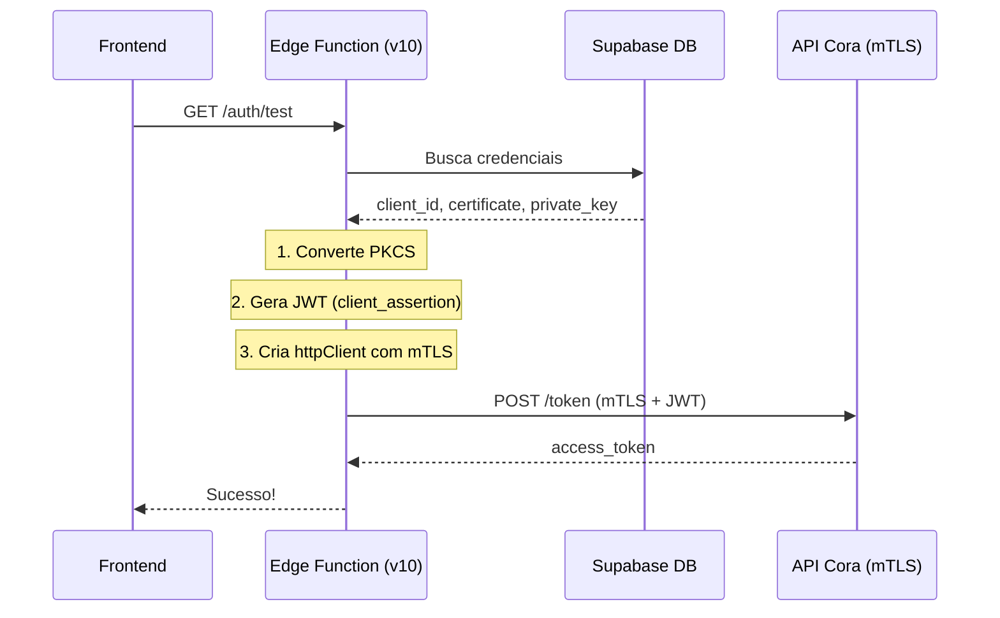

# 🏦 Integração Banco Cora - Documentação Técnica

> **Status:** ✅ Frontend Implementado | ✅ Edge Function v12 (Sync c/ Saldo) | ✅ Integração Ativa
> **Última Atualização:** 2026-02-01

---

## 📋 Visão Geral

A integração com o Banco Cora permite a sincronização automática de extratos bancários para conciliação no módulo financeiro. A solução utiliza a API oficial do Cora com **Integração Direta**, exigindo mTLS (Mutual TLS) para **todas** as requisições, não apenas na autenticação.

---

## 📋 Visão Geral

A integração com o Banco Cora permite a sincronização automática de extratos bancários para conciliação no módulo financeiro. A solução utiliza a API oficial do Cora (v1) com autenticação OAuth2 e certificados mTLS para o ambiente de produção.

### Funcionalidades

1. **Gestão de Credenciais:** Interface para cadastro seguro de Client ID, Certificados e Chaves.
2. **Ambientes:** Suporte a Sandbox (Stage) e Produção.
3. **Teste de Conexão:** Validação imediata das credenciais.
4. **Sincronização:** Importação automática de lançamentos com cálculo de saldo progressivo.

---

## 🛠 Configuração

### 1. Acesso ao Painel
Navegue até **Configurações > Integrações > Banco Cora**.

### 2. Credenciais Necessárias (mTLS)

> **IMPORTANTE:** A Cora usa **Integração Direta com mTLS**, não OAuth2 tradicional!

Para configurar, você precisará dos dados fornecidos no [Painel do Desenvolvedor Cora](https://app.cora.com.br/bank/developers):

| Campo | Descrição | Obrigatório |
|-------|-----------|-------------|
| **Ambiente** | Escolha entre Stage (testes) ou Produção. | Sim |
| **Client ID** | UUID da aplicação criada no Cora (formato: `int-XXXX`). | Sim |
| **Certificado (.crt/.pem)** | Arquivo público gerado no painel Cora. | Sim |
| **Chave Privada (.key)** | Arquivo privado correspondente ao certificado. | Sim |

> ⚠️ **Atenção:** O `client_secret` **não é mais necessário** para integração mTLS. A autenticação é feita via certificado + JWT assinado.

### 3. Segurança

- **Armazenamento:** Certificado e chave privada são armazenados na tabela `integracoes_bancarias` no Supabase.
- **Proteção:** O acesso é restrito via RLS (Row Level Security) apenas para Administradores.
- **Frontend:** A chave privada nunca é retornada para o frontend após salva.
- **mTLS:** A comunicação com o Cora usa TLS mútuo (certificado do cliente no handshake).

---

## 🏗 Arquitetura



## 🗄 Schema de Dados

### `integracoes_bancarias`

| Coluna | Tipo | Descrição |
|--------|------|-----------|
| `id` | uuid | PK |
| `banco` | text | Identificador ('cora') |
| `ambiente` | text | 'stage' ou 'production' |
| `client_id` | text | ID da aplicação (formato: `int-XXXX`) |
| `client_secret` | text | ~~Deprecated~~ (não usado em mTLS) |
| `certificate` | text | Conteúdo do certificado PEM |
| `private_key` | text | Conteúdo da chave privada PEM |
| `ativo` | bool | Status da integração |

### URLs mTLS por Ambiente

> ⚠️ **ATENÇÃO:** Para Integração Direta, utilize **sempre** os domínios `matls-clients` tanto para token quanto para chamadas de API.

| Ambiente | Token URL | API Base URL (Todas as chamadas) |
|----------|-----------|----------------------------------|
| Stage | `https://matls-clients.api.stage.cora.com.br/token` | `https://matls-clients.api.stage.cora.com.br` |
| Production | `https://matls-clients.api.cora.com.br/token` | `https://matls-clients.api.cora.com.br` |

---

## 📊 Campos para Conciliação Bancária

Mapeamento dos campos retornados pelo endpoint `/bank-statement/statement` para uso no sistema de conciliação.

### Transação Bancária (`entries[]`)

| Campo API | Tipo | Descrição | Uso na Conciliação |
|-----------|------|-----------|-------------------|
| `id` | string | ID único da transação | **Chave Primária** (evita duplicidade) |
| `type` | string | `CREDIT` ou `DEBIT` | Definir sinal (+/-) |
| `amount` | int | Valor em **centavos** | Valor da transação (dividir por 100) |
| `createdAt` | ISO8601 | Data/hora da transação | Data do lançamento |
| `transaction.description` | string | Descrição (pode ser vazia) | `descricao` - fallback: `contraparte_nome` |
| `transaction.type` | string | `PIX`, `BOLETO`, `TRANSFER` | `metodo_transacao` |
| `transaction.counterParty.name` | string | Nome da contraparte | `contraparte_nome` |
| `transaction.counterParty.identity` | string | CPF/CNPJ | `contraparte_documento` |

> [!CAUTION]
> **ESTRUTURA REAL DA API (confirmada 2026-02-01):**  
> - Campo é `counterParty` (camelCase com P maiúsculo)  
> - CPF/CNPJ está em `identity`, NÃO em `document`  
> - `description` pode ser string vazia `""`

### Cabeçalhos e Totais

| Campo API | Tipo | Descrição | Uso |
|-----------|------|-----------|-----|
| `start.balance` | int | Saldo inicial do dia/período | Validação de continuidade |
| `end.balance` | int | Saldo final do dia/período | Validação de fechamento |
| `aggregations.creditTotal` | int | Total de entradas | Conferência |
| `aggregations.debitTotal` | int | Total de saídas | Conferência |
| `header.businessName` | string | Nome da empresa titular | Identificação da Conta |

---

## 🔄 Fluxo de Sincronização (`/sync`)

O endpoint `/sync` importa transações do Cora para `lancamentos_bancarios`.

```mermaid
flowchart TD
    A[POST /cora-integration/sync] --> B{Buscar Extrato}
    B -->|Proxy pxminerva| C[Cora API]
    C --> D[Resposta: entries[]]
    D --> E[Transformar dados]
    E --> F[Upsert em lancamentos_bancarios]
    F --> G{Duplicata?}
    G -->|hash_linha existe| H[Ignorar]
    G -->|Novo| I[Inserir]
    I --> J[status = 'pendente']
    J --> K[Usuário classifica via modal]
    K --> L[status = 'conciliado']
```

### Campos Mapeados no Sync

| Campo Cora | Campo DB | Transformação |
|------------|----------|---------------|
| `entry.id` | `cora_entry_id` | Direto |
| `transaction.description` | `descricao` | Fallback: `counterParty.name` se vazio |
| `entry.type` | `tipo_lancamento` | `CREDIT` ou `DEBIT` |
| `entry.amount` | `entrada` / `saida` | Dividir por 100 |
| `entry.createdAt` | `data` | Extrair data (YYYY-MM-DD) |
| `transaction.counterParty.name` | `contraparte_nome` | Direto |
| `transaction.counterParty.identity` | `contraparte_documento` | CPF/CNPJ |
| - | `observacoes` | **NULL** (usuário preenche via modal) |
| - | `classificado_por_id` | **NULL** (usuário preenche via modal) |

---

## ⚠️ Troubleshooting

### Erro: `Failed to decode base64`
- A chave privada não está em formato base64 válido.
- Verifique se o arquivo `.key` não está corrompido.

### Erro: `unexpected ASN.1 DER tag: expected SEQUENCE, got INTEGER`
- A chave está em formato PKCS#1 (`BEGIN RSA PRIVATE KEY`) mas precisa de PKCS#8.
- ✅ **Correção automática:** O Edge Function agora converte PKCS#1 → PKCS#8 automaticamente.

### Erro: `401 invalid_client`
- **Causa mais provável:** Certificado/chave não correspondem ao Client ID.
- **Verificar:**
  1. O Client ID está correto para o ambiente (stage vs production)?
  2. O certificado foi gerado no mesmo ambiente que está configurado?
  3. A chave privada corresponde ao certificado?
  
  ```bash
  # Verificar correspondência cert/key
  openssl rsa -noout -modulus -in private-key.key | openssl md5
  openssl x509 -noout -modulus -in certificate.crt | openssl md5
  # Os hashes devem ser IGUAIS
  ```

### Erro: `Permissão negada`
- Apenas usuários com perfil `admin` ou `diretor` podem gerenciar integrações.

---

## 🔧 Edge Function: cora-integration

### Arquitetura mTLS



### Endpoints Disponíveis

| Método | Rota | Descrição |
|--------|------|----------|
| GET | `/cora-integration/health` | Health check |
| GET | `/cora-integration/auth/test` | Testa conexão mTLS |
| GET | `/cora-integration/extrato` | Consulta extrato |
| POST | `/cora-integration/boletos` | Cria boleto |

### Arquivos da Edge Function

```
supabase/functions/cora-integration/
├── index.ts        # Rotas Hono com basePath
├── auth.ts         # Autenticação mTLS + JWT
├── types.ts        # Tipos TypeScript
└── deno.json       # Import map (hono, supabase)
```

### Detalhes Técnicos da Implementação

1. **Formatos de Chave Suportados:**
   - PKCS#8 (`BEGIN PRIVATE KEY`) - Suportado nativamente
   - PKCS#1 (`BEGIN RSA PRIVATE KEY`) - Convertido automaticamente para PKCS#8

2. **mTLS com Deno:**
   ```typescript
   const httpClient = Deno.createHttpClient({
     certChain: certificate,  // Conteúdo do .crt/.pem
     privateKey: privateKey,  // Conteúdo do .key
   });
   
   const response = await fetch(tokenUrl, {
     method: 'POST',
     client: httpClient,  // mTLS handshake
     body: body.toString(),
   });
   ```

3. **JWT Client Assertion:**
   - Algoritmo: RS256 (RSASSA-PKCS1-v1_5 + SHA-256)
   - Claims: `iss`, `sub` = client_id; `aud` = token_url
   - Expiração: 5 minutos


# Guia de Integração: API de Extrato Cora

Este documento descreve as especificações técnicas para integração com o endpoint de **Consulta de Extrato** da Cora. Através desta API, é possível obter o histórico de movimentações (créditos e débitos) de uma conta digital Cora.

## 1. Visão Geral

O endpoint de extrato permite filtrar transações por período, tipo de operação (débito/crédito) e categoria, oferecendo suporte a paginação e agregação de valores.

* **Base URL (Sandbox/Stage):** `https://matls-clients.api.stage.cora.com.br`
* **Base URL (Produção):** `https://matls-clients.api.cora.com.br`
* **Protocolo:** HTTPS / REST
* **Autenticação:** OAuth2 (Bearer Token)

## 2. Autenticação

As requisições devem incluir o cabeçalho `Authorization` com um token válido gerado via fluxo OAuth2 da Cora.

```http
Authorization: Bearer <seu_access_token>
accept: application/json

```

## 3. Endpoint: Consulta de Extrato

Retorna uma lista de entradas financeiras dentro de um intervalo de datas especificado.

### Definição

* **Método:** `GET`
* **Caminho:** `/bank-statement/statement`

### Parâmetros de Query (Query Params)

| Parâmetro | Tipo | Obrigatório | Descrição |
| --- | --- | --- | --- |
| `start` | date | Sim | Data inicial no formato `YYYY-MM-DD`. |
| `end` | date | Sim | Data final no formato `YYYY-MM-DD`. |
| `type` | string | Não | Filtro por tipo: `CREDIT` ou `DEBIT`. |
| `transaction_type` | string | Não | Categoria (ex: `TRANSFER`, `BOLETO`, `PIX`). |
| `page` | integer | Não | Número da página (Padrão: 1). |
| `perPage` | integer | Não | Itens por página (Padrão: 10). |
| `aggr` | boolean | Não | Se `true`, retorna totais agregados (Padrão: false). |

---

## 4. Exemplo de Requisição (cURL)

```bash
curl --request GET \
  --url 'https://matls-clients.api.stage.cora.com.br/bank-statement/statement?start=2023-01-15&end=2023-01-16&type=DEBIT&page=1&perPage=10' \
  --header 'Authorization: Bearer <TOKEN>' \
  --header 'accept: application/json'

```

---

## 5. Estrutura da Resposta (JSON)

### Sucesso (200 OK)

O corpo da resposta contém os dados do período, saldo e o array `entries` com as transações.

```json
{
  "start": {
    "date": "2026-01-15",
    "balance": 100000
  },
  "entries": [
    {
      "id": "ent_3NvvgcrCSPOLe91Cm8TK99Hg",
      "type": "DEBIT",
      "amount": 1775521,
      "createdAt": "2026-01-31T19:12:31+00",
      "transaction": {
        "id": "trx_90lBq91Cv3SeCujzncdOspow",
        "type": "PIX",
        "category": {
          "main": "",
          "sub": ""
        },
        "description": "",
        "counterParty": {
          "name": "FLASH TECNOLOGIA E INSTITUICAO DE PAGAMENTO LTDA",
          "identity": "32223020000118"
        }
      }
    }
  ],
  "end": {
    "date": "2026-01-31",
    "balance": 95000
  },
  "aggregations": {
    "creditTotal": 0,
    "debitTotal": 1775521
  },
  "header": {
    "businessName": "Sua Empresa",
    "businessDocument": "00.000.000/0001-00"
  }
}
```

> [!IMPORTANT]
> - Os valores de `amount` e `balance` são representados em **centavos** (ex: 1775521 = R$ 17.755,21)
> - `counterParty` usa **camelCase com P maiúsculo**
> - `identity` contém o CPF/CNPJ (não `document`!)
> - `description` pode ser **string vazia** `""`

---

## 6. Tratamento de Erros

A API utiliza códigos de status HTTP padrão para indicar sucesso ou falha:

| Código | Descrição | Motivo Comum |
| --- | --- | --- |
| **400** | Bad Request | Parâmetros de data inválidos ou mal formatados. |
| **401** | Unauthorized | Token ausente, expirado ou inválido. |
| **403** | Forbidden | Token não tem permissão para acessar esta conta. |
| **500** | Internal Error | Erro interno no servidor da Cora. |

### Exemplo de Resposta de Erro

```json
{
  "errors": [
    {
      "code": "invalid_date_range",
      "message": "A data final não pode ser anterior à data inicial."
    }
  ]
}

```

## 7. Boas Práticas

1. **Cache de Token:** Não solicite um novo token OAuth a cada chamada de extrato; armazene-o e reuse-o até que expire.
2. **Paginação:** Para extratos com grande volume de transações, utilize os parâmetros `page` e `perPage` para evitar timeouts e excesso de consumo de memória.
3. **Conversão de Valores:** Lembre-se sempre de dividir os campos `amount` e `balance` por 100 para obter o valor em Reais (BRL).

---

*Documentação gerada com base na [Referência Oficial Cora](https://developers.cora.com.br/reference/consulta-de-extrato).*

# Guia de Integração: Saldo e Dados Cadastrais (Cora)

Este documento detalha como obter o saldo disponível e as informações bancárias (agência, conta, etc.) via API Cora.

## 1. Saldo da Conta (`/bank-balance`)

Este endpoint retorna o saldo atualizado da conta, separando o valor disponível de possíveis valores bloqueados.

### Definição

* **Método:** `GET`
* **Caminho:** `/bank-balance`

### Estrutura da Resposta

Os valores são retornados em **centavos** (Integer).

```json
{
  "total": 150050,
  "available": 150050,
  "blocked": 0
}

```

* **total**: Soma de todo o saldo na conta.
* **available**: Valor livre para transações (Pix, transferências, pagamentos).
* **blocked**: Valores retidos ou em processo de compensação.

---

## 2. Dados da Conta (`/account-details`)

Essencial para validar os dados de recebimento ou para exibir ao usuário onde ele deve realizar depósitos via TED ou DOC.

### Definição

* **Método:** `GET`
* **Caminho:** `/account-details`

### Estrutura da Resposta

```json
{
  "bankNumber": "403",
  "bankName": "Cora SCD",
  "branchNumber": "0001",
  "accountNumber": "123456-7",
  "accountType": "CACC",
  "businessName": "STDIO SOFTWARE LTDA",
  "businessDocument": "00.000.000/0001-00"
}

```

---

## 3. Fluxo de Autenticação e Consumo

Para integrar esses dados em seu sistema (como o SIES Digital ou o dashboard da OctoApps), o fluxo recomendado segue o padrão abaixo:

1. **Auth**: Sua aplicação solicita o token via `POST /token` usando as credenciais do cliente.
2. **Request**: O token é enviado no Header das chamadas de Saldo ou Dados.
3. **Parsing**: Sua aplicação converte os centavos para a moeda local para exibição no frontend.

---

## 4. Implementação em Node.js (Exemplo Rápido)

Caso esteja utilizando o backend em Next.js para seus projetos atuais, aqui está um snippet de exemplo para buscar o saldo:

```javascript
const axios = require('axios');

async function getCoraBalance(token) {
  try {
    const { data } = await axios.get('https://matls-clients.api.cora.com.br/bank-balance', {
      headers: { 'Authorization': `Bearer ${token}` }
    });
    
    // Convertendo centavos para Real
    const balanceInBRL = data.available / 100;
    return balanceInBRL;
  } catch (error) {
    console.error('Erro ao consultar saldo:', error.response.data);
  }
}

```

### Dicas para sua Integração

* **Frequência de Atualização:** Evite fazer chamadas de saldo a cada segundo. Implemente um cache de curto prazo (ex: 30 segundos) ou dispare a atualização apenas quando o usuário navegar para a tela de dashboard.
* **Ambiente:** Lembre-se de alternar entre `matls-clients.api.stage.cora.com.br` (Sandbox) e `matls-clients.api.cora.com.br` (Produção) através de variáveis de ambiente (`.env`).


Esta documentação foca na **Integração Direta** da Cora, que utiliza o protocolo **mTLS (Mutual Transport Layer Security)**. Diferente de integrações simples, aqui a segurança é estabelecida na camada de transporte, exigindo que o cliente apresente um certificado digital assinado pela Cora.

---

# Documentação Técnica: Integração Direta (mTLS) - Cora

## 1. Arquitetura de Segurança

A Modalidade Direta utiliza autenticação em dois níveis:

1. **Camada de Transporte (mTLS):** Validação mútua entre o servidor da Cora e o seu servidor via Certificado Digital e `private-key.key`.
2. **Camada de Aplicação (OAuth2):** Utilização de um `access_token` (Bearer) obtido após o handshake seguro.

## 2. Componentes de Autenticação

Para que a conexão seja aceita, você deve possuir os seguintes arquivos:

* **`private-key.key`**: Sua chave privada RSA (Nunca compartilhada).
* **`client-certificate.crt`**: O certificado público assinado pela Cora.
* **`Client ID`**: Identificador único da sua aplicação no painel Cora.

## 3. Configuração do Ambiente

### Variáveis de Ambiente (.env)

Armazene os caminhos ou o conteúdo dos certificados de forma segura:

```bash
CORA_CLIENT_ID="seu_client_id"
CORA_CERT_PATH="./certs/client-certificate.crt"
CORA_KEY_PATH="./certs/private-key.key"
CORA_BASE_URL="https://matls-clients.api.cora.com.br"

```

---

## 4. Implementação do Cliente HTTP (Node.js/Next.js)

Para realizar chamadas, é necessário criar um `https.Agent` que carregue seus certificados.

```typescript
import axios from 'axios';
import https from 'https';
import fs from 'fs';

// Configuração do Agente mTLS
const mtlsAgent = new https.Agent({
  cert: fs.readFileSync(process.env.CORA_CERT_PATH!),
  key: fs.readFileSync(process.env.CORA_KEY_PATH!),
});

// Exemplo de instância Axios pré-configurada
const coraClient = axios.create({
  baseURL: process.env.CORA_BASE_URL,
  httpsAgent: mtlsAgent,
  headers: {
    'Content-Type': 'application/json'
  }
});

```

---

## 5. Fluxo de Obtensão de Token

Mesmo com mTLS, você precisa de um token de acesso. O endpoint de token também exige o certificado.

* **Endpoint:** `POST /token`
* **Grant Type:** `client_credentials`

```typescript
async function getAccessToken() {
  const params = new URLSearchParams();
  params.append('grant_type', 'client_credentials');
  params.append('client_id', process.env.CORA_CLIENT_ID!);

  const response = await coraClient.post('/token', params);
  return response.data.access_token;
}

```

---

## 6. Consumo de Endpoints (Exemplo: Saldo)

Com o token em mãos, as chamadas seguem o padrão REST, mantendo o `httpsAgent` ativo.

```typescript
async function getBalance() {
  const token = await getAccessToken();
  
  const { data } = await coraClient.get('/bank-balance', {
    headers: { 'Authorization': `Bearer ${token}` }
  });

  return data;
}

```

## 7. Troubleshooting (Erros Comuns)

| Erro | Causa Provável | Solução |
| --- | --- | --- |
| `ECONNRESET` ou `403 Forbidden` | Certificado ou Chave Privada inválidos. | Verifique se a `private-key.key` corresponde ao `.crt` enviado. |
| `CERT_HAS_EXPIRED` | O certificado da Cora ou o seu expirou. | Renove o certificado no painel de desenvolvedor da Cora. |
| `UNABLE_TO_VERIFY_LEAF_SIGNATURE` | Cadeia de certificados incompleta. | Certifique-se de que está usando o certificado final assinado. |

---

## 8. Considerações para Produção

1. **Segurança da Chave:** Em seu projeto **Minerva** ou **OctoApps**, garanta que a `private-key.key` não seja exposta no frontend. Todo o processo mTLS deve ocorrer no **Server-side**.
2. **Performance:** O handshake mTLS é mais pesado que o TLS comum. Reutilize a instância do `https.Agent` para aproveitar o keep-alive da conexão.
3. **Monitoramento:** Implemente logs específicos para falhas de SSL/TLS, pois elas indicam problemas críticos de infraestrutura antes mesmo de chegar à lógica de negócio.

---

## 9. Detalhes da Sincronização

A sincronização de extrato (`/sync`) realiza as seguintes operações:

### 1. Cálculo de Saldo (`saldo_apos`)
Como a API de *Bank Statement* do Cora não retorna o saldo após cada transação individualmente (apenas no cabeçalho do período), a Edge Function realiza o cálculo:
1. Obtém o `start.balance` (saldo inicial do período).
2. Ordena as transações cronologicamente (Cora retorna ordem decrescente padrão).
3. Itera sobre as transações calculando o **Running Balance**:
   - Crédito: `saldo + valor`
   - Débito: `saldo - valor`

### 2. Mapeamento de Campos
O sistema normaliza os dados retornados pela API Cora para a tabela `lancamentos_bancarios`:

| Campo Supabase | Fonte Cora API |
|----------------|----------------|
| `contraparte_nome` | `transaction.counterParty.name` |
| `contraparte_documento` | `transaction.counterParty.identity` |
| `metodo_transacao` | `transaction.type` (PIX, BOLETO, TRANSFER) |
| `cora_entry_id` | `entry.id` |


