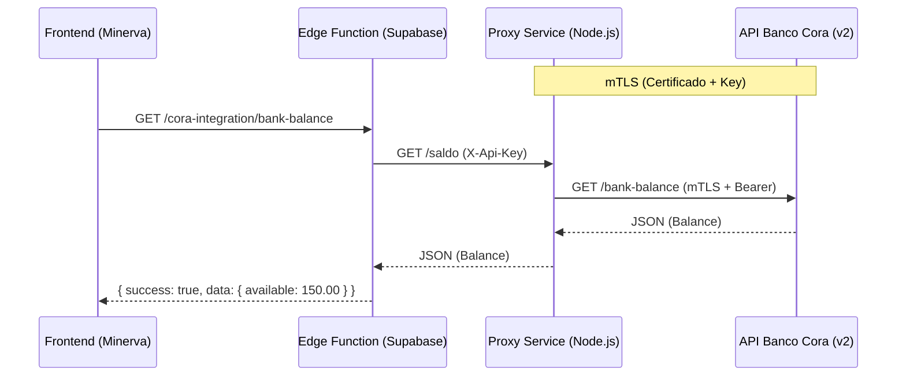
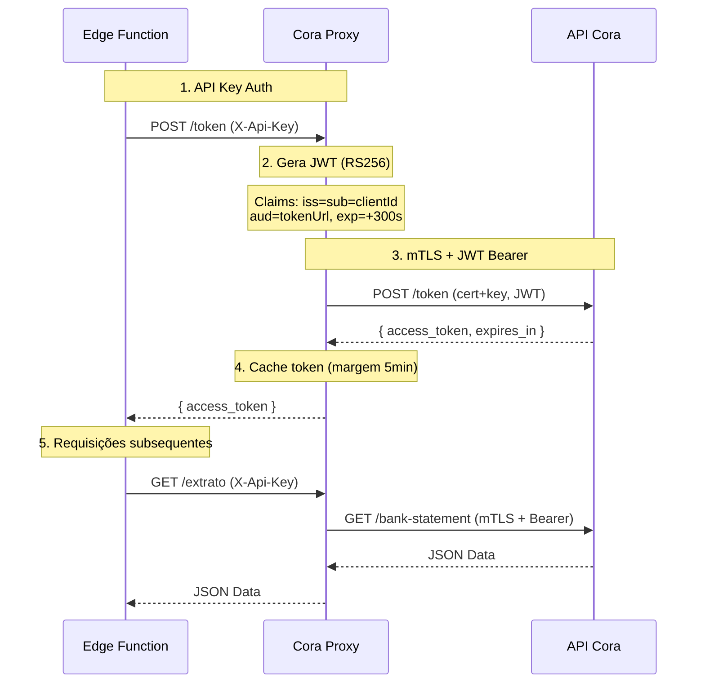
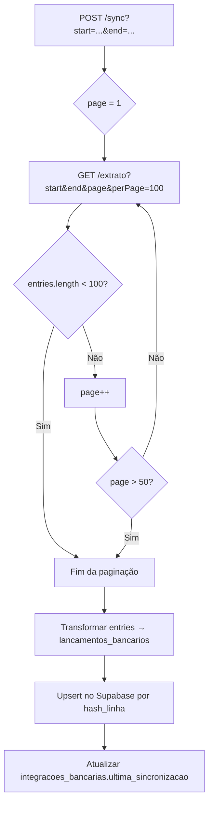

# 🏦 Integração Banco Cora — Documentação Técnica

> **Status:** ✅ Frontend Implementado | ✅ Edge Function v14 (via Proxy) | ✅ Sync Paginado | ✅ Saldo Real
> **Última Atualização:** 2026-02-09

---

## 📋 Visão Geral

A integração com o Banco Cora permite sincronização automática de extratos bancários, emissão de boletos, consulta de saldo em tempo real, e recebimento de webhooks de eventos bancários.

### Arquitetura Híbrida com Proxy

A API do Banco Cora exige **Mutual TLS (mTLS)** em todas as chamadas. O ambiente Deno Edge Functions (Supabase) não suporta manter um `https.Agent` persistente com certificados client-side. A solução utiliza **3 camadas**:

| Camada | Tecnologia | Responsabilidade |
|--------|------------|-----------------|
| **Frontend** | React (Minerva) | UI, filtros, hooks reativos |
| **Edge Function** | Deno/Hono (Supabase) | Gateway, validação, lógica de negócios, Supabase DB |
| **Proxy Service** | Node.js/Express (Render) | mTLS, OAuth2/JWT, comunicação direta com Cora |



---

## 🏗 Componentes Detalhados

### 1. Frontend (`src/components/financeiro`)

| Componente / Hook | Tipo | Função |
|-------------------|------|--------|
| `ConciliacaoBancariaPage` | Page | Visualização de extratos, filtros por data/status |
| `useLancamentosBancariosStats` | Hook | Calcula KPIs reativos (Entradas/Saídas) |
| `useCoraBalance` | Hook | Busca saldo real via Edge Function |

### 2. Edge Function (`supabase/functions/cora-integration`)

| Arquivo | Responsabilidade |
|---------|-----------------|
| `index.ts` | Servidor Hono — roteamento de 12 endpoints, sync paginado, webhook processing |
| `auth.ts` | Comunicação com o Proxy — token cache, route mapping, debug logs |
| `handlers.ts` | Lógica de negócios — boletos, extrato, saldo, webhook validation |
| `types.ts` | Typescript types — BoletoPayload, ExtratoParams, BankStatementParams |

**Route Mapping (Edge → Proxy):**
O `auth.ts` traduz rotas internas para rotas do proxy:

```
/bank-statement/*  →  /extrato
/bank-balance      →  /saldo
/invoice/*         →  /boletos
```

### 3. Proxy Service (`cora-proxy`)

| Arquivo | Responsabilidade |
|---------|-----------------|
| `src/index.ts` | Servidor Express — 8 endpoints, error handling |
| `src/auth.ts` | Autenticação mTLS — JWT RS256, token cache, `https.Agent` |
| `src/middleware/api-key.ts` | Middleware de autenticação por `X-Api-Key` |
| `render.yaml` | Deploy config no Render (plano free) |

> 📖 **Documentação completa do Proxy:** [`cora-proxy/README.md`](../../cora-proxy/README.md)

---

## 🔑 Fluxo de Autenticação Completo



**Duplo cache de token:**
- **Proxy:** Cache com margem de 5 minutos antes da expiração real
- **Edge Function:** Cache independente de 55 minutos

---

## 📡 Mapa Completo de Endpoints

### Edge Function → Proxy → Cora

| Edge Function | Proxy | API Cora | Método | Descrição |
|--------------|-------|----------|--------|-----------|
| `GET /health` | — | — | GET | Health check da Edge |
| `GET /auth/test` | `POST /token` | `POST /token` | GET | Teste de autenticação |
| `POST /auth/clear-cache` | — | — | POST | Limpa cache token/config |
| `GET /auth/debug` | — | — | GET | Debug de configuração |
| `POST /boleto` | `POST /boletos` | `POST /v2/invoices` | POST | Emitir boleto |
| `GET /boleto/:id` | — | `GET /v2/invoices/:id` | GET | Consultar boleto |
| `DELETE /boleto/:id` | — | `DELETE /v2/invoices/:id` | DELETE | Cancelar boleto |
| `GET /extrato` | — | — | GET | Extrato (formato legacy) |
| `GET /bank-statement` | `GET /extrato` | `GET /bank-statement/statement` | GET | Extrato (formato Cora v2) |
| `GET /bank-balance` | `GET /saldo` | `GET /bank-balance` | GET | Saldo bancário |
| `GET /account-details` | — | — | GET | Dados da conta |
| `POST /webhook` | — | — | POST | Recebe webhooks do Cora |
| `POST /sync` | `GET /extrato` (paginado) | `GET /bank-statement/statement` | POST | Sync extrato → Supabase |

### Proxy (Standalone)

| Rota | Método | Auth | Descrição |
|------|--------|------|-----------|
| `/health` | GET | ❌ | Health check (público) |
| `/token` | POST | ✅ | Obtém access token OAuth2 |
| `/extrato` | GET | ✅ | Consulta extrato bancário |
| `/extrato/debug` | GET | ✅ | Debug: estrutura raw da entry |
| `/saldo` | GET | ✅ | Consulta saldo |
| `/third-party/account/balance` | GET | ✅ | Alias para `/saldo` |
| `/boletos` | POST | ✅ | Cria boleto/invoice |
| `/clear-cache` | POST | ✅ | Limpa cache de token |

---

## 🔄 Fluxo de Sincronização (`/sync`)

O endpoint de sincronização busca todo o extrato do período e faz upsert no Supabase.



**Detalhes da transformação:**

| Campo Cora | Campo Supabase | Transformação |
|------------|---------------|---------------|
| `entry.id` | `cora_entry_id` | Direto |
| `entry.id` | `hash_linha` | `cora-${entry.id}` (unique constraint) |
| `entry.amount` | `entrada` / `saida` | Centavos → reais (`÷100`), baseado em `type` |
| `entry.type` | `tipo_lancamento` | `CREDIT` ou `DEBIT` |
| `entry.createdAt` | `data` | ISO timestamp |
| `transaction.type` | `metodo_transacao` | Mapeado para `PIX`, `BOLETO`, `TRANSFER`, `OTHER` |
| `counterParty.name` | `contraparte_nome` | Fallback: `transaction.name` |
| `counterParty.identity` | `contraparte_documento` | Fallback: `.document`, `.taxId`, `.cpf`, `.cnpj` |
| `transaction.description` | `descricao` | Fallback: `contraparte_nome` ou `Crédito/Débito - N/A` |

---

## 💰 Consulta de Saldo

| Rota Edge Function | Estratégia |
|-------------------|------------|
| `GET /bank-balance` | Chama handler `consultarSaldo()` |

- A Edge Function solicita o saldo via Proxy (`/saldo`)
- O Proxy chama `GET /bank-balance` na API Cora com mTLS
- Em caso de instabilidade desse endpoint, há fallback via extrato do dia (campo `end.balance`)

---

## 📨 Webhooks

O endpoint `POST /webhook` recebe eventos do Banco Cora:

| Evento | Ação |
|--------|------|
| `BOLETO_PAGO` | Atualiza `cora_boletos.status` → `PAGO` + dados de pagamento |
| `BOLETO_CANCELADO` | Atualiza status → `CANCELADO` |
| `BOLETO_EXPIRADO` | Atualiza status → `EXPIRADO` |
| `PIX_RECEBIDO` | Log (TODO: registrar no sistema) |

Todos os eventos são salvos na tabela `cora_webhook_events` para auditoria.

> **Validação:** Header `X-Cora-Signature` (HMAC-SHA256 do payload)

---

## 🛠 Configuração e Variáveis

### Variáveis no Supabase (Edge Function)

| Variável | Descrição |
|----------|-----------|
| `SUPABASE_URL` | URL do projeto Supabase |
| `SUPABASE_SERVICE_ROLE_KEY` | Service role key (acesso admin) |

> **Nota:** `PROXY_URL` e `PROXY_API_KEY` estão **hardcoded** no `auth.ts` da Edge Function (não como env vars do Supabase). Valores atuais: `pxminerva.onrender.com` e chave compartilhada.

### Variáveis no Proxy (Render)

| Variável | Descrição |
|----------|-----------|
| `PORT` | Porta do servidor (default: `3001`) |
| `CORA_CLIENT_ID` | ID da aplicação Cora |
| `CORA_CERTIFICATE` | Conteúdo do certificado `.crt` (PEM) |
| `CORA_PRIVATE_KEY` | Conteúdo da chave `.key` (PEM) |
| `CORA_AMBIENTE` | `production` ou `stage` |
| `API_KEY` | Chave compartilhada com a Edge Function |

---

## ⚠️ Troubleshooting

### Erro 400/500 no Saldo
- **Causa provável:** Proxy indisponível (cold start Render) ou erro de certificado
- **Debug:** Console do frontend exibe `❌ Erro no saldo (Cora): ...` com detalhes
- **Fix:** Aguardar ~30s para cold start || `POST /clear-cache` no proxy

### Sync Incompleto
- **Causa:** Timeout na Edge Function (limite padrão 60s)
- **Solução:** Reduza o período de sincronização (ex: 15 dias por vez)

### Token Inválido / Expirado
- **Causa:** Cache dessincronizado entre Proxy e Edge Function
- **Fix:** `POST /clear-cache` no proxy + `POST /auth/clear-cache` na Edge Function

### Proxy com Cold Start Lento (~30s)
- **Causa:** Render Free hiberna após 15min de inatividade
- **Mitigação:** Configurar cron/health check externo para manter ativo

---

## 📚 Tabelas Supabase Relacionadas

| Tabela | Uso |
|--------|-----|
| `lancamentos_bancarios` | Extrato sincronizado (upsert por `hash_linha`) |
| `cora_boletos` | Boletos emitidos e seus status |
| `cora_webhook_events` | Auditoria de webhooks recebidos |
| `integracoes_bancarias` | Metadata da integração / última sincronização |
