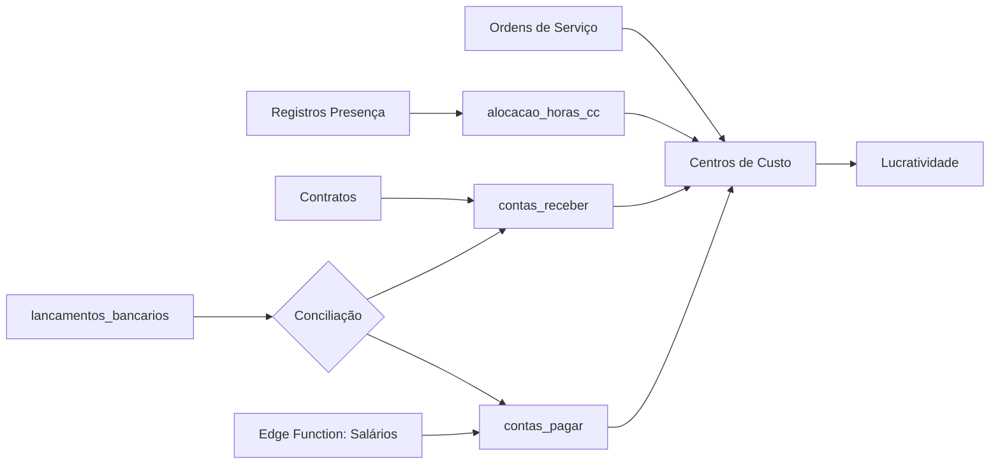
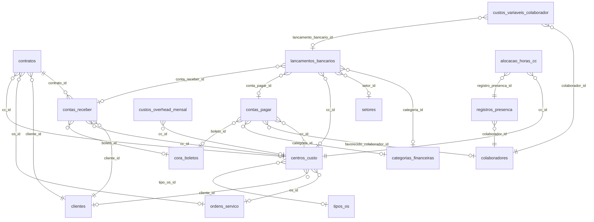

# FINANCE_SPEC.md — Especificação Executável do Módulo Financeiro

> **Date:** 2026-02-09
> **Status:** DRAFT — Gerado por Deep Discovery automatizado
> **Supabase Project:** `zxfevlkssljndqqhxkjb`
> **Stack:** React 19 + TanStack Router + React Query + Supabase (PostgreSQL + Edge Functions)

---

## 1. Contexto

### 1.1 Problema que o módulo resolve

O MinervaV2 é um ERP operacional para uma empresa de engenharia/construção civil que precisa:

1. **Controlar receitas e despesas** vinculadas a Ordens de Serviço (OS) e Centros de Custo (CC).
2. **Calcular lucratividade por projeto** (CC/OS/Cliente) combinando receitas contratuais, despesas operacionais e custo de mão de obra alocada.
3. **Conciliar extrato bancário** (Banco Cora via API mTLS) com lançamentos internos (contas a pagar/receber).
4. **Automatizar folha de pagamento** com geração mensal de despesas via Edge Function.
5. **Projetar fluxo de caixa** com visão diária de entradas/saídas e alertas de dias críticos.

### 1.2 Domínios integrados



### 1.3 Arquitetura atual

| Camada | Tecnologia | Responsabilidade |
|--------|-----------|------------------|
| **Frontend** | React 19, TanStack Router, React Query, shadcn/ui | 28 componentes em `src/components/financeiro/` |
| **Data Layer** | Custom Hooks (`use-*.ts`) | 15+ hooks financeiros em `src/lib/hooks/` |
| **Backend** | Supabase PostgreSQL | Tables, Views, RPCs, Triggers |
| **Integração** | Cora API (mTLS), Edge Functions | Sync bancário, automação de salários |

---

## 2. Modelos de Dados

### 2.1 Entidades Financeiras Core (Live Schema)

> Extraído diretamente do Supabase em 2026-02-09. Campos marcados com ⚠️ possuem inconsistências documentação vs. banco.

#### `centros_custo` (14 registros)

```sql
CREATE TABLE centros_custo (
  id            UUID PRIMARY KEY DEFAULT gen_random_uuid(),
  nome          TEXT NOT NULL,                          -- "CC13001-SOLAR_I"
  valor_global  NUMERIC DEFAULT 0,
  cliente_id    UUID REFERENCES clientes(id),
  tipo_os_id    UUID REFERENCES tipos_os(id),
  os_id         UUID UNIQUE REFERENCES ordens_servico(id), -- 1:1 com OS
  descricao     TEXT,
  data_inicio   DATE DEFAULT CURRENT_DATE,
  data_fim      DATE,
  ativo         BOOLEAN DEFAULT true,
  created_at    TIMESTAMPTZ DEFAULT now(),
  updated_at    TIMESTAMPTZ DEFAULT now()
);
-- ⚠️ Doc cita campo `tipo` (fixo/variavel) mas NÃO EXISTE na tabela real 
-- RLS: HABILITADO
```

#### `contas_pagar` (5 registros)

```sql
CREATE TABLE contas_pagar (
  id                        UUID PRIMARY KEY DEFAULT gen_random_uuid(),
  descricao                 TEXT NOT NULL,
  valor                     NUMERIC NOT NULL,
  vencimento                DATE NOT NULL,
  data_pagamento            DATE,
  status                    TEXT NOT NULL DEFAULT 'em_aberto'
                            CHECK (status IN ('em_aberto','pago','atrasado','cancelado')),
  tipo                      tipo_despesa NOT NULL DEFAULT 'variavel', -- ENUM: fixa, variavel
  favorecido_colaborador_id UUID REFERENCES colaboradores(id),
  favorecido_fornecedor     TEXT,
  cc_id                     UUID REFERENCES centros_custo(id),
  rateio                    JSONB,  -- [{cc_id, percentual, valor}]
  recorrente                BOOLEAN DEFAULT false,
  recorrencia_frequencia    TEXT CHECK (IN ('mensal','quinzenal','semanal')),
  recorrencia_fim           DATE,
  forma_pagamento           TEXT,
  boleto_id                 UUID REFERENCES cora_boletos(id),
  comprovante_url           TEXT,
  categoria_id              UUID REFERENCES categorias_financeiras(id),
  observacoes               TEXT,
  criado_por_id             UUID REFERENCES colaboradores(id),
  dia_vencimento            INTEGER,
  origem                    TEXT DEFAULT 'manual', -- manual, salario_auto, os_compra
  created_at                TIMESTAMPTZ DEFAULT now(),
  updated_at                TIMESTAMPTZ DEFAULT now()
);
-- ⚠️ Doc cita status 'pendente' e 'parcial', mas CHECK real só permite: em_aberto, pago, atrasado, cancelado
-- ⚠️ Doc cita campos 'categoria' e 'subcategoria' (TEXT) como DEPRECATED — NÃO EXISTEM mais no banco
-- RLS: HABILITADO
```

#### `contas_receber` (0 registros)

```sql
CREATE TABLE contas_receber (
  id              UUID PRIMARY KEY DEFAULT gen_random_uuid(),
  cliente_id      UUID NOT NULL REFERENCES clientes(id),
  os_id           UUID REFERENCES ordens_servico(id),
  cc_id           UUID REFERENCES centros_custo(id),
  contrato_id     UUID REFERENCES contratos(id),
  contrato_numero TEXT,
  parcela         TEXT NOT NULL,
  parcela_num     INTEGER NOT NULL,
  total_parcelas  INTEGER NOT NULL,
  valor_previsto  NUMERIC NOT NULL,
  valor_recebido  NUMERIC,
  vencimento      DATE NOT NULL,
  data_recebimento DATE,
  status          TEXT NOT NULL DEFAULT 'em_aberto'
                  CHECK (status IN ('em_aberto','conciliado','inadimplente','cancelado')),
  boleto_id       UUID REFERENCES cora_boletos(id),
  forma_pagamento TEXT CHECK (IN ('boleto','pix','ted','dinheiro','cartao')),
  observacoes     TEXT,
  comprovante_url TEXT,
  categoria_id    UUID REFERENCES categorias_financeiras(id),
  created_at      TIMESTAMPTZ DEFAULT now(),
  updated_at      TIMESTAMPTZ DEFAULT now()
);
-- ⚠️ Doc cita status: 'pago', 'pendente', 'parcial' — Banco real usa: 'conciliado', 'inadimplente'
-- ⚠️ Tabela está VAZIA (0 registros) — trigger de geração de parcelas pode não estar ativo
-- RLS: HABILITADO
```

#### `lancamentos_bancarios` (483 registros — tabela mais populada)

```sql
CREATE TABLE lancamentos_bancarios (
  id                      UUID PRIMARY KEY DEFAULT gen_random_uuid(),
  data                    TIMESTAMPTZ NOT NULL,          -- ⚠️ Doc cita DATE, banco real é TIMESTAMPTZ
  descricao               TEXT NOT NULL,
  entrada                 NUMERIC,
  saida                   NUMERIC,
  saldo_apos              NUMERIC,
  banco                   TEXT,
  conta_bancaria          TEXT,
  arquivo_origem          TEXT,
  hash_linha              TEXT UNIQUE,
  status                  TEXT NOT NULL DEFAULT 'pendente'
                          CHECK (status IN ('pendente','conciliado','ignorado')),
  tipo_lancamento         tipo_lancamento,                -- ENUM: CREDIT, DEBIT
  metodo_transacao        metodo_transacao,               -- ENUM: PIX, BOLETO, TRANSFER, OTHER
  contraparte_nome        TEXT,
  contraparte_documento   TEXT,
  cora_entry_id           TEXT,
  categoria_id            UUID REFERENCES categorias_financeiras(id),
  setor_id                UUID REFERENCES setores(id),
  cc_id                   UUID REFERENCES centros_custo(id),
  rateios                 JSONB,
  conta_pagar_id          UUID REFERENCES contas_pagar(id),
  conta_receber_id        UUID REFERENCES contas_receber(id),
  comprovante_url         TEXT,
  nota_fiscal_url         TEXT,
  observacoes             TEXT,
  classificado_por_id     UUID REFERENCES colaboradores(id),
  classificado_em         TIMESTAMPTZ,
  historico_classificacao JSONB DEFAULT '[]',
  tipo_custo_mo           TEXT CHECK (IN ('flutuante','geral')),
  colaborador_ids         UUID[],
  is_rateio_colaboradores BOOLEAN DEFAULT false,
  is_aplicacao            BOOLEAN DEFAULT false,         -- Exclude from DRE/Cash Flow
  created_at              TIMESTAMPTZ DEFAULT now(),
  updated_at              TIMESTAMPTZ DEFAULT now()
);
-- ✅ Status simplificado para 3 valores (era 5). Registros 'classificado'/'rateado' migrados para 'conciliado'.
-- ✅ Flag is_aplicacao adicionada para excluir aplicações financeiras de cálculos
-- RLS: HABILITADO
```

#### `categorias_financeiras` (15 registros)

```sql
CREATE TABLE categorias_financeiras (
  id         UUID PRIMARY KEY DEFAULT gen_random_uuid(),
  codigo     VARCHAR UNIQUE NOT NULL,
  nome       TEXT NOT NULL,
  descricao  TEXT,
  tipo       TEXT NOT NULL CHECK (tipo IN ('pagar','receber','ambos')),
  ativo      BOOLEAN DEFAULT true,
  created_at TIMESTAMPTZ DEFAULT now(),
  updated_at TIMESTAMPTZ DEFAULT now()
);
-- ⚠️ Doc cita campo `plano_conta_id` e `setor_padrao_id` — NÃO EXISTEM no banco real
-- A tabela `plano_contas` documentada NÃO FOI ENCONTRADA no schema Supabase
-- RLS: DESABILITADO
```

#### `alocacao_horas_cc` (0 registros)

```sql
CREATE TABLE alocacao_horas_cc (
  id                    UUID PRIMARY KEY DEFAULT gen_random_uuid(),
  registro_presenca_id  UUID NOT NULL REFERENCES registros_presenca(id),
  cc_id                 UUID NOT NULL REFERENCES centros_custo(id),
  percentual            NUMERIC NOT NULL CHECK (percentual > 0 AND percentual <= 100),
  valor_calculado       NUMERIC,
  observacao            TEXT,
  created_at            TIMESTAMPTZ DEFAULT now()
);
-- VAZIA — Alocação de MO nunca utilizada em produção
-- RLS: HABILITADO
```

### 2.2 Entidades de Suporte

| Tabela | Registros | Papel no Módulo Financeiro |
|--------|-----------|---------------------------|
| `contratos` | 0 | Gera parcelas em `contas_receber` via trigger |
| `faturas` | 0 | Modelo alternativo de faturamento (não integrado ao fluxo principal) |
| `pagamentos` | 0 | Registro de pagamentos de faturas (não integrado) |
| `cora_boletos` | 0 | Boletos gerados via Cora API |
| `cora_sync_logs` | 0 | Log de sincronizações Cora |
| `cora_webhook_events` | 0 | Eventos webhook do Cora |
| `integracoes_bancarias` | 1 | Config mTLS do Cora (ambiente stage) |
| `custos_variaveis_colaborador` | 0 | Custos variáveis por colaborador/mês |
| `custos_overhead_mensal` | 0 | Rateio de overhead por CC |

### 2.3 Inconsistências Documentação vs. Schema Real

| # | Tipo | Detalhe | Status |
|---|------|---------|--------|
| 1 | **Campo fantasma** | `centros_custo.tipo` (fixo/variavel) documentado mas inexistente no banco | ⚠️ Pendente |
| 2 | **Status divergente** | `contas_pagar.status`: doc usa `pendente`/`parcial`, banco usa `atrasado`/`cancelado` | ⚠️ Pendente |
| 3 | **Status divergente** | `contas_receber.status`: doc usa `pago`/`pendente`/`parcial`, banco usa `conciliado`/`inadimplente` | ⚠️ Pendente |
| 4 | **Tipo divergente** | `lancamentos_bancarios.data`: doc diz `DATE`, real é `TIMESTAMPTZ` | ⚠️ Pendente |
| 5 | **Campos removidos** | `contas_pagar.categoria`/`subcategoria` TEXT marcados DEPRECATED no doc, já removidos do banco | ✅ Resolvido |
| 6 | **Tabela ausente** | `plano_contas` documentada na ARCHITECTURE e DATABASE_SCHEMA, não existe no banco | ⚠️ Pendente |
| 7 | **FK ausente** | `categorias_financeiras.plano_conta_id` e `setor_padrao_id` documentados, inexistentes | ⚠️ Pendente |
| 8 | **Status extras** | `lancamentos_bancarios` tinha `classificado` e `rateado` — **REMOVIDOS via migração** | ✅ Resolvido |
| 9 | **Campos não documentados** | `lancamentos_bancarios.tipo_custo_mo`, `colaborador_ids`, `is_rateio_colaboradores` — **DOCUMENTADOS** | ✅ Resolvido |
| 10 | **Tabelas vazias** | `contas_receber`, `contratos`, `alocacao_horas_cc`, `faturas`, `pagamentos` todas em 0 registros | ⚠️ Pendente |
| 11 | **RPC bug** | `classificar_transacao_bancaria` inseria `contas_receber.status = 'recebido'` (viola CHECK) — **CORRIGIDO** | ✅ Resolvido |
| 12 | **View morta** | `vw_receitas_por_cc` filtrava por `pago`/`recebido` (inexistentes) — **CORRIGIDA** | ✅ Resolvido |

---

## 3. User Stories & Fluxos

### US-01: Dashboard Financeiro

**Como** gestor financeiro, **quero** ver KPIs consolidados do mês (receita prevista/realizada, despesas previstas/pagas, lucro, margem) **para** tomar decisões rápidas.

**Fluxo:**
1. Usuário acessa `/financeiro`
2. Hook `useFinanceiroDashboard` faz queries paralelas a `contas_receber` e `contas_pagar` filtrando por mês
3. Componente `FinanceiroDashboardPage` renderiza KPIs + gráficos comparativos

**Critérios de Aceitação:**
- [ ] KPIs calculam corretamente com status reais do banco (`em_aberto`, `conciliado`, `pago`, `inadimplente`, `atrasado`, `cancelado`)
- [ ] Período selecionável via `PeriodoSelector`
- [ ] Gráficos de comparação receita vs despesa por mês

---

### US-02: Dashboard Analítico por Setor

**Como** diretor, **quero** visualizar KPIs separados por setor (ASS/OBRAS) com evolução mensal **para** comparar performance entre operações.

**Fluxo:**
1. Acessa `/financeiro/dashboard-analitico`
2. Hook `useDashboardAnaliticoKPIs` agrega dados por `setor_id`
3. Filtros de `SetorFiltro` e `PeriodoFiltro`

---

### US-03: Gestão de Receitas (Contratos → Parcelas)

**Como** financeiro, **quero** cadastrar contratos e ver parcelas geradas automaticamente **para** acompanhar receitas futuras.

**Fluxo:**
1. Contrato criado com status `ativo` → trigger `fn_gerar_faturas_contrato` gera parcelas em `contas_receber`
2. Hook `useReceitasRecorrentes` lista contratos + `useParcelasPendentes` lista parcelas
3. Ação "Marcar Recebido" → `useMarcarRecebido` atualiza status

**Critérios de Aceitação:**
- [ ] Trigger gera parcelas idempotentemente
- [ ] Parcelas incluem `parcela_num`, `total_parcelas`, `vencimento` correto
- [ ] Status permite transição `em_aberto` → `conciliado`

> ⚠️ **ALERTA**: Tabela `contas_receber` e `contratos` estão VAZIAS em produção. Trigger pode não estar ativo.

---

### US-04: Gestão de Despesas (Master Ledger)

**Como** financeiro, **quero** um ledger unificado de despesas (manuais + salários automáticos + OS de compra) **para** controlar todas as saídas.

**Fluxo:**
1. Despesas criadas manualmente ou via Edge Function (`origem: 'salario_auto'`) ou via OS de compra (`origem: 'os_compra'`)
2. Hook `useFaturasRecorrentes` lista com filtro de tipo (fixa/variavel)
3. Ação "Marcar Pago" → `useMarcarPago` atualiza `status` e `data_pagamento`

**Critérios de Aceitação:**
- [ ] Filtro por `tipo` (fixa/variavel), `origem`, `status`
- [ ] Rateio entre CCs funcional via campo JSONB `rateio`
- [ ] Edge Function de salários gera despesas mensais corretamente

---

### US-05: Conciliação Bancária (Cora Sync)

**Como** financeiro, **quero** sincronizar extrato bancário do Cora e conciliar com contas internas **para** manter a contabilidade atualizada.

**Fluxo:**
1. Sync via Cora API → lançamentos inseridos em `lancamentos_bancarios` com `status: pendente`
2. Usuário abre modal "Classificar" → define `categoria_id`, `setor_id`, `cc_id`
3. Status evolui: `pendente` → `classificado` → `conciliado` (quando vincula a conta_pagar/receber)
4. Rateio multi-CC disponível via `rateios` JSONB → `status: rateado`

**Critérios de Aceitação:**
- [ ] Deduplicação via `hash_linha` (formato `cora-{entry_id}`)
- [ ] View `view_conciliacao_pendente` sugere matches por valor
- [ ] Histórico de classificação registrado em `historico_classificacao` JSONB
- [ ] Suporte a custo de MO variável (`tipo_custo_mo`, `colaborador_ids`)

---

### US-06: Custo de Mão de Obra

**Como** gestor de projetos, **quero** ver o custo de MO alocado por CC/colaborador **para** entender o custo real de cada projeto.

**Fórmula:**
```
custo_dia = salario_base / 22 (dias úteis)
valor_calculado = custo_dia × (percentual / 100)
```

**Critérios de Aceitação:**
- [ ] Dados da view `view_custo_mo_detalhado_os` corretos
- [ ] Rateio multi-CC por registro de presença funcional
- [ ] Soma de percentuais NÃO precisa ser 100%

> ⚠️ **ALERTA**: Tabela `alocacao_horas_cc` está VAZIA. Feature implementada no código mas nunca usada.

---

### US-07: Fluxo de Caixa Projetado

**Como** financeiro, **quero** projeção diária de fluxo de caixa para 30 dias **para** antecipar dias com saldo negativo.

**Fórmula:**
```
saldo_dia = Σ entradas (contas_receber.valor_previsto) - Σ saídas (contas_pagar.valor)
saldo_acumulado = saldo_anterior + saldo_dia
dia_critico = saldo_acumulado < 0
```

---

### US-08: Centro de Custo — Visão 360°

**Como** controller, **quero** uma visão completa de um CC (receitas, despesas, MO, margem) **para** validar se o projeto é lucrativo.

**Fluxo:** Acessa `/financeiro/centro-custo/$ccId` → agrega dados de 3 tabelas.

**Validação de Fechamento (RPC `validar_fechamento_centro_custo`):**
- Todas `contas_pagar` status = `pago`
- Se `exige_nf = true` → `comprovante_url` preenchido
- Todas `contas_receber` status = `conciliado` ou `cancelado`

---

## 4. Test Plan

### 4.1 Testes Unitários

| ID | Teste | Expectativa |
|----|-------|-------------|
| T-01 | KPI Receita Prevista | `Σ contas_receber.valor_previsto WHERE vencimento IN mês` |
| T-02 | KPI Receita Realizada | `Σ contas_receber.valor_recebido WHERE status = 'conciliado' AND data_recebimento IN mês` |
| T-03 | KPI Despesas Previstas | `Σ contas_pagar.valor WHERE vencimento IN mês` |
| T-04 | KPI Despesas Pagas | `Σ contas_pagar.valor WHERE status = 'pago' AND data_pagamento IN mês` |
| T-05 | Custo MO calcula corretamente | `salario_base/22 * percentual/100 = valor_calculado` |
| T-06 | Fluxo de caixa acumula | `saldo[d] = saldo[d-1] + entradas[d] - saidas[d]` |
| T-07 | Margem = `(receita - custo) / receita * 100` | Handles `receita = 0` sem `NaN` |

### 4.2 Testes de Integração

| ID | Teste | Expectativa |
|----|-------|-------------|
| I-01 | Criar contrato → parcelas geradas | `contas_receber` rows = `parcelas_total` (+1 se entrada) |
| I-02 | Sync Cora → lançamentos sem duplicata | `hash_linha` UNIQUE constraint violation handled |
| I-03 | Classificar lançamento → status atualizado | `pendente → classificado → conciliado` |
| I-04 | Edge Function salários → despesas criadas | `contas_pagar` com `origem = 'salario_auto'` e `favorecido_colaborador_id` preenchido |
| I-05 | Rateio CC → valores somam 100% | `Σ rateio[].percentual = 100` ou validação explicita |

### 4.3 Testes de Regressão

| ID | Teste | Motivação |
|----|-------|-----------|
| R-01 | Filtro status usa valores reais do banco | Inconsistência #2 e #3 acima |
| R-02 | Data de `lancamentos_bancarios` tratada como TIMESTAMPTZ | Inconsistência #4 |
| R-03 | Queries não referenciam `plano_contas` | Tabela inexistente (#6) |

---

## 5. Gap Analysis — Ações Prioritárias

### 🔴 Crítico (Segurança / Correção)

| # | Problema | Ação Requerida |
|---|---------|----------------|
| G-01 | **RLS desabilitado** em `categorias_financeiras`, `setores`, `cargos`, `colaboradores` | Habilitar RLS com policies adequadas antes de produção |
| G-02 | **Credenciais mTLS em tabela** (`integracoes_bancarias.private_key`, `.certificate`) | Migrar para Supabase Vault ou env vars da Edge Function |
| G-03 | **Status divergentes** entre doc e banco (**#2, #3**) | Alinhar CHECK constraints com código e documentação |
| G-04 | **Tabela `plano_contas` inexistente** referenciada no código e docs | Criar migração ou remover referências |
| G-05 | **SECURITY DEFINER** sem auditoria em `criar_centro_custo_para_os` | Adicionar logging de auditoria |

### 🟡 Importante (Performance / Funcionalidade)

| # | Problema | Ação Requerida |
|---|---------|----------------|
| G-06 | **Tabelas financeiras vazias** (`contas_receber`, `contratos`, `alocacao_horas_cc`) | Investigar triggers; seed data de teste |
| G-07 | **Tabela `faturas` desconectada** do fluxo principal | Decidir: deprecar ou integrar com `contas_receber` |
| G-08 | **Campos não documentados** em `lancamentos_bancarios` (custo MO variável) | Documentar e testar feature |
| G-09 | **Documentação desatualizada** (statuses, campos, tabelas) | Atualizar todos os .md de `/docs/finance/` |
| G-10 | **`categorias_financeiras` sem FK para `plano_contas`** | Implementar hierarquia de plano de contas ou simplificar modelo |

### 🟢 Melhoria (Qualidade / DX)

| # | Problema | Ação Requerida |
|---|---------|----------------|
| G-11 | **Componentes > 700 LOC** (centro-custo-detalhes: 749, faturas: 945) | Extrair sub-componentes e hooks |
| G-12 | **Sem empty states** para tabelas vazias | Implementar (já no backlog) |
| G-13 | **Sem trigger automático de parcelas** ao criar contrato | Verificar `fn_gerar_faturas_contrato` ativo |
| G-14 | **DRE Completo** adiado (sem plano de contas) | Depende de G-04/G-10 |
| G-15 | **Sem testes automatizados** para hooks financeiros | Criar test suite com Mock Supabase |

---

## 6. Referência Rápida — Tabelas Financeiras



---

## 7. Glossário

| Termo | Definição |
|-------|-----------|
| **CC** | Centro de Custo — entidade de agrupamento financeiro vinculada 1:1 a uma OS |
| **OS** | Ordem de Serviço — unidade de trabalho operacional |
| **Conciliação** | Processo de vincular lançamento bancário a conta interna (pagar/receber) |
| **Rateio** | Distribuição de custo entre múltiplos CCs via percentual |
| **MO** | Mão de Obra — custo calculado por alocação de presença |
| **DRE** | Demonstrativo de Resultados do Exercício (adiado) |
| **Edge Function** | Supabase serverless function (Deno) para automação |
| **mTLS** | Mutual TLS — autenticação bidirecional com certificados digitais (Cora API) |

---

> **Próximo passo recomendado:** Resolver gaps G-01 (RLS), G-02 (credentials), G-03 (status alignment) e G-04 (plano_contas) antes de qualquer nova feature.
