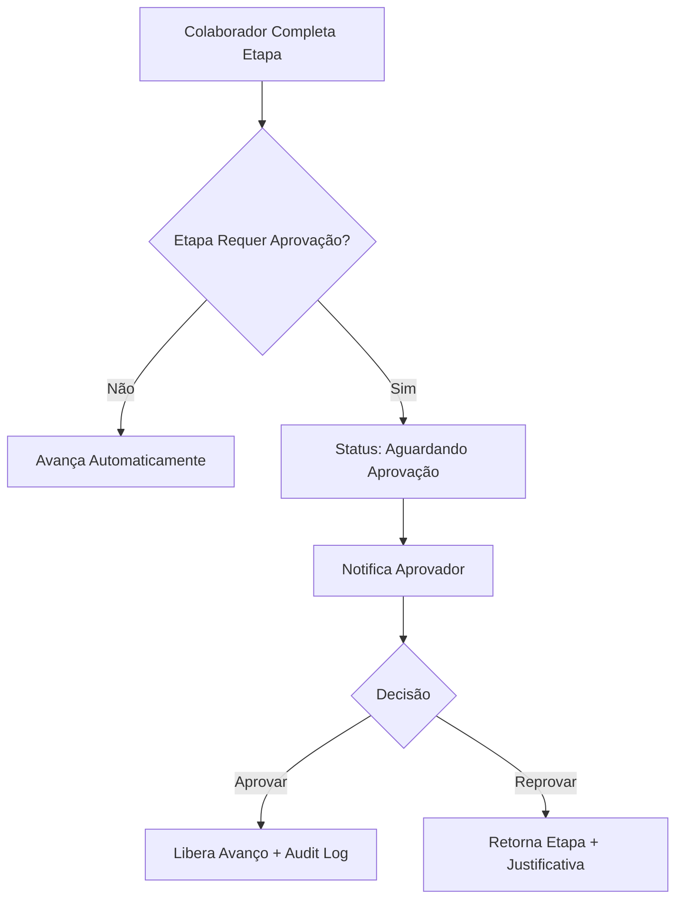

# 🏗️ Arquitetura do Módulo de OS

> **Última Atualização:** 2026-01-25

## Visão Geral da Stack

| Camada | Tecnologia | Propósito |
|--------|------------|-----------|
| **Frontend** | React 18 + TypeScript | UI e lógica de apresentação |
| **Roteamento** | TanStack Router | File-based routing |
| **Estilização** | Tailwind CSS + Shadcn/UI | Design system |
| **Backend** | Supabase (PostgreSQL) | Banco de dados e auth |
| **Edge Functions** | Deno (Supabase) | PDF generation, emails |

---

## Arquitetura de Componentes

```
src/components/os/
├── shared/                    # Componentes compartilhados
│   ├── components/
│   │   ├── workflow-stepper.tsx      # Stepper visual
│   │   ├── workflow-footer.tsx       # Footer com ações
│   │   ├── feedback-transferencia.tsx # Modal pós-handoff
│   │   └── aprovacao-modal.tsx       # Modal de aprovação
│   └── steps/                        # Steps reutilizáveis
│       ├── cadastrar-lead.tsx
│       ├── step-agendar-apresentacao.tsx
│       └── ...
├── obras/                     # OS de Obras (01-04, 13)
│   ├── os-1-4/
│   └── os-13/
├── assessoria/                # OS de Assessoria (05-08, 11-12)
│   ├── os-5-6/
│   ├── os-7/
│   ├── os-8/
│   ├── os-11/
│   └── os-12/
├── administrativo/            # OS Administrativas (09-10)
│   ├── os-9/
│   └── os-10/
└── unified/                   # Componentes unificados
```

---

## Padrão de Workflow (Stepper)

### Fluxo de Dados

```
┌─────────────────────────────────────────────────────────────────┐
│                        WORKFLOW PAGE                             │
├─────────────────────────────────────────────────────────────────┤
│                                                                  │
│  ┌──────────────────────────────────────────────────────────┐   │
│  │                   WorkflowStepper                         │   │
│  │  [1]───[2]───[3]───[4]───[5]───[6]───...                 │   │
│  └──────────────────────────────────────────────────────────┘   │
│                              │                                   │
│                              ▼                                   │
│  ┌──────────────────────────────────────────────────────────┐   │
│  │                 renderCurrentStep()                       │   │
│  │  ┌────────────────────────────────────────────────────┐  │   │
│  │  │               <StepComponent                       │  │   │
│  │  │                 data={formDataByStep[current]}     │  │   │
│  │  │                 onDataChange={setStepData}         │  │   │
│  │  │               />                                   │  │   │
│  │  └────────────────────────────────────────────────────┘  │   │
│  └──────────────────────────────────────────────────────────┘   │
│                              │                                   │
│                              ▼                                   │
│  ┌──────────────────────────────────────────────────────────┐   │
│  │                   WorkflowFooter                          │   │
│  │  [← Voltar]                            [Avançar →]       │   │
│  └──────────────────────────────────────────────────────────┘   │
│                                                                  │
└─────────────────────────────────────────────────────────────────┘
```

### Hooks de Estado

```typescript
// useWorkflowState - Gerenciamento de estado
const {
  currentStep,        // Etapa atual (number)
  setCurrentStep,     // Navegar para etapa
  formDataByStep,     // Dados por etapa { [step]: data }
  setStepData,        // Atualizar dados da etapa
  saveStep,           // Salvar etapa no banco
  completedSteps,     // Array de etapas concluídas
  etapas,             // Dados das etapas do banco
  refreshEtapas       // Recarregar etapas
} = useWorkflowState({ osId, totalSteps: 15 });

// useWorkflowCompletion - Validação
const {
  isStepCompleted,    // Verifica se etapa está concluída
  canAdvanceFromStep  // Verifica se pode avançar
} = useWorkflowCompletion({ formDataByStep, completionRules });

// useWorkflowNavigation - Navegação
const {
  goToNextStep,
  goToPreviousStep,
  canGoBack,
  canGoForward
} = useWorkflowNavigation({ currentStep, totalSteps, completedSteps });
```

---

## Sistema de Persistência

### Fluxo de Salvamento

```
Usuário preenche formulário
         │
         ▼
onDataChange(data)  →  setStepData(step, data)
         │                    │
         │                    ▼
         │            formDataByStep[step] = data
         │                    │
         └────────────────────┼────────────────────┐
                              │                    │
                              ▼                    ▼
                    [Salvar Rascunho]      [Avançar Etapa]
                              │                    │
                              ▼                    ▼
                    saveStep(step, true)   saveStep(step, false)
                              │                    │
                              ▼                    ▼
                    status='em_andamento'  status='concluida'
                              │                    │
                              └────────┬───────────┘
                                       ▼
                          supabase.from('os_etapas')
                            .update({ dados_etapa: data })
                                       │
                                       ▼
                              refreshEtapas()
```

### Estrutura de Dados (os_etapas)

```typescript
interface OSEtapa {
  id: string;
  os_id: string;
  ordem: number;
  nome: string;
  status: 'pendente' | 'em_andamento' | 'concluida' | 'bloqueada';
  responsavel_id: string | null;
  data_prazo: string | null;
  dados_etapa: Record<string, unknown>; // JSONB com dados do formulário
  created_at: string;
}
```

---

## Sistema de Handoffs Automáticos

### Arquitetura do Hook

```typescript
// use-transferencia-setor.ts
export function useTransferenciaSetor() {
  
  const executarTransferencia = async ({
    osId, osType, etapaAtual, proximaEtapa
  }) => {
    
    // 1. Verificar se há mudança de setor
    const handoff = verificarMudancaSetor(osType, etapaAtual, proximaEtapa);
    if (!handoff) return { houveTransferencia: false };
    
    // 2. Buscar coordenador do setor destino
    const coordenador = await buscarCoordenador(handoff.toSetor);
    
    // 3. Registrar transferência
    await supabase.from('os_transferencias').insert({
      os_id: osId,
      etapa_origem: etapaAtual,
      etapa_destino: proximaEtapa,
      setor_destino_id: setorDestinoId,
      coordenador_notificado_id: coordenador.id
    });
    
    // 4. Atualizar OS
    await supabase.from('ordens_servico').update({
      setor_atual_id: setorDestinoId,
      responsavel_id: coordenador.id
    });
    
    // 5. Registrar na timeline
    await supabase.from('os_atividades').insert({
      tipo: 'transferencia_setor',
      descricao: `Transferido para ${handoff.toSetor}`
    });
    
    // 6. Notificar coordenador
    await notificarCoordenador(coordenador, payload);
    
    return { houveTransferencia: true, handoff };
  };
}
```

---

## Geração de PDFs

### Edge Function `generate-pdf`

```
Frontend                    Supabase Edge Function
    │                              │
    │  invoke('generate-pdf', {    │
    │    template: 'proposta',     │
    │    dados: {...}              │
    │  })                          │
    │─────────────────────────────►│
    │                              │
    │                              │  1. Carregar template
    │                              │  2. Popular com dados
    │                              │  3. Gerar PDF via puppeteer
    │                              │  4. Upload para storage
    │                              │
    │  { pdfUrl, documentoId }     │
    │◄─────────────────────────────│
    │                              │
```

### Templates Disponíveis

| Template | OS | Descrição |
|----------|-----|-----------|
| `proposta-comercial` | OS-01-04 | Proposta comercial de obras |
| `proposta-assessoria` | OS-05-06 | Proposta de assessoria |
| `laudo-tecnico` | OS-11 | Laudo técnico pontual |
| `parecer-tecnico` | OS-08 | Parecer de visita técnica |
| `contrato` | OS-13, OS-12 | Contratos de execução |

---

## Sistema de Aprovação

### Fluxo de Aprovação Hierárquica



### Cargos Aprovadores

```typescript
const CARGOS_APROVADORES = [
  'admin',
  'diretor',
  'coord_obras',
  'coord_assessoria',
  'coord_administrativo'
];
```

---

## Rotas do Módulo

| Rota | Componente | Descrição |
|------|------------|-----------|
| `/os` | `OSListPage` | Lista de OS |
| `/os/$osId` | `OSDetailsPage` | Detalhes da OS |
| `/os/details-workflow/$id` | `DetailsWorkflowPage` | Workflow da OS |
| `/os/criar/requisicao-compras` | `RequisicaoComprasPage` | Criar OS-09 |
| `/os/criar/requisicao-mao-de-obra` | `RequisicaoMaoObraPage` | Criar OS-10 |
| `/os/criar/laudo-pontual` | `LaudoPontualPage` | Criar OS-11 |
| `/os/criar/assessoria-recorrente` | `AssessoriaRecorrentePage` | Criar OS-12 |
| `/os/criar/start-contrato-obra` | `StartContratoObraPage` | Criar OS-13 |
