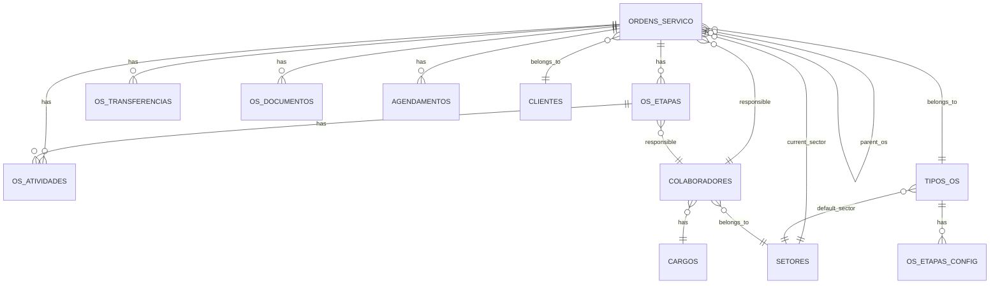

# 🗄️ Database Schema - Módulo de OS

> **Última Atualização:** 2026-01-25  
> **Database:** Supabase (PostgreSQL)

## Diagrama ER



---

## Tabelas Principais

### `ordens_servico`

Tabela principal que armazena todas as Ordens de Serviço.

| Coluna | Tipo | Nullable | Default | Descrição |
|--------|------|:--------:|---------|-----------|
| `id` | uuid | ❌ | `gen_random_uuid()` | PK |
| `codigo_os` | text | ❌ | trigger | Código único (ex: OS-01-0042) |
| `tipo_os_id` | uuid | ❌ | - | FK → tipos_os |
| `cliente_id` | uuid | ✅ | - | FK → clientes |
| `responsavel_id` | uuid | ✅ | - | FK → colaboradores |
| `criado_por_id` | uuid | ❌ | - | FK → colaboradores |
| `status_geral` | text | ❌ | `'rascunho'` | Status geral da OS |
| `status_situacao` | text | ✅ | `'acao_pendente'` | Semáforo visual |
| `data_prazo` | date | ✅ | - | Prazo final |
| `parent_os_id` | uuid | ✅ | - | FK → ordens_servico (OS pai) |
| `setor_atual_id` | uuid | ✅ | - | FK → setores |
| `setor_solicitante_id` | uuid | ✅ | - | FK → setores |
| `etapa_atual_ordem` | integer | ✅ | 1 | Etapa atual |
| `descricao` | text | ✅ | - | Descrição |
| `metadata` | jsonb | ✅ | `'{}'` | Dados extras |
| `created_at` | timestamptz | ✅ | `now()` | Data criação |
| `updated_at` | timestamptz | ✅ | `now()` | Data atualização |

**Status Geral:** `rascunho`, `em_triagem`, `em_andamento`, `concluida`, `cancelada`

**Status Situação:** `acao_pendente`, `aguardando_aprovacao`, `atrasado`, `alerta_prazo`, `aguardando_info`, `no_prazo`, `finalizado`

---

### `os_etapas`

Etapas individuais de cada OS com dados salvos.

| Coluna | Tipo | Nullable | Default | Descrição |
|--------|------|:--------:|---------|-----------|
| `id` | uuid | ❌ | `gen_random_uuid()` | PK |
| `os_id` | uuid | ❌ | - | FK → ordens_servico |
| `ordem` | integer | ❌ | - | Número da etapa (1-N) |
| `nome` | text | ❌ | - | Nome da etapa |
| `status` | text | ❌ | `'pendente'` | Status da etapa |
| `responsavel_id` | uuid | ✅ | - | FK → colaboradores |
| `data_prazo` | date | ✅ | - | Prazo da etapa |
| `dados_etapa` | jsonb | ✅ | `'{}'` | Dados do formulário |
| `created_at` | timestamptz | ✅ | `now()` | Data criação |

**Status:** `pendente`, `em_andamento`, `concluida`, `bloqueada`, `aguardando_aprovacao`

---

### `os_transferencias`

Histórico de transferências entre setores (handoffs).

| Coluna | Tipo | Nullable | Default | Descrição |
|--------|------|:--------:|---------|-----------|
| `id` | uuid | ❌ | `gen_random_uuid()` | PK |
| `os_id` | uuid | ❌ | - | FK → ordens_servico |
| `etapa_origem` | integer | ❌ | - | Etapa de origem |
| `etapa_destino` | integer | ❌ | - | Etapa de destino |
| `setor_origem_id` | uuid | ✅ | - | FK → setores |
| `setor_destino_id` | uuid | ✅ | - | FK → setores |
| `transferido_por_id` | uuid | ❌ | - | FK → colaboradores |
| `coordenador_notificado_id` | uuid | ✅ | - | FK → colaboradores |
| `transferido_em` | timestamptz | ❌ | `now()` | Data transferência |
| `motivo` | text | ✅ | `'avanço_etapa'` | Motivo |
| `metadados` | jsonb | ✅ | `'{}'` | Dados extras |

---

### `os_atividades`

Timeline/Audit log de todas as ações na OS.

| Coluna | Tipo | Nullable | Default | Descrição |
|--------|------|:--------:|---------|-----------|
| `id` | uuid | ❌ | `gen_random_uuid()` | PK |
| `os_id` | uuid | ❌ | - | FK → ordens_servico |
| `etapa_id` | uuid | ✅ | - | FK → os_etapas |
| `usuario_id` | uuid | ❌ | - | FK → colaboradores |
| `tipo` | varchar | ❌ | - | Tipo de atividade |
| `descricao` | text | ❌ | - | Descrição |
| `dados_antigos` | jsonb | ✅ | - | Dados antes da ação |
| `dados_novos` | jsonb | ✅ | - | Dados após ação |
| `metadados` | jsonb | ✅ | `'{}'` | Dados extras |
| `criado_em` | timestamptz | ✅ | `now()` | Data da ação |

**Tipos:** `transferencia_setor`, `comentario`, `status_change`, `aprovacao`, `reprovacao`, `documento_upload`, `etapa_concluida`

---

### `tipos_os`

Catálogo dos 13 tipos de OS disponíveis.

| Coluna | Tipo | Nullable | Default | Descrição |
|--------|------|:--------:|---------|-----------|
| `id` | uuid | ❌ | `gen_random_uuid()` | PK |
| `nome` | text | ❌ | - | Nome do tipo |
| `codigo` | varchar | ✅ | - | Código (OS-01, OS-02...) |
| `setor_padrao_id` | uuid | ✅ | - | FK → setores |
| `ativo` | boolean | ✅ | `true` | Se está ativo |

---

### `os_etapas_config`

Configuração padrão de etapas por tipo de OS.

| Coluna | Tipo | Nullable | Default | Descrição |
|--------|------|:--------:|---------|-----------|
| `id` | uuid | ❌ | `gen_random_uuid()` | PK |
| `tipo_os_id` | uuid | ❌ | - | FK → tipos_os |
| `ordem` | integer | ❌ | - | Ordem da etapa |
| `nome` | text | ❌ | - | Nome da etapa |
| `descricao` | text | ✅ | - | Descrição |
| `prazo_dias_uteis` | integer | ✅ | - | SLA em dias úteis |
| `requer_aprovacao` | boolean | ✅ | `false` | Se requer aprovação |
| `cargo_aprovador_slug` | text | ✅ | - | Cargo do aprovador |
| `setor_responsavel_id` | uuid | ✅ | - | FK → setores |
| `created_at` | timestamptz | ✅ | `now()` | Data criação |

---

### `os_documentos`

Documentos anexados às OS.

| Coluna | Tipo | Nullable | Default | Descrição |
|--------|------|:--------:|---------|-----------|
| `id` | uuid | ❌ | `gen_random_uuid()` | PK |
| `os_id` | uuid | ❌ | - | FK → ordens_servico |
| `etapa_id` | uuid | ✅ | - | FK → os_etapas |
| `nome_arquivo` | text | ❌ | - | Nome do arquivo |
| `tipo_documento` | text | ❌ | - | Tipo (PROPOSTA, CONTRATO, etc) |
| `storage_path` | text | ❌ | - | Path no storage |
| `mime_type` | text | ✅ | - | MIME type |
| `tamanho_bytes` | bigint | ✅ | - | Tamanho |
| `uploaded_por_id` | uuid | ❌ | - | FK → colaboradores |
| `created_at` | timestamptz | ✅ | `now()` | Data upload |

---

### `agendamentos`

Agendamentos de visitas e apresentações.

| Coluna | Tipo | Nullable | Default | Descrição |
|--------|------|:--------:|---------|-----------|
| `id` | uuid | ❌ | `gen_random_uuid()` | PK |
| `turno_id` | uuid | ❌ | - | FK → turnos |
| `data` | date | ❌ | - | Data do agendamento |
| `horario_inicio` | time | ❌ | - | Hora início |
| `horario_fim` | time | ❌ | - | Hora fim |
| `duracao_horas` | numeric | ❌ | - | Duração em horas |
| `categoria` | varchar | ❌ | - | Categoria do agendamento |
| `setor` | varchar | ❌ | - | Setor responsável |
| `os_id` | uuid | ✅ | - | FK → ordens_servico |
| `cliente_id` | uuid | ✅ | - | FK → clientes |
| `responsavel_id` | uuid | ✅ | - | FK → colaboradores |
| `criado_por` | uuid | ✅ | - | FK → colaboradores |
| `status` | varchar | ✅ | `'agendado'` | Status |
| `observacoes` | text | ✅ | - | Observações |

**Categorias:** `Vistoria Técnica`, `Apresentação Comercial`, `Visita Inicial`, `Visita Final`

---

## Tabelas de Suporte

### `setores`

| Coluna | Tipo | Descrição |
|--------|------|-----------|
| `id` | uuid | PK |
| `nome` | text | Nome do setor |
| `slug` | text | Slug único |
| `descricao` | text | Descrição |
| `ativo` | boolean | Se está ativo |

**Setores Padrão:** `administrativo`, `obras`, `assessoria`

---

### `colaboradores`

| Coluna | Tipo | Descrição |
|--------|------|-----------|
| `id` | uuid | PK |
| `nome_completo` | text | Nome |
| `email` | text | Email |
| `cargo_id` | uuid | FK → cargos |
| `setor_id` | uuid | FK → setores |
| `funcao` | text | Função específica |
| `ativo` | boolean | Se está ativo |

---

### `cargos`

| Coluna | Tipo | Descrição |
|--------|------|-----------|
| `id` | uuid | PK |
| `nome` | text | Nome do cargo |
| `slug` | text | Slug único |
| `nivel_acesso` | integer | Nível de acesso (1-10) |

**Cargos do Sistema:** `admin`, `diretor`, `coord_administrativo`, `coord_obras`, `coord_assessoria`, `operacional_admin`, `operacional_obras`, `operacional_assessoria`, `colaborador_obra`, `mao_de_obra`

---

## Índices Importantes

```sql
-- Busca rápida por código de OS
CREATE INDEX idx_ordens_servico_codigo ON ordens_servico(codigo_os);

-- Busca por cliente
CREATE INDEX idx_ordens_servico_cliente ON ordens_servico(cliente_id);

-- Busca por responsável
CREATE INDEX idx_ordens_servico_responsavel ON ordens_servico(responsavel_id);

-- Etapas por OS
CREATE INDEX idx_os_etapas_os_id ON os_etapas(os_id, ordem);

-- Atividades por OS
CREATE INDEX idx_os_atividades_os_id ON os_atividades(os_id, criado_em DESC);
```

---

## RPC Functions

### Aprovação de Etapas

```sql
-- Verificar status de aprovação
SELECT * FROM verificar_aprovacao_etapa(p_os_id, p_etapa_ordem);

-- Solicitar aprovação
SELECT * FROM solicitar_aprovacao(p_os_id, p_etapa_ordem, p_justificativa);

-- Confirmar aprovação
SELECT * FROM confirmar_aprovacao(p_os_id, p_etapa_ordem);

-- Rejeitar aprovação
SELECT * FROM rejeitar_aprovacao(p_os_id, p_etapa_ordem, p_motivo);
```

### Geração de Código de OS

```sql
-- Trigger para gerar código único
CREATE TRIGGER generate_codigo_os
  BEFORE INSERT ON ordens_servico
  FOR EACH ROW
  EXECUTE FUNCTION generate_os_code();
```
