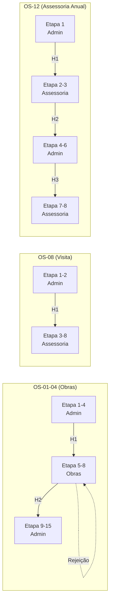
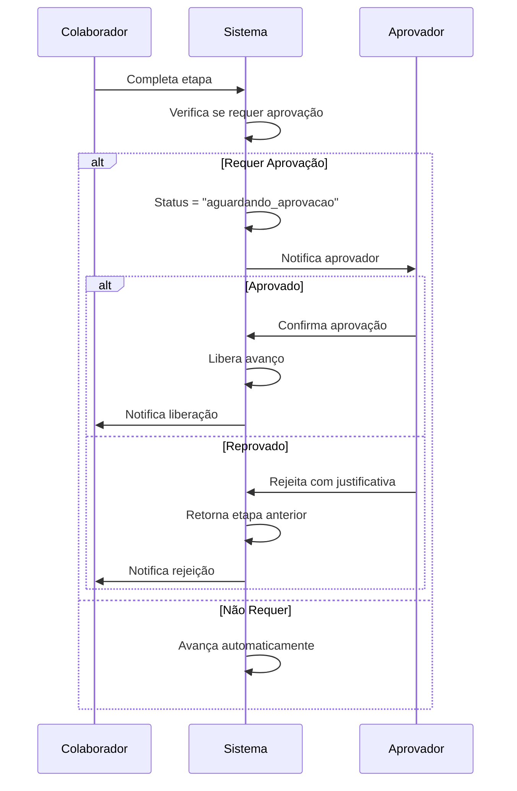

# 🔀 Handoffs e Aprovações

> **Última Atualização:** 2026-01-25

## Visão Geral

O sistema de **handoffs** gerencia automaticamente a transferência de responsabilidade entre setores durante o fluxo de uma OS. O sistema de **aprovações** controla pontos onde é necessária validação hierárquica antes de prosseguir.

---

## Regras de Ownership por Tipo de OS

### OS-01 a 04: Obras

| Etapas | Cargo Responsável | Setor |
|:------:|-------------------|-------|
| 1-4 | `coord_administrativo` | Administrativo |
| 5-8 | `coord_obras` | Obras |
| 9-15 | `coord_administrativo` | Administrativo |

**Handoffs:**
- Etapa 4→5: Admin → Obras (Visita Técnica)
- Etapa 9: Obras → Admin (Aprovação proposta)
- Etapa 9→10: Admin continua (Se aprovado)
- Etapa 9→7: Admin → Obras (Se reprovado)

---

### OS-05/06: Assessoria Lead

| Etapas | Cargo Responsável | Setor |
|:------:|-------------------|-------|
| 1-12 | `coord_administrativo` | Administrativo |

**Handoffs:** Nenhum - Coord. Admin gerencia todo o fluxo.

---

### OS-07: Solicitação de Reforma

| Etapas | Cargo Responsável | Setor |
|:------:|-------------------|-------|
| 1-10 | `coord_assessoria` | Assessoria |

**Iniciador:** Cliente (via link público)  
**Handoffs:** Nenhum

---

### OS-08: Visita Técnica

| Etapas | Cargo Responsável | Setor |
|:------:|-------------------|-------|
| 1-2 | `coord_administrativo` | Administrativo |
| 3-8 | `coord_assessoria` | Assessoria |

**Handoffs:**
- Etapa 2→3: Admin → Assessoria (Após agendamento)

---

### OS-09: Requisição de Compras

| Etapas | Cargo Responsável | Setor |
|:------:|-------------------|-------|
| 1 | `coord_obras` | Obras |
| 2-5 | `coord_administrativo` | Administrativo |

**Iniciador:** Livre (qualquer setor)  
**Handoffs:**
- Etapa 1→2: Solicitante → Admin (Para orçamentos)

---

### OS-10: Requisição de Mão de Obra

| Etapas | Cargo Responsável | Setor |
|:------:|-------------------|-------|
| 1-4 | `coord_administrativo` | Administrativo |

**Iniciador:** Livre  
**Handoffs:** Nenhum

---

### OS-11: Laudo Pontual

| Etapas | Cargo Responsável | Setor |
|:------:|-------------------|-------|
| 1-2 | `coord_administrativo` | Administrativo |
| 3-6 | `coord_assessoria` | Assessoria |

**Handoffs:**
- Etapa 2→3: Admin → Assessoria (Após agendamento)

---

### OS-12: Assessoria Anual

| Etapas | Cargo Responsável | Setor |
|:------:|-------------------|-------|
| 1 | `coord_administrativo` | Administrativo |
| 2-3 | `coord_assessoria` | Assessoria |
| 4-6 | `coord_administrativo` | Administrativo |
| 7-8 | `coord_assessoria` | Assessoria |

**Handoffs:**
- Etapa 1→2: Admin → Assessoria (ART)
- Etapa 3→4: Assessoria → Admin (Agendar visita)
- Etapa 6→7: Admin → Assessoria (Recorrência)

---

### OS-13: Contrato de Obra

| Etapas | Cargo Responsável | Setor |
|:------:|-------------------|-------|
| 1 | `coord_administrativo` | Administrativo |
| 2 | `coord_obras` | Obras |
| 3-4 | `coord_administrativo` | Administrativo |
| 5-10 | `coord_obras` | Obras |
| 11 | `coord_administrativo` | Administrativo |
| 12 | `coord_obras` | Obras |
| 13 | `coord_administrativo` | Administrativo |
| 14-18 | `coord_obras` | Obras |

**Handoffs (7 pontos):**
- Etapa 1→2: Admin → Obras (ART)
- Etapa 2→3: Obras → Admin (Agendar visita inicial)
- Etapa 4→5: Admin → Obras (Histograma)
- Etapa 10→11: Obras → Admin (Seguro)
- Etapa 11→12: Admin → Obras (SST)
- Etapa 12→13: Obras → Admin (Agendar final)
- Etapa 13→14: Admin → Obras (Visita final)

---

## Mapa Visual de Handoffs



---

## Sistema de Aprovações

### Etapas com Aprovação Obrigatória

| OS | Etapa | Nome | Aprovador |
|----|:-----:|------|-----------|
| OS-01-04 | 9 | Gerar Proposta Comercial | Coord. Administrativo |
| OS-01-04 | 13 | Gerar Contrato | Diretor |
| OS-05-06 | 6 | Gerar Proposta Comercial | Coord. Assessoria |
| OS-05-06 | 10 | Gerar Contrato | Diretor |
| OS-07 | 3 | Análise e Parecer | Coord. Assessoria |
| OS-08 | 5 | Formulário Pós-Visita | Coord. Assessoria |
| OS-10 | 2 | Centro de Custo | Coord. Administrativo |
| OS-11 | 5 | Gerar Documento | Coord. Assessoria |
| OS-12 | 3 | Plano de Manutenção | Coord. Assessoria |
| OS-13 | 3,5,8,12,15 | Diversos | Coord. Obras |

---

### Fluxo de Aprovação



---

## Uso Programático

### Verificar Ownership

```typescript
import { getStepOwner } from '@/lib/constants/os-ownership-rules';

const owner = getStepOwner('OS-01', 5);
// { cargo: 'coord_obras', setor: 'obras' }
```

### Verificar Handoff Necessário

```typescript
import { checkDelegationRequired } from '@/lib/constants/os-ownership-rules';

const handoff = checkDelegationRequired(
  'OS-01',                    // tipo OS
  4,                          // etapa atual
  5,                          // próxima etapa
  'coord_administrativo'      // cargo do usuário
);

if (handoff) {
  // Precisa transferir para handoff.toCargo
  console.log(handoff.description);
}
```

### Executar Transferência

```typescript
import { useTransferenciaSetor } from '@/lib/hooks/use-transferencia-setor';

const { executarTransferencia } = useTransferenciaSetor();

await executarTransferencia({
  osId: 'uuid-da-os',
  osType: 'OS-01',
  codigoOS: 'OS-01-0042',
  clienteNome: 'Cliente Exemplo',
  etapaAtual: 4,
  proximaEtapa: 5,
  nomeProximaEtapa: 'Realizar Visita'
});
```
