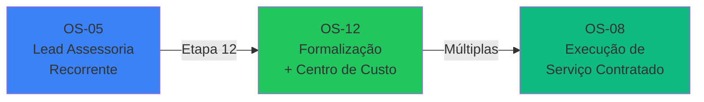
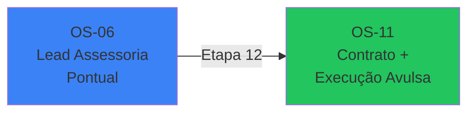
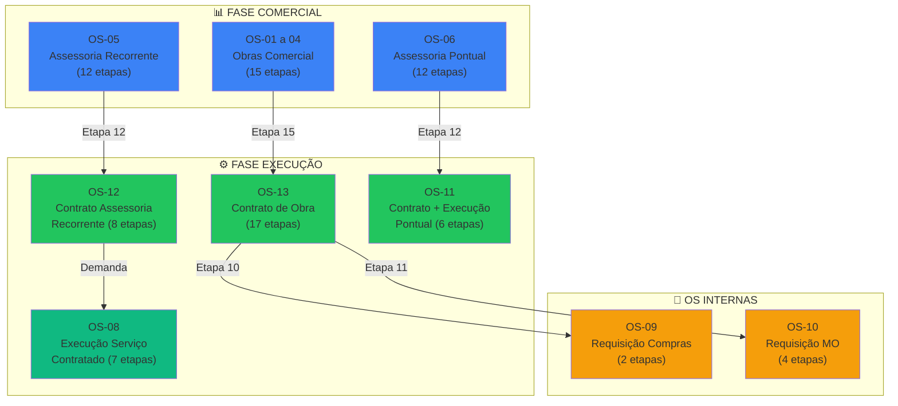

# 🔗 Relacionamentos entre OS

> **Última Atualização:** 2026-01-26

## Visão Geral

O sistema de OS do Minerva possui relacionamentos **pai-filha** organizados em **dois fluxos principais de Assessoria** e um **fluxo de Obras**, garantindo rastreabilidade desde o primeiro contato até a entrega do serviço.

---

## Estrutura dos Fluxos de Assessoria

### 1. Assessoria Técnica Recorrente (Contrato Anual)



| Etapa | OS | Descrição |
|-------|-----|-----------|
| **Prospecção** | OS-05 | Qualificação do lead para contrato anual |
| **Formalização** | OS-12 | Criação de Centro de Custo + Contrato Ativo |
| **Execução** | OS-08 | Demandas técnicas dentro do escopo contratado |

### 2. Assessoria Técnica Pontual (Serviço Avulso)



| Etapa | OS | Descrição |
|-------|-----|-----------|
| **Prospecção** | OS-06 | Qualificação do lead para serviço avulso |
| **Contrato + Execução** | OS-11 | Formalização e execução do serviço pontual |

> [!TIP]
> **Padronização Técnica:** Embora OS-08 e OS-11 pertençam a fluxos comerciais diferentes, a execução técnica e os documentos gerados (recebimento de unidades, laudos SPDA) são idênticos. O sistema espelha os mesmos modelos em ambos os workflows.

---

## Diagrama Geral de Relacionamentos



---

## Relacionamento: OS Comercial → OS Execução

### OS-01 a 04 → OS-13

| Aspecto | Valor |
|---------|-------|
| **OS Pai** | OS-01, OS-02, OS-03 ou OS-04 (Obras Comercial) |
| **OS Filha** | OS-13 (Start de Contrato de Obra) |
| **Gatilho** | Etapa 15 - "Iniciar Contrato de Obra" |
| **Dados Herdados** | cliente_id, dados do memorial, precificação |

```typescript
// Código simplificado do gatilho
if (etapa === 15 && tipoOS.match(/OS-0[1-4]/)) {
  await createOS({
    tipoOSCodigo: 'OS-13',
    clienteId: osPai.cliente_id,
    parentOSId: osPai.id,
    descricao: 'Contrato de Obra - via comercial'
  });
}
```

---

### OS-05 → OS-12

| Aspecto | Valor |
|---------|-------|
| **OS Pai** | OS-05 (Assessoria Recorrente) |
| **OS Filha** | OS-12 (Contrato Assessoria Anual) |
| **Gatilho** | Etapa 12 - "Ativar Contrato" |
| **Dados Herdados** | cliente_id, escopo, frequência de visitas |

---

### OS-06 → OS-11

| Aspecto | Valor |
|---------|-------|
| **OS Pai** | OS-06 (Assessoria Avulsa/Pontual) |
| **OS Filha** | OS-11 (Laudo Pontual) |
| **Gatilho** | Etapa 12 - "Ativar Contrato" |
| **Dados Herdados** | cliente_id, tipo de laudo |

---

## Relacionamento: OS Execução → OS Interna

### OS-13 → OS-09 (Compras)

| Aspecto | Valor |
|---------|-------|
| **OS Pai** | OS-13 (Contrato de Obra) |
| **OS Filha** | OS-09 (Requisição de Compras) |
| **Gatilho** | Etapa 10 - Requisição de Compras |
| **Dados Herdados** | centro_custo_id, cliente_id |

---

### OS-13 → OS-10 (Contratação)

| Aspecto | Valor |
|---------|-------|
| **OS Pai** | OS-13 (Contrato de Obra) |
| **OS Filha** | OS-10 (Requisição de Mão de Obra) |
| **Gatilho** | Etapa 11 - Requisição de Mão de Obra |
| **Dados Herdados** | centro_custo_id, cliente_id |

---

## Uso no Código

### Buscar OS Filhas

```typescript
// Buscar todas as OS filhas de uma OS pai
const { data: osFilhas } = await supabase
  .from('ordens_servico')
  .select('*')
  .eq('parent_os_id', osPaiId);
```

### Criar OS Filha

```typescript
import { workflowAPI } from '@/lib/hooks/use-os-workflows';

const osFilha = await workflowAPI.createOSComEtapas(
  'OS-13',           // tipoOSCodigo
  clienteId,         // cliente
  ccId,              // centro de custo
  responsavelId,     // responsável
  'Contrato via comercial', // descrição
  {},                // metadata
  etapasOS13,        // etapas
  osPaiId            // parentOSId
);
```

### Hook de Hierarquia

```typescript
import { useOSHierarchy } from '@/lib/hooks/use-os-hierarchy';

const { osPai, osFilhas, isLoading } = useOSHierarchy(osId);
```

---

## Regras de Negócio

1. **Herança de Cliente:** A OS filha sempre herda o `cliente_id` da OS pai.

2. **Centro de Custo:** Para OS-09 e OS-10, o CC é herdado da OS-13 pai. Para OS-13, um novo CC é gerado via `gerar_centro_custo()`.

3. **Status do Pai:** Quando a OS filha é criada, a OS pai é marcada como `concluida`.

4. **Navegação:** O componente `LinkedOSDetailModal` exibe o relacionamento de hierarquia na UI.

5. **Timeline:** A criação de OS filha é registrada na timeline da OS pai como evento `os_filha_criada`.
