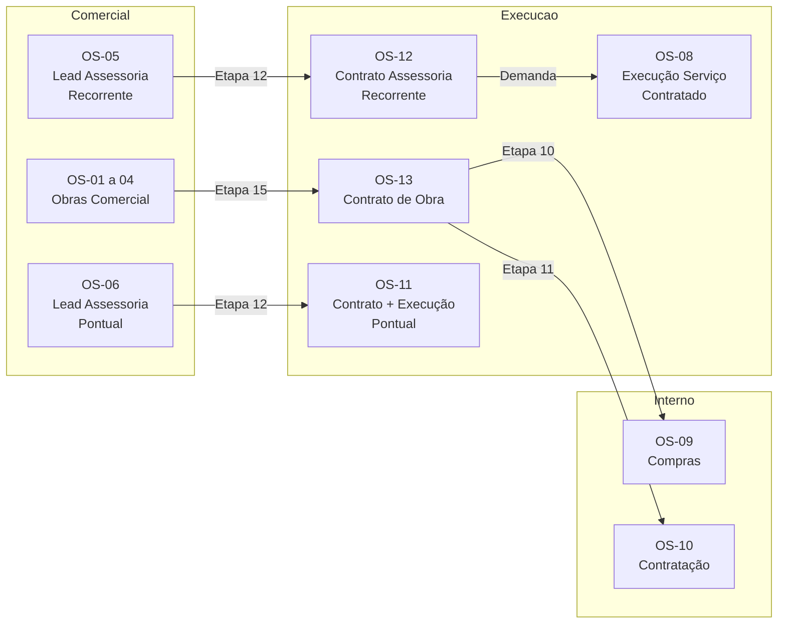

# 📋 Módulo de Ordens de Serviço - MinervaV2

> **Última Atualização:** 2026-01-26  
> **Status Geral:** ~85% implementado

## 🎯 Visão Geral

O módulo de **Ordens de Serviço (OS)** é o coração operacional do Minerva ERP, gerenciando todo o ciclo de vida dos serviços da empresa desde a captação de leads até a execução de contratos.

### Estatísticas

| Métrica | Valor |
|---------|-------|
| **Total de Tipos de OS** | 13 |
| **Setores Envolvidos** | 4 (Obras, Assessoria, Administrativo, RH) |
| **Total de Etapas** | ~100 (variando por tipo) |
| **Handoffs Automáticos** | 15+ pontos de transferência |

---

## 📊 Catálogo de OS

| Código | Nome | Setor | Etapas | Status |
|--------|------|-------|:------:|:------:|
| **OS-01** | Perícia de Fachada | Obras | 15 | ✅ 95% |
| **OS-02** | Revitalização de Fachada | Obras | 15 | ✅ 95% |
| **OS-03** | Reforço Estrutural | Obras | 15 | ✅ 95% |
| **OS-04** | Outros (Obras) | Obras | 15 | ✅ 95% |
| **OS-05** | Lead Assessoria Recorrente | Assessoria | 12 | ✅ 95% |
| **OS-06** | Lead Assessoria Pontual | Assessoria | 12 | ✅ 95% |
| **OS-07** | Solicitação de Reforma | Assessoria | 5 | ⚠️ 90% |
| **OS-08** | Execução Serviço Contratado | Assessoria | 7 | ✅ 95% |
| **OS-09** | Requisição de Compras | Administrativo | 2 | ✅ 95% |
| **OS-10** | Requisição de Mão de Obra | RH | 4 | ✅ 95% |
| **OS-11** | Contrato e Execução Pontual | Assessoria | 6 | ⚠️ 90% |
| **OS-12** | Contrato Assessoria Recorrente | Assessoria | 8 | ⚠️ 90% |
| **OS-13** | Contrato de Obra | Obras | 17 | ✅ 95% |

**Legenda:** ✅ Completo | ⚠️ Parcial (pendente integração)

---

## 🔗 Relacionamentos OS Pai/Filha



---

## 📚 Documentação

### Arquitetura
- [ARCHITECTURE.md](./ARCHITECTURE.md) - Arquitetura técnica do módulo
- [DATABASE_SCHEMA.md](./DATABASE_SCHEMA.md) - Schema do banco de dados
- [HANDOFFS_AND_APPROVALS.md](./HANDOFFS_AND_APPROVALS.md) - Transferências e aprovações

### Relacionamentos
- [OS_RELATIONSHIPS.md](./OS_RELATIONSHIPS.md) - Relacionamentos entre OS

### Workflows por Tipo
- [OS-01-04-OBRAS.md](./WORKFLOWS/OS-01-04-OBRAS.md) - Obras (Perícia, Revitalização, Reforço)
- [OS-05-06-ASSESSORIA.md](./WORKFLOWS/OS-05-06-ASSESSORIA.md) - Assessoria Lead
- [OS-07-REFORMA.md](./WORKFLOWS/OS-07-REFORMA.md) - Solicitação de Reforma
- [OS-08-VISITA.md](./WORKFLOWS/OS-08-VISITA.md) - Execução Serviço Contratado
- [OS-09-COMPRAS.md](./WORKFLOWS/OS-09-COMPRAS.md) - Requisição de Compras
- [OS-10-RH.md](./WORKFLOWS/OS-10-RH.md) - Requisição de Mão de Obra
- [OS-11-LAUDO.md](./WORKFLOWS/OS-11-LAUDO.md) - Contrato e Execução Pontual
- [OS-12-CONTRATO-ASSESS.md](./WORKFLOWS/OS-12-CONTRATO-ASSESS.md) - Contrato Assessoria Recorrente
- [OS-13-CONTRATO-OBRA.md](./WORKFLOWS/OS-13-CONTRATO-OBRA.md) - Contrato de Obra

### Referência Técnica
- [HOOKS_REFERENCE.md](./HOOKS_REFERENCE.md) - Hooks React do módulo
- [COMPONENTS_MAP.md](./COMPONENTS_MAP.md) - Mapa de componentes
- [IMPLEMENTATION_STATUS.md](./IMPLEMENTATION_STATUS.md) - Status de implementação
- [NAVEGACAO_HISTORICO_WORKFLOW.md](../technical/NAVEGACAO_HISTORICO_WORKFLOW.md) - **NOVO**: Padrões de Read-Only e Histórico (Adendos)

### Checklist para Novas OSs
- [ ] Implementar `readOnly` em todos os Steps
- [ ] Usar Wrapper `StepReadOnlyWithAdendos` na visualização de etapas concluídas

---

## 🚀 Quick Start

### Criar uma nova OS programaticamente

```typescript
import { useCreateOSWorkflow } from '@/lib/hooks/use-os-workflows';

const { mutate: createOS } = useCreateOSWorkflow();

await createOS({
  tipoOSCodigo: 'OS-05',
  clienteId: 'uuid-cliente',
  responsavelId: 'uuid-responsavel',
  descricao: 'Descrição da OS',
  etapas: [
    { ordem: 1, nome_etapa: 'Identifique o Lead' },
    // ... demais etapas
  ]
});
```

### Verificar handoff necessário

```typescript
import { checkDelegationRequired } from '@/lib/constants/os-ownership-rules';

const handoff = checkDelegationRequired(
  'OS-01',      // tipo OS
  4,            // etapa atual
  5,            // próxima etapa
  'coord_administrativo'  // cargo atual
);

if (handoff) {
  // Precisa transferir para outro setor
  console.log(`Transferir para ${handoff.toCargo}`);
}
```

---

## 🔐 Cargos e Permissões

| Cargo | Slug | Pode Iniciar | Setores |
|-------|------|--------------|---------|
| Administrador | `admin` | Todas | Todos |
| Diretor | `diretor` | Todas | Todos |
| Coord. Administrativo | `coord_administrativo` | OS-01-06, OS-11-13 | Administrativo |
| Coord. Obras | `coord_obras` | OS-09 | Obras |
| Coord. Assessoria | `coord_assessoria` | OS-07, OS-08 (via cliente) | Assessoria |

---

## 📞 Referências Externas

- [CONSTITUICAO.md](../../CONSTITUICAO.md) - Regras gerais do projeto
- [docs/technical/](../technical/) - Documentação técnica detalhada
- [docs/sistema/TODAS_OS_E_ETAPAS.md](../sistema/TODAS_OS_E_ETAPAS.md) - Referência completa de etapas
