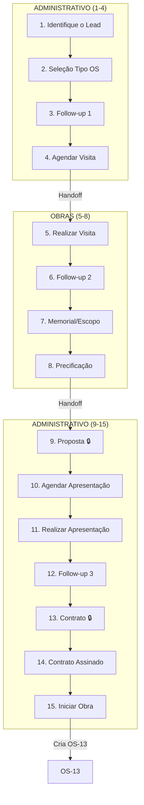

# 🏗️ OS-01 a 04: Obras Comercial

> **Última Atualização:** 2026-01-25  
> **Status:** 95% implementado

## Informações Gerais

| Atributo | Valor |
|----------|-------|
| **Códigos** | OS-01, OS-02, OS-03, OS-04 |
| **Setor Principal** | Obras |
| **Total de Etapas** | 15 |
| **Handoffs** | 4 pontos |
| **OS Filha Gerada** | OS-13 (Contrato de Obra) |

### Tipos de OS Cobertos

| Código | Nome |
|--------|------|
| OS-01 | Perícia de Fachada |
| OS-02 | Revitalização de Fachada |
| OS-03 | Reforço Estrutural |
| OS-04 | Outros (Obras) |

---

## Fluxo de 15 Etapas



---

## Detalhamento das Etapas

### Etapa 1: Identifique o Lead

| Atributo | Valor |
|----------|-------|
| Responsável | Coord. Administrativo |
| Prazo | 1 dia |
| Componente | `cadastrar-lead.tsx` |

**Dados Coletados:**
```typescript
interface Etapa1Data {
  leadId?: string;
  nome?: string;
  cpfCnpj?: string;
  email?: string;
  telefone?: string;
  tipo?: 'fisica' | 'juridica';
  // Edificação
  tipoEdificacao?: string;
  qtdUnidades?: string;
  qtdBlocos?: string;
  qtdPavimentos?: string;
  // Endereço
  cep?: string;
  endereco?: string;
  bairro?: string;
  cidade?: string;
  estado?: string;
}
```

---

### Etapa 2: Seleção do Tipo de OS

| Atributo | Valor |
|----------|-------|
| Responsável | Coord. Administrativo |
| Prazo | 1 dia |

**Ação Especial:** Ao avançar para Etapa 3, a OS é criada no banco.

---

### Etapa 3: Follow-up 1 (Entrevista)

| Atributo | Valor |
|----------|-------|
| Responsável | Coord. Administrativo |
| Prazo | 4 dias |
| Componente | `step-followup-1.tsx` |

**Dados Coletados:**
```typescript
interface Etapa3Data {
  idadeEdificacao?: string;
  motivoProcura?: string;
  quandoAconteceu?: string;
  oqueFeitoARespeito?: string;
  grauUrgencia?: string;
  nomeContatoLocal?: string;
  telefoneContatoLocal?: string;
  anexos?: File[];
}
```

---

### Etapa 4: Agendar Visita Técnica

| Atributo | Valor |
|----------|-------|
| Responsável | Coord. Administrativo |
| Prazo | 3 dias |
| Componente | `step-agendar-apresentacao.tsx` |

**Integração:** Cria registro na tabela `agendamentos` com categoria "Vistoria Técnica".

---

### Etapa 5: Realizar Visita 🔀

| Atributo | Valor |
|----------|-------|
| Responsável | **Coord. Obras** |
| Prazo | 4 dias |
| **Handoff** | Admin → Obras |

---

### Etapa 6: Follow-up 2 (Pós-Visita)

| Atributo | Valor |
|----------|-------|
| Responsável | Coord. Obras |
| Prazo | 2 dias |
| Componente | `step-preparar-orcamentos.tsx` |

---

### Etapa 7: Memorial (Escopo)

| Atributo | Valor |
|----------|-------|
| Responsável | Coord. Obras |
| Prazo | 1 dia |
| Componente | `step-memorial-escopo.tsx` |

**Dados Coletados:**
```typescript
interface Etapa7Data {
  objetivo?: string;
  etapasPrincipais?: {
    nome: string;
    subetapas: {
      nome: string;
      descricao: string;
      total: string;
    }[];
  }[];
  planejamentoInicial?: string;
  logisticaTransporte?: string;
}
```

---

### Etapa 8: Precificação

| Atributo | Valor |
|----------|-------|
| Responsável | Coord. Obras |
| Prazo | 1 dia |
| Componente | `step-precificacao.tsx` |

**Cálculos Automáticos:**
```typescript
const valorImprevisto = valorBase * (percentualImprevisto / 100);
const valorLucro = (valorBase + valorImprevisto) * (percentualLucro / 100);
const valorFinal = (valorBase + valorImprevisto + valorLucro) * (1 + imposto / 100);
```

---

### Etapa 9: Gerar Proposta 🔒🔀

| Atributo | Valor |
|----------|-------|
| Responsável | **Coord. Administrativo** |
| Prazo | 1 dia |
| **Aprovação** | Coord. Obras |
| **Handoff** | Obras → Admin |
| Componente | `step-gerar-proposta.tsx` |

**Ações:**
1. Gera PDF via Edge Function `generate-pdf`
2. Upload para Supabase Storage
3. Registra em `os_documentos`
4. Aguarda aprovação para avançar

---

### Etapas 10-12: Apresentação e Follow-up

| Etapa | Nome | Prazo |
|:-----:|------|:-----:|
| 10 | Agendar Apresentação | 1 dia |
| 11 | Realizar Apresentação | 1 dia |
| 12 | Follow-up 3 (Pós-Apresentação) | 1 dia |

---

### Etapa 13: Gerar Contrato 🔒

| Atributo | Valor |
|----------|-------|
| Responsável | Coord. Administrativo |
| Prazo | 1 dia |
| **Aprovação** | Diretor |
| Componente | `step-gerar-contrato.tsx` |

---

### Etapa 14: Contrato Assinado

| Atributo | Valor |
|----------|-------|
| Responsável | Coord. Administrativo |
| Prazo | 1 dia |
| Componente | `step-contrato-assinado.tsx` |

---

### Etapa 15: Iniciar Contrato de Obra

| Atributo | Valor |
|----------|-------|
| Responsável | Sistema |
| **Ação Automática** | Cria OS-13 |

**Código:**
```typescript
const os13 = await createOS({
  tipoOSCodigo: 'OS-13',
  clienteId: os.cliente_id,
  parentOSId: osId,
  descricao: 'Contrato de Obra'
});

await updateOS(osId, { status_geral: 'concluida' });
navigate({ to: '/os/$osId', params: { osId: os13.id } });
```

---

## Arquivos Relacionados

```
src/components/os/obras/os-1-4/
└── pages/
    └── os-1-4-workflow-page.tsx

src/components/os/shared/steps/
├── cadastrar-lead.tsx
├── step-followup-1.tsx
├── step-agendar-apresentacao.tsx
├── step-preparar-orcamentos.tsx
├── step-memorial-escopo.tsx
├── step-precificacao.tsx
├── step-gerar-proposta.tsx
├── step-realizar-apresentacao.tsx
├── step-analise-relatorio.tsx
├── step-gerar-contrato.tsx
└── step-contrato-assinado.tsx

src/routes/_auth/os/
└── details-workflow/$id.tsx
```
