# 📊 OS-05 e OS-06: Lead Assessoria

> **Última Atualização:** 2026-01-26  
> **Status:** 95% implementado

## Informações Gerais

| Atributo | Valor |
|----------|-------|
| **Códigos** | OS-05, OS-06 |
| **Setor Principal** | Assessoria |
| **Total de Etapas** | 12 |
| **Handoffs** | 0 (sem transferências) |
| **Aprovações** | Etapas 6 e 10 |

### Estrutura dos Fluxos

| Tipo | OS Lead | OS Execução | Descrição |
|------|---------|-------------|-----------|
| **Recorrente** | OS-05 | OS-12 → OS-08 | Contrato anual com demandas múltiplas |
| **Pontual** | OS-06 | OS-11 | Serviço avulso único |

> [!TIP]
> **OS-08 e OS-11:** Embora pertençam a fluxos comerciais diferentes, a execução técnica e os documentos gerados são **idênticos** (recebimento de unidades, laudos SPDA). O sistema espelha os mesmos modelos em ambos.

---

## Fluxo de 12 Etapas

```mermaid
flowchart TB
    subgraph Admin["COORD. ADMINISTRATIVO (1-12)"]
        E1[1. Identifique o Lead]
        E2[2. Seleção Tipo OS]
        E3[3. Follow-up 1]
        E4[4. Memorial/Escopo]
        E5[5. Precificação]
        E6["6. Proposta 🔒"]
        E7[7. Agendar Visita]
        E8[8. Realizar Visita]
        E9[9. Follow-up 3]
        E10["10. Contrato 🔒"]
        E11[11. Contrato Assinado]
        E12[12. Ativar Contrato]
    end
    
    E1 --> E2 --> E3 --> E4 --> E5 --> E6
    E6 --> E7 --> E8 --> E9 --> E10 --> E11 --> E12
    
    E12 -->|OS-05| OS12[OS-12 Contrato Anual]
    E12 -->|OS-06| OS11[OS-11 Laudo Pontual]
```



---

## Detalhamento das Etapas

### Etapa 1: Identifique o Lead

| Atributo | Valor |
|----------|-------|
| Responsável | Coord. Administrativo |
| Prazo | 1 dia |
| Componente | `cadastrar-lead.tsx` |

**Comportamento:** Ao avançar, a OS é criada automaticamente (diferente de OS-01-04 que cria na Etapa 2→3).

---

### Etapa 2: Seleção do Tipo de Assessoria

| Atributo | Valor |
|----------|-------|
| Responsável | Coord. Administrativo |
| Prazo | 1 dia |
| Componente | `step-selecao-tipo-assessoria.tsx` |

**Opções:**
- **OS-05:** Assessoria Recorrente (visitas mensais, contrato anual)
- **OS-06:** Assessoria Pontual (laudo único, parecer específico)

---

### Etapa 3: Follow-up 1 (Entrevista)

| Atributo | Valor |
|----------|-------|
| Responsável | Coord. Administrativo |
| Prazo | 4 dias |

**Componentes Específicos:**
- OS-05: `step-followup-1-os5.tsx` (frequência, duração contrato)
- OS-06: `step-followup-1-os6.tsx` (tipo laudo, prazo entrega)

---

### Etapa 4: Memorial (Escopo e Prazos)

| Atributo | Valor |
|----------|-------|
| Responsável | Coord. Administrativo |
| Prazo | 2 dias |
| Componente | `step-escopo-assessoria.tsx` |

```typescript
interface StepEscopoAssessoriaData {
  objetivo?: string;
  especificacoesTecnicas?: {
    nome: string;
    descricao: string;
  }[];
  metodologia?: string;
  prazo?: {
    planejamentoInicial?: string;
    levantamentoCampo?: string;
    composicaoLaudo?: string;
  };
  garantia?: string;
}
```

---

### Etapa 5: Precificação

| Atributo | Valor |
|----------|-------|
| Responsável | Coord. Administrativo |
| Prazo | 1 dia |
| Componente | `step-precificacao-assessoria.tsx` |

**Diferença de OS-01-04:** Valor base é definido manualmente (não calculado por etapas).

---

### Etapa 6: Gerar Proposta 🔒

| Atributo | Valor |
|----------|-------|
| Responsável | Coord. Administrativo |
| Prazo | 1 dia |
| **Aprovação** | Coord. Assessoria |
| Componente | `step-gerar-proposta.tsx` |

---

### Etapas 7-9: Apresentação

| Etapa | Nome | Prazo |
|:-----:|------|:-----:|
| 7 | Agendar Visita (Apresentação) | 3 dias |
| 8 | Realizar Visita (Apresentação) | 1 dia |
| 9 | Follow-up 3 (Pós-Apresentação) | 2 dias |

---

### Etapa 10: Gerar Contrato 🔒

| Atributo | Valor |
|----------|-------|
| Responsável | Coord. Administrativo |
| Prazo | 1 dia |
| **Aprovação** | Diretor |
| Componente | `step-gerar-contrato.tsx` |

---

### Etapa 11: Contrato Assinado

| Atributo | Valor |
|----------|-------|
| Responsável | Coord. Administrativo |
| Prazo | 2 dias |
| Componente | `step-contrato-assinado.tsx` |

---

### Etapa 12: Ativar Contrato

| Atributo | Valor |
|----------|-------|
| Responsável | Sistema |
| Componente | `step-ativar-contrato-assessoria.tsx` |

**Ação Automática:**

```typescript
if (tipoOS === 'OS-05') {
  // Criar OS-12 (Assessoria Anual)
  await createOS({
    tipoOSCodigo: 'OS-12',
    clienteId: os.cliente_id,
    parentOSId: osId,
    descricao: 'Execução de Assessoria Mensal'
  });
} else if (tipoOS === 'OS-06') {
  // Criar OS-11 (Laudo Pontual)
  await createOS({
    tipoOSCodigo: 'OS-11',
    clienteId: os.cliente_id,
    parentOSId: osId,
    descricao: 'Execução de Laudo Pontual'
  });
}

await updateOS(osId, { status_geral: 'concluida' });
```

---

## Arquivos Relacionados

```
src/components/os/assessoria/os-5-6/
├── pages/
│   └── os-5-6-workflow-page.tsx
└── steps/
    ├── step-selecao-tipo-assessoria.tsx
    └── step-ativar-contrato-assessoria.tsx

src/components/os/shared/steps/
├── cadastrar-lead.tsx
├── step-followup-1-os5.tsx
├── step-followup-1-os6.tsx
├── step-escopo-assessoria.tsx
├── step-precificacao-assessoria.tsx
├── step-gerar-proposta.tsx
├── step-agendar-apresentacao.tsx
├── step-realizar-apresentacao.tsx
├── step-analise-relatorio.tsx
├── step-gerar-contrato.tsx
└── step-contrato-assinado.tsx

src/routes/_auth/os/criar/
└── assessoria-lead.tsx
```

---

## Diferenças entre OS-05 e OS-06

| Aspecto | OS-05 (Recorrente) | OS-06 (Pontual) |
|---------|-------------------|-----------------|
| Tipo de Contrato | Anual | Único |
| Visitas | Mensais | Uma vez |
| Campos Follow-up | Frequência, duração | Tipo laudo, prazo |
| OS Filha | OS-12 | OS-11 |
| Valor Típico | Mensalidade | Valor fechado |
