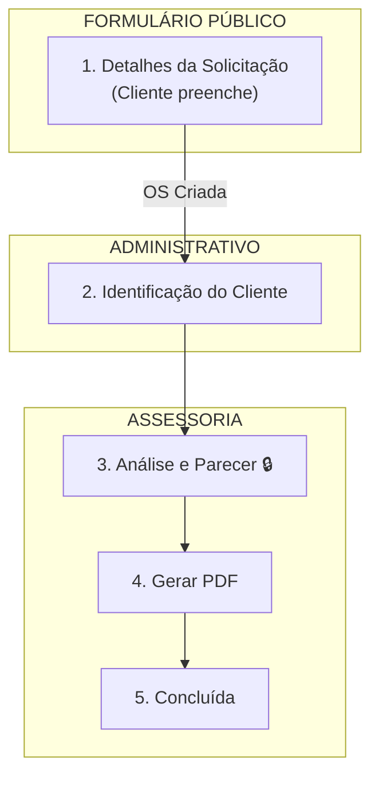

# 🏠 OS-07: Solicitação de Reforma

> **Última Atualização:** 2026-01-26  
> **Status:** 95% implementado


## Informações Gerais

| Atributo | Valor |
|----------|-------|
| **Código** | OS-07 |
| **Setor** | Assessoria |
| **Total de Etapas** | 5 |
| **Iniciador** | Cliente (via link público) |
| **Handoffs** | 0 |
| **Rota Pública** | `/solicitacao-reforma` |

---

## Fluxo de 5 Etapas



---

## Detalhamento das Etapas

### Etapa 1: Detalhes da Solicitação (Público)

| Atributo | Valor |
|----------|-------|
| Responsável | Cliente |
| Prazo | - |
| **Acesso** | Link público `/solicitacao-reforma` |
| Componente | `os07-form-publico-novo.tsx` |

**Formulário Público:**
```typescript
interface FormularioReformaData {
  // Solicitante
  nome?: string;
  whatsapp?: string;
  email?: string;
  // Localização
  condominioNome?: string;
  bloco?: string;
  unidade?: string;
  // Intervenções
  intervencoes?: string[];
  temIntervencaoCritica?: boolean;
  // Discriminação (NOVO)
  discriminacoes?: {
    sistema: string;  // ELÉTRICA, CIVIL, HIDRÁULICA, FORRO, ESQUADRIAS
    item: string;     // Descrição do que será feito
    geraRuido: boolean;
    previsaoInicio: string;  // dd/mm/aa
    previsaoFim: string;     // dd/mm/aa
  }[];
  // Plano de Descarte (NOVO)
  planoDescarte?: string;
  // Executores
  executores?: { nome: string; cpf: string }[];
  // Documentação
  arquivosART?: File[];
  arquivosProjeto?: File[];
}
```

**Comportamento:**
- Não requer autenticação
- Valida ART/RRT para intervenções críticas
- Ao submeter, cria OS automaticamente e avança para Etapa 2

---

### Etapa 2: Identificação do Cliente

| Atributo | Valor |
|----------|-------|
| Responsável | Coord. Administrativo |
| Prazo | 1 dia |
| Componente | `lead-cadastro.tsx` |

**Ação:** Vincula cliente existente ou cria novo lead.

| Atributo | Valor |
|----------|-------|
| Responsável | Coord. Assessoria |
| Prazo | 3 dias |
| **Aprovação** | Coord. Assessoria |
| Componente | `os07-analise-page.tsx` |

```typescript
interface AnaliseReformaData {
  analiseAprovada?: boolean;
  observacoesTecnicas?: string;
  requisitosSeguran?: string[];
  parecerEngenheiro?: string;
  dataAnalise?: string;
}
```

---

### Etapa 4: Gerar PDF

| Atributo | Valor |
|----------|-------|
| Responsável | Coord. Assessoria |
| Prazo | 2 dias |

**Ação:** Gera "Termo de Comunicação de Reforma" via Edge Function.

---

### Etapa 5: Concluída

| Atributo | Valor |
|----------|-------|
| Responsável | Sistema |
| Prazo | 1 dia |

---

## Rotas Públicas

| URL | Descrição | Componente |
|-----|-----------|------------|
| `/solicitacao-reforma` | Formulário público (sem osId) | `os07-form-publico-novo.tsx` |
| `/reforma/{osId}` | Formulário legado (com osId) | `os07-form-publico.tsx` |

---

## Arquivos Relacionados

```
src/components/os/assessoria/os-7/
├── pages/
│   ├── os07-workflow-page.tsx      # Workflow interno
│   └── os07-analise-page.tsx       # Análise técnica
├── shared/
│   └── form-detalhes-reforma.tsx   # ⭐ Componente compartilhado
├── components/
│   ├── os07-form-publico-novo.tsx  # Formulário público (usa shared)
│   └── os07-form-publico.tsx       # Formulário legado
└── steps/
    └── (usa componentes de shared/)
```

> [!TIP]
> **Componente Reutilizável:** `form-detalhes-reforma.tsx` contém os campos de intervenções, executores e documentação. Alterações neste arquivo afetam tanto o formulário público quanto o interno.

### Campos Compartilhados (form-detalhes-reforma.tsx)

```typescript
export interface DetalhesReformaData {
  intervencoesSelecionadas: string[];
  executores: Executor[];
  arquivosART: FileWithComment[];
  arquivosProjeto: FileWithComment[];
}
```

