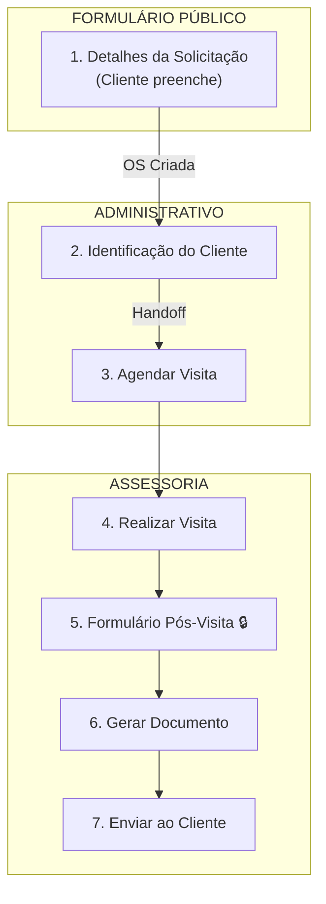

# 🔧 OS-08: Visita Técnica / Parecer Técnico

> **Última Atualização:** 2026-01-26  
> **Status:** 95% implementado

## Informações Gerais

| Atributo | Valor |
|----------|-------|
| **Código** | OS-08 |
| **Setor** | Assessoria |
| **Total de Etapas** | 7 |
| **Iniciador** | Cliente (via link público) ou Interno |
| **Handoffs** | 1 (Admin → Assessoria) |
| **Rota Pública** | `/solicitacao-visita-tecnica` |

> [!NOTE]
> **Fluxo Público:** A OS-08 pode ser iniciada externamente via formulário público. O cliente preenche a Etapa 1 (Detalhes da Solicitação) e a OS é criada automaticamente. O colaborador interno vincula o cliente na Etapa 2.

---

## Fluxo de 7 Etapas



---

## Detalhamento das Etapas

### Etapa 1: Identificação do Solicitante

| Atributo | Valor |
|----------|-------|
| Responsável | Coord. Administrativo |
| Prazo | 1 dia |

```typescript
interface Etapa1OS08Data {
  solicitanteNome?: string;
  solicitanteWhatsapp?: string;
  condominioNome?: string;
  tipoDocumentoRequerido?: 'Parecer' | 'Laudo' | 'Vistoria';
  detalhesSolicitacao?: string;
  fotosSolicitacao?: File[];
}
```

---

### Etapa 2: Atribuir Cliente 🔀

| Atributo | Valor |
|----------|-------|
| Responsável | Coord. Administrativo |
| Prazo | 1 dia |
| **Handoff** | Admin → Assessoria |

---

### Etapa 3: Agendar Visita

| Atributo | Valor |
|----------|-------|
| Responsável | **Coord. Assessoria** |
| Prazo | 2 dias |
| Componente | `step-agendar-visita.tsx` |

---

### Etapa 4: Realizar Visita

| Atributo | Valor |
|----------|-------|
| Responsável | Coord. Assessoria |
| Prazo | 2 dias |
| Componente | `step-realizar-visita.tsx` |

---

### Etapa 5: Formulário Pós-Visita 🔒

| Atributo | Valor |
|----------|-------|
| Responsável | Coord. Assessoria |
| Prazo | 2 dias |
| **Aprovação** | Coord. Assessoria |
| Componente | `step-formulario-pos-visita.tsx` |

```typescript
interface FormularioPosVisitaData {
  pontuacaoEngenheiro?: number; // 1-5
  pontuacaoMorador?: number;    // 1-5
  manifestacaoPatologica?: string;
  gravidadeProblema?: 'baixa' | 'media' | 'alta' | 'critica';
  recomendacoesTecnicas?: string;
  referenciaNBR?: string;
  fotosLocal?: File[];
  fotosManifestacao?: File[];
  conclusaoTecnica?: string;
}
```

---

### Etapa 6: Gerar Documento

| Atributo | Valor |
|----------|-------|
| Responsável | Coord. Assessoria |
| Prazo | 1 dia |
| Componente | `step-gerar-documento.tsx` |

**Template:** `parecer-tecnico` via Edge Function `generate-pdf`

---

### Etapa 7: Enviar ao Cliente

| Atributo | Valor |
|----------|-------|
| Responsável | Sistema |
| Prazo | 1 dia |
| Componente | `step-enviar-documento.tsx` |

**Métodos de Envio:** Email, WhatsApp ou Portal do Cliente

---

## Rotas Públicas

| URL | Descrição | Componente |
|-----|-----------|------------|
| `/solicitacao-visita-tecnica` | Formulário público (sem osId) | `os08-form-publico.tsx` |

---

## Arquivos Relacionados

```
src/components/os/assessoria/os-8/
├── pages/
│   └── os08-workflow-page.tsx       # Workflow interno
├── shared/
│   └── form-detalhes-visita.tsx     # ⭐ Componente compartilhado
├── components/
│   ├── os08-form-publico.tsx        # Formulário público (usa shared)
│   └── checklist-recebimento.tsx
└── steps/
    ├── step-detalhes-solicitacao.tsx # Usa shared (40 linhas)
    ├── step-agendar-visita.tsx
    ├── step-realizar-visita.tsx
    ├── step-formulario-pos-visita.tsx
    ├── step-gerar-documento.tsx
    └── step-enviar-documento.tsx
```

> [!TIP]
> **Componente Reutilizável:** `form-detalhes-visita.tsx` contém os campos de finalidade, tipo de área, detalhes técnicos e uploads. Alterações neste arquivo afetam tanto o formulário público quanto o interno.

### Campos Compartilhados (form-detalhes-visita.tsx)

```typescript
export interface DetalhesSolicitacaoData {
  finalidadeInspecao: FinalidadeInspecao | '';
  tipoArea: string;
  unidadesVistoriar: string;
  contatoUnidades: string;
  areaVistoriada: string;
  detalhesSolicitacao: string;
  tempoSituacao: string;
  primeiraVisita: string;
  arquivos?: FileWithComment[];
}
```

---

## Regra Especial

> [!NOTE]
> **Clientes com contrato OS-05 (anual):** Uma OS-08 deve ser agendada **toda semana** como parte do serviço de assessoria recorrente.

