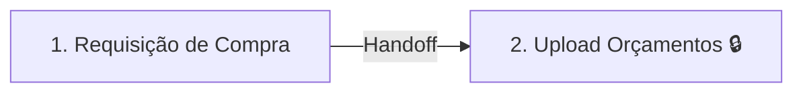

# 💰 OS-09: Requisição de Compras

> **Última Atualização:** 2026-01-25  
> **Status:** 95% implementado

## Informações Gerais

| Atributo | Valor |
|----------|-------|
| **Código** | OS-09 |
| **Setor** | Administrativo |
| **Total de Etapas** | 2 |
| **Iniciador** | Livre (qualquer setor) |
| **Handoffs** | 1 (Solicitante → Admin) |
| **Gatilho** | Manual ou via OS-13 (Etapa 10) |

---

## Fluxo de 2 Etapas



---

## Detalhamento das Etapas

### Etapa 1: Requisição de Compra

| Atributo | Valor |
|----------|-------|
| Responsável | Coord. Obras (solicitante) |
| Prazo | - |
| Componente | `step-requisicao-compra.tsx` |

```typescript
interface ItemRequisicao {
  id: string;
  descricao: string;
  quantidade: number;
  unidade: 'un' | 'kg' | 'm' | 'm²' | 'litro';
  especificacao?: string;
  valorEstimado?: number;
}

interface Etapa1OS09Data {
  centroCustoId: string;       // OBRIGATÓRIO
  centroCustoNome?: string;
  itens: ItemRequisicao[];
  valorTotalEstimado?: number; // Calculado
  justificativa?: string;
  urgencia?: 'baixa' | 'media' | 'alta';
  dataNecessidade?: string;
  observacoes?: string;
  // Vínculo com OS pai
  osOrigemId?: string;
  osOrigemCodigo?: string;
}
```

**Regras:**
- Centro de Custo é **obrigatório**
- Valor total = `∑(quantidade × valorEstimado)`

---

### Etapa 2: Upload de Orçamentos 🔒

| Atributo | Valor |
|----------|-------|
| Responsável | **Coord. Administrativo** |
| **Handoff** | Solicitante → Admin |
| **Aprovação** | Coord. Administrativo |
| Componente | `step-upload-orcamentos.tsx` |

```typescript
interface Orcamento {
  id: string;
  fornecedorNome: string;
  fornecedorCnpj?: string;
  arquivo: File;
  valorTotal: number;
  prazoEntrega?: string;
  observacoes?: string;
}

interface Etapa2OS09Data {
  orcamentos: Orcamento[];            // Mínimo 3
  orcamentoSelecionadoId?: string;
  justificativaEscolha?: string;
  statusAprovacao?: 'pendente' | 'aprovado' | 'reprovado';
}
```

> [!WARNING]
> **Mínimo de 3 orçamentos** é obrigatório para conclusão.

---

## Arquivos Relacionados

```
src/components/os/administrativo/os-9/
├── pages/
│   └── os09-workflow-page.tsx
├── components/
│   └── requisition-item-card.tsx
└── steps/
    ├── step-requisicao-compra.tsx
    └── step-upload-orcamentos.tsx

src/routes/_auth/os/criar/
└── requisicao-compras.tsx
```

---

## Integração com OS-13

Quando criada via **OS-13 (Etapa 10)**:

```typescript
const os09 = await createOS({
  tipoOSCodigo: 'OS-09',
  clienteId: os13.cliente_id,
  parentOSId: os13.id,
  metadata: {
    osOrigemId: os13.id,
    osOrigemCodigo: os13.codigo_os,
    centroCustoId: os13.cc_id
  }
});
```
