# 👥 OS-10: Requisição de Mão de Obra

> **Última Atualização:** 2026-01-25  
> **Status:** 95% implementado

## Informações Gerais

| Atributo | Valor |
|----------|-------|
| **Código** | OS-10 |
| **Setor** | RH / Administrativo |
| **Total de Etapas** | 4 |
| **Iniciador** | Livre |
| **Handoffs** | 0 |
| **Gatilho** | Manual ou via OS-13 (Etapa 11) |

---

## Fluxo de 4 Etapas

```mermaid
flowchart LR
    E1[1. Abertura Solicitação]
    E2["2. Centro de Custo 🔒"]
    E3[3. Gerenciador de Vagas]
    E4[4. Revisão e Envio]
    
    E1 --> E2 --> E3 --> E4
```



---

## Detalhamento das Etapas

### Etapa 1: Abertura da Solicitação

| Atributo | Valor |
|----------|-------|
| Responsável | Solicitante |
| Componente | `step-abertura-solicitacao.tsx` |

```typescript
interface AberturaData {
  dataAbertura?: string;      // Auto (data atual)
  solicitante?: string;       // Auto (usuário logado) - READ ONLY
  solicitanteId?: string;     // Auto - READ ONLY
  departamento?: string;      // Auto (setor do usuário) - READ ONLY
  urgencia?: 'baixa' | 'normal' | 'alta' | 'urgente';
  justificativa?: string;     // Obrigatório
}
```

> [!IMPORTANT]
> Campos `solicitante` e `departamento` são preenchidos automaticamente e não podem ser alterados.

---

### Etapa 2: Seleção do Centro de Custo 🔒

| Atributo | Valor |
|----------|-------|
| Responsável | Coord. Administrativo |
| **Aprovação** | Coord. Administrativo |
| Componente | `step-selecao-centro-custo.tsx` |

**Ação:** A OS é criada ao avançar desta etapa.

---

### Etapa 3: Gerenciador de Vagas

| Atributo | Valor |
|----------|-------|
| Responsável | Coord. Administrativo |
| Componente | `step-gerenciador-vagas.tsx` |

```typescript
interface Vaga {
  id: string;
  cargo: string;
  funcao: string;
  quantidade: number;
  requisitos?: string;
  faixaSalarial?: string;
}

interface GerenciadorVagasData {
  vagas: Vaga[];
  totalVagas?: number;
}
```

**Funcionalidades:**
- Adicionar múltiplas vagas
- Modal de criação individual
- Cards visuais por vaga

---

### Etapa 4: Revisão e Envio

| Atributo | Valor |
|----------|-------|
| Responsável | Coord. Administrativo |
| Componente | `step-revisao-envio.tsx` |

---

## Funções de Colaborador Disponíveis

| # | Slug | Nome |
|:-:|------|------|
| 1 | `admin` | Administrador |
| 2 | `diretor` | Diretor |
| 3 | `coord_administrativo` | Coord. Administrativo |
| 4 | `coord_obras` | Coord. Obras |
| 5 | `coord_assessoria` | Coord. Assessoria |
| 6 | `operacional_admin` | Operacional Admin |
| 7 | `operacional_obras` | Operacional Obras |
| 8 | `operacional_assessoria` | Operacional Assessoria |
| 9 | `colaborador_obra` | Colaborador Obra* |
| 10 | `mao_de_obra` | Mão de Obra* |

> *Não possuem acesso ao sistema

---

## Arquivos Relacionados

```
src/components/os/administrativo/os-10/
├── pages/
│   └── os10-workflow-page.tsx
├── components/
│   ├── modal-adicionar-vaga.tsx
│   └── vaga-card.tsx
└── steps/
    ├── step-abertura-solicitacao.tsx
    ├── step-selecao-centro-custo.tsx
    ├── step-gerenciador-vagas.tsx
    └── step-revisao-envio.tsx

src/routes/_auth/os/criar/
└── requisicao-mao-de-obra.tsx
```
