# 📄 OS-11: Contrato e Execução Pontual

> **Última Atualização:** 2026-01-26  
> **Status:** 100% implementado

## Informações Gerais

| Atributo | Valor |
|----------|-------|
| **Código** | OS-11 |
| **Setor** | Assessoria |
| **Total de Etapas** | 7 |
| **Gatilho** | Gerada por OS-06 (Etapa 12) |
| **Handoffs** | 1 (Admin → Assessoria) |

> [!NOTE]
> **Fluxo Pontual:** A OS-11 gerencia tanto a formalização do contrato quanto a execução do serviço avulso. A execução técnica e os documentos gerados (laudos, recebimento de unidades) são idênticos aos da OS-08.

---

## Fluxo de 7 Etapas

```mermaid
flowchart TB
    subgraph Admin["ADMINISTRATIVO (1-2)"]
        E1[1. Cadastrar Cliente]
        E2[2. Agendar Visita]
    end
    
    subgraph Assessoria["ASSESSORIA (3-7)"]
        E3[3. Realizar Visita]
        E4[4. Anexar RT]
        E5[5. Questionário Pós-Visita]
        E6["6. Gerar Documento 🔒"]
        E7[7. Enviar ao Cliente]
    end
    
    E1 --> E2
    E2 -->|Handoff| E3
    E3 --> E4 --> E5 --> E6 --> E7
```



---

## Detalhamento das Etapas

### Etapa 1: Cadastrar Cliente

| Atributo | Valor |
|----------|-------|
| Responsável | Coord. Administrativo |
| Componente | `CadastrarLead` |

---

### Etapa 2: Agendar Visita 🔀

| Atributo | Valor |
|----------|-------|
| Responsável | Coord. Administrativo |
| **Handoff** | Admin → Assessoria |
| Componente | `StepAgendarVisita` |

---

### Etapa 3: Realizar Visita

| Atributo | Valor |
|----------|-------|
| Responsável | **Coord. Assessoria** |
| Componente | `StepRealizarVisita` |

---

### Etapa 4: Anexar RT

| Atributo | Valor |
|----------|-------|
| Responsável | Coord. Assessoria |
| Componente | `StepAnexarRT` |

---

### Etapa 5: Questionário Pós-Visita

| Atributo | Valor |
|----------|-------|
| Responsável | Coord. Assessoria |
| Componente | `StepFormularioPosVisita` |

---

### Etapa 6: Gerar Documento 🔒

| Atributo | Valor |
|----------|-------|
| Responsável | Sistema |
| **Aprovação** | Coord. Assessoria |
| Componente | `StepGerarDocumento` |

**Geração de PDF:**
```typescript
await generatePdf('laudo-tecnico', {
  clienteNome: os.cliente?.nome,
  dadosVistoria: etapa3Data,
  rt: etapa4Data.arquivoRT,
  dataGeracao: new Date().toISOString()
});
```

---

### Etapa 7: Enviar ao Cliente

| Atributo | Valor |
|----------|-------|
| Responsável | Sistema |
| Componente | `StepEnviarCliente` |

---

## Arquivos Relacionados

```
src/components/os/assessoria/os-11/
├── pages/
│   └── os11-workflow-page.tsx
└── steps/
    ├── step-cadastro-cliente.tsx
    ├── step-agendar-visita.tsx
    ├── step-realizar-visita.tsx
    ├── step-anexar-rt.tsx
    ├── step-gerar-documento.tsx
    └── step-enviar-cliente.tsx

src/routes/_auth/os/criar/
└── laudo-pontual.tsx
```
