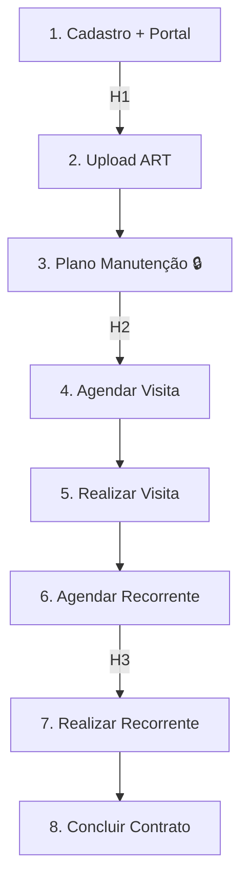

# 📋 OS-12: Contrato de Assessoria Recorrente

> **Última Atualização:** 2026-01-26  
> **Status:** 90% implementado

## Informações Gerais

| Atributo | Valor |
|----------|-------|
| **Código** | OS-12 |
| **Setor** | Assessoria |
| **Total de Etapas** | 8 |
| **Gatilho** | Gerada por OS-05 (Etapa 12) |
| **OS Filhas** | OS-08 (múltiplas, por demanda) |
| **Handoffs** | 3 pontos |

> [!IMPORTANT]
> **Centro de Custo:** Ao ativar a OS-12, o sistema gera um Centro de Custo para rastrear todas as demandas (OS-08) vinculadas a este contrato.

---

## Fluxo de 8 Etapas



---

## Detalhamento das Etapas

### Etapa 1: Cadastro Cliente + Portal 🔀

| Atributo | Valor |
|----------|-------|
| Responsável | Coord. Administrativo |
| **Handoff** | Admin → Assessoria |
| Componente | `StepCadastroClientePortal` |

**Ações:**
- Cria acesso ao Portal do Cliente
- Envia email com credenciais (login, senha, link)
- Usa Edge Function `create-client-portal`

---

### Etapa 2: Upload de ART

| Atributo | Valor |
|----------|-------|
| Responsável | **Coord. Assessoria** |
| Componente | `StepAnexarART` |

---

### Etapa 3: Plano de Manutenção 🔒🔀

| Atributo | Valor |
|----------|-------|
| Responsável | Coord. Assessoria |
| **Aprovação** | Coord. Assessoria |
| **Handoff** | Assessoria → Admin |
| Componente | `StepPlanoManutencao` |

---

### Etapas 4-6: Visitas

| Etapa | Nome | Responsável |
|:-----:|------|-------------|
| 4 | Agendar Visita | Coord. Administrativo |
| 5 | Realizar Visita | Coord. Administrativo |
| 6 | Agendar Recorrente 🔀 | Coord. Administrativo |

**Handoff Etapa 6→7:** Admin → Assessoria

---

### Etapas 7-8: Execução

| Etapa | Nome | Responsável |
|:-----:|------|-------------|
| 7 | Realizar Visita Recorrente | **Coord. Assessoria** |
| 8 | Concluir Contrato | Coord. Assessoria |

---

## Arquivos Relacionados

```
src/components/os/assessoria/os-12/
├── pages/
│   └── os12-workflow-page.tsx
└── steps/
    ├── step-cadastro-cliente-portal.tsx
    ├── step-anexar-art.tsx
    ├── step-plano-manutencao.tsx
    ├── step-agendar-visita.tsx
    ├── step-realizar-visita.tsx
    ├── step-agendar-visita-recorrente.tsx
    ├── step-realizar-visita-recorrente.tsx
    └── step-concluir-contrato.tsx

src/routes/_auth/os/criar/
└── assessoria-recorrente.tsx
```

---

## Integrações

| Integração | Descrição | Status |
|------------|-----------|:------:|
| Supabase Functions | `invite-client` para portal | ✅ |
| E-mail (Resend) | Envio de credenciais | ✅ |
| Calendário | Agendamento de visitas | ⚠️ Parcial |
| Portal do Cliente | Área externa | ✅ |
