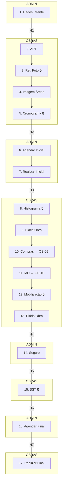

# 🏗️ OS-13: Start de Contrato de Obra

> **Última Atualização:** 2026-01-25  
> **Status:** 95% implementado

## Informações Gerais

| Atributo | Valor |
|----------|-------|
| **Código** | OS-13 |
| **Setor** | Obras |
| **Total de Etapas** | 17 |
| **Gatilho** | Gerada por OS-01-04 (Etapa 15) |
| **Handoffs** | 7 pontos |
| **Aprovações** | 5 etapas |
| **OS Filhas** | OS-09, OS-10 |

---

## Fluxo de 17 Etapas



---

## Quadro Resumo de Etapas

| # | Etapa | Responsável | 🔒 |
|:-:|-------|-------------|:--:|
| 1 | Dados do Cliente | Administrativo | |
| 2 | Anexar ART | Obras | |
| 3 | Relatório Fotográfico | Obras | 🔒 |
| 4 | Imagem de Áreas | Obras | |
| 5 | Cronograma | Obras | 🔒 |
| 6 | Agendar Visita Inicial | Administrativo | |
| 7 | Realizar Visita Inicial | Administrativo | |
| 8 | Histograma | Obras | 🔒 |
| 9 | Placa de Obra | Obras | |
| 10 | Requisição de Compras | Obras | |
| 11 | Requisição de Mão de Obra | Obras | |
| 12 | Evidência Mobilização | Obras | 🔒 |
| 13 | Diário de Obra | Obras | |
| 14 | Seguro de Obras | Administrativo | |
| 15 | Documentos SST | Obras | 🔒 |
| 16 | Agendar Visita Final | Administrativo | |
| 17 | Realizar Visita Final | Obras | |

---

## Integrações Automáticas

### Etapa 10: Cria OS-09

```typescript
await createOS({
  tipoOSCodigo: 'OS-09',
  parentOSId: os13Id,
  clienteId: os13.cliente_id,
  descricao: 'Requisição de Materiais - via OS-13'
});
```

### Etapa 11: Cria OS-10

```typescript
await createOS({
  tipoOSCodigo: 'OS-10',
  parentOSId: os13Id,
  clienteId: os13.cliente_id,
  descricao: 'Requisição de Contratação - via OS-13'
});
```

---

## Handoffs Detalhados

| De | Para | Descrição |
|:--:|:----:|-----------|
| 1→2 | Admin → Obras | Anexar ART |
| 5→6 | Obras → Admin | Agendar visita inicial |
| 7→8 | Admin → Obras | Histograma e Diário |
| 13→14 | Obras → Admin | Providenciar Seguro |
| 14→15 | Admin → Obras | Documentos SST |
| 15→16 | Obras → Admin | Agendar visita final |
| 16→17 | Admin → Obras | Realizar visita final |

---

## Arquivos Relacionados

```
src/components/os/obras/os-13/
├── pages/
│   └── os13-workflow-page.tsx
└── steps/
    ├── cadastrar-cliente-obra.tsx
    ├── step-anexar-art.tsx
    ├── step-relatorio-fotografico.tsx
    ├── step-imagem-areas.tsx
    ├── step-cronograma-obra.tsx
    ├── step-agendar-visita-inicial.tsx
    ├── step-realizar-visita-inicial.tsx
    ├── step-histograma.tsx
    ├── step-placa-obra.tsx
    ├── step-requisicao-compras.tsx
    ├── step-requisicao-mao-obra.tsx
    ├── step-evidencia-mobilizacao.tsx
    ├── step-diario-obra.tsx
    ├── step-seguro-obras.tsx
    ├── step-documentos-sst.tsx
    ├── step-agendar-visita-final.tsx
    └── step-realizar-visita-final.tsx

src/routes/_auth/os/criar/
└── start-contrato-obra.tsx
```
