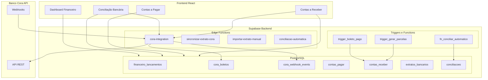
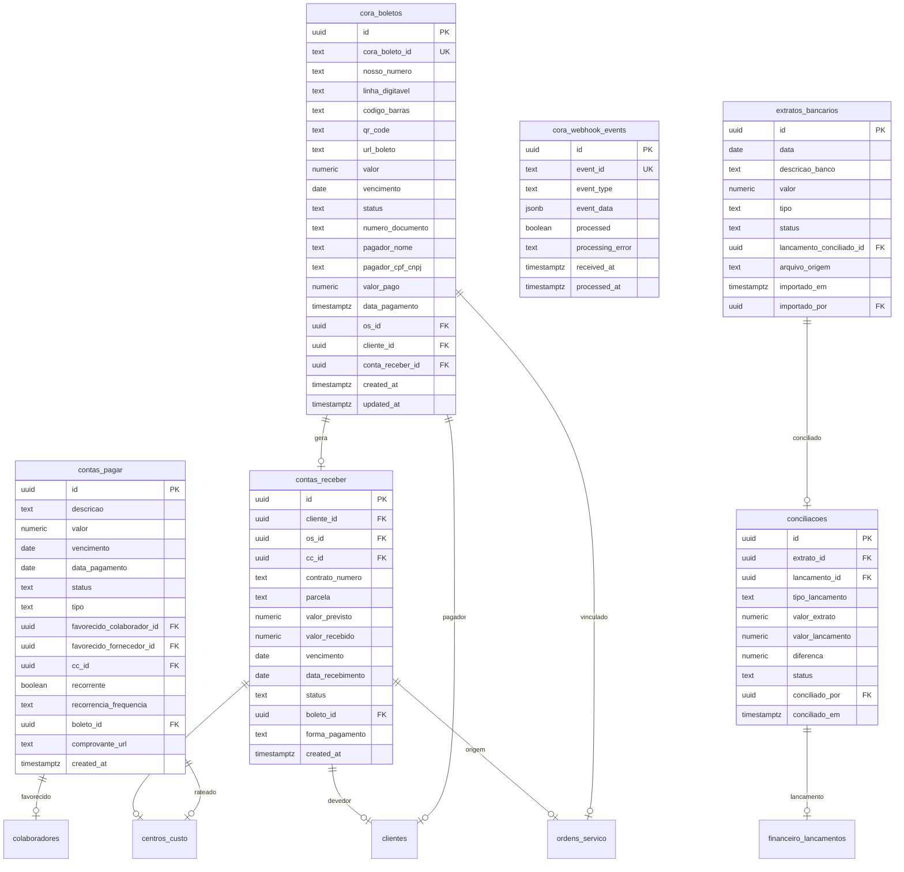
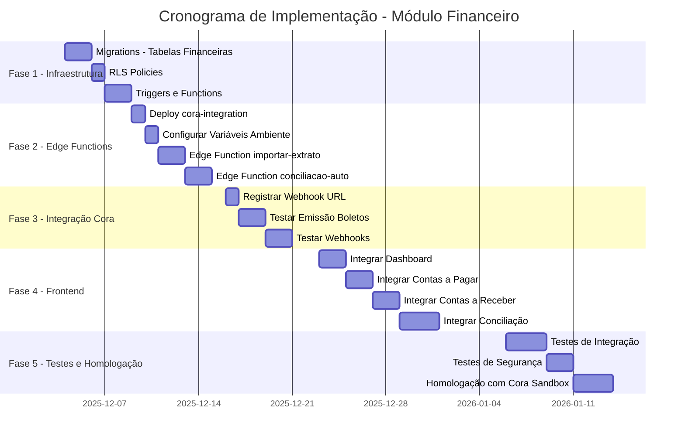

# 🏦 Planejamento Arquitetural - Módulo Financeiro e Integração Banco Cora

> **Data:** 03/12/2025  
> **Versão:** 1.0  
> **Autor:** Arquitetura de Software  
> **Status:** Em Planejamento

---

## 📋 Sumário Executivo

Este documento apresenta a análise arquitetural completa do Módulo Financeiro do sistema MinervaV2, abrangendo os subsistemas de conciliação bancária, contas a pagar, processamento de pagamentos e integração com a API do Banco Cora. O objetivo é identificar gaps funcionais e técnicos, e elaborar um planejamento detalhado de execução.

---

## 1. 🔍 Diagnóstico Atual

### 1.1 Estrutura Existente - Edge Function Cora

A pasta `supabase/functions/cora-integration/` contém uma implementação inicial bem estruturada:

| Arquivo | Descrição | Status |
|---------|-----------|--------|
| [`index.ts`](../../supabase/functions/cora-integration/index.ts:1) | Ponto de entrada com rotas HTTP usando Hono | ✅ Implementado |
| [`auth.ts`](../../supabase/functions/cora-integration/auth.ts:1) | Autenticação mTLS com JWT | ✅ Implementado |
| [`handlers.ts`](../../supabase/functions/cora-integration/handlers.ts:1) | Handlers para API do Cora | ✅ Implementado |
| [`types.ts`](../../supabase/functions/cora-integration/types.ts:1) | Interfaces TypeScript | ✅ Implementado |
| [`README.md`](../../supabase/functions/cora-integration/README.md:1) | Documentação | ✅ Documentado |

**Endpoints implementados na Edge Function:**
- `POST /boleto` - Emitir boleto
- `GET /boleto/:id` - Consultar boleto
- `DELETE /boleto/:id` - Cancelar boleto
- `GET /extrato` - Consultar extrato bancário (API Cora)
- `POST /webhook` - Receber webhooks do Cora
- `GET /health` - Health check
- `GET /auth/test` - Teste de autenticação

**Funcionalidade Crítica - Sincronização de Extrato:**
A API do Cora permite consultar o extrato bancário em tempo real, retornando todas as entradas e saídas da conta. Esta funcionalidade deve ser usada para:
1. **Importar automaticamente** transações para a tabela `extratos_bancarios`
2. **Alimentar a tela de Conciliação Bancária** com dados reais
3. **Permitir conciliação** entre extrato real e contas a pagar/receber previstas

### 1.2 Tabelas do Banco de Dados - Mapeamento

#### Tabelas Financeiras Existentes

| Tabela | Registros | RLS | Descrição |
|--------|-----------|-----|-----------|
| `financeiro_lancamentos` | 0 | ❌ | Lançamentos financeiros gerais |
| `centros_custo` | 48 | ✅ | Centros de custo vinculados a clientes/OS |

#### Schema da Tabela `financeiro_lancamentos`

```sql
CREATE TABLE financeiro_lancamentos (
  id UUID PRIMARY KEY DEFAULT gen_random_uuid(),
  descricao TEXT NOT NULL,
  valor NUMERIC NOT NULL,
  tipo financeiro_tipo DEFAULT 'despesa', -- ENUM: receita | despesa
  data_vencimento DATE NOT NULL,
  data_pagamento DATE,
  conciliado BOOLEAN DEFAULT false,
  cc_id UUID REFERENCES centros_custo(id),
  cliente_id UUID REFERENCES clientes(id),
  criado_por_id UUID REFERENCES colaboradores(id),
  created_at TIMESTAMPTZ DEFAULT now()
);
```

#### RLS Policy Existente

```sql
-- Acesso restrito a admin, diretoria e gestor_administrativo
fin_strict_access: ALL para cargos ['admin', 'diretoria', 'gestor_administrativo']
```

### 1.3 Tabelas INEXISTENTES (Referenciadas na Edge Function)

❌ **`cora_boletos`** - Não existe no banco  
❌ **`cora_webhook_events`** - Não existe no banco

### 1.4 Componentes Frontend

| Componente | Localização | Status |
|------------|-------------|--------|
| Dashboard Financeiro | [`financeiro-dashboard-page.tsx`](../../src/components/financeiro/financeiro-dashboard-page.tsx:1) | Mock Data |
| Conciliação Bancária | [`conciliacao-bancaria-page.tsx`](../../src/components/financeiro/conciliacao-bancaria-page.tsx:1) | Mock Data |
| Contas a Pagar | [`contas-pagar-page.tsx`](../../src/components/financeiro/contas-pagar-page.tsx:1) | Mock Data |
| Contas a Receber | [`contas-receber-page.tsx`](../../src/components/financeiro/contas-receber-page.tsx:1) | Mock Data |
| Prestação de Contas | `prestacao-contas-page.tsx` | Mock Data |

### 1.5 Functions e Triggers Existentes

**Nenhuma function ou trigger relacionada ao módulo financeiro foi identificada.**

---

## 2. 🚨 Gaps Identificados

### 2.1 Gaps de Infraestrutura de Banco de Dados

| Gap | Criticidade | Descrição |
|-----|-------------|-----------|
| **G1** | 🔴 Alta | Tabela `cora_boletos` não existe |
| **G2** | 🔴 Alta | Tabela `cora_webhook_events` não existe |
| **G3** | 🔴 Alta | Tabela de contas a pagar não existe |
| **G4** | 🔴 Alta | Tabela de contas a receber (parcelas) não existe |
| **G5** | 🟡 Média | Tabela de extratos bancários importados não existe |
| **G6** | 🟡 Média | Tabela de pagamentos PIX não existe |
| **G7** | 🟡 Média | Tabela de conciliações não existe |
| **G8** | 🟡 Média | Triggers para geração automática de contas não existem |

### 2.2 Gaps de Edge Functions

| Gap | Criticidade | Descrição |
|-----|-------------|-----------|
| **G9** | 🔴 Alta | Edge Function não está deployed |
| **G10** | 🔴 Alta | Variáveis de ambiente Cora não configuradas |
| **G11** | 🟡 Média | Webhook URL não registrada no painel Cora |
| **G12** | 🔴 Alta | Falta sincronização automática do extrato via API Cora |
| **G13** | 🟡 Média | Falta Edge Function para importação de extrato OFX/CSV (backup manual) |

### 2.3 Gaps Funcionais

| Gap | Criticidade | Descrição |
|-----|-------------|-----------|
| **G14** | 🔴 Alta | Emissão de boletos não funciona (tabela inexistente) |
| **G15** | 🔴 Alta | Recebimento de webhooks não operacional |
| **G16** | 🔴 Alta | Sincronização do extrato Cora → Conciliação Bancária não implementada |
| **G17** | 🔴 Alta | Conciliação bancária automática não implementada |
| **G18** | 🟡 Média | Geração automática de parcelas a partir de contratos |
| **G19** | 🟡 Média | Importação de extratos OFX/CSV (backup manual) |
| **G20** | 🟡 Média | Alertas de inadimplência não implementados |

### 2.4 Gaps de Integração Frontend

| Gap | Criticidade | Descrição |
|-----|-------------|-----------|
| **G21** | 🔴 Alta | Componentes usam dados mock, sem integração Supabase |
| **G22** | 🔴 Alta | Conciliação Bancária não exibe extrato real do Cora |
| **G23** | 🟡 Média | Falta integração com Edge Function Cora |
| **G24** | 🟡 Média | Não há tratamento de erros da API Cora |

---

## 3. 📐 Arquitetura Proposta

### 3.1 Diagrama de Arquitetura



### 3.2 Modelo de Dados Proposto



---

## 4. 📅 Planejamento de Execução

### 4.1 Fases de Desenvolvimento



### 4.2 Detalhamento das Fases

---

## FASE 1: Infraestrutura de Banco de Dados

**Duração Estimada:** 5 dias  
**Esforço:** 40 horas

### Tarefa 1.1: Migrations - Tabelas Financeiras

**Arquivo:** `supabase/migrations/YYYYMMDD_create_financial_tables.sql`

```sql
-- =============================================
-- TABELA: cora_boletos
-- Armazena boletos emitidos via API Cora
-- =============================================
CREATE TABLE IF NOT EXISTS cora_boletos (
    id UUID PRIMARY KEY DEFAULT gen_random_uuid(),
    cora_boleto_id TEXT UNIQUE NOT NULL,
    nosso_numero TEXT NOT NULL,
    linha_digitavel TEXT NOT NULL,
    codigo_barras TEXT NOT NULL,
    qr_code TEXT,
    url_boleto TEXT,
    valor INTEGER NOT NULL, -- Valor em centavos
    vencimento DATE NOT NULL,
    status TEXT NOT NULL DEFAULT 'PENDENTE' 
        CHECK (status IN ('PENDENTE', 'PAGO', 'CANCELADO', 'EXPIRADO')),
    numero_documento TEXT NOT NULL,
    pagador_nome TEXT NOT NULL,
    pagador_cpf_cnpj TEXT NOT NULL,
    pagador_endereco JSONB,
    valor_pago INTEGER,
    data_pagamento TIMESTAMPTZ,
    -- Relacionamentos
    os_id UUID REFERENCES ordens_servico(id),
    cliente_id UUID REFERENCES clientes(id),
    conta_receber_id UUID,
    -- Metadados
    instrucoes TEXT[],
    multa JSONB,
    juros JSONB,
    desconto JSONB,
    -- Auditoria
    created_at TIMESTAMPTZ DEFAULT now(),
    updated_at TIMESTAMPTZ DEFAULT now()
);

CREATE INDEX idx_cora_boletos_status ON cora_boletos(status);
CREATE INDEX idx_cora_boletos_vencimento ON cora_boletos(vencimento);
CREATE INDEX idx_cora_boletos_cliente ON cora_boletos(cliente_id);
CREATE INDEX idx_cora_boletos_os ON cora_boletos(os_id);
CREATE INDEX idx_cora_boletos_numero_doc ON cora_boletos(numero_documento);

-- =============================================
-- TABELA: cora_webhook_events
-- Log de eventos recebidos via webhook
-- =============================================
CREATE TABLE IF NOT EXISTS cora_webhook_events (
    id UUID PRIMARY KEY DEFAULT gen_random_uuid(),
    event_id TEXT UNIQUE NOT NULL,
    event_type TEXT NOT NULL,
    event_data JSONB NOT NULL,
    signature TEXT,
    processed BOOLEAN DEFAULT false,
    processing_error TEXT,
    retry_count INTEGER DEFAULT 0,
    received_at TIMESTAMPTZ DEFAULT now(),
    processed_at TIMESTAMPTZ
);

CREATE INDEX idx_webhook_events_type ON cora_webhook_events(event_type);
CREATE INDEX idx_webhook_events_processed ON cora_webhook_events(processed);

-- =============================================
-- TABELA: contas_pagar
-- Previsão de despesas (salários, fixas, variáveis)
-- =============================================
CREATE TABLE IF NOT EXISTS contas_pagar (
    id UUID PRIMARY KEY DEFAULT gen_random_uuid(),
    descricao TEXT NOT NULL,
    valor NUMERIC(15,2) NOT NULL,
    vencimento DATE NOT NULL,
    data_pagamento DATE,
    status TEXT NOT NULL DEFAULT 'em_aberto'
        CHECK (status IN ('em_aberto', 'pago', 'atrasado', 'cancelado')),
    tipo TEXT NOT NULL
        CHECK (tipo IN ('salario', 'conta_fixa', 'despesa_variavel', 'imposto', 'outros')),
    -- Favorecido (um ou outro)
    favorecido_colaborador_id UUID REFERENCES colaboradores(id),
    favorecido_fornecedor TEXT,
    -- Centro de Custo e Rateio
    cc_id UUID REFERENCES centros_custo(id),
    rateio JSONB, -- Array de {cc_id, percentual, valor}
    -- Recorrência
    recorrente BOOLEAN DEFAULT false,
    recorrencia_frequencia TEXT CHECK (recorrencia_frequencia IN ('mensal', 'quinzenal', 'semanal')),
    recorrencia_fim DATE,
    -- Pagamento
    forma_pagamento TEXT,
    boleto_id UUID REFERENCES cora_boletos(id),
    comprovante_url TEXT,
    -- Categorização
    categoria TEXT,
    subcategoria TEXT,
    -- Auditoria
    criado_por_id UUID REFERENCES colaboradores(id),
    created_at TIMESTAMPTZ DEFAULT now(),
    updated_at TIMESTAMPTZ DEFAULT now()
);

CREATE INDEX idx_contas_pagar_status ON contas_pagar(status);
CREATE INDEX idx_contas_pagar_vencimento ON contas_pagar(vencimento);
CREATE INDEX idx_contas_pagar_tipo ON contas_pagar(tipo);
CREATE INDEX idx_contas_pagar_cc ON contas_pagar(cc_id);

-- =============================================
-- TABELA: contas_receber
-- Parcelas a receber de contratos
-- =============================================
CREATE TABLE IF NOT EXISTS contas_receber (
    id UUID PRIMARY KEY DEFAULT gen_random_uuid(),
    cliente_id UUID NOT NULL REFERENCES clientes(id),
    os_id UUID REFERENCES ordens_servico(id),
    cc_id UUID REFERENCES centros_custo(id),
    contrato_numero TEXT,
    parcela TEXT NOT NULL, -- Ex: "1/12"
    parcela_num INTEGER NOT NULL,
    total_parcelas INTEGER NOT NULL,
    valor_previsto NUMERIC(15,2) NOT NULL,
    valor_recebido NUMERIC(15,2),
    vencimento DATE NOT NULL,
    data_recebimento DATE,
    status TEXT NOT NULL DEFAULT 'em_aberto'
        CHECK (status IN ('em_aberto', 'conciliado', 'inadimplente', 'cancelado')),
    -- Cobrança
    boleto_id UUID REFERENCES cora_boletos(id),
    forma_pagamento TEXT CHECK (forma_pagamento IN ('boleto', 'pix', 'ted', 'dinheiro', 'cartao')),
    -- Metadados
    observacoes TEXT,
    comprovante_url TEXT,
    -- Auditoria
    created_at TIMESTAMPTZ DEFAULT now(),
    updated_at TIMESTAMPTZ DEFAULT now()
);

CREATE INDEX idx_contas_receber_cliente ON contas_receber(cliente_id);
CREATE INDEX idx_contas_receber_os ON contas_receber(os_id);
CREATE INDEX idx_contas_receber_status ON contas_receber(status);
CREATE INDEX idx_contas_receber_vencimento ON contas_receber(vencimento);

-- =============================================
-- TABELA: extratos_bancarios
-- Lançamentos importados do banco
-- =============================================
CREATE TABLE IF NOT EXISTS extratos_bancarios (
    id UUID PRIMARY KEY DEFAULT gen_random_uuid(),
    data DATE NOT NULL,
    descricao_banco TEXT NOT NULL,
    valor NUMERIC(15,2) NOT NULL,
    tipo TEXT NOT NULL CHECK (tipo IN ('entrada', 'saida')),
    saldo NUMERIC(15,2),
    status TEXT NOT NULL DEFAULT 'pendente'
        CHECK (status IN ('pendente', 'conciliado', 'ignorado')),
    -- Conciliação
    lancamento_conciliado_id UUID,
    tipo_lancamento_conciliado TEXT,
    -- Importação
    arquivo_origem TEXT,
    linha_arquivo INTEGER,
    hash_linha TEXT UNIQUE, -- Para evitar duplicatas
    importado_em TIMESTAMPTZ DEFAULT now(),
    importado_por UUID REFERENCES colaboradores(id),
    -- Auditoria
    conciliado_em TIMESTAMPTZ,
    conciliado_por UUID REFERENCES colaboradores(id)
);

CREATE INDEX idx_extratos_data ON extratos_bancarios(data);
CREATE INDEX idx_extratos_status ON extratos_bancarios(status);
CREATE INDEX idx_extratos_valor ON extratos_bancarios(valor);

-- =============================================
-- TABELA: conciliacoes
-- Registro de conciliações realizadas
-- =============================================
CREATE TABLE IF NOT EXISTS conciliacoes (
    id UUID PRIMARY KEY DEFAULT gen_random_uuid(),
    extrato_id UUID NOT NULL REFERENCES extratos_bancarios(id),
    tipo_lancamento TEXT NOT NULL 
        CHECK (tipo_lancamento IN ('conta_receber', 'conta_pagar', 'lancamento_manual')),
    lancamento_id UUID NOT NULL,
    valor_extrato NUMERIC(15,2) NOT NULL,
    valor_lancamento NUMERIC(15,2) NOT NULL,
    diferenca NUMERIC(15,2) GENERATED ALWAYS AS (valor_extrato - valor_lancamento) STORED,
    status TEXT NOT NULL DEFAULT 'conciliado'
        CHECK (status IN ('conciliado', 'parcial', 'divergente', 'cancelado')),
    observacoes TEXT,
    conciliado_por UUID REFERENCES colaboradores(id),
    conciliado_em TIMESTAMPTZ DEFAULT now()
);

CREATE INDEX idx_conciliacoes_extrato ON conciliacoes(extrato_id);
CREATE INDEX idx_conciliacoes_lancamento ON conciliacoes(lancamento_id);

-- =============================================
-- FK: Vincular conta_receber_id em cora_boletos
-- =============================================
ALTER TABLE cora_boletos 
ADD CONSTRAINT fk_boleto_conta_receber 
FOREIGN KEY (conta_receber_id) REFERENCES contas_receber(id);
```

### Tarefa 1.2: RLS Policies

```sql
-- =============================================
-- RLS POLICIES - Módulo Financeiro
-- Padrão: Acesso restrito a admin, diretoria, gestor_administrativo
-- =============================================

-- Habilitar RLS
ALTER TABLE cora_boletos ENABLE ROW LEVEL SECURITY;
ALTER TABLE cora_webhook_events ENABLE ROW LEVEL SECURITY;
ALTER TABLE contas_pagar ENABLE ROW LEVEL SECURITY;
ALTER TABLE contas_receber ENABLE ROW LEVEL SECURITY;
ALTER TABLE extratos_bancarios ENABLE ROW LEVEL SECURITY;
ALTER TABLE conciliacoes ENABLE ROW LEVEL SECURITY;

-- Policy padrão para tabelas financeiras
CREATE POLICY fin_access_policy ON cora_boletos FOR ALL
USING (get_auth_user_cargo_slug() = ANY(ARRAY['admin', 'diretoria', 'gestor_administrativo']));

CREATE POLICY fin_access_policy ON cora_webhook_events FOR ALL
USING (get_auth_user_cargo_slug() = ANY(ARRAY['admin', 'diretoria', 'gestor_administrativo']));

CREATE POLICY fin_access_policy ON contas_pagar FOR ALL
USING (get_auth_user_cargo_slug() = ANY(ARRAY['admin', 'diretoria', 'gestor_administrativo']));

CREATE POLICY fin_access_policy ON contas_receber FOR ALL
USING (get_auth_user_cargo_slug() = ANY(ARRAY['admin', 'diretoria', 'gestor_administrativo']));

CREATE POLICY fin_access_policy ON extratos_bancarios FOR ALL
USING (get_auth_user_cargo_slug() = ANY(ARRAY['admin', 'diretoria', 'gestor_administrativo']));

CREATE POLICY fin_access_policy ON conciliacoes FOR ALL
USING (get_auth_user_cargo_slug() = ANY(ARRAY['admin', 'diretoria', 'gestor_administrativo']));

-- Service Role: Acesso total para Edge Functions
-- (Já é padrão do Supabase com SUPABASE_SERVICE_ROLE_KEY)
```

### Tarefa 1.3: Triggers e Functions

```sql
-- =============================================
-- TRIGGER: Atualizar status de boleto quando webhook processar pagamento
-- =============================================
CREATE OR REPLACE FUNCTION fn_processar_pagamento_boleto()
RETURNS TRIGGER AS $$
BEGIN
    -- Atualizar conta_receber vinculada
    IF NEW.status = 'PAGO' AND NEW.conta_receber_id IS NOT NULL THEN
        UPDATE contas_receber
        SET 
            status = 'conciliado',
            valor_recebido = NEW.valor_pago / 100.0, -- Converter de centavos
            data_recebimento = NEW.data_pagamento::DATE,
            forma_pagamento = 'boleto',
            updated_at = now()
        WHERE id = NEW.conta_receber_id;
    END IF;
    
    RETURN NEW;
END;
$$ LANGUAGE plpgsql;

CREATE TRIGGER trigger_processar_pagamento_boleto
AFTER UPDATE OF status ON cora_boletos
FOR EACH ROW
WHEN (NEW.status = 'PAGO' AND OLD.status != 'PAGO')
EXECUTE FUNCTION fn_processar_pagamento_boleto();

-- =============================================
-- FUNCTION: Gerar parcelas a partir de contrato (OS-13)
-- =============================================
CREATE OR REPLACE FUNCTION fn_gerar_parcelas_contrato(
    p_os_id UUID,
    p_cliente_id UUID,
    p_cc_id UUID,
    p_valor_total NUMERIC,
    p_entrada NUMERIC,
    p_num_parcelas INTEGER,
    p_data_primeira_parcela DATE
)
RETURNS SETOF contas_receber AS $$
DECLARE
    v_valor_parcela NUMERIC;
    v_contrato_numero TEXT;
    v_parcela_record contas_receber;
    i INTEGER;
BEGIN
    -- Obter código da OS como número do contrato
    SELECT codigo_os INTO v_contrato_numero FROM ordens_servico WHERE id = p_os_id;
    
    -- Calcular valor da parcela
    v_valor_parcela := (p_valor_total - p_entrada) / p_num_parcelas;
    
    -- Criar parcela de entrada se houver
    IF p_entrada > 0 THEN
        INSERT INTO contas_receber (
            cliente_id, os_id, cc_id, contrato_numero,
            parcela, parcela_num, total_parcelas,
            valor_previsto, vencimento, status
        ) VALUES (
            p_cliente_id, p_os_id, p_cc_id, v_contrato_numero,
            'Entrada', 0, p_num_parcelas + 1,
            p_entrada, p_data_primeira_parcela, 'em_aberto'
        ) RETURNING * INTO v_parcela_record;
        
        RETURN NEXT v_parcela_record;
    END IF;
    
    -- Criar parcelas
    FOR i IN 1..p_num_parcelas LOOP
        INSERT INTO contas_receber (
            cliente_id, os_id, cc_id, contrato_numero,
            parcela, parcela_num, total_parcelas,
            valor_previsto, vencimento, status
        ) VALUES (
            p_cliente_id, p_os_id, p_cc_id, v_contrato_numero,
            i || '/' || p_num_parcelas, i, p_num_parcelas,
            v_valor_parcela,
            p_data_primeira_parcela + (i * INTERVAL '1 month'),
            'em_aberto'
        ) RETURNING * INTO v_parcela_record;
        
        RETURN NEXT v_parcela_record;
    END LOOP;
    
    RETURN;
END;
$$ LANGUAGE plpgsql;

-- =============================================
-- FUNCTION: Atualizar status de inadimplência
-- Executar via pg_cron diariamente
-- =============================================
CREATE OR REPLACE FUNCTION fn_atualizar_inadimplencia()
RETURNS INTEGER AS $$
DECLARE
    v_count INTEGER;
BEGIN
    UPDATE contas_receber
    SET status = 'inadimplente', updated_at = now()
    WHERE status = 'em_aberto'
      AND vencimento < CURRENT_DATE;
    
    GET DIAGNOSTICS v_count = ROW_COUNT;
    
    RETURN v_count;
END;
$$ LANGUAGE plpgsql;

-- =============================================
-- TRIGGER: Gerar contas a pagar de salários mensalmente
-- =============================================
CREATE OR REPLACE FUNCTION fn_gerar_salarios_mensais()
RETURNS TRIGGER AS $$
BEGIN
    -- Gerar conta a pagar para colaborador CLT
    IF NEW.tipo_contratacao = 'CLT' AND NEW.salario_base > 0 THEN
        INSERT INTO contas_pagar (
            descricao,
            valor,
            vencimento,
            tipo,
            favorecido_colaborador_id,
            recorrente,
            recorrencia_frequencia
        ) VALUES (
            'Salário - ' || NEW.nome_completo,
            NEW.salario_base,
            DATE_TRUNC('month', CURRENT_DATE) + INTERVAL '1 month' + INTERVAL '4 days',
            'salario',
            NEW.id,
            true,
            'mensal'
        );
    END IF;
    
    RETURN NEW;
END;
$$ LANGUAGE plpgsql;

-- Habilitar trigger apenas para novos colaboradores CLT
CREATE TRIGGER trigger_gerar_salario_novo_colaborador
AFTER INSERT ON colaboradores
FOR EACH ROW
WHEN (NEW.tipo_contratacao = 'CLT' AND NEW.salario_base > 0)
EXECUTE FUNCTION fn_gerar_salarios_mensais();
```

---

## FASE 2: Edge Functions

**Duração Estimada:** 6 dias  
**Esforço:** 48 horas

### Tarefa 2.1: Deploy da Edge Function cora-integration

**Comandos:**
```bash
# Deploy da função
npx supabase functions deploy cora-integration

# Verificar deploy
npx supabase functions list
```

### Tarefa 2.2: Configurar Variáveis de Ambiente

**No Supabase Dashboard → Settings → Edge Functions → Environment Variables:**

| Variável | Descrição | Obrigatória |
|----------|-----------|-------------|
| `CORA_CLIENT_ID` | Client ID da aplicação Cora | ✅ |
| `CORA_PRIVATE_KEY` | Chave privada PEM (com \n) | ✅ |
| `CORA_CERT` | Certificado PEM | ✅ |
| `CORA_API_URL` | URL da API (sandbox ou produção) | ✅ |
| `CORA_TOKEN_URL` | URL do endpoint de token | ✅ |
| `CORA_WEBHOOK_SECRET` | Secret para validar webhooks | ✅ |

### Tarefa 2.3: Edge Function - Importar Extrato

**Arquivo:** `supabase/functions/importar-extrato/index.ts`

```typescript
/**
 * Edge Function: Importar Extrato Bancário
 * 
 * Suporta formatos:
 * - OFX (Open Financial Exchange)
 * - CSV (padrão Cora e outros bancos)
 */
import { Hono } from 'npm:hono';
import { cors } from 'npm:hono/cors';
import { createClient } from 'jsr:@supabase/supabase-js@2';

const app = new Hono();

app.use('/*', cors({ origin: '*' }));

const getSupabaseClient = () => {
  return createClient(
    Deno.env.get('SUPABASE_URL')!,
    Deno.env.get('SUPABASE_SERVICE_ROLE_KEY')!
  );
};

interface ExtratoLinha {
  data: string;
  descricao: string;
  valor: number;
  tipo: 'entrada' | 'saida';
  saldo?: number;
}

// Parser OFX simplificado
function parseOFX(content: string): ExtratoLinha[] {
  const linhas: ExtratoLinha[] = [];
  const transactionRegex = /<STMTTRN>([\s\S]*?)<\/STMTTRN>/g;
  let match;

  while ((match = transactionRegex.exec(content)) !== null) {
    const block = match[1];
    
    const trntype = block.match(/<TRNTYPE>(\w+)/)?.[1];
    const dtposted = block.match(/<DTPOSTED>(\d{8})/)?.[1];
    const trnamt = block.match(/<TRNAMT>(-?\d+\.?\d*)/)?.[1];
    const memo = block.match(/<MEMO>([^<]+)/)?.[1];

    if (dtposted && trnamt) {
      const valor = parseFloat(trnamt);
      linhas.push({
        data: `${dtposted.slice(0,4)}-${dtposted.slice(4,6)}-${dtposted.slice(6,8)}`,
        descricao: memo || trntype || 'Sem descrição',
        valor: Math.abs(valor),
        tipo: valor >= 0 ? 'entrada' : 'saida',
      });
    }
  }

  return linhas;
}

// Parser CSV
function parseCSV(content: string, formato: 'cora' | 'generico'): ExtratoLinha[] {
  const linhas: ExtratoLinha[] = [];
  const rows = content.trim().split('\n');
  
  // Pular header
  for (let i = 1; i < rows.length; i++) {
    const cols = rows[i].split(';');
    
    if (formato === 'cora') {
      // Formato Cora: Data;Descrição;Entrada;Saída;Saldo
      const [data, descricao, entrada, saida, saldo] = cols;
      const valorEntrada = parseFloat(entrada?.replace(',', '.') || '0');
      const valorSaida = parseFloat(saida?.replace(',', '.') || '0');
      
      if (valorEntrada > 0 || valorSaida > 0) {
        linhas.push({
          data: data.split('/').reverse().join('-'),
          descricao,
          valor: valorEntrada > 0 ? valorEntrada : valorSaida,
          tipo: valorEntrada > 0 ? 'entrada' : 'saida',
          saldo: parseFloat(saldo?.replace(',', '.') || '0'),
        });
      }
    }
  }

  return linhas;
}

// Gerar hash para evitar duplicatas
function gerarHashLinha(linha: ExtratoLinha): string {
  const str = `${linha.data}|${linha.descricao}|${linha.valor}|${linha.tipo}`;
  let hash = 0;
  for (let i = 0; i < str.length; i++) {
    const char = str.charCodeAt(i);
    hash = ((hash << 5) - hash) + char;
    hash = hash & hash;
  }
  return hash.toString(16);
}

app.post('/importar', async (c) => {
  try {
    const formData = await c.req.formData();
    const file = formData.get('arquivo') as File;
    const formato = formData.get('formato') as string || 'cora';
    const userId = formData.get('userId') as string;

    if (!file) {
      return c.json({ success: false, error: 'Arquivo não enviado' }, 400);
    }

    const content = await file.text();
    const filename = file.name.toLowerCase();
    
    let linhas: ExtratoLinha[];
    
    if (filename.endsWith('.ofx')) {
      linhas = parseOFX(content);
    } else if (filename.endsWith('.csv')) {
      linhas = parseCSV(content, formato as 'cora' | 'generico');
    } else {
      return c.json({ success: false, error: 'Formato não suportado' }, 400);
    }

    // Inserir no banco
    const supabase = getSupabaseClient();
    let importados = 0;
    let duplicados = 0;

    for (const linha of linhas) {
      const hash = gerarHashLinha(linha);
      
      const { error } = await supabase.from('extratos_bancarios').insert({
        data: linha.data,
        descricao_banco: linha.descricao,
        valor: linha.valor,
        tipo: linha.tipo,
        saldo: linha.saldo,
        arquivo_origem: file.name,
        hash_linha: hash,
        importado_por: userId,
      });

      if (error?.code === '23505') { // Unique violation
        duplicados++;
      } else if (!error) {
        importados++;
      }
    }

    return c.json({
      success: true,
      data: {
        totalLinhas: linhas.length,
        importados,
        duplicados,
      },
    });
  } catch (error) {
    console.error('Erro ao importar extrato:', error);
    return c.json({
      success: false,
      error: error instanceof Error ? error.message : 'Erro desconhecido',
    }, 500);
  }
});

Deno.serve(app.fetch);
```

### Tarefa 2.4: Edge Function - Sincronizar Extrato Cora (API)

**Arquivo:** `supabase/functions/sincronizar-extrato-cora/index.ts`

Esta Edge Function consulta a API do Cora e importa automaticamente as transações da conta bancária para a tabela `extratos_bancarios`, alimentando a tela de Conciliação Bancária com dados reais.

```typescript
/**
 * Edge Function: Sincronizar Extrato Cora
 *
 * Consulta a API do Banco Cora e importa transações
 * automaticamente para a tabela extratos_bancarios.
 *
 * Endpoints:
 * - POST /sincronizar - Sincroniza extrato de um período
 * - GET /status - Retorna status da última sincronização
 * - POST /webhook-transacao - Recebe notificações de novas transações
 */
import { Hono } from 'npm:hono';
import { cors } from 'npm:hono/cors';
import { createClient } from 'jsr:@supabase/supabase-js@2';
import { getCoraAccessToken } from '../cora-integration/auth.ts';

const app = new Hono();
app.use('/*', cors({ origin: '*' }));

const CORA_API_BASE_URL = Deno.env.get('CORA_API_URL') || 'https://api.cora.com.br';

const getSupabaseClient = () => {
  return createClient(
    Deno.env.get('SUPABASE_URL')!,
    Deno.env.get('SUPABASE_SERVICE_ROLE_KEY')!
  );
};

interface CoraTransacao {
  id: string;
  date: string;
  description: string;
  amount: number; // Em centavos
  type: 'CREDIT' | 'DEBIT';
  balance: number;
  category?: string;
  counterpart?: {
    name: string;
    document: string;
  };
}

interface CoraExtratoResponse {
  data: CoraTransacao[];
  pagination: {
    hasMore: boolean;
    nextCursor?: string;
  };
}

// Gerar hash único para evitar duplicatas
function gerarHashTransacao(transacao: CoraTransacao): string {
  const str = `${transacao.id}|${transacao.date}|${transacao.amount}|${transacao.type}`;
  let hash = 0;
  for (let i = 0; i < str.length; i++) {
    const char = str.charCodeAt(i);
    hash = ((hash << 5) - hash) + char;
    hash = hash & hash;
  }
  return `cora_${transacao.id}_${hash.toString(16)}`;
}

// Função auxiliar para fazer requisições autenticadas ao Cora
async function coraAuthenticatedFetch(url: string, options: RequestInit = {}) {
  const accessToken = await getCoraAccessToken();
  
  return fetch(url, {
    ...options,
    headers: {
      ...options.headers,
      'Authorization': `Bearer ${accessToken}`,
      'Content-Type': 'application/json',
    },
  });
}

/**
 * POST /sincronizar
 * Sincroniza o extrato bancário de um período específico
 */
app.post('/sincronizar', async (c) => {
  try {
    const body = await c.req.json();
    const { dataInicio, dataFim, userId } = body;
    
    // Validar datas
    const inicio = dataInicio || new Date(Date.now() - 30 * 24 * 60 * 60 * 1000).toISOString().split('T')[0];
    const fim = dataFim || new Date().toISOString().split('T')[0];
    
    const supabase = getSupabaseClient();
    
    // Consultar API do Cora
    const queryParams = new URLSearchParams({
      startDate: inicio,
      endDate: fim,
      limit: '100',
    });
    
    let allTransacoes: CoraTransacao[] = [];
    let hasMore = true;
    let cursor: string | undefined;
    
    // Paginar resultados da API Cora
    while (hasMore) {
      if (cursor) {
        queryParams.set('cursor', cursor);
      }
      
      const response = await coraAuthenticatedFetch(
        `${CORA_API_BASE_URL}/v1/accounts/statements?${queryParams}`
      );
      
      if (!response.ok) {
        const errorText = await response.text();
        console.error('Erro na API Cora:', errorText);
        throw new Error(`Erro ao consultar extrato Cora: ${response.status}`);
      }
      
      const data: CoraExtratoResponse = await response.json();
      allTransacoes = [...allTransacoes, ...data.data];
      
      hasMore = data.pagination.hasMore;
      cursor = data.pagination.nextCursor;
    }
    
    // Inserir transações no banco de dados
    let importados = 0;
    let duplicados = 0;
    let erros = 0;
    
    for (const transacao of allTransacoes) {
      const hash = gerarHashTransacao(transacao);
      
      const { error } = await supabase.from('extratos_bancarios').insert({
        data: transacao.date.split('T')[0],
        descricao_banco: transacao.description,
        valor: Math.abs(transacao.amount) / 100, // Converter centavos para reais
        tipo: transacao.type === 'CREDIT' ? 'entrada' : 'saida',
        saldo: transacao.balance / 100,
        status: 'pendente',
        arquivo_origem: 'API_CORA_SYNC',
        hash_linha: hash,
        importado_por: userId || null,
        importado_em: new Date().toISOString(),
      });
      
      if (error?.code === '23505') { // Unique violation - duplicata
        duplicados++;
      } else if (error) {
        console.error('Erro ao inserir transação:', error);
        erros++;
      } else {
        importados++;
      }
    }
    
    // Registrar log de sincronização
    await supabase.from('cora_sync_logs').insert({
      tipo: 'extrato',
      data_inicio: inicio,
      data_fim: fim,
      total_transacoes: allTransacoes.length,
      importados,
      duplicados,
      erros,
      executado_por: userId,
    }).catch(() => {}); // Ignora erro se tabela de log não existir
    
    return c.json({
      success: true,
      data: {
        periodo: { inicio, fim },
        totalTransacoes: allTransacoes.length,
        importados,
        duplicados,
        erros,
        message: `Sincronização concluída: ${importados} novas transações importadas`,
      },
    });
    
  } catch (error) {
    console.error('Erro na sincronização do extrato Cora:', error);
    return c.json({
      success: false,
      error: error instanceof Error ? error.message : 'Erro desconhecido',
    }, 500);
  }
});

/**
 * GET /status
 * Retorna o status da última sincronização
 */
app.get('/status', async (c) => {
  try {
    const supabase = getSupabaseClient();
    
    // Buscar última transação importada via API
    const { data: ultimaTransacao } = await supabase
      .from('extratos_bancarios')
      .select('data, importado_em')
      .eq('arquivo_origem', 'API_CORA_SYNC')
      .order('importado_em', { ascending: false })
      .limit(1)
      .single();
    
    // Contar transações pendentes
    const { count: pendentes } = await supabase
      .from('extratos_bancarios')
      .select('*', { count: 'exact', head: true })
      .eq('status', 'pendente');
    
    // Contar transações conciliadas
    const { count: conciliados } = await supabase
      .from('extratos_bancarios')
      .select('*', { count: 'exact', head: true })
      .eq('status', 'conciliado');
    
    return c.json({
      success: true,
      data: {
        ultimaSincronizacao: ultimaTransacao?.importado_em || null,
        ultimaDataExtrato: ultimaTransacao?.data || null,
        transacoesPendentes: pendentes || 0,
        transacoesConciliadas: conciliados || 0,
      },
    });
    
  } catch (error) {
    console.error('Erro ao buscar status:', error);
    return c.json({
      success: false,
      error: error instanceof Error ? error.message : 'Erro desconhecido',
    }, 500);
  }
});

/**
 * POST /webhook-transacao
 * Recebe notificações em tempo real de novas transações do Cora
 */
app.post('/webhook-transacao', async (c) => {
  try {
    // Validar assinatura do webhook (HMAC-SHA256)
    const signature = c.req.header('X-Cora-Signature');
    const webhookSecret = Deno.env.get('CORA_WEBHOOK_SECRET');
    
    if (!signature || !webhookSecret) {
      return c.json({ error: 'Assinatura ausente' }, 401);
    }
    
    const body = await c.req.text();
    
    // Verificar HMAC
    const encoder = new TextEncoder();
    const key = await crypto.subtle.importKey(
      'raw',
      encoder.encode(webhookSecret),
      { name: 'HMAC', hash: 'SHA-256' },
      false,
      ['sign']
    );
    const signatureBuffer = await crypto.subtle.sign('HMAC', key, encoder.encode(body));
    const expectedSignature = Array.from(new Uint8Array(signatureBuffer))
      .map(b => b.toString(16).padStart(2, '0'))
      .join('');
    
    if (signature !== expectedSignature) {
      return c.json({ error: 'Assinatura inválida' }, 401);
    }
    
    const event = JSON.parse(body);
    
    // Processar evento de transação
    if (event.type === 'TRANSACTION_CREATED' && event.data) {
      const transacao = event.data as CoraTransacao;
      const supabase = getSupabaseClient();
      const hash = gerarHashTransacao(transacao);
      
      await supabase.from('extratos_bancarios').insert({
        data: transacao.date.split('T')[0],
        descricao_banco: transacao.description,
        valor: Math.abs(transacao.amount) / 100,
        tipo: transacao.type === 'CREDIT' ? 'entrada' : 'saida',
        saldo: transacao.balance / 100,
        status: 'pendente',
        arquivo_origem: 'API_CORA_WEBHOOK',
        hash_linha: hash,
      });
    }
    
    return c.json({ success: true, received: true });
    
  } catch (error) {
    console.error('Erro ao processar webhook de transação:', error);
    return c.json({
      success: false,
      error: error instanceof Error ? error.message : 'Erro desconhecido',
    }, 500);
  }
});

Deno.serve(app.fetch);
```

**Tabela auxiliar para logs de sincronização (opcional):**

```sql
-- Adicionar à migration principal
CREATE TABLE IF NOT EXISTS cora_sync_logs (
    id UUID PRIMARY KEY DEFAULT gen_random_uuid(),
    tipo TEXT NOT NULL, -- 'extrato', 'boletos', etc
    data_inicio DATE,
    data_fim DATE,
    total_transacoes INTEGER DEFAULT 0,
    importados INTEGER DEFAULT 0,
    duplicados INTEGER DEFAULT 0,
    erros INTEGER DEFAULT 0,
    executado_por UUID REFERENCES colaboradores(id),
    created_at TIMESTAMPTZ DEFAULT now()
);

CREATE INDEX idx_sync_logs_tipo ON cora_sync_logs(tipo);
CREATE INDEX idx_sync_logs_created ON cora_sync_logs(created_at);
```

### Tarefa 2.5: Edge Function - Conciliação Automática

**Arquivo:** `supabase/functions/conciliacao-automatica/index.ts`

```typescript
/**
 * Edge Function: Conciliação Automática
 * 
 * Tenta conciliar automaticamente lançamentos do extrato
 * com contas a receber/pagar baseado em:
 * - Valor exato
 * - Proximidade de data
 * - Similaridade de descrição
 */
import { Hono } from 'npm:hono';
import { cors } from 'npm:hono/cors';
import { createClient } from 'jsr:@supabase/supabase-js@2';

const app = new Hono();
app.use('/*', cors({ origin: '*' }));

const getSupabaseClient = () => {
  return createClient(
    Deno.env.get('SUPABASE_URL')!,
    Deno.env.get('SUPABASE_SERVICE_ROLE_KEY')!
  );
};

interface SugestaoConcialiacao {
  extrato_id: string;
  tipo_lancamento: 'conta_receber' | 'conta_pagar';
  lancamento_id: string;
  score: number;
  motivo: string;
}

app.post('/processar', async (c) => {
  try {
    const supabase = getSupabaseClient();
    
    // Buscar lançamentos pendentes do extrato
    const { data: extratos, error: extratoError } = await supabase
      .from('extratos_bancarios')
      .select('*')
      .eq('status', 'pendente')
      .order('data', { ascending: true });

    if (extratoError) throw extratoError;

    const sugestoes: SugestaoConcialiacao[] = [];

    for (const extrato of extratos || []) {
      // Para entradas, buscar contas a receber
      if (extrato.tipo === 'entrada') {
        const { data: contasReceber } = await supabase
          .from('contas_receber')
          .select('*')
          .eq('status', 'em_aberto')
          .gte('vencimento', new Date(extrato.data).toISOString().split('T')[0])
          .order('vencimento', { ascending: true });

        for (const conta of contasReceber || []) {
          const diffValor = Math.abs(extrato.valor - conta.valor_previsto);
          const diffPercent = diffValor / conta.valor_previsto;

          // Match exato de valor
          if (diffPercent < 0.001) {
            sugestoes.push({
              extrato_id: extrato.id,
              tipo_lancamento: 'conta_receber',
              lancamento_id: conta.id,
              score: 100,
              motivo: 'Valor exato',
            });
            break;
          }
          
          // Match com tolerância de 1%
          if (diffPercent < 0.01) {
            sugestoes.push({
              extrato_id: extrato.id,
              tipo_lancamento: 'conta_receber',
              lancamento_id: conta.id,
              score: 90,
              motivo: `Valor aproximado (diferença: ${(diffPercent * 100).toFixed(2)}%)`,
            });
          }
        }
      }
      
      // Para saídas, buscar contas a pagar
      if (extrato.tipo === 'saida') {
        const { data: contasPagar } = await supabase
          .from('contas_pagar')
          .select('*')
          .eq('status', 'em_aberto')
          .gte('vencimento', new Date(extrato.data).toISOString().split('T')[0])
          .order('vencimento', { ascending: true });

        for (const conta of contasPagar || []) {
          const diffValor = Math.abs(extrato.valor - Number(conta.valor));
          const diffPercent = diffValor / Number(conta.valor);

          if (diffPercent < 0.001) {
            sugestoes.push({
              extrato_id: extrato.id,
              tipo_lancamento: 'conta_pagar',
              lancamento_id: conta.id,
              score: 100,
              motivo: 'Valor exato',
            });
            break;
          }
        }
      }
    }

    // Auto-conciliar sugestões com score 100
    let autoConciliados = 0;
    for (const sugestao of sugestoes.filter(s => s.score === 100)) {
      const { error } = await supabase.from('conciliacoes').insert({
        extrato_id: sugestao.extrato_id,
        tipo_lancamento: sugestao.tipo_lancamento,
        lancamento_id: sugestao.lancamento_id,
        valor_extrato: (extratos?.find(e => e.id === sugestao.extrato_id))?.valor,
        valor_lancamento: 0, // Será preenchido pelo trigger
        status: 'conciliado',
      });

      if (!error) {
        // Atualizar status do extrato
        await supabase
          .from('extratos_bancarios')
          .update({ status: 'conciliado', conciliado_em: new Date().toISOString() })
          .eq('id', sugestao.extrato_id);
        
        autoConciliados++;
      }
    }

    return c.json({
      success: true,
      data: {
        extratosProcessados: extratos?.length || 0,
        sugestoesGeradas: sugestoes.length,
        autoConciliados,
        sugestoesPendentes: sugestoes.filter(s => s.score < 100),
      },
    });
  } catch (error) {
    console.error('Erro na conciliação automática:', error);
    return c.json({
      success: false,
      error: error instanceof Error ? error.message : 'Erro desconhecido',
    }, 500);
  }
});

Deno.serve(app.fetch);
```

---

## FASE 3: Integração com Banco Cora

**Duração Estimada:** 5 dias  
**Esforço:** 40 horas

### Tarefa 3.1: Registrar Webhook URL no Painel Cora

1. Acessar Portal de Desenvolvedores Cora
2. Configurar Webhook URL: `https://<project-ref>.supabase.co/functions/v1/cora-integration/webhook`
3. Selecionar eventos:
   - `BOLETO_CRIADO`
   - `BOLETO_PAGO`
   - `BOLETO_CANCELADO`
   - `BOLETO_EXPIRADO`
   - `PIX_RECEBIDO`
4. Anotar `WEBHOOK_SECRET` gerado

### Tarefa 3.2: Testes de Emissão de Boletos

**Cenários de Teste:**

| Cenário | Descrição | Resultado Esperado |
|---------|-----------|-------------------|
| TC-01 | Emitir boleto válido | Boleto criado, salvo em `cora_boletos` |
| TC-02 | Emitir boleto sem CPF | Erro de validação |
| TC-03 | Emitir boleto valor zero | Erro de validação |
| TC-04 | Consultar boleto existente | Dados retornados |
| TC-05 | Cancelar boleto pendente | Status atualizado |

### Tarefa 3.3: Testes de Webhooks

**Cenários de Teste:**

| Cenário | Descrição | Resultado Esperado |
|---------|-----------|-------------------|
| TW-01 | Receber BOLETO_PAGO | Status atualizado, conta_receber conciliada |
| TW-02 | Receber PIX_RECEBIDO | Lançamento registrado no extrato |
| TW-03 | Webhook sem assinatura | Rejeitado com 400 |
| TW-04 | Webhook com assinatura inválida | Rejeitado com 400 |

---

## FASE 4: Integração Frontend

**Duração Estimada:** 9 dias  
**Esforço:** 72 horas

### Tarefa 4.1: Hooks e Services

**Arquivo:** `src/lib/hooks/use-financeiro.ts`

```typescript
import { useQuery, useMutation, useQueryClient } from '@tanstack/react-query';
import { supabase } from '../supabase';
import type { 
  ContaPagar, 
  ContaReceber, 
  ExtratoBancario,
  Boleto 
} from '../types';

// ============ CONTAS A PAGAR ============
export function useContasPagar(filtros?: {
  status?: string;
  tipo?: string;
  mes?: number;
  ano?: number;
}) {
  return useQuery({
    queryKey: ['contas-pagar', filtros],
    queryFn: async () => {
      let query = supabase
        .from('contas_pagar')
        .select(`
          *,
          favorecido_colaborador:colaboradores(nome_completo),
          centro_custo:centros_custo(nome)
        `)
        .order('vencimento', { ascending: true });

      if (filtros?.status) {
        query = query.eq('status', filtros.status);
      }
      if (filtros?.tipo) {
        query = query.eq('tipo', filtros.tipo);
      }

      const { data, error } = await query;
      if (error) throw error;
      return data as ContaPagar[];
    },
  });
}

export function usePagarConta() {
  const queryClient = useQueryClient();
  
  return useMutation({
    mutationFn: async (dados: {
      id: string;
      valorPago: number;
      dataPagamento: string;
      comprovanteUrl?: string;
    }) => {
      const { error } = await supabase
        .from('contas_pagar')
        .update({
          status: 'pago',
          data_pagamento: dados.dataPagamento,
          comprovante_url: dados.comprovanteUrl,
          updated_at: new Date().toISOString(),
        })
        .eq('id', dados.id);
      
      if (error) throw error;
    },
    onSuccess: () => {
      queryClient.invalidateQueries({ queryKey: ['contas-pagar'] });
    },
  });
}

// ============ CONTAS A RECEBER ============
export function useContasReceber(filtros?: {
  status?: string;
  clienteId?: string;
}) {
  return useQuery({
    queryKey: ['contas-receber', filtros],
    queryFn: async () => {
      let query = supabase
        .from('contas_receber')
        .select(`
          *,
          cliente:clientes(nome_razao_social),
          centro_custo:centros_custo(nome),
          boleto:cora_boletos(cora_boleto_id, status, url_boleto)
        `)
        .order('vencimento', { ascending: true });

      if (filtros?.status) {
        query = query.eq('status', filtros.status);
      }
      if (filtros?.clienteId) {
        query = query.eq('cliente_id', filtros.clienteId);
      }

      const { data, error } = await query;
      if (error) throw error;
      return data as ContaReceber[];
    },
  });
}

// ============ EMITIR BOLETO ============
export function useEmitirBoleto() {
  const queryClient = useQueryClient();
  
  return useMutation({
    mutationFn: async (dados: {
      contaReceberId: string;
      pagador: {
        nome: string;
        cpfCnpj: string;
        endereco?: object;
      };
      valor: number;
      vencimento: string;
      numeroDocumento: string;
      instrucoes?: string[];
    }) => {
      const response = await fetch(
        `${import.meta.env.VITE_SUPABASE_URL}/functions/v1/cora-integration/boleto`,
        {
          method: 'POST',
          headers: {
            'Content-Type': 'application/json',
            'Authorization': `Bearer ${import.meta.env.VITE_SUPABASE_ANON_KEY}`,
          },
          body: JSON.stringify(dados),
        }
      );

      if (!response.ok) {
        const error = await response.json();
        throw new Error(error.error?.mensagem || 'Erro ao emitir boleto');
      }

      return response.json();
    },
    onSuccess: () => {
      queryClient.invalidateQueries({ queryKey: ['contas-receber'] });
      queryClient.invalidateQueries({ queryKey: ['boletos'] });
    },
  });
}

// ============ EXTRATO BANCÁRIO ============
export function useExtratoBancario(filtros?: {
  dataInicio?: string;
  dataFim?: string;
  status?: string;
}) {
  return useQuery({
    queryKey: ['extrato-bancario', filtros],
    queryFn: async () => {
      let query = supabase
        .from('extratos_bancarios')
        .select('*')
        .order('data', { ascending: false });

      if (filtros?.dataInicio) {
        query = query.gte('data', filtros.dataInicio);
      }
      if (filtros?.dataFim) {
        query = query.lte('data', filtros.dataFim);
      }
      if (filtros?.status) {
        query = query.eq('status', filtros.status);
      }

      const { data, error } = await query;
      if (error) throw error;
      return data as ExtratoBancario[];
    },
  });
}

export function useImportarExtrato() {
  const queryClient = useQueryClient();
  
  return useMutation({
    mutationFn: async (arquivo: File) => {
      const formData = new FormData();
      formData.append('arquivo', arquivo);
      formData.append('formato', 'cora');

      const response = await fetch(
        `${import.meta.env.VITE_SUPABASE_URL}/functions/v1/importar-extrato/importar`,
        {
          method: 'POST',
          headers: {
            'Authorization': `Bearer ${import.meta.env.VITE_SUPABASE_ANON_KEY}`,
          },
          body: formData,
        }
      );

      if (!response.ok) {
        const error = await response.json();
        throw new Error(error.error || 'Erro ao importar extrato');
      }

      return response.json();
    },
    onSuccess: () => {
      queryClient.invalidateQueries({ queryKey: ['extrato-bancario'] });
    },
  });
}

// ============ SINCRONIZAÇÃO EXTRATO CORA ============
export function useSincronizarExtratoCora() {
  const queryClient = useQueryClient();
  
  return useMutation({
    mutationFn: async (dados?: {
      dataInicio?: string;
      dataFim?: string;
    }) => {
      const response = await fetch(
        `${import.meta.env.VITE_SUPABASE_URL}/functions/v1/sincronizar-extrato-cora/sincronizar`,
        {
          method: 'POST',
          headers: {
            'Content-Type': 'application/json',
            'Authorization': `Bearer ${import.meta.env.VITE_SUPABASE_ANON_KEY}`,
          },
          body: JSON.stringify({
            dataInicio: dados?.dataInicio,
            dataFim: dados?.dataFim,
          }),
        }
      );

      if (!response.ok) {
        const error = await response.json();
        throw new Error(error.error || 'Erro ao sincronizar extrato');
      }

      return response.json();
    },
    onSuccess: () => {
      queryClient.invalidateQueries({ queryKey: ['extrato-bancario'] });
    },
  });
}

export function useStatusSincronizacao() {
  return useQuery({
    queryKey: ['status-sincronizacao-cora'],
    queryFn: async () => {
      const response = await fetch(
        `${import.meta.env.VITE_SUPABASE_URL}/functions/v1/sincronizar-extrato-cora/status`,
        {
          headers: {
            'Authorization': `Bearer ${import.meta.env.VITE_SUPABASE_ANON_KEY}`,
          },
        }
      );

      if (!response.ok) {
        throw new Error('Erro ao buscar status de sincronização');
      }

      return response.json();
    },
    refetchInterval: 60000, // Atualizar a cada minuto
  });
}

// ============ CONCILIAÇÃO AUTOMÁTICA ============
export function useExecutarConciliacaoAutomatica() {
  const queryClient = useQueryClient();
  
  return useMutation({
    mutationFn: async () => {
      const response = await fetch(
        `${import.meta.env.VITE_SUPABASE_URL}/functions/v1/conciliacao-automatica/processar`,
        {
          method: 'POST',
          headers: {
            'Content-Type': 'application/json',
            'Authorization': `Bearer ${import.meta.env.VITE_SUPABASE_ANON_KEY}`,
          },
        }
      );

      if (!response.ok) {
        const error = await response.json();
        throw new Error(error.error || 'Erro na conciliação automática');
      }

      return response.json();
    },
    onSuccess: () => {
      queryClient.invalidateQueries({ queryKey: ['extrato-bancario'] });
      queryClient.invalidateQueries({ queryKey: ['contas-receber'] });
      queryClient.invalidateQueries({ queryKey: ['contas-pagar'] });
    },
  });
}
```

### Tarefa 4.2-4.4: Atualizar Componentes

Substituir dados mock por hooks reais em:
- [`financeiro-dashboard-page.tsx`](../../src/components/financeiro/financeiro-dashboard-page.tsx:1)
- [`contas-pagar-page.tsx`](../../src/components/financeiro/contas-pagar-page.tsx:1)
- [`contas-receber-page.tsx`](../../src/components/financeiro/contas-receber-page.tsx:1)
- [`conciliacao-bancaria-page.tsx`](../../src/components/financeiro/conciliacao-bancaria-page.tsx:1)

### Tarefa 4.5: Integrar Conciliação Bancária com Extrato Cora

**Componente atualizado:** `src/components/financeiro/conciliacao-bancaria-page.tsx`

```typescript
// Exemplo de integração na tela de Conciliação Bancária
import {
  useExtratoBancario,
  useSincronizarExtratoCora,
  useStatusSincronizacao,
  useExecutarConciliacaoAutomatica
} from '@/lib/hooks/use-financeiro';

export function ConciliacaoBancariaPage() {
  const [filtros, setFiltros] = useState({
    dataInicio: new Date(Date.now() - 30 * 24 * 60 * 60 * 1000).toISOString().split('T')[0],
    dataFim: new Date().toISOString().split('T')[0],
    status: undefined as string | undefined,
  });
  
  // Buscar transações do extrato
  const { data: extrato, isLoading, refetch } = useExtratoBancario(filtros);
  
  // Status da última sincronização
  const { data: statusSync } = useStatusSincronizacao();
  
  // Mutations
  const sincronizarMutation = useSincronizarExtratoCora();
  const conciliarMutation = useExecutarConciliacaoAutomatica();
  
  // Sincronizar com API Cora
  const handleSincronizar = async () => {
    try {
      const result = await sincronizarMutation.mutateAsync({
        dataInicio: filtros.dataInicio,
        dataFim: filtros.dataFim,
      });
      
      toast.success(
        `Sincronização concluída: ${result.data.importados} novas transações`
      );
    } catch (error) {
      toast.error('Erro ao sincronizar com Banco Cora');
    }
  };
  
  // Executar conciliação automática
  const handleConciliacaoAutomatica = async () => {
    try {
      const result = await conciliarMutation.mutateAsync();
      
      toast.success(
        `Conciliação automática: ${result.data.autoConciliados} transações conciliadas`
      );
    } catch (error) {
      toast.error('Erro na conciliação automática');
    }
  };
  
  return (
    <div className="space-y-6">
      {/* Header com ações */}
      <div className="flex justify-between items-center">
        <h1>Conciliação Bancária</h1>
        
        <div className="flex gap-2">
          <Button
            onClick={handleSincronizar}
            disabled={sincronizarMutation.isPending}
          >
            {sincronizarMutation.isPending ? (
              <Loader2 className="animate-spin mr-2" />
            ) : (
              <RefreshCw className="mr-2" />
            )}
            Sincronizar Cora
          </Button>
          
          <Button
            variant="secondary"
            onClick={handleConciliacaoAutomatica}
            disabled={conciliarMutation.isPending}
          >
            Conciliar Automaticamente
          </Button>
        </div>
      </div>
      
      {/* Status da sincronização */}
      {statusSync?.data && (
        <Card>
          <CardContent className="py-3">
            <div className="flex gap-6 text-sm">
              <span>
                Última sincronização: {' '}
                {statusSync.data.ultimaSincronizacao
                  ? format(new Date(statusSync.data.ultimaSincronizacao), "dd/MM/yyyy HH:mm")
                  : 'Nunca'}
              </span>
              <span>
                Pendentes: <Badge variant="warning">{statusSync.data.transacoesPendentes}</Badge>
              </span>
              <span>
                Conciliadas: <Badge variant="success">{statusSync.data.transacoesConciliadas}</Badge>
              </span>
            </div>
          </CardContent>
        </Card>
      )}
      
      {/* Filtros */}
      <Card>
        <CardContent>
          <div className="flex gap-4">
            <DatePicker
              label="Data Início"
              value={filtros.dataInicio}
              onChange={(date) => setFiltros({ ...filtros, dataInicio: date })}
            />
            <DatePicker
              label="Data Fim"
              value={filtros.dataFim}
              onChange={(date) => setFiltros({ ...filtros, dataFim: date })}
            />
            <Select
              label="Status"
              value={filtros.status}
              onChange={(status) => setFiltros({ ...filtros, status })}
              options={[
                { value: '', label: 'Todos' },
                { value: 'pendente', label: 'Pendente' },
                { value: 'conciliado', label: 'Conciliado' },
                { value: 'ignorado', label: 'Ignorado' },
              ]}
            />
          </div>
        </CardContent>
      </Card>
      
      {/* Tabela do Extrato */}
      <Card>
        <CardHeader>
          <CardTitle>Extrato Bancário - Banco Cora</CardTitle>
        </CardHeader>
        <CardContent>
          {isLoading ? (
            <LoadingSpinner />
          ) : (
            <Table>
              <TableHeader>
                <TableRow>
                  <TableHead>Data</TableHead>
                  <TableHead>Descrição</TableHead>
                  <TableHead className="text-right">Valor</TableHead>
                  <TableHead>Tipo</TableHead>
                  <TableHead>Status</TableHead>
                  <TableHead>Ações</TableHead>
                </TableRow>
              </TableHeader>
              <TableBody>
                {extrato?.map((item) => (
                  <TableRow key={item.id}>
                    <TableCell>{format(new Date(item.data), 'dd/MM/yyyy')}</TableCell>
                    <TableCell>{item.descricao_banco}</TableCell>
                    <TableCell className={cn(
                      "text-right font-mono",
                      item.tipo === 'entrada' ? 'text-green-600' : 'text-red-600'
                    )}>
                      {item.tipo === 'entrada' ? '+' : '-'}
                      {formatCurrency(item.valor)}
                    </TableCell>
                    <TableCell>
                      <Badge variant={item.tipo === 'entrada' ? 'success' : 'destructive'}>
                        {item.tipo === 'entrada' ? 'Entrada' : 'Saída'}
                      </Badge>
                    </TableCell>
                    <TableCell>
                      <Badge variant={
                        item.status === 'conciliado' ? 'success' :
                        item.status === 'ignorado' ? 'secondary' :
                        'warning'
                      }>
                        {item.status}
                      </Badge>
                    </TableCell>
                    <TableCell>
                      {item.status === 'pendente' && (
                        <Button size="sm" variant="ghost">
                          Conciliar
                        </Button>
                      )}
                    </TableCell>
                  </TableRow>
                ))}
              </TableBody>
            </Table>
          )}
        </CardContent>
      </Card>
    </div>
  );
}
```

---

## FASE 5: Testes e Homologação

**Duração Estimada:** 8 dias  
**Esforço:** 64 horas

### 5.1 Testes de Integração

**Cenários E2E:**
1. Fluxo completo: Criar OS → Gerar Parcelas → Emitir Boleto → Receber Webhook → Conciliar
2. Importar extrato OFX → Conciliação automática
3. Contas a pagar recorrentes

### 5.2 Testes de Segurança

| Verificação | Descrição |
|-------------|-----------|
| RLS | Verificar que usuários não-admin não acessam dados financeiros |
| Webhook Auth | Testar rejeição de webhooks sem assinatura válida |
| Secrets | Confirmar que chaves privadas não são expostas em logs |
| HTTPS | Confirmar que todas as chamadas usam TLS |

### 5.3 Homologação Sandbox Cora

1. Configurar credenciais de sandbox
2. Executar todos os cenários de teste
3. Validar fluxo de webhooks
4. Documentar diferenças sandbox vs produção

---

## 5. 🔒 Segurança e Conformidade

### 5.1 Requisitos de Segurança para Dados Financeiros

| Requisito | Implementação |
|-----------|---------------|
| **Criptografia em trânsito** | HTTPS obrigatório (Supabase padrão) |
| **Criptografia em repouso** | Supabase criptografa dados por padrão |
| **Autenticação mTLS** | Implementado em [`auth.ts`](../../supabase/functions/cora-integration/auth.ts:1) |
| **Validação de Webhook** | HMAC-SHA256 em [`handlers.ts`](../../supabase/functions/cora-integration/handlers.ts:282) |
| **RLS** | Acesso restrito a admin/diretoria/gestor_administrativo |
| **Auditoria** | Tabela `cora_webhook_events` registra todos os eventos |
| **Secrets Management** | Variáveis de ambiente no Supabase Dashboard |

### 5.2 Conformidade Bancária Brasileira

| Requisito | Status |
|-----------|--------|
| **LGPD** | Dados de pagadores protegidos por RLS |
| **Resolução BCB 4.658** | Autenticação mTLS implementada |
| **Guarda de Comprovantes** | URLs de comprovantes armazenadas |
| **Rastreabilidade** | IDs de transação Cora preservados |

### 5.3 Tratamento de Erros

```typescript
// Estratégia de retry para webhooks
const RETRY_CONFIG = {
  maxRetries: 3,
  backoffMs: [1000, 5000, 15000], // Exponential backoff
};

// Alertas de falha
const ALERTAS = {
  webhookFalha: 'Notificar admin após 3 falhas consecutivas',
  boletoExpirado: 'Notificar gestor financeiro',
  inadimplencia: 'Gerar relatório diário de inadimplentes',
};
```

---

## 6. 📊 Estimativas Consolidadas

| Fase | Duração | Esforço | Dependências |
|------|---------|---------|--------------|
| **Fase 1 - Infraestrutura** | 5 dias | 40h | - |
| **Fase 2 - Edge Functions** | 6 dias | 48h | Fase 1 |
| **Fase 3 - Integração Cora** | 5 dias | 40h | Fase 2 |
| **Fase 4 - Frontend** | 9 dias | 72h | Fase 3 |
| **Fase 5 - Testes** | 8 dias | 64h | Fase 4 |
| **TOTAL** | **33 dias** | **264h** | - |

### Recursos Necessários

| Recurso | Quantidade |
|---------|------------|
| Desenvolvedor Backend | 1 |
| Desenvolvedor Frontend | 1 |
| DevOps | 0.5 |
| QA | 0.5 |

---

## 7. 🎯 Critérios de Aceite

### MVP (Minimum Viable Product)

- [ ] Emissão de boletos via API Cora funcionando
- [ ] Recebimento de webhooks processando pagamentos
- [ ] Tabela de contas a receber com dados reais
- [ ] Tabela de contas a pagar com dados reais
- [ ] Conciliação manual funcionando

### Versão Completa

- [ ] Importação de extratos OFX/CSV
- [ ] Conciliação automática
- [ ] Geração automática de parcelas a partir de contratos
- [ ] Alertas de inadimplência
- [ ] Relatórios de prestação de contas
- [ ] Dashboard com dados em tempo real

---

## 8. 📚 Referências

- [Documentação API Cora](https://developers.cora.com.br)
- [Supabase Edge Functions](https://supabase.com/docs/guides/functions)
- [Supabase RLS](https://supabase.com/docs/guides/auth/row-level-security)
- [RFC 7519 - JWT](https://tools.ietf.org/html/rfc7519)
- [OFX Specification](https://www.ofx.net/downloads.html)

---

**Documento elaborado pela Equipe de Arquitetura**  
**Versão 1.0 - Dezembro 2025**