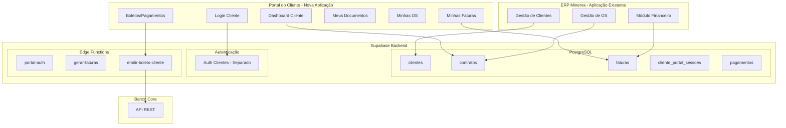
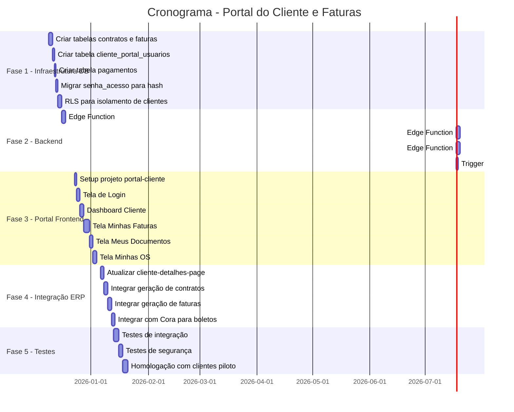

# 🏢 Planejamento Arquitetural - Portal do Cliente, Faturas e Dados Financeiros

> **Data:** 03/12/2025  
> **Versão:** 1.0  
> **Autor:** Arquitetura de Software  
> **Status:** Em Planejamento

---

## 📋 Sumário Executivo

Este documento apresenta a análise arquitetural completa do módulo de **Detalhes de Clientes**, **Portal do Cliente**, **Dados Financeiros** e **Faturas** do sistema MinervaV2. O objetivo é identificar gaps funcionais e técnicos, e elaborar um planejamento detalhado para implementação de um Portal do Cliente funcional com acesso a faturas, documentos e acompanhamento de serviços.

---

## 1. 🔍 Diagnóstico Atual

### 1.1 Estrutura de Componentes Existente

| Componente | Localização | Status | Descrição |
|------------|-------------|--------|-----------|
| [`cliente-detalhes-page.tsx`](../../src/components/clientes/cliente-detalhes-page.tsx:1) | Frontend | Mock Data | Detalhes do cliente com tabs: Cadastro, Financeiro, Portal |
| [`ClienteHistoricoCompleto.tsx`](../../src/components/clientes/ClienteHistoricoCompleto.tsx:1) | Frontend | Integrado | Histórico de OS do cliente via Supabase |
| [`clientes-lista-page.tsx`](../../src/components/clientes/clientes-lista-page.tsx:1) | Frontend | Parcial | Lista de clientes com filtros |
| [`use-cliente-historico.ts`](../../src/lib/hooks/use-cliente-historico.ts:1) | Hook | Integrado | Hook para buscar histórico do cliente |

### 1.2 Tabelas do Banco de Dados - Mapeamento

#### Tabelas Existentes Relacionadas

| Tabela | Registros | RLS | Descrição |
|--------|-----------|-----|-----------|
| `clientes` | 5 | ❌ | Dados cadastrais dos clientes |
| `centros_custo` | 48 | ✅ | Centros de custo vinculados a clientes/OS |
| `ordens_servico` | 42 | ❌ | Ordens de serviço dos clientes |
| `clientes_documentos` | 32 | ❌ | Documentos vinculados aos clientes |
| `financeiro_lancamentos` | 0 | ❌ | Lançamentos financeiros (VAZIA) |

#### Schema da Tabela `clientes`

```sql
CREATE TABLE clientes (
  id UUID PRIMARY KEY DEFAULT gen_random_uuid(),
  nome_razao_social TEXT NOT NULL,
  cpf_cnpj VARCHAR UNIQUE,
  email TEXT,
  telefone VARCHAR,
  status cliente_status DEFAULT 'lead', -- ENUM: lead | ativo | inativo | blacklist
  responsavel_id UUID REFERENCES colaboradores(id),
  endereco JSONB,
  observacoes TEXT,
  nome_responsavel TEXT,
  tipo_cliente tipo_cliente, -- ENUM: PESSOA_FISICA | PESSOA_JURIDICA
  tipo_empresa tipo_empresa, -- ENUM: ADMINISTRADORA | CONDOMINIO | etc
  senha_acesso VARCHAR, -- ⚠️ Senha em texto plano (SEGURANÇA)
  created_at TIMESTAMPTZ DEFAULT now(),
  updated_at TIMESTAMPTZ DEFAULT now()
);
```

### 1.3 Portal do Cliente - Estado Atual

**Referências no Código:**
- [`cliente-detalhes-page.tsx:493-503`](../../src/components/clientes/cliente-detalhes-page.tsx:493) - UI mockada
- URL referenciada: `https://portal.minervaengenharia.com.br`
- Login: CPF do responsável
- Senha: Campo `senha_acesso` em texto plano

**❌ PORTAL NÃO EXISTE** - Apenas UI mockada para exibir credenciais fictícias.

### 1.4 Dados Financeiros - Estado Atual

**Na UI (Mock Data):**
```typescript
// cliente-detalhes-page.tsx:109-124
financeiro: {
  limiteCredito: 10000,
  faturasEmAberto: 1,
  valorEmAberto: 4200,
  statusFinanceiro: 'em_dia',
  proximaFatura: '2024-12-05',
},
contrato: {
  tipo: 'recorrente',
  valorMensal: 4200,
  valorTotal: 50400,
  prazoMeses: 12,
  parcelasRestantes: 1,
}
```

**❌ DADOS SÃO MOCK** - Não existe tabela de faturas, parcelas ou contratos.

### 1.5 Tabelas INEXISTENTES (Referenciadas mas não criadas)

| Tabela | Referência | Status |
|--------|------------|--------|
| `contratos` | [`use-cliente-historico.ts:117`](../../src/lib/hooks/use-cliente-historico.ts:117) | ❌ Não existe |
| `documentos` | [`use-cliente-historico.ts:125`](../../src/lib/hooks/use-cliente-historico.ts:125) | ❌ Não existe (existe `clientes_documentos`) |
| `faturas` | [`cliente-detalhes-page.tsx`](../../src/components/clientes/cliente-detalhes-page.tsx:1) | ❌ Não existe |
| `parcelas` | UI Frontend | ❌ Não existe |

---

## 2. 🚨 Gaps Identificados

### 2.1 Gaps de Infraestrutura de Banco de Dados

| Gap | Criticidade | Descrição |
|-----|-------------|-----------|
| **G1** | 🔴 Alta | Tabela `contratos` não existe |
| **G2** | 🔴 Alta | Tabela `faturas` ou `parcelas_financeiras` não existe |
| **G3** | 🔴 Alta | Tabela `cliente_portal_acessos` (auth separada) não existe |
| **G4** | 🟡 Média | Campo `senha_acesso` em texto plano - falha de segurança |
| **G5** | 🟡 Média | Não há tabela para tokens de acesso do portal |
| **G6** | 🟡 Média | RLS não configurado para isolamento de dados do cliente |

### 2.2 Gaps de Funcionalidades

| Gap | Criticidade | Descrição |
|-----|-------------|-----------|
| **G7** | 🔴 Alta | Portal do Cliente não existe |
| **G8** | 🔴 Alta | Geração de faturas/parcelas não implementada |
| **G9** | 🔴 Alta | Visualização de faturas pelo cliente não existe |
| **G10** | 🟡 Média | Emissão de boletos automáticos não funciona |
| **G11** | 🟡 Média | Segunda via de boleto não disponível |
| **G12** | 🟡 Média | Histórico de pagamentos do cliente não existe |

### 2.3 Gaps de Segurança

| Gap | Criticidade | Descrição |
|-----|-------------|-----------|
| **G13** | 🔴 Alta | Senha do cliente em texto plano |
| **G14** | 🔴 Alta | Não há autenticação separada para clientes |
| **G15** | 🟡 Média | RLS não implementado para dados do cliente |
| **G16** | 🟡 Média | Não há controle de sessão do portal |

### 2.4 Gaps de Integração Frontend

| Gap | Criticidade | Descrição |
|-----|-------------|-----------|
| **G17** | 🔴 Alta | Tela de detalhes usa 100% mock data |
| **G18** | 🟡 Média | Hook `use-cliente-historico` referencia tabelas inexistentes |
| **G19** | 🟡 Média | Não há integração com sistema de faturas |
| **G20** | 🟡 Média | Não há integração com Banco Cora para boletos |

---

## 3. 📐 Arquitetura Proposta

### 3.1 Diagrama de Arquitetura do Portal



### 3.2 Modelo de Dados Proposto

```mermaid
erDiagram
    clientes {
        uuid id PK
        text nome_razao_social
        varchar cpf_cnpj UK
        text email
        cliente_status status
        uuid responsavel_id FK
        jsonb endereco
        timestamptz created_at
    }

    cliente_portal_usuarios {
        uuid id PK
        uuid cliente_id FK UK
        uuid auth_user_id FK
        varchar cpf_login UK
        boolean ativo
        timestamptz ultimo_acesso
        timestamptz created_at
    }

    contratos {
        uuid id PK
        uuid cliente_id FK
        uuid os_id FK
        uuid cc_id FK
        varchar numero_contrato UK
        text tipo
        numeric valor_total
        numeric valor_mensal
        integer parcelas_total
        date data_inicio
        date data_fim
        text status
        jsonb condicoes_pagamento
        text arquivo_url
        timestamptz created_at
    }

    faturas {
        uuid id PK
        uuid contrato_id FK
        uuid cliente_id FK
        varchar numero_fatura UK
        integer parcela_num
        numeric valor_original
        numeric valor_juros
        numeric valor_desconto
        numeric valor_final
        date vencimento
        date data_pagamento
        text status
        uuid boleto_id FK
        text url_boleto
        timestamptz created_at
    }

    pagamentos {
        uuid id PK
        uuid fatura_id FK
        uuid cliente_id FK
        numeric valor_pago
        date data_pagamento
        text forma_pagamento
        text comprovante_url
        jsonb dados_cora
        timestamptz created_at
    }

    clientes ||--|{ cliente_portal_usuarios : "acesso portal"
    clientes ||--|{ contratos : "tem"
    clientes ||--|{ faturas : "deve"
    contratos ||--|{ faturas : "gera"
    faturas ||--|{ pagamentos : "recebe"
    faturas ||--o| cora_boletos : "boleto emitido"
```

---

## 4. 📅 Planejamento de Execução

### 4.1 Fases de Desenvolvimento



### 4.2 Detalhamento das Fases

---

## FASE 1: Infraestrutura de Banco de Dados

**Duração Estimada:** 7 dias  
**Esforço:** 56 horas

### Tarefa 1.1: Migrations - Tabelas de Contratos e Faturas

**Arquivo:** `supabase/migrations/YYYYMMDD_create_contratos_faturas.sql`

```sql
-- =============================================
-- TABELA: contratos
-- Contratos de serviços com clientes
-- =============================================
CREATE TABLE IF NOT EXISTS contratos (
    id UUID PRIMARY KEY DEFAULT gen_random_uuid(),
    cliente_id UUID NOT NULL REFERENCES clientes(id),
    os_id UUID REFERENCES ordens_servico(id),
    cc_id UUID REFERENCES centros_custo(id),
    numero_contrato VARCHAR(50) UNIQUE NOT NULL,
    
    -- Tipo e Valores
    tipo TEXT NOT NULL CHECK (tipo IN ('avulso', 'recorrente', 'parceiro', 'obra')),
    valor_total NUMERIC(15,2) NOT NULL,
    valor_mensal NUMERIC(15,2),
    valor_entrada NUMERIC(15,2) DEFAULT 0,
    parcelas_total INTEGER NOT NULL DEFAULT 1,
    
    -- Datas
    data_inicio DATE NOT NULL,
    data_fim DATE,
    dia_vencimento INTEGER DEFAULT 5 CHECK (dia_vencimento BETWEEN 1 AND 28),
    
    -- Status
    status TEXT NOT NULL DEFAULT 'ativo'
        CHECK (status IN ('rascunho', 'ativo', 'suspenso', 'encerrado', 'cancelado')),
    
    -- Condições especiais
    condicoes_pagamento JSONB DEFAULT '{}',
    observacoes TEXT,
    
    -- Arquivo
    arquivo_url TEXT,
    
    -- Auditoria
    criado_por_id UUID REFERENCES colaboradores(id),
    created_at TIMESTAMPTZ DEFAULT now(),
    updated_at TIMESTAMPTZ DEFAULT now()
);

CREATE INDEX idx_contratos_cliente ON contratos(cliente_id);
CREATE INDEX idx_contratos_status ON contratos(status);
CREATE INDEX idx_contratos_os ON contratos(os_id);

-- =============================================
-- TABELA: faturas
-- Parcelas/faturas geradas a partir de contratos
-- =============================================
CREATE TABLE IF NOT EXISTS faturas (
    id UUID PRIMARY KEY DEFAULT gen_random_uuid(),
    contrato_id UUID NOT NULL REFERENCES contratos(id),
    cliente_id UUID NOT NULL REFERENCES clientes(id),
    
    -- Identificação
    numero_fatura VARCHAR(30) UNIQUE NOT NULL,
    parcela_num INTEGER NOT NULL,
    parcela_descricao TEXT, -- Ex: "3/12", "Entrada"
    
    -- Valores
    valor_original NUMERIC(15,2) NOT NULL,
    valor_juros NUMERIC(15,2) DEFAULT 0,
    valor_multa NUMERIC(15,2) DEFAULT 0,
    valor_desconto NUMERIC(15,2) DEFAULT 0,
    valor_final NUMERIC(15,2) GENERATED ALWAYS AS (
        valor_original + valor_juros + valor_multa - valor_desconto
    ) STORED,
    
    -- Datas
    vencimento DATE NOT NULL,
    data_pagamento DATE,
    
    -- Status
    status TEXT NOT NULL DEFAULT 'pendente'
        CHECK (status IN ('pendente', 'pago', 'atrasado', 'cancelado', 'protestado')),
    
    -- Cobrança
    boleto_id UUID REFERENCES cora_boletos(id),
    url_boleto TEXT,
    linha_digitavel TEXT,
    codigo_barras TEXT,
    
    -- PIX
    pix_qrcode TEXT,
    pix_copia_cola TEXT,
    
    -- Observações
    observacoes TEXT,
    
    -- Notificações
    notificacao_enviada BOOLEAN DEFAULT false,
    notificacao_enviada_em TIMESTAMPTZ,
    
    -- Auditoria
    created_at TIMESTAMPTZ DEFAULT now(),
    updated_at TIMESTAMPTZ DEFAULT now()
);

CREATE INDEX idx_faturas_cliente ON faturas(cliente_id);
CREATE INDEX idx_faturas_contrato ON faturas(contrato_id);
CREATE INDEX idx_faturas_status ON faturas(status);
CREATE INDEX idx_faturas_vencimento ON faturas(vencimento);

-- =============================================
-- TABELA: pagamentos
-- Registro de pagamentos recebidos
-- =============================================
CREATE TABLE IF NOT EXISTS pagamentos (
    id UUID PRIMARY KEY DEFAULT gen_random_uuid(),
    fatura_id UUID NOT NULL REFERENCES faturas(id),
    cliente_id UUID NOT NULL REFERENCES clientes(id),
    
    -- Valores
    valor_pago NUMERIC(15,2) NOT NULL,
    valor_juros_pago NUMERIC(15,2) DEFAULT 0,
    valor_multa_pago NUMERIC(15,2) DEFAULT 0,
    valor_desconto_aplicado NUMERIC(15,2) DEFAULT 0,
    
    -- Pagamento
    data_pagamento DATE NOT NULL,
    forma_pagamento TEXT NOT NULL 
        CHECK (forma_pagamento IN ('boleto', 'pix', 'ted', 'dinheiro', 'cartao')),
    
    -- Comprovante
    comprovante_url TEXT,
    
    -- Dados do Cora (se via boleto)
    cora_transaction_id TEXT,
    dados_cora JSONB,
    
    -- Auditoria
    registrado_por_id UUID REFERENCES colaboradores(id),
    created_at TIMESTAMPTZ DEFAULT now()
);

CREATE INDEX idx_pagamentos_fatura ON pagamentos(fatura_id);
CREATE INDEX idx_pagamentos_cliente ON pagamentos(cliente_id);
CREATE INDEX idx_pagamentos_data ON pagamentos(data_pagamento);

-- =============================================
-- TABELA: cliente_portal_usuarios
-- Usuários do portal do cliente (auth separada)
-- =============================================
CREATE TABLE IF NOT EXISTS cliente_portal_usuarios (
    id UUID PRIMARY KEY DEFAULT gen_random_uuid(),
    cliente_id UUID NOT NULL REFERENCES clientes(id),
    auth_user_id UUID REFERENCES auth.users(id), -- Link com Supabase Auth
    
    -- Login
    cpf_login VARCHAR(11) UNIQUE NOT NULL,
    senha_hash TEXT NOT NULL,
    
    -- Status
    ativo BOOLEAN DEFAULT true,
    email_verificado BOOLEAN DEFAULT false,
    
    -- Controle de acesso
    ultimo_acesso TIMESTAMPTZ,
    tentativas_falhas INTEGER DEFAULT 0,
    bloqueado_ate TIMESTAMPTZ,
    
    -- Tokens
    token_reset_senha TEXT,
    token_reset_expira TIMESTAMPTZ,
    
    -- Auditoria
    created_at TIMESTAMPTZ DEFAULT now(),
    updated_at TIMESTAMPTZ DEFAULT now(),
    
    UNIQUE(cliente_id)
);

CREATE INDEX idx_portal_usuarios_cliente ON cliente_portal_usuarios(cliente_id);
CREATE INDEX idx_portal_usuarios_cpf ON cliente_portal_usuarios(cpf_login);

-- =============================================
-- REMOVER campo senha_acesso inseguro da tabela clientes
-- (após migração dos dados)
-- =============================================
-- ALTER TABLE clientes DROP COLUMN senha_acesso;
```

### Tarefa 1.2: RLS Policies para Portal do Cliente

```sql
-- =============================================
-- RLS POLICIES - Portal do Cliente
-- Clientes só podem ver seus próprios dados
-- =============================================

-- Habilitar RLS
ALTER TABLE contratos ENABLE ROW LEVEL SECURITY;
ALTER TABLE faturas ENABLE ROW LEVEL SECURITY;
ALTER TABLE pagamentos ENABLE ROW LEVEL SECURITY;
ALTER TABLE cliente_portal_usuarios ENABLE ROW LEVEL SECURITY;

-- Function para obter cliente_id do usuário logado
CREATE OR REPLACE FUNCTION get_portal_cliente_id()
RETURNS UUID AS $$
BEGIN
    RETURN (
        SELECT cliente_id 
        FROM cliente_portal_usuarios 
        WHERE auth_user_id = auth.uid()
    );
END;
$$ LANGUAGE plpgsql SECURITY DEFINER;

-- Policies para Portal do Cliente (usuários auth com role 'cliente')
CREATE POLICY portal_contratos_select ON contratos FOR SELECT
USING (
    cliente_id = get_portal_cliente_id()
    OR get_auth_user_cargo_slug() = ANY(ARRAY['admin', 'diretoria', 'gestor_administrativo'])
);

CREATE POLICY portal_faturas_select ON faturas FOR SELECT
USING (
    cliente_id = get_portal_cliente_id()
    OR get_auth_user_cargo_slug() = ANY(ARRAY['admin', 'diretoria', 'gestor_administrativo'])
);

CREATE POLICY portal_pagamentos_select ON pagamentos FOR SELECT
USING (
    cliente_id = get_portal_cliente_id()
    OR get_auth_user_cargo_slug() = ANY(ARRAY['admin', 'diretoria', 'gestor_administrativo'])
);

-- Policies de escrita (apenas admin/financeiro)
CREATE POLICY fin_contratos_all ON contratos FOR ALL
USING (get_auth_user_cargo_slug() = ANY(ARRAY['admin', 'diretoria', 'gestor_administrativo']));

CREATE POLICY fin_faturas_all ON faturas FOR ALL
USING (get_auth_user_cargo_slug() = ANY(ARRAY['admin', 'diretoria', 'gestor_administrativo']));

CREATE POLICY fin_pagamentos_all ON pagamentos FOR ALL
USING (get_auth_user_cargo_slug() = ANY(ARRAY['admin', 'diretoria', 'gestor_administrativo']));
```

### Tarefa 1.3: Triggers para Geração de Faturas

```sql
-- =============================================
-- FUNCTION: Gerar faturas automaticamente ao criar contrato
-- =============================================
CREATE OR REPLACE FUNCTION fn_gerar_faturas_contrato()
RETURNS TRIGGER AS $$
DECLARE
    v_data_vencimento DATE;
    v_valor_parcela NUMERIC;
    v_numero_base TEXT;
    v_parcela_num INTEGER;
BEGIN
    -- Só gerar se contrato estiver ativo
    IF NEW.status != 'ativo' THEN
        RETURN NEW;
    END IF;
    
    -- Calcular valor da parcela
    v_valor_parcela := (NEW.valor_total - COALESCE(NEW.valor_entrada, 0)) / NEW.parcelas_total;
    
    -- Gerar número base para faturas
    v_numero_base := 'FAT-' || TO_CHAR(now(), 'YYYYMM') || '-' || SUBSTRING(NEW.id::TEXT, 1, 8);
    
    v_parcela_num := 0;
    
    -- Gerar fatura de entrada se houver
    IF COALESCE(NEW.valor_entrada, 0) > 0 THEN
        v_parcela_num := 0;
        INSERT INTO faturas (
            contrato_id, cliente_id, numero_fatura, parcela_num,
            parcela_descricao, valor_original, vencimento, status
        ) VALUES (
            NEW.id, NEW.cliente_id, v_numero_base || '-E',
            0, 'Entrada', NEW.valor_entrada, NEW.data_inicio, 'pendente'
        );
    END IF;
    
    -- Gerar parcelas mensais
    FOR i IN 1..NEW.parcelas_total LOOP
        v_data_vencimento := NEW.data_inicio + (i * INTERVAL '1 month');
        -- Ajustar para o dia de vencimento
        v_data_vencimento := DATE_TRUNC('month', v_data_vencimento) + 
                            ((COALESCE(NEW.dia_vencimento, 5) - 1) || ' days')::INTERVAL;
        
        INSERT INTO faturas (
            contrato_id, cliente_id, numero_fatura, parcela_num,
            parcela_descricao, valor_original, vencimento, status
        ) VALUES (
            NEW.id, NEW.cliente_id, v_numero_base || '-' || LPAD(i::TEXT, 3, '0'),
            i, i || '/' || NEW.parcelas_total, v_valor_parcela,
            v_data_vencimento, 'pendente'
        );
    END LOOP;
    
    RETURN NEW;
END;
$$ LANGUAGE plpgsql;

CREATE TRIGGER trigger_gerar_faturas_contrato
AFTER INSERT OR UPDATE OF status ON contratos
FOR EACH ROW
WHEN (NEW.status = 'ativo')
EXECUTE FUNCTION fn_gerar_faturas_contrato();

-- =============================================
-- FUNCTION: Atualizar status de inadimplência
-- Executar via pg_cron diariamente
-- =============================================
CREATE OR REPLACE FUNCTION fn_atualizar_faturas_atrasadas()
RETURNS INTEGER AS $$
DECLARE
    v_count INTEGER;
BEGIN
    UPDATE faturas
    SET status = 'atrasado', updated_at = now()
    WHERE status = 'pendente'
      AND vencimento < CURRENT_DATE;
    
    GET DIAGNOSTICS v_count = ROW_COUNT;
    
    RETURN v_count;
END;
$$ LANGUAGE plpgsql;

-- =============================================
-- FUNCTION: Calcular juros e multa em faturas atrasadas
-- =============================================
CREATE OR REPLACE FUNCTION fn_calcular_encargos_fatura(
    p_fatura_id UUID,
    p_multa_percentual NUMERIC DEFAULT 2.0,
    p_juros_dia_percentual NUMERIC DEFAULT 0.033
)
RETURNS NUMERIC AS $$
DECLARE
    v_fatura RECORD;
    v_dias_atraso INTEGER;
    v_juros NUMERIC;
    v_multa NUMERIC;
BEGIN
    SELECT * INTO v_fatura FROM faturas WHERE id = p_fatura_id;
    
    IF v_fatura.status != 'atrasado' THEN
        RETURN v_fatura.valor_original;
    END IF;
    
    v_dias_atraso := CURRENT_DATE - v_fatura.vencimento;
    
    IF v_dias_atraso <= 0 THEN
        RETURN v_fatura.valor_original;
    END IF;
    
    -- Calcular multa (uma vez)
    v_multa := v_fatura.valor_original * (p_multa_percentual / 100);
    
    -- Calcular juros pro-rata
    v_juros := v_fatura.valor_original * (p_juros_dia_percentual / 100) * v_dias_atraso;
    
    -- Atualizar fatura
    UPDATE faturas
    SET valor_juros = v_juros,
        valor_multa = v_multa,
        updated_at = now()
    WHERE id = p_fatura_id;
    
    RETURN v_fatura.valor_original + v_multa + v_juros;
END;
$$ LANGUAGE plpgsql;
```

---

## FASE 2: Backend (Edge Functions)

**Duração Estimada:** 7 dias  
**Esforço:** 56 horas

### Tarefa 2.1: Edge Function - Autenticação do Portal

**Arquivo:** `supabase/functions/portal-auth/index.ts`

```typescript
/**
 * Edge Function: Portal Auth
 * Autenticação separada para clientes do portal
 */
import { Hono } from 'npm:hono';
import { cors } from 'npm:hono/cors';
import { createClient } from 'jsr:@supabase/supabase-js@2';
import * as bcrypt from 'https://deno.land/x/bcrypt@v0.4.1/mod.ts';

const app = new Hono();
app.use('/*', cors({ origin: '*' }));

const getSupabaseClient = () => {
  return createClient(
    Deno.env.get('SUPABASE_URL')!,
    Deno.env.get('SUPABASE_SERVICE_ROLE_KEY')!
  );
};

// Login do cliente
app.post('/login', async (c) => {
  try {
    const { cpf, senha } = await c.req.json();
    
    // Limpar CPF
    const cpfLimpo = cpf.replace(/\D/g, '');
    
    const supabase = getSupabaseClient();
    
    // Buscar usuário do portal
    const { data: usuario, error } = await supabase
      .from('cliente_portal_usuarios')
      .select('*, clientes(*)')
      .eq('cpf_login', cpfLimpo)
      .eq('ativo', true)
      .single();
    
    if (error || !usuario) {
      return c.json({ success: false, error: 'Credenciais inválidas' }, 401);
    }
    
    // Verificar se está bloqueado
    if (usuario.bloqueado_ate && new Date(usuario.bloqueado_ate) > new Date()) {
      return c.json({ 
        success: false, 
        error: 'Conta bloqueada temporariamente. Tente novamente mais tarde.' 
      }, 403);
    }
    
    // Verificar senha
    const senhaValida = await bcrypt.compare(senha, usuario.senha_hash);
    
    if (!senhaValida) {
      // Incrementar tentativas falhas
      const novasTentativas = (usuario.tentativas_falhas || 0) + 1;
      const bloqueio = novasTentativas >= 5 
        ? new Date(Date.now() + 30 * 60 * 1000).toISOString() // 30 min
        : null;
      
      await supabase
        .from('cliente_portal_usuarios')
        .update({ 
          tentativas_falhas: novasTentativas,
          bloqueado_ate: bloqueio
        })
        .eq('id', usuario.id);
      
      return c.json({ success: false, error: 'Credenciais inválidas' }, 401);
    }
    
    // Login bem sucedido - criar sessão via Supabase Auth
    const { data: authData, error: authError } = await supabase.auth.admin.createUser({
      email: `cliente_${cpfLimpo}@portal.minerva.local`,
      password: senha,
      email_confirm: true,
      user_metadata: {
        role: 'cliente',
        cliente_id: usuario.cliente_id,
        nome: usuario.clientes.nome_razao_social,
      }
    });
    
    // Se usuário já existe, fazer signIn
    if (authError?.message?.includes('already been registered')) {
      const { data: signInData, error: signInError } = await supabase.auth.signInWithPassword({
        email: `cliente_${cpfLimpo}@portal.minerva.local`,
        password: senha,
      });
      
      if (signInError) {
        return c.json({ success: false, error: 'Erro na autenticação' }, 500);
      }
      
      // Atualizar último acesso
      await supabase
        .from('cliente_portal_usuarios')
        .update({ 
          ultimo_acesso: new Date().toISOString(),
          tentativas_falhas: 0,
          auth_user_id: signInData.user?.id
        })
        .eq('id', usuario.id);
      
      return c.json({
        success: true,
        data: {
          access_token: signInData.session?.access_token,
          refresh_token: signInData.session?.refresh_token,
          cliente: {
            id: usuario.cliente_id,
            nome: usuario.clientes.nome_razao_social,
          }
        }
      });
    }
    
    return c.json({ success: false, error: 'Erro ao criar sessão' }, 500);
    
  } catch (error) {
    console.error('Erro no login:', error);
    return c.json({
      success: false,
      error: error instanceof Error ? error.message : 'Erro desconhecido',
    }, 500);
  }
});

// Criar conta no portal (chamado pelo ERP ao cadastrar cliente)
app.post('/criar-acesso', async (c) => {
  try {
    const { cliente_id, cpf, senha } = await c.req.json();
    
    const cpfLimpo = cpf.replace(/\D/g, '');
    const senhaHash = await bcrypt.hash(senha);
    
    const supabase = getSupabaseClient();
    
    const { data, error } = await supabase
      .from('cliente_portal_usuarios')
      .insert({
        cliente_id,
        cpf_login: cpfLimpo,
        senha_hash: senhaHash,
        ativo: true,
      })
      .select()
      .single();
    
    if (error) {
      return c.json({ success: false, error: error.message }, 400);
    }
    
    return c.json({ success: true, data: { id: data.id } });
    
  } catch (error) {
    console.error('Erro ao criar acesso:', error);
    return c.json({
      success: false,
      error: error instanceof Error ? error.message : 'Erro desconhecido',
    }, 500);
  }
});

// Reset de senha
app.post('/reset-senha', async (c) => {
  try {
    const { cpf, nova_senha, token } = await c.req.json();
    
    const supabase = getSupabaseClient();
    
    // Verificar token
    const { data: usuario, error } = await supabase
      .from('cliente_portal_usuarios')
      .select('*')
      .eq('token_reset_senha', token)
      .gt('token_reset_expira', new Date().toISOString())
      .single();
    
    if (error || !usuario) {
      return c.json({ success: false, error: 'Token inválido ou expirado' }, 400);
    }
    
    // Atualizar senha
    const senhaHash = await bcrypt.hash(nova_senha);
    
    await supabase
      .from('cliente_portal_usuarios')
      .update({
        senha_hash: senhaHash,
        token_reset_senha: null,
        token_reset_expira: null,
        tentativas_falhas: 0,
        bloqueado_ate: null,
      })
      .eq('id', usuario.id);
    
    return c.json({ success: true });
    
  } catch (error) {
    console.error('Erro no reset de senha:', error);
    return c.json({
      success: false,
      error: error instanceof Error ? error.message : 'Erro desconhecido',
    }, 500);
  }
});

Deno.serve(app.fetch);
```

### Tarefa 2.2: Edge Function - Emitir Boleto para Cliente

**Arquivo:** `supabase/functions/emitir-boleto-cliente/index.ts`

```typescript
/**
 * Edge Function: Emitir Boleto para Cliente
 * Gera boleto via API Cora para uma fatura específica
 */
import { Hono } from 'npm:hono';
import { cors } from 'npm:hono/cors';
import { createClient } from 'jsr:@supabase/supabase-js@2';
import { getCoraAccessToken } from '../cora-integration/auth.ts';

const app = new Hono();
app.use('/*', cors({ origin: '*' }));

const CORA_API_BASE_URL = Deno.env.get('CORA_API_URL') || 'https://api.cora.com.br';

const getSupabaseClient = () => {
  return createClient(
    Deno.env.get('SUPABASE_URL')!,
    Deno.env.get('SUPABASE_SERVICE_ROLE_KEY')!
  );
};

app.post('/emitir', async (c) => {
  try {
    const { fatura_id } = await c.req.json();
    
    const supabase = getSupabaseClient();
    
    // Buscar fatura com dados do cliente
    const { data: fatura, error: faturaError } = await supabase
      .from('faturas')
      .select(`
        *,
        cliente:clientes(
          id, nome_razao_social, cpf_cnpj, email, telefone, endereco
        ),
        contrato:contratos(numero_contrato)
      `)
      .eq('id', fatura_id)
      .single();
    
    if (faturaError || !fatura) {
      return c.json({ success: false, error: 'Fatura não encontrada' }, 404);
    }
    
    // Verificar se já tem boleto
    if (fatura.boleto_id) {
      return c.json({ success: false, error: 'Fatura já possui boleto emitido' }, 400);
    }
    
    // Calcular valor final (com juros/multa se atrasado)
    let valorFinal = fatura.valor_original;
    if (fatura.status === 'atrasado') {
      // Calcular encargos
      const diasAtraso = Math.floor(
        (new Date().getTime() - new Date(fatura.vencimento).getTime()) / (1000 * 60 * 60 * 24)
      );
      const multa = fatura.valor_original * 0.02; // 2%
      const juros = fatura.valor_original * 0.00033 * diasAtraso; // 0.033% ao dia
      valorFinal = fatura.valor_original + multa + juros;
    }
    
    // Obter token do Cora
    const accessToken = await getCoraAccessToken();
    
    // Preparar dados do boleto
    const boletoData = {
      amount: Math.round(valorFinal * 100), // Em centavos
      due_date: fatura.vencimento,
      document_number: fatura.numero_fatura,
      payer: {
        name: fatura.cliente.nome_razao_social,
        document: fatura.cliente.cpf_cnpj.replace(/\D/g, ''),
        email: fatura.cliente.email,
        address: fatura.cliente.endereco || {},
      },
      instructions: [
        `Referente ao contrato ${fatura.contrato.numero_contrato}`,
        `Parcela ${fatura.parcela_descricao}`,
        'Após vencimento, cobrar multa de 2% e juros de 1% ao mês.',
      ],
    };
    
    // Chamar API do Cora
    const response = await fetch(`${CORA_API_BASE_URL}/v1/invoices`, {
      method: 'POST',
      headers: {
        'Authorization': `Bearer ${accessToken}`,
        'Content-Type': 'application/json',
      },
      body: JSON.stringify(boletoData),
    });
    
    if (!response.ok) {
      const errorData = await response.json();
      console.error('Erro na API Cora:', errorData);
      return c.json({ 
        success: false, 
        error: 'Erro ao emitir boleto no Cora',
        details: errorData
      }, 500);
    }
    
    const boleto = await response.json();
    
    // Salvar boleto no banco
    const { data: boletoSalvo, error: boletoError } = await supabase
      .from('cora_boletos')
      .insert({
        cora_boleto_id: boleto.id,
        nosso_numero: boleto.our_number,
        linha_digitavel: boleto.barcode_line,
        codigo_barras: boleto.barcode,
        qr_code: boleto.pix_qr_code,
        url_boleto: boleto.pdf_url,
        valor: boleto.amount,
        vencimento: fatura.vencimento,
        status: 'PENDENTE',
        numero_documento: fatura.numero_fatura,
        pagador_nome: fatura.cliente.nome_razao_social,
        pagador_cpf_cnpj: fatura.cliente.cpf_cnpj,
        cliente_id: fatura.cliente_id,
        conta_receber_id: null, // Se estiver integrando com contas_receber
      })
      .select()
      .single();
    
    if (boletoError) {
      console.error('Erro ao salvar boleto:', boletoError);
    }
    
    // Atualizar fatura com dados do boleto
    await supabase
      .from('faturas')
      .update({
        boleto_id: boletoSalvo?.id,
        url_boleto: boleto.pdf_url,
        linha_digitavel: boleto.barcode_line,
        codigo_barras: boleto.barcode,
        pix_qrcode: boleto.pix_qr_code,
        updated_at: new Date().toISOString(),
      })
      .eq('id', fatura_id);
    
    return c.json({
      success: true,
      data: {
        boleto_id: boletoSalvo?.id,
        url_boleto: boleto.pdf_url,
        linha_digitavel: boleto.barcode_line,
        pix_qrcode: boleto.pix_qr_code,
      },
    });
    
  } catch (error) {
    console.error('Erro ao emitir boleto:', error);
    return c.json({
      success: false,
      error: error instanceof Error ? error.message : 'Erro desconhecido',
    }, 500);
  }
});

// Segunda via de boleto
app.get('/segunda-via/:faturaId', async (c) => {
  try {
    const faturaId = c.req.param('faturaId');
    
    const supabase = getSupabaseClient();
    
    const { data: fatura, error } = await supabase
      .from('faturas')
      .select('url_boleto, linha_digitavel, pix_qrcode')
      .eq('id', faturaId)
      .single();
    
    if (error || !fatura?.url_boleto) {
      return c.json({ success: false, error: 'Boleto não encontrado' }, 404);
    }
    
    return c.json({
      success: true,
      data: fatura,
    });
    
  } catch (error) {
    console.error('Erro ao buscar segunda via:', error);
    return c.json({
      success: false,
      error: error instanceof Error ? error.message : 'Erro desconhecido',
    }, 500);
  }
});

Deno.serve(app.fetch);
```

---

## FASE 3: Portal do Cliente (Frontend)

**Duração Estimada:** 12 dias  
**Esforço:** 96 horas

### Estrutura do Projeto Portal

```
portal-cliente/
├── src/
│   ├── App.tsx
│   ├── main.tsx
│   ├── router.ts
│   ├── components/
│   │   ├── ui/ (shadcn/ui)
│   │   ├── layout/
│   │   │   ├── portal-layout.tsx
│   │   │   └── portal-header.tsx
│   │   ├── auth/
│   │   │   └── login-form.tsx
│   │   ├── dashboard/
│   │   │   └── dashboard-cliente.tsx
│   │   ├── faturas/
│   │   │   ├── faturas-lista.tsx
│   │   │   ├── fatura-detalhes.tsx
│   │   │   └── boleto-viewer.tsx
│   │   ├── documentos/
│   │   │   └── documentos-lista.tsx
│   │   └── os/
│   │       └── minhas-os-lista.tsx
│   ├── lib/
│   │   ├── supabase-client.ts
│   │   ├── hooks/
│   │   │   ├── use-auth-cliente.ts
│   │   │   ├── use-faturas.ts
│   │   │   └── use-documentos.ts
│   │   └── utils/
│   └── routes/
│       ├── login.tsx
│       ├── _portal.tsx (layout autenticado)
│       ├── _portal/
│       │   ├── index.tsx (dashboard)
│       │   ├── faturas.tsx
│       │   ├── documentos.tsx
│       │   └── minhas-os.tsx
└── package.json
```

### Hook de Autenticação do Cliente

```typescript
// src/lib/hooks/use-auth-cliente.ts
import { create } from 'zustand';
import { persist } from 'zustand/middleware';

interface ClienteAuth {
  isAuthenticated: boolean;
  cliente: {
    id: string;
    nome: string;
  } | null;
  accessToken: string | null;
  refreshToken: string | null;
  
  login: (cpf: string, senha: string) => Promise<void>;
  logout: () => void;
}

const PORTAL_API_URL = `${import.meta.env.VITE_SUPABASE_URL}/functions/v1/portal-auth`;

export const useAuthCliente = create<ClienteAuth>()(
  persist(
    (set) => ({
      isAuthenticated: false,
      cliente: null,
      accessToken: null,
      refreshToken: null,
      
      login: async (cpf: string, senha: string) => {
        const response = await fetch(`${PORTAL_API_URL}/login`, {
          method: 'POST',
          headers: { 'Content-Type': 'application/json' },
          body: JSON.stringify({ cpf, senha }),
        });
        
        const data = await response.json();
        
        if (!data.success) {
          throw new Error(data.error || 'Erro no login');
        }
        
        set({
          isAuthenticated: true,
          cliente: data.data.cliente,
          accessToken: data.data.access_token,
          refreshToken: data.data.refresh_token,
        });
      },
      
      logout: () => {
        set({
          isAuthenticated: false,
          cliente: null,
          accessToken: null,
          refreshToken: null,
        });
      },
    }),
    {
      name: 'minerva-portal-auth',
    }
  )
);
```

### Hook de Faturas do Cliente

```typescript
// src/lib/hooks/use-faturas.ts
import { useQuery, useMutation, useQueryClient } from '@tanstack/react-query';
import { supabase } from '../supabase-client';
import { useAuthCliente } from './use-auth-cliente';

export function useFaturasCliente() {
  const { cliente } = useAuthCliente();
  
  return useQuery({
    queryKey: ['faturas-cliente', cliente?.id],
    queryFn: async () => {
      const { data, error } = await supabase
        .from('faturas')
        .select(`
          *,
          contrato:contratos(numero_contrato, tipo)
        `)
        .eq('cliente_id', cliente?.id)
        .order('vencimento', { ascending: false });
      
      if (error) throw error;
      return data;
    },
    enabled: !!cliente?.id,
  });
}

export function useEmitirBoleto() {
  const queryClient = useQueryClient();
  
  return useMutation({
    mutationFn: async (faturaId: string) => {
      const response = await fetch(
        `${import.meta.env.VITE_SUPABASE_URL}/functions/v1/emitir-boleto-cliente/emitir`,
        {
          method: 'POST',
          headers: {
            'Content-Type': 'application/json',
            'Authorization': `Bearer ${useAuthCliente.getState().accessToken}`,
          },
          body: JSON.stringify({ fatura_id: faturaId }),
        }
      );
      
      const data = await response.json();
      if (!data.success) throw new Error(data.error);
      return data.data;
    },
    onSuccess: () => {
      queryClient.invalidateQueries({ queryKey: ['faturas-cliente'] });
    },
  });
}
```

---

## FASE 4: Integração com ERP

**Duração Estimada:** 8 dias  
**Esforço:** 64 horas

### Atualizar cliente-detalhes-page.tsx

```typescript
// Substituir mock data por dados reais
import { useClienteCompleto } from '@/lib/hooks/use-cliente-completo';
import { useContratos } from '@/lib/hooks/use-contratos';
import { useFaturasCliente } from '@/lib/hooks/use-faturas-administrativo';

export function ClienteDetalhesPage({ clienteId, onBack }: Props) {
  // Hooks reais
  const { cliente, isLoading: clienteLoading } = useClienteCompleto(clienteId);
  const { contratos } = useContratos(clienteId);
  const { faturas } = useFaturasCliente(clienteId);
  
  // Calcular resumo financeiro
  const resumoFinanceiro = useMemo(() => {
    if (!faturas) return null;
    
    const pendentes = faturas.filter(f => f.status === 'pendente');
    const atrasadas = faturas.filter(f => f.status === 'atrasado');
    
    return {
      faturasEmAberto: pendentes.length + atrasadas.length,
      valorEmAberto: pendentes.reduce((sum, f) => sum + f.valor_original, 0),
      valorAtrasado: atrasadas.reduce((sum, f) => sum + f.valor_final, 0),
      proximaFatura: pendentes.sort((a, b) => 
        new Date(a.vencimento).getTime() - new Date(b.vencimento).getTime()
      )[0]?.vencimento,
    };
  }, [faturas]);
  
  // ... resto do componente usando dados reais
}
```

---

## 5. 🔒 Segurança e Conformidade

### 5.1 Autenticação

| Requisito | Implementação |
|-----------|---------------|
| **Senha com hash** | bcrypt com salt |
| **Bloqueio por tentativas** | 5 tentativas = 30 min bloqueio |
| **Sessão separada** | Supabase Auth com role 'cliente' |
| **Token JWT** | Expiração de 1 hora |

### 5.2 Autorização (RLS)

| Tabela | Regra |
|--------|-------|
| `contratos` | Cliente vê apenas os seus |
| `faturas` | Cliente vê apenas as suas |
| `pagamentos` | Cliente vê apenas os seus |
| Escrita | Apenas admin/financeiro |

### 5.3 Dados Sensíveis

| Dado | Proteção |
|------|----------|
| CPF | Mascarado na UI (`***.***.***-12`) |
| Senha | Hash bcrypt (nunca exposta) |
| Boletos | URLs temporárias com expiração |

---

## 6. 📊 Estimativas Consolidadas

| Fase | Duração | Esforço | Dependências |
|------|---------|---------|--------------|
| **Fase 1 - Infraestrutura DB** | 7 dias | 56h | - |
| **Fase 2 - Backend** | 7 dias | 56h | Fase 1 |
| **Fase 3 - Portal Frontend** | 12 dias | 96h | Fase 2 |
| **Fase 4 - Integração ERP** | 8 dias | 64h | Fases 1-3 |
| **Fase 5 - Testes** | 8 dias | 64h | Fase 4 |
| **TOTAL** | **42 dias** | **336h** | - |

### Recursos Necessários

| Recurso | Quantidade |
|---------|------------|
| Desenvolvedor Backend | 1 |
| Desenvolvedor Frontend | 1 |
| DevOps | 0.5 |
| QA | 0.5 |
| Designer UI/UX | 0.25 |

---

## 7. 🎯 Critérios de Aceite

### MVP (Minimum Viable Product)

- [ ] Tabelas de contratos e faturas criadas
- [ ] Autenticação do portal funcionando
- [ ] Login do cliente por CPF + senha
- [ ] Visualização de faturas pendentes
- [ ] Emissão de boleto via Cora
- [ ] Download de boleto PDF

### Versão Completa

- [ ] Dashboard do cliente com resumo
- [ ] Histórico de pagamentos
- [ ] Segunda via de boleto
- [ ] Documentos do cliente
- [ ] Acompanhamento de OS
- [ ] Notificações por email
- [ ] PIX como forma de pagamento
- [ ] Integração completa com ERP

---

## 8. 📚 Referências

- [Supabase Auth - Custom Claims](https://supabase.com/docs/guides/auth/custom-claims)
- [Supabase RLS](https://supabase.com/docs/guides/auth/row-level-security)
- [bcrypt for Deno](https://deno.land/x/bcrypt)
- [TanStack Router](https://tanstack.com/router)
- [Documentação API Cora](https://developers.cora.com.br)

---

**Documento elaborado pela Equipe de Arquitetura**  
**Versão 1.0 - Dezembro 2025**