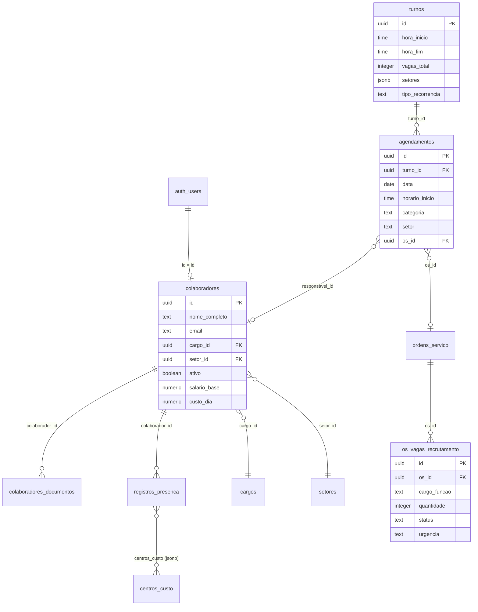
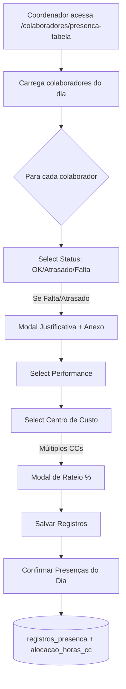
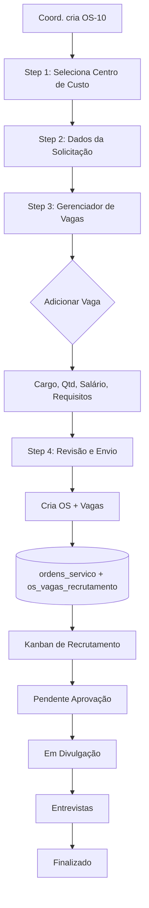

# 🏗️ Arquitetura do Módulo de RH

> **Última Atualização:** 28/01/2026

---

## 📊 Diagrama de Relacionamentos



---

## 🔄 Fluxo de Dados - Presença



---

## 🔄 Fluxo de Dados - OS-10 (Requisição MO)



---

## 🧩 Componentes Principais

```
┌─────────────────────────────────────────────────────────────┐
│                     MÓDULO DE RH                             │
├─────────────────────────────────────────────────────────────┤
│                                                              │
│  ┌─────────────────┐     ┌─────────────────┐                │
│  │  COLABORADORES  │     │   PRESENÇA      │                │
│  │  - Lista        │     │   - Tabela      │                │
│  │  - Detalhes     │     │   - Detalhes    │                │
│  │  - Modal CRUD   │     │   - Histórico   │                │
│  └────────┬────────┘     └────────┬────────┘                │
│           │                       │                          │
│           ▼                       ▼                          │
│  ┌─────────────────────────────────────────┐                │
│  │            HOOKS DE DADOS               │                │
│  │  - use-os-workflows (centralizado)      │                │
│  │  - use-turnos                           │                │
│  │  - use-agendamentos                     │                │
│  │  - use-recrutamento                     │                │
│  │  - use-custo-mo                         │                │
│  └────────────────────┬────────────────────┘                │
│                       │                                      │
│                       ▼                                      │
│  ┌─────────────────────────────────────────┐                │
│  │          SUPABASE (PostgreSQL)          │                │
│  │  - colaboradores                        │                │
│  │  - registros_presenca                   │                │
│  │  - turnos / agendamentos                │                │
│  │  - os_vagas_recrutamento                │                │
│  └─────────────────────────────────────────┘                │
│                                                              │
└─────────────────────────────────────────────────────────────┘
```

---

## 🔗 Integrações

### Supabase Storage

| Bucket | Uso | Padrão de Nome |
|--------|-----|----------------|
| `avatars` | Fotos de perfil | `{user_id}/avatar_{timestamp}.jpg` |
| `documentos-colaboradores` | Docs pessoais | `{colaborador_id}/{tipo}_{timestamp}.ext` |
| `comprovantes-presenca` | Atestados | `{colaborador_id}/{timestamp}_atestado.ext` |

### Integração com Outros Módulos

```
┌──────────────┐     ┌──────────────┐     ┌──────────────┐
│  MÓDULO RH   │────▶│   MÓDULO OS  │────▶│  FINANCEIRO  │
│              │     │              │     │              │
│ Colaboradores│     │ Alocação CC  │     │ Custo MO     │
│ Presença     │     │ Agendamentos │     │ Rateio       │
│ Recrutamento │     │ OS-10        │     │ Lucratividade│
└──────────────┘     └──────────────┘     └──────────────┘
```

---

## 🔐 RLS (Row Level Security)

### Política de Leitura - `colaboradores`

```sql
-- Nível >= 5 (Coordenadores+) veem todos
-- Demais veem próprio perfil ou mesmo setor
CREATE POLICY "colaboradores_read_final" ON colaboradores
FOR SELECT USING (
  id = auth.uid() OR
  get_user_nivel() >= 5 OR
  setor_id = (SELECT setor_id FROM colaboradores WHERE id = auth.uid())
);
```

### Política - `registros_presenca`

```sql
-- Coordenadores+ podem ler/escrever todos
-- Operacionais apenas do próprio setor
CREATE POLICY "presenca_access" ON registros_presenca
FOR ALL USING (
  get_user_nivel() >= 5 OR
  colaborador_id IN (
    SELECT id FROM colaboradores 
    WHERE setor_id = get_current_user_setor()
  )
);
```

---

## 📦 Dependências de Componentes

```
colaborador-detalhes-page.tsx
├── modal-cadastro-colaborador.tsx
├── DOCUMENTOS_OBRIGATORIOS (constants)
├── use-cliente-documentos (hook)
├── BarChart (recharts)
└── supabase-client

controle-presenca-tabela-page.tsx
├── use-centro-custo (hook)
├── BulkActionsBar (interno)
├── ModalJustificativa (interno)
├── ModalRateioCC (interno)
└── Table (shadcn/ui)

recrutamento-page.tsx
├── recrutamento-kanban.tsx
├── requisicao-card.tsx
├── modal-detalhes-requisicao.tsx
└── use-recrutamento (hook)
```

---

*Diagrama gerado com base na análise do código-fonte e banco de dados.*
