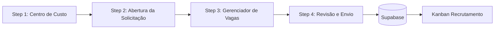

# 🔧 OS-10: Requisição de Mão de Obra

> **Última Atualização:** 28/01/2026  
> **Tipo de OS:** Administrativo (RH)  
> **Status:** ✅ 95% Implementado

---

## 📋 Visão Geral

A OS-10 é o fluxo de **Requisição de Mão de Obra**, onde coordenadores solicitam contratação de novos colaboradores. O processo inicia no workflow de 4 etapas e depois segue para o **Kanban de Recrutamento**.

---

## 🔄 Workflow de Criação



### Step 1: Seleção de Centro de Custo

**Componente:** `step-selecao-centro-custo.tsx` (3.212 bytes)

| Campo | Tipo | Obrigatório | Descrição |
|-------|------|-------------|-----------|
| Centro de Custo | Select | ✅ | Dropdown de CCs ativos |

### Step 2: Abertura da Solicitação

**Componente:** `step-abertura-solicitacao.tsx` (7.366 bytes)

| Campo | Tipo | Obrigatório | Descrição |
|-------|------|-------------|-----------|
| Solicitante | Text | ✅ | Nome do responsável |
| Departamento | Text | ❌ | Área da empresa |
| Justificativa | Textarea | ✅ | Motivo da contratação |
| Urgência | Select | ✅ | baixa, normal, alta, critica |

### Step 3: Gerenciador de Vagas

**Componente:** `step-gerenciador-vagas.tsx` (5.560 bytes)

Permite adicionar múltiplas vagas com:

| Campo | Tipo | Obrigatório | Descrição |
|-------|------|-------------|-----------|
| Cargo/Função | Text | ✅ | Título da vaga |
| Quantidade | Number | ✅ | Número de vagas |
| Salário Base | Currency | ❌ | Faixa salarial |
| Habilidades | Textarea | ❌ | Requisitos técnicos |
| Perfil Comportamental | Textarea | ❌ | Soft skills |
| Experiência Mínima | Select | ❌ | Ex: "2 anos" |
| Escolaridade | Select | ❌ | Ensino Médio, Superior, etc |
| Urgência | Select | ✅ | baixa, normal, alta, critica |
| Data Limite | Date | ❌ | Deadline contratação |

### Step 4: Revisão e Envio

**Componente:** `step-revisao-envio.tsx` (13.258 bytes)

- Resumo de todos os dados
- Lista de vagas adicionadas
- KPIs: total de vagas, urgência geral
- Botão "Criar Requisição"

---

## 🗄️ Schema de Dados

### Tabela: `os_vagas_recrutamento`

```sql
CREATE TABLE os_vagas_recrutamento (
  id uuid PRIMARY KEY DEFAULT gen_random_uuid(),
  os_id uuid NOT NULL REFERENCES ordens_servico(id),
  cargo_funcao text NOT NULL,
  quantidade integer DEFAULT 1,
  salario_base numeric,
  habilidades_necessarias text,
  perfil_comportamental text,
  experiencia_minima text,
  escolaridade_minima text,
  status text DEFAULT 'aberta',  -- aberta, em_selecao, preenchida, cancelada
  urgencia text DEFAULT 'normal', -- baixa, normal, alta, critica
  data_limite_contratacao date,
  created_at timestamptz DEFAULT now(),
  updated_at timestamptz DEFAULT now()
);
```

### Metadata da OS-10

```typescript
interface OS10Metadata {
  solicitante?: string;
  departamento?: string;
  urgencia?: 'baixa' | 'normal' | 'alta' | 'critica';
  justificativa?: string;
}
```

---

## 📊 Kanban de Recrutamento

**Rota:** `/colaboradores/recrutamento`

### Colunas

| Status | Título | Descrição |
|--------|--------|-----------|
| `pendente_aprovacao` | 🕐 Pendente Aprovação | OS em triagem |
| `em_divulgacao` | 📢 Em Divulgação | Vagas publicadas |
| `entrevistas` | 👥 Entrevistas | Candidatos em seleção |
| `finalizado` | ✅ Finalizado | Vagas preenchidas |

### Lógica de Status

```typescript
function determineKanbanStatus(
  statusGeral: string,
  vagas: VagaRecrutamento[]
): RecruitmentColumnStatus {
  // OS em triagem → pendente_aprovacao
  if (statusGeral === 'em_triagem') {
    return 'pendente_aprovacao';
  }

  // OS concluída ou todas as vagas preenchidas → finalizado
  if (statusGeral === 'concluida' || 
      vagas.every(v => v.status === 'preenchida')) {
    return 'finalizado';
  }

  // Alguma vaga em seleção → entrevistas
  if (vagas.some(v => v.status === 'em_selecao')) {
    return 'entrevistas';
  }

  // Fallback: em divulgação
  return 'em_divulgacao';
}
```

---

## 🔧 Hooks

### `useRequisicoesMaoDeObra()`

Lista todas as OS-10 com vagas para o Kanban.

```typescript
import { useRequisicoesMaoDeObra } from '@/lib/hooks/use-recrutamento';

const { requisicoes, loading, refetch } = useRequisicoesMaoDeObra();

// Agrupar por status
const pendentes = requisicoes.filter(r => r.kanban_status === 'pendente_aprovacao');
const emDivulgacao = requisicoes.filter(r => r.kanban_status === 'em_divulgacao');
const entrevistas = requisicoes.filter(r => r.kanban_status === 'entrevistas');
const finalizados = requisicoes.filter(r => r.kanban_status === 'finalizado');
```

### `useUpdateVagaStatus()`

Atualiza status de uma vaga (drag & drop).

```typescript
import { useUpdateVagaStatus } from '@/lib/hooks/use-recrutamento';

const { mutate: updateStatus } = useUpdateVagaStatus();

// Mover vaga para "em seleção"
await updateStatus({
  vagaId: 'uuid',
  status: 'em_selecao'
});
```

---

## 📁 Estrutura de Arquivos

```
src/components/os/administrativo/os-10/
├── components/
│   └── ... (componentes auxiliares)
├── pages/
│   └── os10-workflow-page.tsx     # Page principal
└── steps/
    ├── index.ts
    ├── step-selecao-centro-custo.tsx
    ├── step-abertura-solicitacao.tsx
    ├── step-gerenciador-vagas.tsx
    └── step-revisao-envio.tsx

src/components/colaboradores/recrutamento/
├── index.ts
├── recrutamento-page.tsx           # Página do Kanban
├── recrutamento-kanban.tsx         # Layout das colunas
├── requisicao-card.tsx             # Card de cada requisição
└── modal-detalhes-requisicao.tsx   # Modal com vagas
```

---

## 🔗 Tipos TypeScript

```typescript
// src/lib/types/recrutamento.ts

export type RecruitmentColumnStatus =
  | 'pendente_aprovacao'
  | 'em_divulgacao'
  | 'entrevistas'
  | 'finalizado';

export interface VagaRecrutamento {
  id: string;
  os_id: string;
  cargo_funcao: string;
  quantidade: number;
  salario_base: number | null;
  habilidades_necessarias: string | null;
  perfil_comportamental: string | null;
  experiencia_minima: string | null;
  escolaridade_minima: string | null;
  status: 'aberta' | 'em_selecao' | 'preenchida' | 'cancelada';
  urgencia: 'baixa' | 'normal' | 'alta' | 'critica';
  data_limite_contratacao: string | null;
  created_at: string;
  updated_at?: string;
}

export interface RequisicaoMaoDeObra {
  id: string;
  codigo_os: string;
  status_geral: string;
  descricao: string;
  data_entrada: string;
  cc_id: string | null;
  centro_custo: { id: string; nome: string } | null;
  solicitante: { id: string; nome_completo: string; avatar_url: string | null } | null;
  vagas: VagaRecrutamento[];
  total_vagas: number;
  kanban_status: RecruitmentColumnStatus;
}
```

---

## 📊 Fluxo Completo

```
┌─────────────────────────────────────────────────────────────────────────┐
│                           OS-10 LIFECYCLE                                │
├─────────────────────────────────────────────────────────────────────────┤
│                                                                          │
│  1. CRIAÇÃO                    2. TRIAGEM           3. RECRUTAMENTO     │
│  ──────────                    ──────────           ──────────────      │
│  /os/criar/requisicao-         Aprovação            Kanban Recrutamento │
│  mao-de-obra                   do Coord.            Divulgação →        │
│                                                     Entrevistas →       │
│  Steps 1-4                     Status:              Finalizado          │
│                                em_triagem →                              │
│                                em_andamento                              │
│                                                                          │
│  ┌────────┐   ┌────────┐   ┌────────┐   ┌────────┐   ┌────────┐        │
│  │   CC   │ → │ Dados  │ → │ Vagas  │ → │Revisão │ → │ Kanban │        │
│  └────────┘   └────────┘   └────────┘   └────────┘   └────────┘        │
│                                                                          │
└─────────────────────────────────────────────────────────────────────────┘
```

---

*Documentação gerada em 28/01/2026.*
