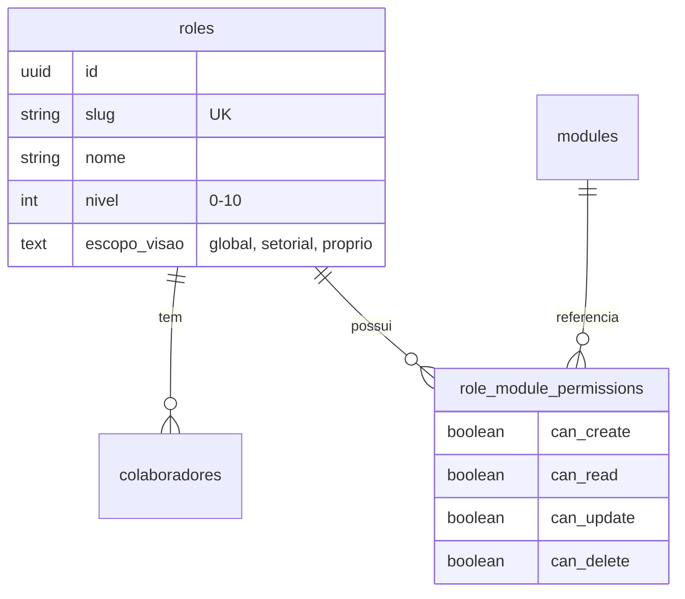

# 🔐 Sistema de Permissionamento Granular (RBAC)

> **Versão:** 1.0 (Migração 2026-02-01)
> **Status:** Ativo ✅

---

## 🏗️ Arquitetura

O sistema utiliza um modelo **RBAC (Role-Based Access Control)** persistido no Banco de Dados (Supabase), substituindo o antigo sistema hardcoded.

### Entidades Principais

| Tabela | Descrição |
|--------|-----------|
| `roles` | Define os papéis (cargos) disponíveis e níveis de acesso macro. |
| `modules` | Módulos do sistema que podem ser controlados (RH, OS, FINANCE, etc). |
| `role_module_permissions` | Tabela pivô que define CRUD (Create, Read, Update, Delete) por Role + Módulo. |
| `colaboradores` | A coluna `role_id` vincula o usuário a um papel. |

### Diagrama ER



---

## 🎭 Roles (Papéis) Padrão

| Nível | Role | Slug | Descrição |
|-------|------|------|-----------|
| 10 | Administrador | `admin` | Acesso total irrestrito (God mode). |
| 9 | Diretor | `diretor` | Visão estratégica global. |
| 6 | Coord. Administrativo | `coord_administrativo` | Gestão administrativa e financeira. |
| 5 | Coordenador | `coord_obras`, `coord_assessoria` | Gestão de equipe e setor específico. |
| 3 | Operacional (Nível 3) | `operacional_admin`, `operacional_comercial` | Acesso de escrita no próprio setor. |
| 2 | Operacional (Nível 2) | `operacional_obras`, `operacional_assessoria` | Acesso básico de leitura/escrita restrita. |
| 0 | Colaborador Obra | `colaborador_obra` | Sem acesso ao sistema (apenas registro). |

---

## 📦 Módulos Controlados

- `RH`: Recursos Humanos
- `OS`: Ordens de Serviço
- `FINANCE`: Financeiro
- `CLIENTS`: Clientes
- `CONFIG`: Configurações
- `REPORTS`: Relatórios
- `CALC_REV`: Cálculo Revisional
- `CONTACTS`: Contatos
- `PETITIONS`: Petições
- `PIPELINE`: Pipeline de Vendas

---

## 💻 Desenvolvimento (Frontend)

### Hook `useGranularPermissions`

Substitui o antigo `usePermissoes`.

```tsx
import { useGranularPermissions } from '@/lib/hooks/use-granular-permissions';

function MeuComponente() {
  const { canAccessModule, permissions } = useGranularPermissions();

  // Verificar acesso de LEITURA (Padrão)
  if (!canAccessModule('FINANCE')) {
    return <div>Acesso Negado</div>;
  }

  // Verificar acesso de CRIAÇÃO
  const podeCriar = canAccessModule('FINANCE', 'create');

  return (
    <div>
      <h1>Financeiro</h1>
      {podeCriar && <Button>Nova Conta</Button>}
    </div>
  );
}
```

### Migração Legado

O hook mantém compatibilidade com algumas flags antigas para facilitar a transição:
- `pode_criar_os`
- `pode_gerenciar_usuarios`
- `nivel`

---

## 🔄 Fluxo de Atualização

1. **Alterar Permissão de uma Role:**
   - Atualmente via Banco de Dados (Tabela `role_module_permissions`).
   - Futuro: Interface em `/configuracoes/permissoes`.

2. **Alterar Role de um Colaborador:**
   - Página de Detalhes do Colaborador > Editar > Função.
   - O sistema atualiza automaticamente o `role_id` baseado na função selecionada.
