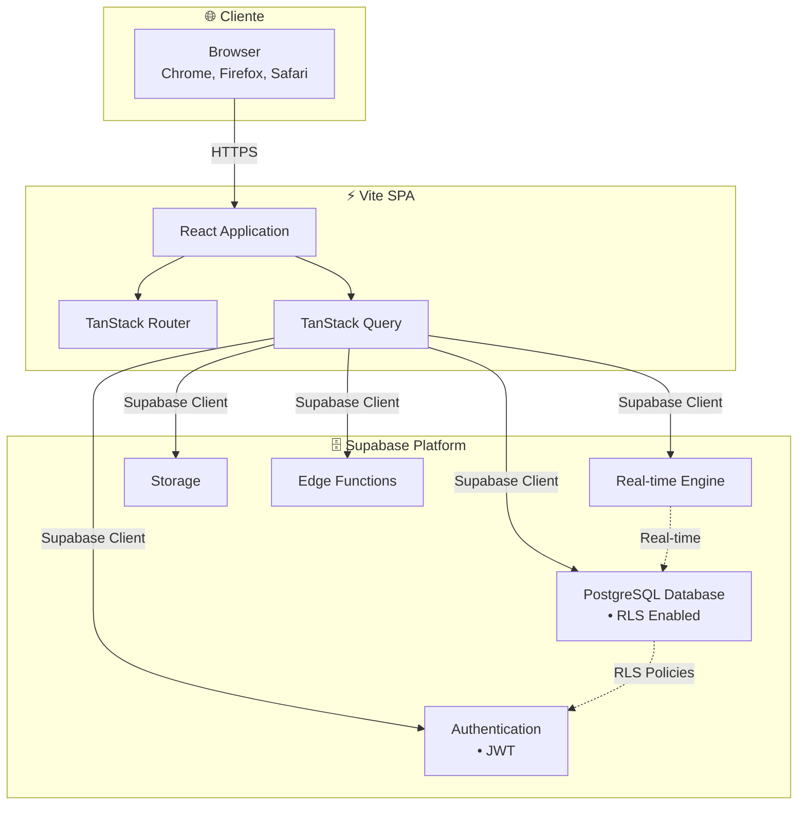

# 02 - Arquitetura Técnica

## 🏗️ Visão Geral da Arquitetura

O **Sistema Minerva v2** utiliza uma arquitetura moderna baseada em **React + TypeScript + Vite** para o frontend (SPA), com **Supabase** como Backend-as-a-Service completo. A aplicação segue uma arquitetura component-driven com foco em type safety extrema e performance otimizada. A comunicação com o banco de dados acontece através do cliente Supabase, com Row Level Security (RLS) garantindo segurança granular dos dados.

O sistema implementa duas bibliotecas de calendário distintas: **Schedule-X** para a visualização principal e **FullCalendar** para workflows específicos de OS. A arquitetura prioriza a experiência do desenvolvedor (DX) com ferramentas modernas como **TanStack Router** para roteamento type-safe, **shadcn/ui** para componentes consistentes, e uma pipeline de build otimizada com Vite.

A aplicação é construída seguindo princípios de **Atomic Design** para organização de componentes, **Custom Hooks** para lógica reutilizável, e **Real-time subscriptions** para sincronização automática de dados.

## 📊 Diagrama de Arquitetura



## 🎯 Princípios Arquiteturais

### 1. Type Safety First
- **TypeScript strict mode** habilitado.
- **Zod** para validação de schemas (formulários e dados).
- **TanStack Router** para navegação type-safe.
- **Database Types** gerados automaticamente do Supabase.

### 2. Component-Driven Architecture
- **shadcn/ui** como base de componentes (Radix UI + Tailwind).
- **Tailwind CSS** para estilização utility-first.
- **React Hook Form** para gerenciamento de formulários complexos.

### 3. State Management & Data Fetching
- **TanStack Query (React Query)** para estado do servidor (caching, revalidation).
- **Context API** para estados globais simples (Auth, Theme).
- **Supabase Realtime** para atualizações ao vivo.

## 📁 Estrutura de Pastas (Vite)

```
minerva-v2/
├── src/
│   ├── components/               # React Components
│   │   ├── ui/                   # Shadcn UI components (button, card, etc)
│   │   ├── auth/                 # Auth forms
│   │   ├── dashboard/            # Dashboard widgets
│   │   ├── os/                   # OS workflow components
│   │   └── ...
│   │
│   ├── routes/                   # TanStack Router definitions
│   │   ├── __root.tsx            # Root layout
│   │   ├── _auth.tsx             # Auth layout (protected)
│   │   ├── login.tsx             # Login page
│   │   └── ...
│   │
│   ├── lib/                      # Core utilities
│   │   ├── supabase/             # Supabase client config
│   │   ├── validations/          # Zod schemas (os-etapas-schema.ts, etc)
│   │   ├── contexts/             # React Contexts
│   │   └── utils.ts              # Helper functions
│   │
│   ├── hooks/                    # Custom React Hooks
│   │   ├── use-auth.tsx
│   │   ├── use-os.tsx
│   │   └── ...
│   │
│   ├── main.tsx                  # Entry point
│   └── index.css                 # Global styles (Tailwind directives)
│
├── public/                       # Static assets
├── index.html                    # HTML entry point
├── vite.config.ts                # Vite configuration
├── tailwind.config.js            # Tailwind configuration
└── package.json
```

## 🔐 Camada de Autenticação

### Fluxo de Autenticação
1. Usuário acessa `/login`.
2. `useAuth` hook verifica sessão no Supabase.
3. Login bem-sucedido armazena JWT (gerenciado pelo Supabase Client).
4. `TanStack Router` redireciona para `/dashboard` ou rota tentada.
5. Rotas protegidas em `_auth.tsx` validam usuário antes de renderizar.

## 📦 Dependências Principais

### Produção
- `react`, `react-dom`
- `@tanstack/react-router` (Roteamento)
- `@tanstack/react-query` (Data Fetching)
- `@supabase/supabase-js` (Backend SDK)
- `react-hook-form` + `zod` (Formulários)
- `tailwindcss`, `clsx`, `tailwind-merge` (Estilos)
- `lucide-react` (Ícones)
- `@schedule-x/react` (Calendário Principal)
- `@fullcalendar/react` (Calendário Secundário)

### Desenvolvimento
- `vite`
- `typescript`
- `eslint`

## 🔧 Configurações Importantes

### Vite
Configurado para processar caminhos absolutos (`@/*`) e otimizar o build para produção.

### Tailwind
Utiliza variáveis CSS para tema (Dark/Light mode support) e plugins para animações (`tailwindcss-animate`).

---

**Status**: ✅ **Atualizado**
**Última Atualização**: 01/12/2025