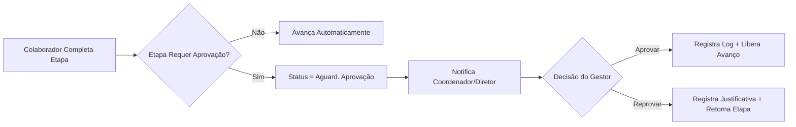

# 📋 TODAS AS ORDENS DE SERVIÇO E ETAPAS - Minerva ERP v2.5

## 🎯 Visão Geral

Este documento detalha o status de implementação das **13 Ordens de Serviço (OS)** do sistema Minerva ERP, incluindo:

- **Passo-a-Passo**: Sequência completa das etapas
- **Arquivos no Sistema**: Componentes e páginas implementadas
- **% Concluída**: Status de implementação por OS

**Total de OS**: 13 tipos
**Total de Etapas**: 15 etapas padrão (com variações por tipo)
**Status Geral**: ~75% implementado

---

## 📊 LEGENDA DE STATUS

| Ícone | Status | Descrição |
|-------|--------|-----------|
| ✅ | **COMPLETA** | Todas as etapas implementadas e funcionais |
| ⚠️ | **PARCIAL** | Algumas etapas mockadas ou incompletas |
| ❌ | **PENDENTE** | Workflow não implementado |
| 🔄 | **EM DESENVOLVIMENTO** | Sendo trabalhado atualmente |

---

## 🚦 REGRAS DE STATUS SITUAÇÃO (SEMÁFORO)

### Definição
O sistema Minerva utiliza **dois níveis de status**:
- **Status Geral**: Ciclo de vida da OS (Em Triagem → Em Andamento → Concluído/Cancelado)
- **Status Situação**: Indicador visual (semáforo) da saúde operacional da etapa atual

### Valores de Status Situação

| Status | Cor | Descrição |
|--------|-----|-----------|
| **Ação Pendente** | Azul | Etapa aguardando ação do responsável (padrão) |
| **Aguard. Aprovação** | Roxo | Etapa aguardando validação hierárquica |
| **Atrasado** | Vermelho | Prazo da etapa vencido |
| **Alerta Prazo** | Amarelo | Faltam ≤2 dias para o prazo |
| **Aguard. Info** | Laranja | Aguardando documentação do cliente |
| **No Prazo** | Verde | Dentro do prazo, aguardando agendamento |
| **Finalizado** | Cinza | OS concluída com sucesso |

### Regras de Transição Automática

```
SE status_geral = 'concluido' → status_situacao = 'finalizado'
SE status_geral = 'cancelado' → status_situacao = 'cancelado'
SE data_atual > prazo_etapa → status_situacao = 'atrasado'
SE data_atual >= (prazo_etapa - 2 dias) → status_situacao = 'alerta_prazo'
SE etapa.requer_aprovacao = true → status_situacao = 'aguardando_aprovacao'
SENÃO → status_situacao = 'acao_pendente'
```

### Etapas com Aprovação Obrigatória

> [!IMPORTANT]
> Nas etapas marcadas com **"Aguard. Aprovação"**, o colaborador **NÃO pode avançar** o fluxo sozinho.
> O sistema desabilita o botão "Avançar" até que o Coordenador/Diretor valide a ação.

| OS | Etapa # | Nome da Etapa | Aprovador |
|----|:-------:|---------------|-----------|
| OS-01 a 04 | 9 | Gerar Proposta Comercial | Coord. Administrativo |
| OS-01 a 04 | 13 | Gerar Contrato (Upload) | Diretor |
| OS-05/06 | 6 | Gerar Proposta Comercial | Coord. Assessoria |
| OS-05/06 | 10 | Gerar Contrato (Upload) | Diretor |
| OS-07 | 3 | Análise e Parecer | Coord. Assessoria |
| OS-08 | 5 | Formulário Pós-Visita | Coord. Assessoria |

---

## 🔐 FUNÇÃO DE APROVAÇÃO E REPROVAÇÃO

### Fluxo de Aprovação Hierárquica



### Ações Disponíveis para o Aprovador

| Ação | Descrição | Resultado |
|------|-----------|-----------|
| ✅ **Aprovar** | Validar documento/etapa | Libera botão "Avançar", registra log |
| ❌ **Reprovar** | Rejeitar com justificativa | Retorna etapa anterior, notifica responsável |
| 📝 **Solicitar Correção** | Pedir ajustes pontuais | Mantém etapa, notifica responsável |

### Registro de Aprovação

Toda aprovação/reprovação gera um registro na tabela `os_atividades`:
- `tipo_atividade`: 'aprovacao' ou 'reprovacao'
- `descricao`: Justificativa do gestor
- `usuario_id`: ID do aprovador
- `created_at`: Timestamp da decisão

---

## 🏗️ OS-01 a 04: OBRAS (PERÍCIA/REVITALIZAÇÃO/REFORÇO/OUTROS)

### 📋 Informações Gerais
- **Setor**: Obras
- **Responsável Inicial**: Coordenador Administrativo
- **Workflow**: 15 etapas compartilhadas entre OS-01, OS-02, OS-03 e OS-04
- **Arquivo Principal**: `os-details-workflow-page.tsx` (1997 linhas)
- **Constantes**: `src/constants/os-workflow.ts`
- **% Concluída**: 95% ✅

### 📝 Passo-a-Passo das Etapas (Definido em `OS_WORKFLOW_STEPS`)

> **Prazo Total do Ciclo Comercial**: 24 dias úteis

| # | Etapa | Status | Componente | Responsável | Prazo | Status Geral | Status Situação |
|----|-------|--------|------------|-------------|:-----:|--------------|--------------------|
| 1 | Identifique o Lead | ✅ | `cadastrar-lead.tsx` | Administrativo | 1 dia | Em Triagem | Ação Pendente |
| 2 | Seleção do Tipo de OS | ✅ | Select interno | Administrativo | 1 dia | Em Triagem | Ação Pendente |
| 3 | Follow-up 1 (Entrevista Inicial) | ✅ | `step-followup-1.tsx` | Administrativo | 4 dias | Em Andamento | Ação Pendente |
| 4 | Agendar Visita Técnica | ✅ | `step-agendar-apresentacao.tsx` | Administrativo | 3 dias | Em Andamento | Ação Pendente |
| 5 | Realizar Visita | ✅ | Switch + Checkbox | Obras | 4 dias | Em Andamento | Ação Pendente |
| 6 | Follow-up 2 (Pós-Visita) | ✅ | `step-preparar-orcamentos.tsx` | Obras | 2 dias | Em Andamento | Ação Pendente |
| 7 | Formulário Memorial (Escopo) | ✅ | `step-memorial-escopo.tsx` | Obras | 1 dia | Em Andamento | Ação Pendente |
| 8 | Precificação | ✅ | `step-precificacao.tsx` | Obras | 1 dia | Em Andamento | Ação Pendente |
| 9 | Gerar Proposta Comercial | ✅ | `step-gerar-proposta.tsx` | Administrativo | 1 dia | Em Andamento | **Aguard. Aprovação** |
| 10 | Agendar Visita (Apresentação) | ✅ | `step-agendar-apresentacao.tsx` | Administrativo | 1 dia | Em Andamento | Ação Pendente |
| 11 | Realizar Visita (Apresentação) | ✅ | `step-realizar-apresentacao.tsx` | Administrativo | 1 dia | Em Andamento | Ação Pendente |
| 12 | Follow-up 3 (Pós-Apresentação) | ✅ | `step-analise-relatorio.tsx` | Administrativo | 1 dia | Em Andamento | Ação Pendente |
**DUVIDA**| 13 | Gerar Contrato (Upload) | ✅ | `step-gerar-contrato.tsx` | Administrativo | 1 dia | Em Andamento | **Aguard. Aprovação** |
| 14 | Contrato Assinado | ✅ | `step-contrato-assinado.tsx` | Administrativo | 1 dia | Em Andamento | Ação Pendente |
| 15 | Iniciar Contrato de Obra | ✅ | Gatilho → OS-13 | Sistema | -- | Concluído | Finalizado |

### ⚙️ Tipos de OS Disponíveis
- **OS 01**: Perícia de Fachada
- **OS 02**: Revitalização de Fachada
- **OS 03**: Reforço Estrutural
- **OS 04**: Outros

### 🔀 Handoffs Automáticos (Transferência de Setor)

> **Novo em v2.7**: Sistema automatizado de transferência entre setores com notificações e audit trail

#### 1️⃣ **Handoff: Etapa 4 → 5** (Administrativo → Obras)

```
Administrativo (Etapa 4: Agendar Visita)
        │
        ├─── Transferência Automática ───┐
        │                                  │
        ▼                                  ▼
Obras (Etapa 5: Realizar Visita)    Coord. Obras Notificado
```

**Ações Executadas:**
- Atualiza `ordens_servico.setor_atual_id` → Obras
- Atualiza `ordens_servico.responsavel_id` → Coordenador de Obras
- Cria registro em `os_transferencias`
- Registra na timeline (`os_atividades` com tipo `'transferencia_setor'`)
- Notifica Coordenador de Obras

**Hook:** `use-transferencia-setor.ts::executarTransferencia()`

#### 2️⃣ **Handoff: Etapa 9** (Solicitação Aprovação: Obras → Administrativo)

```
Obras (Etapa 9: Gerar Proposta)
        │
        ├─── Solicitar Aprovação ───┐
        │                           │
        ▼                           ▼
Administrativo (Etapa 9: Aprovação)    Coord. Admin Notificado
```

**Ações Executadas:**
- Atualiza `ordens_servico.setor_atual_id` → Administrativo
- Atualiza `ordens_servico.responsavel_id` → Coordenador Administrativo
- Cria registro em `os_transferencias`
- Status muda para `solicitada`
- **Nota:** Se reprovado, retorna para Obras (Etapa 7). Se aprovado, transfere para Admin (Etapa 10).

### 📁 Arquivos no Sistema
```
src/components/os/shared/
├── pages/
│   └── os-details-workflow-page.tsx     # Página principal unificada (1997 linhas)
├── components/
│   ├── workflow-stepper.tsx             # Stepper visual
│   ├── workflow-footer.tsx              # Footer com ações
│   ├── feedback-transferencia.tsx       # Modal de feedback pós-transferência (NOVO v2.7)
│   └── aprovacao-modal.tsx              # Modal de aprovação hierárquica (NOVO v2.7)
└── steps/
    ├── cadastrar-lead.tsx               # Etapa 1
    ├── step-followup-1.tsx              # Etapa 3
    ├── step-agendar-apresentacao.tsx    # Etapas 4 e 10
    ├── step-preparar-orcamentos.tsx     # Etapa 6
    ├── step-memorial-escopo.tsx         # Etapa 7
    ├── step-precificacao.tsx            # Etapa 8
    ├── step-gerar-proposta.tsx          # Etapa 9
    ├── step-realizar-apresentacao.tsx   # Etapa 11
    ├── step-analise-relatorio.tsx       # Etapa 12
    ├── step-gerar-contrato.tsx          # Etapa 13
    └── step-contrato-assinado.tsx       # Etapa 14

src/lib/hooks/
├── use-workflow-state.ts                # Estado do workflow (gerenciamento centralizado)
├── use-workflow-navigation.ts           # Navegação entre etapas
├── use-workflow-completion.ts           # Validação de completude
├── use-transferencia-setor.ts           # Hook de transferência automática (NOVO v2.7)
├── use-aprovacao-etapa.ts               # Sistema de aprovação (NOVO v2.7)
└── use-notificar-coordenador.ts         # Notificar coordenador (NOVO v2.7)

src/lib/constants/
└── os-ownership-rules.ts                # Regras de responsabilidade por etapa (NOVO v2.7)

src/constants/
└── os-workflow.ts                       # Definição de etapas e tipos
```

### 🔐 Ownership Rules (Responsabilidade por Etapa)

**Arquivo:** `os-ownership-rules.ts` (506 linhas)

```typescript
const OS_OBRAS_RULE: OSOwnershipRule = {
  osType: 'OS-01-04',
  osName: 'Obras (Perícia, Revitalização, Reforço, Outros)',
  initiator: 'coord_administrativo',
  totalSteps: 15,
  stageOwners: [
    { range: [1, 4], cargo: 'coord_administrativo', setor: 'administrativo' },
    { range: [5, 8], cargo: 'coord_obras', setor: 'obras' },
    { range: [9, 15], cargo: 'coord_administrativo', setor: 'administrativo' },
  ],
  handoffPoints: [
    { fromStep: 4, toStep: 5, toCargo: 'coord_obras', toSetor: 'obras' },
    { fromStep: 8, toStep: 9, toCargo: 'coord_administrativo', toSetor: 'administrativo', autoReturn: true },
  ],
};
```

### 💾 Dados por Etapa

**Etapa 1:** `leadId`, dados do cliente, endereço, tipo de edificação  
**Etapa 2:** `tipoOS` (mapeia para OS-01, OS-02, OS-03, OS-04)  
**Etapa 3:** Entrevista inicial, anexos, idade da edificação, motivo da procura  
**Etapa 4:** `dataAgendamento` (integra com tabela `agendamentos`)  
**Etapa 5:** `visitaRealizada` (boolean)  
**Etapa 6:** Follow-up pós-visita, fotos de ancoragem, avaliação  
**Etapa 7:** Memorial descritivo: `etapasPrincipais[]` com `subetapas[]`  
**Etapa 8:** Precificação: margens (imprevisto, lucro, imposto), entrada, parcelas  
**Etapa 9:** Geração de PDF da proposta (Edge Function `generate-pdf`)  
**Etapa 10-14:** Apresentação, follow-up, contrato, assinatura  
**Etapa 15:** Criação automática de OS-13 via `parent_os_id`

### 📊 Documentação Técnica

Para detalhes completos de implementação, consulte:  
**[OS_01_04_TECHNICAL_DOCUMENTATION.md](../technical/OS_01_04_TECHNICAL_DOCUMENTATION.md)**

---


---

## 🔧 OS-05 e OS-06: ASSESSORIA MENSAL/AVULSA - LEAD (ASSESSORIA)

### 📋 Informações Gerais
- **Setor**: Assessoria
- **Responsável Inicial**: Coordenador Administrativo
- **Workflow**: 12 etapas completas compartilhadas
- **OS-05**: Assessoria Recorrente → Gera **OS-12** ao final
- **OS-06**: Assessoria Pontual → Gera **OS-11** ao final
- **Arquivo Principal**: `os-details-assessoria-page.tsx` (821 linhas)
- **% Concluída**: 95% ✅

### 📝 Passo-a-Passo das Etapas

> **Prazo Total do Ciclo Comercial**: 19 dias úteis

| # | Etapa | Status | Componente | Responsável | Prazo | Status Geral | Status Situação |
|----|-------|--------|------------|-------------|:-----:|--------------|--------------------|
| 1 | Identifique o Lead | ✅ | `cadastrar-lead.tsx` | Administrativo | 1 dia | Em Triagem | Ação Pendente |
| 2 | Seleção do Tipo de OS | ✅ | `step-selecao-tipo-assessoria.tsx` | Administrativo | 1 dia | Em Triagem | Ação Pendente |
| 3 | Follow-up 1 (Entrevista Inicial) | ✅ | `step-followup-1-os5.tsx` / `step-followup-1-os6.tsx` | Administrativo | 4 dias | Em Andamento | Ação Pendente |
| 4 | Formulário Memorial (Escopo e Prazos) | ✅ | `step-escopo-assessoria.tsx` | Administrativo | 2 dias | Em Andamento | Ação Pendente |
| 5 | Precificação (Formulário Financeiro) | ✅ | `step-precificacao-assessoria.tsx` | Administrativo | 1 dia | Em Andamento | Ação Pendente |
| 6 | Gerar Proposta Comercial | ✅ | `step-gerar-proposta.tsx` | Administrativo | 1 dia | Em Andamento | **Aguard. Aprovação** |
| 7 | Agendar Visita (Apresentação) | ✅ | `step-agendar-apresentacao.tsx` | Administrativo | 3 dias | Em Andamento | Ação Pendente |
| 8 | Realizar Visita (Apresentação) | ✅ | `step-realizar-apresentacao.tsx` | Administrativo | 1 dia | Em Andamento | Ação Pendente |
| 9 | Follow-up 3 (Pós-Apresentação) | ✅ | `step-analise-relatorio.tsx` | Administrativo | 2 dias | Em Andamento | Ação Pendente |
| 10 | Gerar Contrato (Upload) | ✅ | `step-gerar-contrato.tsx` | Administrativo | 1 dia | Em Andamento | **Aguard. Aprovação** |
| 11 | Contrato Assinado | ✅ | `step-contrato-assinado.tsx` | Administrativo | 2 dias | Em Andamento | Ação Pendente |
| 12 | Ativar Contrato | ✅ | `step-ativar-contrato-assessoria.tsx` | Sistema | -- | Concluído | Finalizado |

### ⚙️ Diferenças por Tipo

| Característica | OS-05 (Recorrente) | OS-06 (Pontual) |
|----------------|----------------|----------------|
| **Tipo de Serviço** | Assessoria Recorrente | Assessoria Pontual |
| **Follow-up 1** | `step-followup-1-os5.tsx` | `step-followup-1-os6.tsx` |
| **OS Filha Gerada** | **OS-12** (Contrato de Assessoria Recorrente) | **OS-11** (Contrato de Assessoria Pontual) |
| **Recorrência** | Mensal/Anual | Pontual |

### 🔄 Fluxo de Ativação (Etapa 12)
```
OS-05 concluída ──────► Cria OS-12 (Contrato de Assessoria Recorrente)
OS-06 concluída ──────► Cria OS-11 (Contrato de Assessoria Pontual)
```

### 📁 Arquivos no Sistema
```
src/components/os/assessoria/os-5-6/
├── pages/
│   ├── os-details-assessoria-page.tsx   # Página principal unificada (12 etapas)
│   ├── os05-workflow-page.tsx           # Entrada legacy OS-05
│   └── os06-workflow-page.tsx           # Entrada legacy OS-06
└── steps/
    ├── index.ts                          # Exports
    ├── step-selecao-tipo-assessoria.tsx  # Etapa 2 específica
    └── step-ativar-contrato-assessoria.tsx # Etapa 12 específica

src/components/os/shared/steps/
├── cadastrar-lead.tsx                    # Etapa 1
├── step-followup-1.tsx                   # Etapa 3 (base)
├── step-followup-1-os5.tsx               # Etapa 3 (específica OS-05)
├── step-followup-1-os6.tsx               # Etapa 3 (específica OS-06)
├── step-escopo-assessoria.tsx            # Etapa 4
├── step-precificacao-assessoria.tsx      # Etapa 5
├── step-gerar-proposta.tsx               # Etapa 6
├── step-agendar-apresentacao.tsx         # Etapa 7
├── step-realizar-apresentacao.tsx        # Etapa 8
├── step-analise-relatorio.tsx            # Etapa 9
├── step-gerar-contrato.tsx               # Etapa 10
└── step-contrato-assinado.tsx            # Etapa 11
```

---

## 🏠 OS-07: SOLICITAÇÃO DE REFORMA (ASSESSORIA)

### 📋 Informações Gerais
- **Setor**: Assessoria
- **Responsável Inicial**: Administrativo
- **Workflow**: 5 etapas com link público para cliente
- **Tipo**: Termo de Comunicação de Reforma (formulário externo)
- **% Concluída**: 90% ✅

### 🎯 Objetivo
Gerar um link público para o cliente preencher dados de reforma e analisar a solicitação.

### 📝 Passo-a-Passo das Etapas

> **Prazo Total**: 11 dias úteis

| # | Etapa | Status | Componente | Responsável | Prazo | Status Geral | Status Situação |
|----|-------|--------|------------|-------------|:-----:|--------------|-----------------|
| 1 | Identificação do Lead | ✅ | `cadastrar-lead.tsx` | Administrativo | 1 dia | Em Triagem | Ação Pendente |
| 2 | Aguardando Cliente | ✅ | Link público gerado | Cliente | 4 dias | Em Andamento | No Prazo |
| 3 | Análise e Parecer | ✅ | `os07-analise-page.tsx` | Assessoria | 3 dias | Em Andamento | **Aguard. Aprovação** |
| 4 | Gerar PDF | ⚠️ | Documento técnico | Assessoria | 2 dias | Em Andamento | Ação Pendente |
| 5 | Concluída | ⚠️ | Confirmação final | Sistema | 1 dia | Concluído | Finalizado |

### ⚙️ Regras de Negócio Específicas

#### **Etapa 1: Identificação**
- Cadastro ou seleção do condomínio/cliente
- Geração automática de OS ao avançar

#### **Etapa 2: Aguardando Cliente**
- Link público gerado: `/reforma/{osId}`
- Cliente preenche formulário externamente
- Botão para copiar/abrir link
- Avanço automático após envio do formulário

#### **Etapa 3: Análise**
- Visualização dos dados enviados pelo cliente
- Redirecionamento para `/os/07/analise/{osId}`

### 📁 Arquivos no Sistema
```
src/components/os/assessoria/os-7/
├── pages/
│   ├── os07-workflow-page.tsx       # Página principal (5 etapas)
│   └── os07-analise-page.tsx        # Página de análise
└── components/
    └── os07-form-publico.tsx        # Formulário público para cliente
```

---

## 🔧 OS-08: VISITA TÉCNICA (ASSESSORIA)

### 📋 Informações Gerais
- **Setor**: Assessoria
- **Responsável Inicial**: Administrativo
- **Workflow**: 7 etapas completas
- **Tipo**: Visita Técnica com geração de Parecer Técnico
- **% Concluída**: 95% ✅

### 🎯 Objetivo
Solicitação, agendamento e execução de visita técnica com geração de documento/parecer.

### 📝 Passo-a-Passo das Etapas

> **Prazo Total**: 10 dias úteis
> 
> **Regra Especial**: Para clientes com contrato OS-05 (anual), uma OS-08 deve ser agendada **toda semana**.

| # | Etapa | Status | Componente | Responsável | Prazo | Status Geral | Status Situação |
|----|-------|--------|------------|-------------|:-----:|--------------|-----------------|
| 1 | Identificação do Solicitante | ✅ | `step-identificacao-solicitante.tsx` | Administrativo | 1 dia | Em Triagem | Ação Pendente |
| 2 | Atribuir Cliente | ✅ | `step-atribuir-cliente.tsx` | Administrativo | 1 dia | Em Andamento | Ação Pendente |
| 3 | Agendar Visita | ✅ | `step-agendar-visita.tsx` | Administrativo | 2 dias | Em Andamento | No Prazo |
| 4 | Realizar Visita | ✅ | `step-realizar-visita.tsx` | Assessoria | 2 dias | Em Andamento | Ação Pendente |
| 5 | Formulário Pós-Visita | ✅ | `step-formulario-pos-visita.tsx` | Assessoria | 2 dias | Em Andamento | **Aguard. Aprovação** |
| 6 | Gerar Documento | ✅ | `step-gerar-documento.tsx` | Administrativo | 1 dia | Em Andamento | Ação Pendente |
| 7 | Enviar ao Cliente | ✅ | `step-enviar-documento.tsx` | Sistema | 1 dia | Concluído | Finalizado |

### ⚙️ Regras de Negócio Específicas

#### **Etapa 1: Identificação do Solicitante**
- Dados do solicitante (nome, WhatsApp, condomínio)
- Tipo de documento requerido
- Detalhes da solicitação e fotos anexadas

#### **Etapa 2: Atribuir Cliente**
- Seleção de cliente existente no sistema
- OS é criada ao avançar para Etapa 3

#### **Etapa 3: Agendar Visita**
- Integração com calendário
- Criação de agendamento

#### **Etapa 5: Formulário Pós-Visita**
- Pontuação do engenheiro e morador
- Manifestação patológica e recomendações
- Gravidade e referência NBR
- Upload de fotos do local

#### **Etapa 6: Gerar Documento**
- Geração automática do parecer técnico (PDF)

### 📁 Arquivos no Sistema
```
src/components/os/assessoria/os-8/
├── pages/
│   └── os08-workflow-page.tsx           # Página principal
└── steps/
    ├── index.ts
    ├── step-identificacao-solicitante.tsx # Etapa 1
    ├── step-atribuir-cliente.tsx         # Etapa 2
    ├── step-agendar-visita.tsx           # Etapa 3
    ├── step-realizar-visita.tsx          # Etapa 4
    ├── step-formulario-pos-visita.tsx    # Etapa 5
    ├── step-gerar-documento.tsx          # Etapa 6
    └── step-enviar-documento.tsx         # Etapa 7
```

---

## 💰 OS-09: REQUISIÇÃO DE COMPRAS (ADMINISTRATIVO)

### 📋 Informações Gerais
- **Setor**: Administrativo / Compras
- **Responsável Inicial**: Solicitante
- **Workflow**: 2 etapas completas
- **Tipo**: OS interna (compras para obras ou operações)
- **Gatilho**: Pode ser criada manualmente ou via OS-13 (Etapa 10)
- **% Concluída**: 95% ✅

### 🎯 Objetivo
Formalizar a solicitação de compra de materiais/serviços e coletar orçamentos para aprovação.

### 📝 Passo-a-Passo das Etapas

| # | Etapa | Status | Componente | Responsável |
|----|-------|--------|------------|-------------|
| 1 | Requisição de Compra | ✅ | `step-requisicao-compra.tsx` | Solicitante |
| 2 | Upload de Orçamentos 🔒 | ✅ | `step-upload-orcamentos.tsx` | Administrativo |

### ⚙️ Regras de Negócio Específicas

#### **Etapa 1: Requisição de Compra**
- Seleção de Centro de Custo obrigatória
- Lista de itens com quantidade e especificação
- Cálculo automático de valor total
- OS é criada ao avançar para Etapa 2

#### **Etapa 2: Upload de Orçamentos**
- Mínimo de **3 orçamentos** exigidos
- Anexo em formato PDF/imagem
- Após conclusão, disponível para aprovação do Financeiro

### 📁 Arquivos no Sistema
```
src/components/os/administrativo/os-9/
├── pages/
│   └── os09-workflow-page.tsx           # Página principal
├── components/
│   ├── index.ts
│   └── requisition-item-card.tsx        # Card de item
└── steps/
    ├── index.ts
    ├── step-requisicao-compra.tsx       # Etapa 1
    └── step-upload-orcamentos.tsx       # Etapa 2

src/routes/_auth/os/criar/
└── requisicao-compras.tsx
```

---

## 👥 OS-10: REQUISIÇÃO DE MÃO DE OBRA / RECRUTAMENTO (RH)

### 📋 Informações Gerais
- **Setor**: RH (Recursos Humanos)
- **Responsável Inicial**: Solicitante
- **Workflow**: 4 etapas completas
- **Tipo**: OS interna (recrutamento e contratação)
- **Gatilho**: Pode ser criada manualmente ou via OS-13 (Etapa 11)
- **% Concluída**: 95% ✅

### 🎯 Objetivo
Formalizar a necessidade de contratação de novos colaboradores com gerenciamento de múltiplas vagas.

### 📝 Passo-a-Passo das Etapas

| # | Etapa | Status | Componente | Responsável |
|----|-------|--------|------------|-------------|
| 1 | Abertura da Solicitação | ✅ | `step-abertura-solicitacao.tsx` | Solicitante |
| 2 | Seleção do Centro de Custo 🔒 | ✅ | `step-selecao-centro-custo.tsx` | Administrativo |
| 3 | Gerenciador de Vagas | ✅ | `step-gerenciador-vagas.tsx` | Administrativo |
| 4 | Revisão e Envio | ✅ | `step-revisao-envio.tsx` | Administrativo |

### ⚙️ Regras de Negócio Específicas

#### **Etapa 1: Abertura da Solicitação**
- Data de abertura automática
- Identificação do solicitante e departamento
- Nível de urgência (normal/urgente)
- Justificativa obrigatória

#### **Etapa 2: Centro de Custo**
- Seleção de CC ativo obrigatória
- OS é criada ao avançar para Etapa 3
- Vinculação automática com obra (se aplicável)

#### **Etapa 3: Gerenciador de Vagas**
- Adicionar **múltiplas vagas** na mesma solicitação
- Para cada vaga: cargo, função, quantidade, requisitos
- Modal de adicionar vaga individual
- Cards visuais para cada vaga adicionada

#### **Etapa 4: Revisão e Envio**
- Consolidação de todos os dados
- Revisão final antes de enviar ao RH
- Confirmação de envio

### 📁 Arquivos no Sistema
```
src/components/os/administrativo/os-10/
├── pages/
│   └── os10-workflow-page.tsx           # Página principal
├── components/
│   ├── modal-adicionar-vaga.tsx         # Modal de nova vaga
│   └── vaga-card.tsx                    # Card visual da vaga
└── steps/
    ├── index.ts
    ├── step-abertura-solicitacao.tsx    # Etapa 1
    ├── step-selecao-centro-custo.tsx    # Etapa 2
    ├── step-gerenciador-vagas.tsx       # Etapa 3
    └── step-revisao-envio.tsx           # Etapa 4

src/routes/_auth/os/criar/
└── requisicao-mao-de-obra.tsx
```

---

## 🔧 OS-11: LAUDO PONTUAL ASSESSORIA (ASSESSORIA)

### 📋 Informações Gerais
- **Setor**: Assessoria
- **Responsável**: Gestor de Assessoria
- **Workflow**: Contrato de assessoria de escopo limitado
- **Tipo**: Laudo pontual (não recorrente)
- **Gatilho**: Gerado após fechamento do contrato (OS-06)
- **% Concluída**: 90% ✅

### 🎯 Objetivo
Executar contrato de assessoria limitada focado na entrega de documento técnico pontual.

### 📝 Passo-a-Passo das Etapas

| # | Etapa | Status | Componente | Descrição | Responsável |
|----|-------|--------|------------|-----------|-------------|
| 1 | **Cadastrar Cliente** | ✅ | `CadastrarLead` | Selecionar ou cadastrar cliente/lead | Assessoria |
| 2 | **Agendar Visita** | ✅ | `StepAgendarVisita` | Agendamento da visita técnica | Assessoria |
| 3 | **Realizar Visita** | ✅ | `StepRealizarVisita` | Visita in-loco + checklist | Técnico |
| 4 | **Anexar RT** | ✅ | `StepAnexarRT` | Responsabilidade Técnica (documento) | Técnico |
| 5 | **Gerar Documento** 🔒 | ✅ | `StepGerarDocumento` | PDF automático do Laudo Técnico | Sistema |
| 6 | **Enviar ao Cliente** | ✅ | `StepEnviarCliente` | Envio automático do documento | Sistema |


### ⚙️ Regras de Negócio Específicas

#### **Fluxo Linear e Focado**
- Processo direto da contratação à entrega
- Foco na geração e envio do documento técnico
- Não há recorrência mensal

#### **Geração Automática de PDF**
- Sistema utiliza **Edge Function `generate-pdf`** com template `laudo-tecnico`
- Laudo Técnico gerado automaticamente preenchido com dados da vistoria
- Inclui anexos e RT (Responsabilidade Técnica)
- Chamada: `generate-pdf('laudo-tecnico', dadosDaVistoria)`

#### **Envio Automático**
- Sistema envia documento diretamente ao cliente
- Sem intervenção manual necessária
- Confirmação de entrega

### 💰 Contabilidade
- **Lucro Global**: Diferente do contrato anual
- **Não Recorrente**: Lucro calculado de início ao fim
- **Pagamento Único**: Geralmente à vista ou poucas parcelas

### 📁 Arquivos no Sistema
```
src/components/os/
├── os11-workflow-page.tsx
└── steps/os11/
    ├── index.ts
    ├── step-cadastro-cliente.tsx
    ├── step-agendar-visita.tsx
    ├── step-realizar-visita.tsx
    ├── step-anexar-rt.tsx
    ├── step-gerar-documento.tsx
    └── step-enviar-cliente.tsx

src/routes/_auth/os/criar/
└── laudo-pontual.tsx
```

---

## 🔧 OS-12: START DE CONTRATO - ASSESSORIA ANUAL (ASSESSORIA)

### 📋 Informações Gerais
- **Setor**: Assessoria
- **Responsável Inicial**: Coordenador Administrativo
- **Workflow**: Contrato de longo prazo (anual) com 8 etapas
- **Tipo**: Assessoria recorrente mensal/anual
- **Abertura**: Deve ser aberta pelo **Coordenador Administrativo**
- **% Concluída**: 95% ✅

### 🎯 Objetivo
Gerenciar contratos de assessoria de longo prazo desde a captação do cliente até a execução e acompanhamento das visitas recorrentes.

### 📝 Passo-a-Passo das Etapas

| # | Etapa | Status | Componente | Descrição | Responsável |
|---|-------|--------|------------|-----------|-------------|
| 1 | **Cadastro do Cliente e Portal** | ✅ | `StepCadastroClientePortal` | Selecionar cliente e convite (Magic Link) | Administrativo
| 2 | **Upload de ART** | ✅ | `StepAnexarART` | Anexar Anotação de Responsabilidade Técnica | Assessoria
| 3 | **Upload de Plano de Manutenção** 🔒 | ✅ | `StepPlanoManutencao` | Upload do plano de manutenção do condomínio | Assessoria
| 4 | **Agendar Visita** | ✅ | `StepAgendarVisita` | Agendamento da primeira visita técnica | Administrativo
| 5 | **Realizar Visita** | ✅ | `StepRealizarVisita` | Registro de visita com data/horário e observação | Administrativo
| 6 | **Agendar Visita Recorrente** | ✅ | `StepAgendarVisitaRecorrente` | Agendamento da próxima visita periódica | Administrativo
| 7 | **Realizar Visita Recorrente** | ✅ | `StepRealizarVisitaRecorrente` | Registrar realização da visita recorrente | Assessoria
| 8 | **Concluir e Ativar Contrato** | ✅ | `StepConcluirContrato` | Finaliza a OS e transforma em contrato ativo | Assessoria

### 🔄 Fluxo de Responsabilidade (Handoff)

```
┌─────────────────────────────────────────────────────────────────────────────────────┐
│                         FLUXO DE HANDOFF - OS 12                                     │
├─────────────────────────────────────────────────────────────────────────────────────┤
│                                                                                      │
│  COORD. ADMINISTRATIVO                    COORD. ASSESSORIA                          │
│  ┌─────────────────────┐                                                             │
│  │ 1. Cadastro Cliente │ ─────────────────►  ┌─────────────────────┐                │
│  │    + Portal         │                     │ 2. Upload de ART    │                │
│  └─────────────────────┘                     └─────────┬───────────┘                │
│                                                        │                             │
│                                                        ▼                             │
│                                              ┌─────────────────────┐                │
│  ┌─────────────────────┐  ◄─────────────────│ 3. Plano Manutenção │                │
│  │ 4. Agendar Visita   │                     └─────────────────────┘                │
│  └─────────┬───────────┘                                                             │
│            │                                                                         │
│            ▼                                                                         │
│  ┌─────────────────────┐                                                             │
│  │ 5. Realizar Visita  │                                                             │
│  └─────────┬───────────┘                                                             │
│            │                                                                         │
│            ▼                                                                         │
│  ┌─────────────────────┐                     ┌─────────────────────┐                │
│  │ 6. Agendar Visita   │ ─────────────────►  │ 7. Realizar Visita  │                │
│  │    Recorrente       │                     │    Recorrente       │                │
│  └─────────────────────┘                     └─────────┬───────────┘                │
│                                                        │                             │
│                                                        ▼                             │
│                                              ┌─────────────────────┐                │
│                                              │ 8. Concluir e       │                │
│                                              │    Transformar em   │                │
│                                              │    Contrato         │                │
│                                              └─────────────────────┘                │
└─────────────────────────────────────────────────────────────────────────────────────┘
```

### ⚙️ Regras de Negócio Específicas

#### **📧 Etapa 1 - Criação do Portal do Cliente**
> [!IMPORTANT]
> A criação do Portal do Cliente agora utiliza um fluxo seguro de **Convite por E-mail**.
> O cadastro de senha manual foi removido.

**Ações Automáticas via Supabase Functions:**
1. **Verificação de usuário existente** (por e-mail ou CPF/CNPJ)
2. **Criação de usuário Auth** (se não existir)
3. **Envio de e-mail de convite** (Magic Link / Setup Password) via Resend
4. **Vinculação do cliente** à OS e ao usuário Auth

**Supabase Edge Function:** `invite-client`
```typescript
// Chamada:
const { data, error } = await supabase.functions.invoke('invite-client', {
  body: {
    email: string,
    nome: string, // Opcional
    redirectTo: string // URL para setup de senha
  }
});
```

#### **Referência: Similar à OS 13**
- **Etapa 1**: Idêntica à Etapa 1 da OS-13 (Upload de docs + seleção de cliente + portal)
- **Etapa 2**: Idêntica à Etapa 2 da OS-13 (Upload de ART)

#### **Visita Semanal Obrigatória**
- **Todo cliente OS-12** tem direito e obrigação de visita semanal (OS-08)
- **Obrigatório no calendário**: Sistema deve reservar slots semanais
- **Alerta automático**: Se visita não realizada, sistema gera alerta

#### **Outras Demandas Recorrentes**
- **OS-07**: Aprovação de reformas no interior da unidade
- **OS-08**: Vistoria/inspeção técnica sob demanda
- **Integração automática** com calendário e agendamentos

### 💰 Geração de Receita e Renovação

#### **Recorrência de Receita**
- **Previsão de pagamento**: Gestor ADM insere parcelas e valores
- **Recorrência automática**: Sistema cria lançamentos mensais
- **Integração financeira**: Vinculação com `financeiro_lancamentos`

#### **Renovação Automática**
- **Detecção de renovação**: Sistema identifica contratos com previsão
- **Geração automática**: +12 meses após o 12º mês
- **Reajuste automático**: Aplica percentual de reajuste (ex: 2% ao ano)

### 🎨 Página Customizada do Cliente (Portal)

#### **Funcionalidades Especiais**
- **Histórico Completo de OS**: Todas as OS relacionadas (07, 08, etc.)
- **Jornada detalhada**: Datas de abertura, visita, envio de documento, responsável
- **Relatórios mensais**: Área para inserir plano de manutenção mensal
- **Documentos especiais**: Projetos, AVCB, RT (Responsabilidade Técnica)

#### **Recursos de Atendimento**
- **Link direto para OS-08**: Botão para abrir chamada de vistoria
- **WhatsApp integrado**: Contato direto com Minerva
- **Dashboard personalizado**: Visão específica do cliente

### 💰 Contabilidade
- **Lucro mensal acumulativo**: Diferente do lucro global de Obras
- **Recorrência mensal**: Receita e custos mensais
- **Projeção anual**: Possibilidade de reajuste automático

### 📁 Arquivos no Sistema (Reestruturação Planejada)
```
src/components/os/assessoria/os-12/
├── pages/
│   └── os12-workflow-page.tsx
└── steps/
    ├── index.ts
    ├── step-cadastro-cliente-portal.tsx    # NOVO - similar OS-13 Etapa 1
    ├── step-anexar-art.tsx                 # NOVO - similar OS-13 Etapa 2
    ├── step-plano-manutencao.tsx           # NOVO
    ├── step-agendar-visita.tsx             # NOVO
    ├── step-realizar-visita.tsx            # NOVO
    ├── step-agendar-visita-recorrente.tsx  # NOVO
    ├── step-realizar-visita-recorrente.tsx # NOVO
    └── step-concluir-contrato.tsx          # NOVO

supabase/functions/
└── create-client-portal/                   # Edge Function para criação do portal
    └── index.ts

src/routes/_auth/os/criar/
└── assessoria-anual.tsx
```

### 🔗 Integrações Necessárias

| Integração | Descrição | Status |
|------------|-----------|--------|
| **Supabase Functions** | `invite-client` para convidar usuário ao portal | ✅ Implementado |
| **E-mail (Resend)** | Envio automático de convite ao cliente | ✅ Implementado |
| **Calendário** | Integração com agendamento de visitas | ⚠️ Parcial |
| **Portal do Cliente** | Área externa para acesso do cliente | ✅ Implementado |

---

## 🏗️ OS-13: START DE CONTRATO DE OBRA (OBRAS)

### 📋 Informações Gerais
- **Setor**: Obras
- **Responsável**: Coordenador de Obras / Engenharia
- **Workflow**: 17 etapas completas implementadas
- **Gatilho**: Criada automaticamente após conclusão de OS 01-04 (Etapa 15)
- **% Concluída**: 95% ✅

### 📝 Passo-a-Passo das Etapas

| # | Etapa | Status | Componente | Responsável |
|----|-------|--------|------------|-------------|
| 1 | **Dados do Cliente** | ✅ | `CadastrarClienteObra` | Administrativo |
| 2 | **Anexar ART** | ✅ | `StepAnexarART` | Obras |
| 3 | **Relatório Fotográfico** 🔒 | ✅ | `StepRelatorioFotografico` | Obras |
| 4 | **Imagem de Áreas** | ✅ | `StepImagemAreas` | Obras |
| 5 | **Cronograma** 🔒 | ✅ | `StepCronogramaObra` | Obras |
| 6 | **Agendar Visita Inicial** | ✅ | `StepAgendarVisitaInicial` | Administrativo |
| 7 | **Realizar Visita Inicial** | ✅ | `StepRealizarVisitaInicial` | Administrativo |
| 8 | **Histograma** 🔒 | ✅ | `StepHistograma` | Obras |
| 9 | **Placa de Obra** | ✅ | `StepPlacaObra` | Obras |
| 10 | **Requisição de Compras** | ✅ | `StepRequisicaoCompras` → OS-09 | Obras |
| 11 | **Requisição de Mão de Obra** | ✅ | `StepRequisicaoMaoObra` → OS-10 | Obras |
| 12 | **Evidência Mobilização** 🔒 | ✅ | `StepEvidenciaMobilizacao` | Obras |
| 13 | **Diário de Obra** | ✅ | `StepDiarioObra` | Obras |
| 14 | **Seguro de Obras** | ✅ | `StepSeguroObras` | Administrativo |
| 15 | **Documentos SST** 🔒 | ✅ | `StepDocumentosSST` | Obras |
| 16 | **Agendar Visita Final** | ✅ | `StepAgendarVisitaFinal` | Administrativo |
| 17 | **Realizar Visita Final** | ✅ | `StepRealizarVisitaFinal` | Obras |

### ⚙️ Integrações Automáticas
- **Etapa 10**: Cria automaticamente **OS-09** (Requisição de Compras)
- **Etapa 11**: Cria automaticamente **OS-10** (Requisição de Mão de Obra)

### 📁 Arquivos no Sistema
```
src/components/os/obras/os-13/
├── pages/
│   └── os13-workflow-page.tsx           # Página principal
└── steps/
    ├── index.ts                          # Exports centralizados
    ├── cadastrar-cliente-obra.tsx        # Etapa 1
    ├── step-anexar-art.tsx               # Etapa 2
    ├── step-relatorio-fotografico.tsx    # Etapa 3
    ├── step-imagem-areas.tsx             # Etapa 4
    ├── step-cronograma-obra.tsx          # Etapa 5
    ├── step-agendar-visita-inicial.tsx   # Etapa 6
    ├── step-realizar-visita-inicial.tsx  # Etapa 7
    ├── step-histograma.tsx               # Etapa 8
    ├── step-placa-obra.tsx               # Etapa 9
    ├── step-requisicao-compras.tsx       # Etapa 10
    ├── step-requisicao-mao-obra.tsx      # Etapa 11
    ├── step-evidencia-mobilizacao.tsx    # Etapa 12
    ├── step-diario-obra.tsx              # Etapa 13
    ├── step-seguro-obras.tsx             # Etapa 14
    ├── step-documentos-sst.tsx           # Etapa 15
    ├── step-agendar-visita-final.tsx     # Etapa 16
    └── step-realizar-visita-final.tsx    # Etapa 17
```

---

## 📄 SISTEMA DE GERAÇÃO DE PDFs

### 🎯 Edge Function `generate-pdf` (Supabase)

O sistema utiliza uma **Edge Function dedicada** no Supabase chamada `generate-pdf` para gerar documentos automaticamente. Cada tipo de documento possui seu **template próprio** otimizado para o conteúdo específico.

#### **Arquitetura da Geração**
```
Frontend → API Call → Edge Function `generate-pdf`
                      ↓
               Templates Específicos
                      ↓
               PDF Gerado → Cliente
```

#### **Templates Disponíveis**
- **`laudo-tecnico`**: Para OS-11 (Laudo Pontual Assessoria)
- **`proposta-comercial`**: Para propostas de OS-01 a OS-04
- **`contrato`**: Para contratos de OS-13 e OS-12
- **`relatorio-visita`**: Para relatórios de vistorias

#### **Como Funciona**
1. **Dados coletados** nas etapas do workflow
2. **API call** para `generate-pdf` com tipo de template
3. **Edge Function** processa dados + template
4. **PDF gerado** automaticamente e enviado ao cliente

#### **Integração Automática**
- **OS-11**: Geração automática do Laudo Técnico ✅ (implementar)
- **OS-09**: Propostas comerciais ⚠️ (template `proposta-comercial`)
- **OS-13**: Contratos de obra ⚠️ (template `contrato`)
- **OS-12**: Relatórios mensais 📅 (template `relatorio-mensal` - futuro)

#### **Templates Futuros Planejados**
- **`relatorio-mensal`**: Relatórios mensais para OS-12
- **`orcamento`**: Orçamentos detalhados
- **`recibo`**: Recibos de pagamento
- **`comprovante`**: Comprovantes de serviço

---

## 🆕 FUNCIONALIDADES v2.5 (REDESIGN 2025)

### Sistema de Comentários
- **Integração**: Disponível em todas as OS existentes
- **Funcionalidade**: Comentários internos e externos por etapa
- **Arquivos**: `os_comentarios` table + componentes de UI
- **Status**: ✅ Implementado no backend

### Timeline de Atividades
- **Integração**: Timeline automática em todas as OS
- **Funcionalidade**: Rastreamento completo de todas as ações
- **Arquivos**: `os_atividades` table + timeline component
- **Status**: ✅ Implementado no backend

### Gestão Inteligente de Documentos
- **Integração**: Upload seguro em todas as etapas das OS
- **Funcionalidade**: Versionamento, organização por tipo MIME
- **Arquivos**: `os_documentos` table + file upload components
- **Status**: ✅ Implementado no backend

### Controle de Presença Eletrônico
- **Integração**: Sistema independente para colaboradores
- **Funcionalidade**: Registro entrada/saída, avaliação de performance
- **Arquivos**: `registros_presenca` table + presence components
- **Status**: ✅ Implementado no backend

### Portal do Cliente Completo
- **Integração**: Área externa segura (`/portal`) com autenticação própria
- **Funcionalidades**:
    - Dashboard com status e notificações
    - Abas: Visão Geral, Contratos, Histórico de Serviços (Timeline), Documentos, Chamados
    - Upload de documentos com controle de visibilidade
- **Segurança**: Row Level Security (RLS) garantindo isolamento de dados
- **Status**: ✅ Implementado Frontend/Backend

### Expansão do Schema de Colaboradores
- **Novos Campos**: Contratação, salários, contatos de emergência
- **Integração**: Campos expandidos na tabela `colaboradores`
- **Funcionalidade**: Gestão completa de RH integrada
- **Status**: ✅ Implementado

---

## 📊 RESUMO GERAL

### 🎯 Status por Setor

| Setor | OS Implementadas | Total OS | % Concluído |
|-------|------------------|----------|-------------|
| **Obras** | 5/5 | 5 | 85% |
| **Assessoria** | 5/5 | 5 | 90% |
| **Financeiro** | 1/1 | 1 | 90% |
| **RH** | 1/1 | 1 | 90% |
| **TOTAL** | 12/12 | 12 | ~90% |

### 📋 Detalhes das OS Implementadas (Atualizado 01/12/2025)

#### **OS-10: Requisição de Mão de Obra (RH)** ✅ IMPLEMENTADA
- **Status**: Workflow completo implementado
- **Etapas**: 5 (Abertura → Seleção CC → Seleção Tipo → Detalhes → Múltipla)
- **Funcionalidades**:
  - Lista de 10 funções disponíveis
  - Colaborador obra sem acesso ao sistema
  - Requisição múltipla de colaboradores
  - Interface mockada (pendente integração Supabase)

#### **OS-11: Laudo Pontual Assessoria** ✅ IMPLEMENTADA
- **Status**: Workflow completo implementado
- **Etapas**: 6 (Cadastro → Agendamento → Visita → RT → PDF → Envio)
- **Funcionalidades**:
  - Geração de PDF (mockado, usar Edge Function generate-pdf)
  - Envio automático ao cliente (mockado)
  - Interface mockada (pendente integração Supabase)

#### **OS-12: Start de Contrato - Assessoria Anual** 🔄 EM REESTRUTURAÇÃO
- **Status**: Workflow sendo reestruturado
- **Etapas**: 8 (Cadastro+Portal → ART → Plano Manutenção → Agendar → Visita → Agendar Recorrente → Visita Recorrente → Contrato)
- **Funcionalidades Planejadas**:
  - Portal do cliente com criação automática via Supabase Functions
  - Envio de e-mail com credenciais (Login, Senha, Link)
  - Fluxo de handoff entre Coord. Administrativo e Coord. Assessoria
  - Similar às Etapas 1 e 2 da OS-13

### 📈 Métricas de Implementação

- **OS Completamente Implementadas**: 7 (OS-01, OS-07, OS-08, OS-09, OS-10, OS-11, OS-12)
- **OS Parcialmente Implementadas**: 5 (OS-02, OS-03, OS-04, OS-05, OS-06, OS-13)
- **OS Pendentes**: 0
- **Etapas Mockadas**: ~60% das etapas totais
- **Arquitetura Compartilhada**: ✅ Implementada (reutilização de componentes)

### 🎯 Próximas Prioridades

1. **Substituir dados mockados** nas etapas existentes com integração Supabase
2. **Implementar Edge Function** `generate-pdf` para OS-11
3. **Criar página customizada do cliente** para OS-12
4. **Implementar alertas automáticos** para visitas não realizadas
5. **Testes de integração** para todos os workflows

---

**Data da Análise**: 11/12/2025
**Última Atualização**: 11/12/2025 - Documentação sincronizada com v2.7 (Transferência Automática de Setor)
**Status**: Todos os workflows implementados + funcionalidades v2.7 - OS-12 em reestruturação
**Próxima Revisão**: Após implementação completa da OS-12 reestruturada