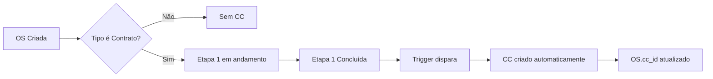

# 🏗️ Plano de Refatoração: Arquitetura de Centros de Custo

**Data:** 2025-12-06  
**Status:** 🟢 Migration Criada - Aguardando Execução  
**Prioridade:** 🔴 CRÍTICA

---

## 📋 Sumário Executivo

### Mudança de Paradigma
O **Centro de Custo (CC)** deixa de ser uma entidade isolada criada manualmente e passa a ser um **espelho financeiro direto de uma OS de Contrato Ativa**.

### Regra de Ouro
> **1 OS de Contrato = 1 Centro de Custo**

---

## 🔍 DIAGNÓSTICO (Estado Atual)

### 1. Tabela `centros_custo`
| Campo | Status | Observação |
|-------|--------|------------|
| id | ✅ Existe | PK UUID |
| nome | ✅ Existe | Ex: CC1300001 |
| valor_global | ✅ Existe | Orçamento do CC |
| cliente_id | ✅ Existe | FK para clientes |
| tipo_os_id | ✅ Existe | FK para tipos_os |
| ativo | ✅ Existe | Status |
| **os_id** | ❌ **NÃO EXISTE** | 🔴 Precisa criar |
| **data_inicio** | ❌ **NÃO EXISTE** | 🔴 Precisa criar |

### 2. Tabela `ordens_servico`
| Campo | Status | Observação |
|-------|--------|------------|
| cc_id | ✅ Existe | FK para centros_custo |
| valor_contrato | ✅ Existe | Valor do contrato |
| valor_proposta | ✅ Existe | Proposta inicial |
| is_contract_active | ✅ Existe | Flag de contrato ativo |

### 3. Triggers Existentes (para refatorar)
```sql
trigger_criar_cc_para_os → criar_centro_custo_para_os()
-- ⚠️ PROBLEMA: Cria CC para TODAS as OSs no INSERT
-- SOLUÇÃO: Criar apenas para OSs de Contrato na Etapa 1 concluída

trigger_validar_cc_cliente_os → validar_cc_cliente_os()
-- ✅ OK: Valida que CC pertence ao cliente
```

### 4. Tipos de OS

#### ✅ OSs de CONTRATO (geram CC automaticamente)
| Código | Nome | Ação |
|--------|------|------|
| OS-07 | Solicitação de Reforma | Gera CC na Etapa 1 |
| OS-08 | Visita Técnica / Parecer Técnico | Gera CC na Etapa 1 |
| OS-11 | Start Contrato Assessoria Mensal | Gera CC na Etapa 1 |
| OS-12 | Start Contrato Assessoria Avulsa | Gera CC na Etapa 1 |
| OS-13 | Start de Contrato de Obra | Gera CC na Etapa 1 |

#### 🔗 OSs SATÉLITE (herdam CC do pai)
| Código | Nome | Ação |
|--------|------|------|
| OS-09 | Requisição de Compras | Exige cc_id da OS pai |
| OS-10 | Requisição de Mão de Obra | Exige cc_id da OS pai |

#### 📝 OSs de LEAD (sem CC obrigatório)
| Código | Nome | Ação |
|--------|------|------|
| OS-05 | Assessoria Mensal (Lead) | Não gera CC |
| OS-06 | Assessoria Avulsa (Lead) | Não gera CC |

### 5. Estrutura de Rateio de MO
```
registros_presenca.centros_custo: jsonb
-- Formato atual: ["uuid1", "uuid2"] (array simples)
-- ⚠️ PROBLEMA: Não tem percentual de alocação
-- SOLUÇÃO: Nova tabela alocacao_horas_cc com percentual
```

---

## 🔧 SOLUÇÃO IMPLEMENTADA

### Migration: `20251206_refactor_centro_custo_architecture.sql`

#### Parte 1: Alterações no Schema
```sql
-- Adicionar vínculo direto com OS
ALTER TABLE centros_custo ADD COLUMN os_id uuid UNIQUE REFERENCES ordens_servico(id);

-- Adicionar datas de controle
ALTER TABLE centros_custo ADD COLUMN data_inicio date;
ALTER TABLE centros_custo ADD COLUMN data_fim date;
```

#### Parte 2: Tabela de Alocação de Horas
```sql
CREATE TABLE alocacao_horas_cc (
  id uuid PRIMARY KEY,
  registro_presenca_id uuid REFERENCES registros_presenca(id),
  cc_id uuid REFERENCES centros_custo(id),
  percentual numeric(5,2) CHECK (percentual > 0 AND percentual <= 100),
  valor_calculado numeric(12,2), -- Calculado automaticamente
  UNIQUE (registro_presenca_id, cc_id)
);
```

#### Parte 3: Trigger de Geração Automática
```sql
-- Monitora os_etapas
-- Quando etapa ordem=1 status='concluida' para OS de contrato:
-- → Gera CC automaticamente com:
--   - nome: "CC - OS1300001 - Nome Cliente"
--   - os_id: vinculado
--   - valor_global: herdado de valor_contrato
--   - data_inicio: data da OS
```

#### Parte 4: Views de Lucratividade
```sql
vw_receitas_por_cc         -- Receitas via contas_receber
vw_custos_operacionais_por_cc  -- Custos via contas_pagar
vw_custos_mo_por_cc        -- Custos MO via alocacao_horas_cc
vw_lucratividade_cc        -- Consolidado: Receita - Custos = Lucro
```

#### Parte 5: Função de Consulta
```sql
SELECT * FROM get_lucratividade_cc('uuid-do-cc');
-- Retorna:
-- - receita_prevista, receita_realizada
-- - custo_operacional_total, custo_mo_total
-- - lucro_previsto, lucro_realizado
-- - margem_prevista_pct, margem_realizada_pct
-- - status_financeiro: 'LUCRATIVO' | 'NEUTRO' | 'PREJUÍZO'
```

---

## 📊 Fluxo de Dados

### A. Geração Automática de CC



### B. Receitas (Entradas)

```
contas_receber.cc_id → centros_custo.id
```
- Parcelas geradas no cadastro do contrato
- Status: em_aberto → conciliado (quando pago)

### C. Custos Operacionais (Saídas)

```
contas_pagar.cc_id → centros_custo.id
contas_pagar.rateio → [{"cc_id": "uuid", "percentual": 50}, ...]
```
- Via OS-09 (Compras): exige cc_id
- Via Conciliação Bancária: seleção manual do CC

### D. Custos de Mão de Obra

```
registros_presenca → alocacao_horas_cc → centros_custo
                     ↓
                     percentual + valor_calculado
```
- Fórmula CLT: `(Salário × 1.46) / 22 dias`
- Fórmula PJ: `custo_dia` direto
- Rateio: 50% CC-A + 50% CC-B

---

## 🎯 Checklist de Implementação

### Banco de Dados
- [x] Migration criada: `20251206_refactor_centro_custo_architecture.sql`
- [ ] Executar migration no Supabase
- [ ] Testar trigger de geração automática
- [ ] Migrar dados existentes (alocações)

### Frontend
- [ ] Atualizar componente de seleção de CC
- [ ] Criar interface de rateio de MO
- [ ] Dashboard de lucratividade por CC
- [ ] Integrar views no painel financeiro

### Validações
- [ ] OS-09 exigir cc_id obrigatório
- [ ] Conciliação permitir rateio múltiplo
- [ ] Presença permitir alocação percentual

---

## 🔄 Comandos para Executar

### 1. Aplicar Migration (via Supabase CLI)
```bash
supabase db push
```

### 2. Ou via SQL Editor no Dashboard
Copiar conteúdo de `20251206_refactor_centro_custo_architecture.sql` e executar.

### 3. Migrar Dados Existentes
```sql
SELECT migrar_centros_custo_para_alocacao();
```

### 4. Testar Views
```sql
-- Ver lucratividade de todos os CCs
SELECT * FROM vw_lucratividade_cc ORDER BY lucro_previsto DESC;

-- Detalhe de um CC específico
SELECT * FROM get_lucratividade_cc('uuid-do-cc');
```

---

## 📝 Notas Importantes

1. **Backward Compatibility**: O campo `centros_custo` (jsonb array) continua existindo em `registros_presenca` para compatibilidade. A nova tabela `alocacao_horas_cc` é a fonte de verdade para cálculos.

2. **Rateio Padrão**: Quando migrar dados antigos, será aplicado rateio igual (100% / quantidade de CCs).

3. **Performance**: Índices criados para todas as FKs e campos de filtro comuns.

4. **RLS**: Políticas aplicadas à nova tabela `alocacao_horas_cc`.

---

**Criado por:** Claude (Arquiteto de Software)  
**Revisado em:** 2025-12-06


