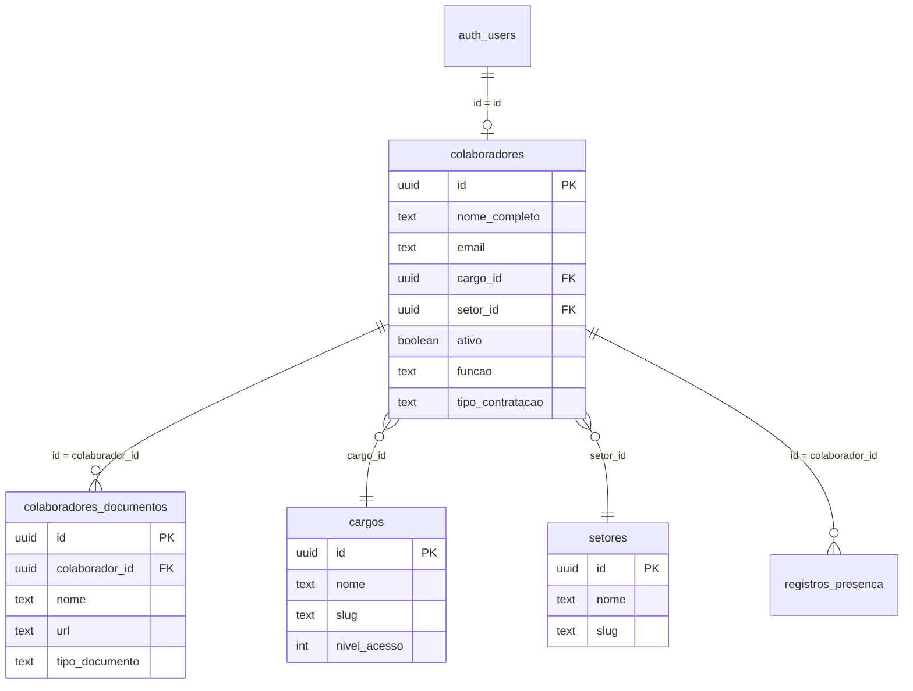

# 👥 Módulo de Colaboradores - Documentação Técnica

**Última Atualização:** 2026-01-06  
**Versão:** 1.0  
**Status:** ✅ Sincronizado com código e banco de dados

---

## 📌 Visão Geral

O módulo de Colaboradores gerencia o ciclo de vida completo dos funcionários no sistema Minerva ERP:

- **Cadastro e convite** de novos colaboradores
- **Gestão de documentos** pessoais (RG, CPF, etc.)
- **Controle de presença** e custos
- **Self-service** via "Minha Conta"

### Usuários do Módulo

| Perfil | Acesso | Funcionalidades |
|--------|--------|-----------------|
| Admin/Diretor | `/colaboradores` | CRUD completo, visualização de todos |
| Coordenadores (nível ≥5) | `/colaboradores` | Visualização de todos, edição restrita |
| Operacionais (nível <5) | `/colaboradores` | Visualização do próprio setor |
| Colaborador | `/minha-conta` | Self-service (perfil, senha, docs) |

---

## 🏗 Arquitetura

### Diagrama de Relacionamentos



### Storage Buckets

| Bucket | Uso | Padrão de Nome |
|--------|-----|----------------|
| `avatars` | Fotos de perfil | `{user_id}/avatar_{timestamp}.jpg` |
| `documentos-colaboradores` | Documentos pessoais | `{colaborador_id}/{tipo_documento}_{timestamp}.{ext}` |

---

## 🗄 Schemas do Banco de Dados

### Tabela: `colaboradores`

> **Total:** 40+ colunas | **RLS:** Habilitado

#### Dados de Identificação
| Coluna | Tipo | Nullable | Descrição |
|--------|------|----------|-----------|
| `id` | uuid | NO | PK (= `auth.users.id`) |
| `nome_completo` | text | YES | Nome exibido no sistema |
| `cpf` | varchar | YES | Documento (formatado) |
| `data_nascimento` | date | YES | - |
| `avatar_url` | text | YES | URL da foto de perfil |

#### Contato
| Coluna | Tipo | Nullable | Descrição |
|--------|------|----------|-----------|
| `email` | text | YES | Email principal (login) |
| `email_pessoal` | text | YES | Email alternativo |
| `email_profissional` | text | YES | Email corporativo |
| `telefone` | varchar | YES | Telefone principal |
| `telefone_pessoal` | text | YES | - |
| `telefone_profissional` | text | YES | - |
| `contato_emergencia_nome` | text | YES | Nome do contato |
| `contato_emergencia_telefone` | text | YES | - |

#### Endereço
| Coluna | Tipo | Nullable | Descrição |
|--------|------|----------|-----------|
| `cep` | text | YES | CEP (integração ViaCEP) |
| `logradouro` | text | YES | Rua/Avenida |
| `numero` | text | YES | - |
| `complemento` | text | YES | - |
| `bairro` | text | YES | - |
| `cidade` | text | YES | - |
| `uf` | varchar(2) | YES | Estado |

#### Profissional
| Coluna | Tipo | Nullable | Descrição |
|--------|------|----------|-----------|
| `cargo_id` | uuid FK | YES | Referência para `cargos` |
| `setor_id` | uuid FK | YES | Referência para `setores` |
| `funcao` | text | YES | Slug da função (ex: `coord_obras`) |
| `qualificacao` | text | YES | ENCARREGADO, OFICIAL, etc. |
| `gestor` | text | YES | Nome do gestor responsável |
| `disponibilidade_dias` | text[] | YES | Array: ['SEG', 'TER', ...] |
| `turno` | text[] | YES | Array: ['MANHA', 'TARDE'] |

#### Contratual e Financeiro
| Coluna | Tipo | Nullable | Descrição |
|--------|------|----------|-----------|
| `tipo_contratacao` | text | YES | CLT, CONTRATO, PROLABORE |
| `data_admissao` | date | YES | - |
| `salario_base` | numeric | YES | Salário CLT |
| `custo_dia` | numeric | YES | Custo diário (PJ/Contrato) |
| `custo_mensal` | numeric | YES | Custo mensal calculado |
| `remuneracao_contratual` | numeric | YES | Valor PJ |
| `rateio_fixo` | text | YES | Centro de custo fixo |

#### Dados Bancários
| Coluna | Tipo | Nullable | Descrição |
|--------|------|----------|-----------|
| `banco` | text | YES | Código do banco (ex: '001') |
| `agencia` | text | YES | - |
| `conta` | text | YES | - |
| `chave_pix` | text | YES | - |

#### Sistema
| Coluna | Tipo | Nullable | Default | Descrição |
|--------|------|----------|---------|-----------|
| `ativo` | boolean | YES | `true` | Status ativo/inativo |
| `bloqueado_sistema` | boolean | YES | `false` | Bloqueia acesso |
| `status_convite` | text | YES | `'ativo'` | pendente, ativo, expirado |
| `auth_user_id` | uuid | YES | - | Referência alternativa para auth |
| `documentos_obrigatorios` | jsonb | YES | `'[]'` | Checklist de docs (legacy) |
| `created_at` | timestamptz | YES | `now()` | - |
| `updated_at` | timestamptz | YES | `now()` | - |

---

### Tabela: `colaboradores_documentos`

> **Total:** 9 colunas | **RLS:** Habilitado

| Coluna | Tipo | Nullable | Default | Descrição |
|--------|------|----------|---------|-----------|
| `id` | uuid | NO | `gen_random_uuid()` | PK |
| `colaborador_id` | uuid | NO | - | FK para `colaboradores` |
| `nome` | text | NO | - | Nome original do arquivo |
| `url` | text | NO | - | URL pública no Storage |
| `tipo` | text | YES | - | Extensão do arquivo (pdf, jpg) |
| `tipo_documento` | text | YES | - | Categoria (RG, CPF, CNH, etc.) |
| `tamanho` | bigint | YES | - | Tamanho em bytes |
| `created_at` | timestamptz | YES | `now()` | - |
| `updated_at` | timestamptz | YES | `now()` | - |

#### Tipos de Documento Suportados

> **26 tipos de documento** organizados por categoria

```typescript
const DOCUMENTOS_OBRIGATORIOS = [
  // Documentos Pessoais (8)
  { value: 'RG', label: 'RG', categoria: 'pessoal' },
  { value: 'CPF', label: 'CPF', categoria: 'pessoal' },
  { value: 'CNH', label: 'CNH', categoria: 'pessoal' },
  { value: 'COMPROVANTE_RESIDENCIA', label: 'Comprovante de Residência', categoria: 'pessoal' },
  { value: 'TITULO_ELEITOR', label: 'Título de Eleitor', categoria: 'pessoal' },
  { value: 'RESERVISTA', label: 'Certificado de Reservista', categoria: 'pessoal' },
  { value: 'CERTIDAO_NASCIMENTO', label: 'Certidão de Nascimento', categoria: 'pessoal' },
  { value: 'CERTIDAO_CASAMENTO', label: 'Certidão de Casamento', categoria: 'pessoal' },
  
  // Documentos CLT (3)
  { value: 'CTPS', label: 'Carteira de Trabalho (CTPS)', categoria: 'clt' },
  { value: 'PIS_PASEP', label: 'PIS/PASEP', categoria: 'clt' },
  { value: 'EXAME_ADMISSIONAL', label: 'Exame Admissional', categoria: 'clt' },
  
  // Documentos MEI/PJ (10)
  { value: 'CNPJ', label: 'Cartão CNPJ', categoria: 'pj' },
  { value: 'CCMEI', label: 'Certificado MEI (CCMEI)', categoria: 'pj' },
  { value: 'CONTRATO_SOCIAL', label: 'Contrato Social / Requerimento MEI', categoria: 'pj' },
  { value: 'ALVARA_FUNCIONAMENTO', label: 'Alvará de Funcionamento', categoria: 'pj' },
  { value: 'COMPROVANTE_INSCRICAO_MUNICIPAL', label: 'Inscrição Municipal', categoria: 'pj' },
  { value: 'CERTIDAO_NEGATIVA_FEDERAL', label: 'Certidão Negativa Federal', categoria: 'pj' },
  { value: 'CERTIDAO_NEGATIVA_ESTADUAL', label: 'Certidão Negativa Estadual', categoria: 'pj' },
  { value: 'CERTIDAO_NEGATIVA_MUNICIPAL', label: 'Certidão Negativa Municipal', categoria: 'pj' },
  { value: 'RPA', label: 'Recibo de Pagamento Autônomo (RPA)', categoria: 'pj' },
  { value: 'DADOS_BANCARIOS_PJ', label: 'Comprovante Conta PJ', categoria: 'pj' },
  
  // Outros (3)
  { value: 'CERTIFICADOS', label: 'Certificados e Cursos', categoria: 'outros' },
  { value: 'FOTO_3X4', label: 'Foto 3x4', categoria: 'outros' },
  { value: 'CONTRATO_TRABALHO', label: 'Contrato de Prestação de Serviços', categoria: 'outros' },
];
```

> [!IMPORTANT]
> **Fluxo de documentos centralizado no RH:** Colaboradores não podem mais enviar documentos via "Minha Conta". Todos os uploads são feitos exclusivamente pelo RH no painel de Detalhes do Colaborador.

---

## 🔐 RLS Policies (Row Level Security)

### `colaboradores`

| Policy | Comando | Lógica |
|--------|---------|--------|
| `colab_read_hierarquia_v2` | SELECT | `id = auth.uid()` OR `nivel >= 9` OR `nivel >= 5` |
| `colab_read_own` | SELECT | `auth.uid() = id` (sempre vê próprio) |
| `colaboradores_read_final` | SELECT | `id = auth.uid()` OR `nivel >= 5` OR `mesmo setor` |

> **Resumo:** Nível ≥5 (Coordenadores+) veem todos os colaboradores. Demais veem apenas próprio perfil ou mesmo setor.

### `colaboradores_documentos`

| Policy | Comando | Lógica |
|--------|---------|--------|
| `Leitura para autenticados` | SELECT | `auth.role() = 'authenticated'` |
| `Escrita para autenticados` | ALL | `auth.role() = 'authenticated'` |

> **Nota:** Qualquer usuário autenticado pode ler/escrever documentos. Filtro por `colaborador_id` é aplicado no frontend.

### Tabelas de Apoio

| Tabela | Policy | Acesso |
|--------|--------|--------|
| `cargos` | `public_read_cargos` | SELECT público |
| `setores` | `public_read_setores` | SELECT público |

---

## 📁 Estrutura de Arquivos

```
src/
├── routes/_auth/
│   ├── colaboradores/
│   │   └── $colaboradorId.tsx        # Rota detalhes (7 linhas, wrapper)
│   └── minha-conta/
│       └── index.tsx                  # Self-service (571 linhas - 2 tabs)
│
├── components/colaboradores/
│   ├── colaboradores-lista-page.tsx   # Lista principal (403 linhas)
│   ├── colaborador-detalhes-page.tsx  # Detalhes + 3 tabs (976 linhas)
│   ├── modal-cadastro-colaborador.tsx # Formulário completo (1060 linhas)
│   ├── modal-convite-colaborador.tsx  # Convite em lote (~263 linhas)
│   ├── controle-presenca-page.tsx     # Registro de presença
│   └── controle-presenca-tabela-page.tsx
│
├── lib/constants/
│   └── colaboradores.ts               # FUNCOES, BANCOS, DOCUMENTOS (115 linhas)
│
└── types/
    └── colaborador.ts                 # Interfaces TypeScript (239 linhas)
```

---

## 🔄 Fluxo de Dados: Documentos

### Diagrama de Integração

```
┌─────────────────────────────────────────────────────────────────────┐
│                    FLUXO DE DOCUMENTOS (Centralizado RH)            │
├─────────────────────────────────────────────────────────────────────┤
│                                                                      │
│              ┌─────────────────────────────────────┐                │
│              │   /colaboradores/{id}/Documentos   │                │
│              │   (Apenas RH/Admin/Coordenadores)   │                │
│              └──────────────────┬──────────────────┘                │
│                                 │                                    │
│                                 │  1. Select tipo_documento          │
│                                 │  2. Upload arquivo                 │
│                                 │  3. Download/Delete                │
│                                 │                                    │
│                                 ▼                                    │
│              ┌──────────────────────────────┐                        │
│              │   Supabase Storage           │                        │
│              │   documentos-colaboradores   │                        │
│              └──────────────┬───────────────┘                        │
│                             │                                        │
│                             ▼                                        │
│              ┌──────────────────────────────┐                        │
│              │   colaboradores_documentos   │                        │
│              │   (colaborador_id, url,      │                        │
│              │    tipo_documento, ...)      │                        │
│              └──────────────────────────────┘                        │
│                                                                      │
│  NOTA: Colaboradores NÃO enviam documentos via "Minha Conta"        │
│                                                                      │
└─────────────────────────────────────────────────────────────────────┘
```

### Fluxo de Upload

1. **Usuário seleciona** tipo de documento no dropdown
2. **Seleciona arquivo** (PDF, JPG, PNG - max 5MB)
3. **Upload para Storage** com padrão: `{colaborador_id}/{tipo_documento}_{timestamp}.{ext}`
4. **Obter URL pública** via `getPublicUrl()`
5. **INSERT na tabela** `colaboradores_documentos`
6. **Atualizar UI** com toast de sucesso

---

## 🎯 Componentes Principais

### ColaboradoresListaPage

**Arquivo:** `src/components/colaboradores/colaboradores-lista-page.tsx`

| Feature | Descrição |
|---------|-----------|
| Cards de indicadores | Total ativos/inativos, custo-dia médio |
| Tabela com filtros | Busca por nome/CPF/email, filtro setor/status |
| Ações | Convidar colaborador, navegar para detalhes |

### ColaboradorDetalhesPage

**Arquivo:** `src/components/colaboradores/colaborador-detalhes-page.tsx`

| Tab | Conteúdo |
|-----|----------|
| **Visão Geral** | Dados pessoais, contato, profissionais, contratuais, bancários |
| **Financeiro & Presença** | Métricas (6 meses), gráfico de custos, histórico |
| **Documentos** | Upload, download, exclusão de documentos |

**Ações do Header:**
- Reenviar Convite (se pendente)
- Editar Cadastro
- Ativar/Desativar

### MinhaContaPage

**Arquivo:** `src/routes/_auth/minha-conta/index.tsx` (571 linhas)

| Tab | Conteúdo |
|-----|---------|
| **Perfil** | Avatar (crop), nome, telefone |
| **Segurança** | Alterar senha (Zod validation) |

> [!NOTE]
> A aba "Documentos" foi removida. Gestão de documentos é feita exclusivamente pelo RH.

---

## 🔗 Mapeamento de Funções e Cargos

```typescript
// src/lib/constants/colaboradores.ts

const FUNCOES = [
  { value: 'admin', label: '1 - Admin', setor: 'ti', nivel: 10 },
  { value: 'diretor', label: '2 - Diretor', setor: 'diretoria', nivel: 9 },
  { value: 'coord_administrativo', label: '3 - Coord. Admin', setor: 'administrativo', nivel: 6 },
  { value: 'coord_assessoria', label: '4 - Coord. Assessoria', setor: 'assessoria', nivel: 5 },
  { value: 'coord_obras', label: '5 - Coord. Obras', setor: 'obras', nivel: 5 },
  { value: 'operacional_admin', label: '6 - Op. Administrativo', setor: 'administrativo', nivel: 3 },
  { value: 'operacional_comercial', label: '7 - Op. Comercial', setor: 'administrativo', nivel: 3 },
  { value: 'operacional_assessoria', label: '8 - Op. Assessoria', setor: 'assessoria', nivel: 2 },
  { value: 'operacional_obras', label: '9 - Op. Obras', setor: 'obras', nivel: 2 },
  { value: 'colaborador_obra', label: '10 - Colaborador Obra', setor: 'obras', nivel: 0 },
];
```

> **Importante:** `colaborador_obra` (nível 0) **não tem acesso ao sistema**. Apenas registros de presença.

---

## 📚 Referências

| Documento | Descrição |
|-----------|-----------|
| [USER_STRUCTURE_AND_INVITES.md](./USER_STRUCTURE_AND_INVITES.md) | Fluxo de convite e autenticação |
| [Manual de Permissões](./Manual%20de%20Permissões%20e%20Controle%20de%20Acesso.md) | RLS detalhado |
| `src/lib/constants/colaboradores.ts` | Constantes e mapeamentos |
| `src/types/colaborador.ts` | Interfaces TypeScript |

---

*Documento gerado por análise do código e banco de dados em 2026-01-06.*
