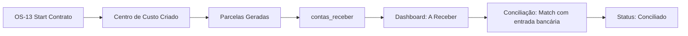
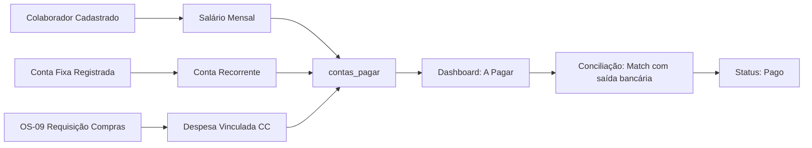

# 📊 Diagnóstico Completo: Módulo Financeiro - MinervaV2

**Data do Diagnóstico:** 2026-01-18  
**Versão do Sistema:** v2.7  
**Status Geral:** 🔴 **CRÍTICO - 100% Mock Data**

---

## 📋 Sumário Executivo

> [!CAUTION]
> O Módulo Financeiro está **100% implementado apenas no frontend** com dados mockados. Nenhuma funcionalidade está conectada ao Supabase em produção.

### Métricas de Implementação

| Aspecto | Status | Percentual |
|---------|--------|------------|
| Frontend (UI) | ✅ Completo | 95% |
| Integração Supabase | ❌ Não iniciada | 0% |
| Hooks de Data Fetching | ❌ Não existem | 0% |
| Tabelas no Banco | ⚠️ Existem, não usadas | 50% |
| Migrations | ⚠️ Pendentes | 30% |

---

## 🗂️ Inventário de Arquivos

### Páginas do Módulo Financeiro

| Arquivo | Localização | Linhas | Status |
|---------|-------------|--------|--------|
| `financeiro-dashboard-page.tsx` | `components/financeiro/` | 381 | 🔴 100% Mock |
| `contas-pagar-page.tsx` | `components/financeiro/` | 558 | 🔴 100% Mock |
| `contas-receber-page.tsx` | `components/financeiro/` | 447 | 🔴 100% Mock |
| `prestacao-contas-page.tsx` | `components/financeiro/` | 469 | 🔴 100% Mock |
| `conciliacao-bancaria-page.tsx` | `components/financeiro/` | 647 | 🔴 100% Mock |
| `gestao-compras-page.tsx` | `components/financeiro/` | ~200 | 🔴 100% Mock |
| `cliente-tab-financeiro.tsx` | `components/clientes/tabs/` | 238 | 🟡 Parcial (usa `useClienteContratos`) |

### Componentes Auxiliares

| Arquivo | Função |
|---------|--------|
| `modal-nova-conta.tsx` | Modal para adicionar conta a pagar manual |
| `modal-classificar-lancamento.tsx` | Modal de classificação para conciliação |
| `modal-custo-flutuante.tsx` | Modal para custos flutuantes |
| `modal-aprovar-requisicao.tsx` | Modal de aprovação de requisições |
| `purchase-approval-board.tsx` | Board de aprovação de compras |

### Rotas Definidas

```
src/routes/_auth/financeiro/
├── index.tsx              # Dashboard principal
├── contas-pagar.tsx       # Contas a pagar
├── contas-receber.tsx     # Contas a receber
├── prestacao-contas.tsx   # Prestação de contas
├── conciliacao.tsx        # Conciliação bancária
├── compras.tsx            # Gestão de compras
└── requisicoes.tsx        # Requisições
```

---

## 🔍 Análise Detalhada por Componente

### 1. Dashboard Financeiro (`financeiro-dashboard-page.tsx`)

**O que existe:**
- KPIs visuais (Previsão de Receita, Faturas, A Receber Hoje, A Pagar Hoje, Lucro, Clientes)
- Gráficos de comparação Previsto vs. Realizado (Receitas e Despesas)
- Análise de variação mensal
- Seção de Prestação de Contas com resumo por tipo de projeto

**O que está 100% mockado:**
```typescript
// Linhas 29-37 - Mock data hardcoded
const mockKPIs = {
  previsaoReceitaMes: 248000,
  previsaoFaturasMes: 114000,
  aReceberHoje: 22987,
  aPagarHoje: 6785,
  lucroMes: 134000,
  totalClientesMes: 47
};
```

**O que falta implementar:**
- [ ] Hook `useFinanceiroDashboard` para buscar dados reais
- [ ] Query agregada para KPIs do mês
- [ ] Query de comparação histórica (últimos 6 meses)
- [ ] Integração com `centros_custo` para prestação de contas

---

### 2. Contas a Receber (`contas-receber-page.tsx`)

**O que existe:**
- Listagem de parcelas com filtros (status, busca)
- KPIs: Total Previsto, Recebido, Em Aberto, Inadimplente
- Destaque visual de parcelas inadimplentes
- Tabela com: Cliente, CC, Contrato, Parcela, Vencimento, Valores, Status

**O que está 100% mockado:**
```typescript
// Linhas 27-117 - Array mockParcelas com 8 registros fictícios
const mockParcelas: ContaReceber[] = [
  {
    id: 'rec-1',
    cliente: 'Empreendimentos ABC S.A.',
    // ... dados fictícios
  }
];
```

**O que falta implementar:**
- [ ] Hook `useContasReceber` para buscar de `public.contas_receber`
- [ ] Filtro por período/vencimento
- [ ] Ação de "Conciliar" parcela (update status + link comprovante)
- [ ] Integração real com contratos e centros de custo

> [!IMPORTANT]
> A tabela `contas_receber` existe no schema mas **nunca é consultada** no código frontend. Zero queries encontradas.

---

### 3. Contas a Pagar (`contas-pagar-page.tsx`)

**O que existe:**
- Listagem de contas com filtros (status, tipo, busca)
- KPIs: Total Previsto, Pago, Em Aberto, Atrasado
- Modal para adicionar conta manual
- Classificação por tipo (Salário, Conta Fixa, Despesa Variável)

**O que está 100% mockado:**
```typescript
// Linhas 26-150 - Array mockContas com 10 registros fictícios
const mockContas: ContaPagar[] = [
  // Salários fictícios
  // Aluguel fictício
  // Energia fictícia
  // etc.
];
```

**Única referência real encontrada:**
```typescript
// use-aprovacao-requisicoes.ts linha 132
.from('contas_pagar')
```
> Apenas para aprovar requisições de compra, não para listar/gerenciar contas.

**O que falta implementar:**
- [ ] Hook `useContasPagar` para buscar de `public.contas_pagar`
- [ ] Geração automática de salários a partir de `colaboradores`
- [ ] Geração automática de parcelas a partir de contratos
- [ ] Fluxo de pagamento/baixa de conta

---

### 4. Prestação de Contas (`prestacao-contas-page.tsx`)

**O que existe:**
- Listagem de projetos com receitas/custos
- Cálculo de lucro e margem
- Regras de negócio implementadas:
  - Obras/Laudo: Lucro só após encerramento
  - Assessoria Anual: Lucro calculado mensalmente
- Detalhamento por tipo de custo (MO, Material, Equipamento)

**O que está 100% mockado:**
```typescript
// Linhas 43-127 - Array mockProjetos com 4 projetos fictícios
const mockProjetos: ProjetoFinanceiro[] = [
  {
    id: 'proj-1',
    nome: 'Obra Residencial - Condomínio Jardim das Flores',
    // ... dados fictícios
  }
];
```

**O que falta implementar:**
- [ ] Hook `usePrestacaoContas` ou `useLucratividadeCC`
- [ ] View `vw_lucratividade_cc` (descrita em CENTRO_CUSTO_REFACTORING_PLAN.md)
- [ ] Função `get_lucratividade_cc(uuid)` no Supabase
- [ ] Exportação real para Excel/PDF

---

### 5. Conciliação Bancária (`conciliacao-bancaria-page.tsx`)

**O que existe:**
- Filtros avançados (datas, tipo, setor, CC)
- Resumo: Entradas, Saídas, Saldo
- Tabela de lançamentos com edição inline
- Modal de classificação com rateio
- Modal de custo flutuante

**O que está 100% mockado:**
```typescript
// Linhas 62-131 - Array mockLancamentos com 7 lançamentos fictícios
const mockLancamentos: LancamentoBancario[] = [
  {
    id: 'lanc-1',
    data: '2024-12-10',
    descricao: 'PIX RECEBIDO - CONDOMINIO JARDIM DAS FLORES',
    // ...
  }
];
```

**O que falta implementar:**'1
- [ ] Importação de extrato bancário (OFX/CSV)
- [ ] Tabela `lancamentos_bancarios` no Supabase
- [ ] Hook `useConciliacaoBancaria`
- [ ] Matching automático com contas_receber/pagar
- [ ] Persistência de classificações

---

## 🗃️ Análise do Schema de Banco de Dados

### Tabelas Existentes (Supabase)

#### `centros_custo`
```sql
public.centros_custo (
  id uuid PK,
  nome text,              -- Ex: CC13001-SOLAR_I
  valor_global numeric,   -- Orçamento total
  cliente_id uuid FK,
  tipo_os_id uuid FK,
  os_id uuid UNIQUE FK,   -- ⚠️ Campo pendente de migration
  descricao text,
  ativo boolean,
  data_inicio date,       -- ⚠️ Campo pendente de migration
  data_fim date,          -- ⚠️ Campo pendente de migration
  created_at, updated_at
);
```
**Status:** ⚠️ Migration `20251206_refactor_centro_custo_architecture.sql` existe mas está **PENDENTE** de execução no Supabase.

#### `contas_receber` (Inferido da documentação)
```sql
-- Não foi encontrada definição explícita no código
-- Sugerido pelo CENTRO_CUSTO_REFACTORING_PLAN.md:
contas_receber.cc_id → centros_custo.id
```
**Status:** ❌ Tabela possivelmente existe, mas zero queries no frontend.

#### `contas_pagar` (Referenciada 1x)
```sql
-- Única referência encontrada:
.from('contas_pagar')  // use-aprovacao-requisicoes.ts
```
**Status:** ⚠️ Tabela existe, uso mínimo (apenas aprovação de requisições).

### Migrations Pendentes

| Migration | Status | Descrição |
|-----------|--------|-----------|
| `20251206_refactor_centro_custo_architecture.sql` | 🟡 Criada, não executada | Adiciona `os_id`, `data_inicio`, `data_fim` + tabela `alocacao_horas_cc` + views de lucratividade |

---

## 📐 Tipos TypeScript Definidos

```typescript
// src/lib/types.ts (linhas 258-301)

export type FinanceiroCategoria =
  | 'mao_de_obra' | 'material' | 'equipamento'
  | 'aplicacao' | 'escritorio' | 'impostos' | 'outros';

export type ContaPagarTipo = 'salario' | 'conta_fixa' | 'despesa_variavel';
export type ContaPagarStatus = 'em_aberto' | 'pago' | 'atrasado';
export type ContaReceberStatus = 'em_aberto' | 'conciliado' | 'inadimplente';

export interface ContaPagar {
  id: string;
  favorecido: string;
  tipoFavorecido: 'colaborador' | 'fornecedor';
  descricao: string;
  tipo: ContaPagarTipo;
  vencimento: string;
  valor: number;
  valorPago?: number;
  status: ContaPagarStatus;
  dataPagamento?: string;
  comprovanteId?: string;
  recorrente: boolean;
  categoria?: FinanceiroCategoria;
}

export interface ContaReceber {
  id: string;
  cliente: string;
  centroCusto: string;
  contrato: string;
  parcela: string;
  vencimento: string;
  valorPrevisto: number;
  valorRecebido?: number;
  status: ContaReceberStatus;
  dataConciliacao?: string;
  comprovanteId?: string;
}
```

> [!NOTE]
> Os tipos estão bem definidos, mas **não correspondem exatamente ao schema do banco**. Será necessário alinhar com `database.types.ts` gerado pelo Supabase CLI.

---

## 🔗 Hooks de Data Fetching - Estado Atual

### Hooks Financeiros Existentes
| Hook | Arquivo | Status |
|------|---------|--------|
| `useClienteContratos` | `use-cliente-contratos.ts` | ✅ Funcional |

**Nenhum hook dedicado ao módulo financeiro foi encontrado:**
- ❌ `useFinanceiroDashboard` - Não existe
- ❌ `useContasPagar` - Não existe
- ❌ `useContasReceber` - Não existe
- ❌ `useConciliacaoBancaria` - Não existe
- ❌ `usePrestacaoContas` - Não existe
- ❌ `useLucratividadeCC` - Não existe

---

## 🚧 O Que Deveria Existir (Funcionalidades Esperadas)

### 1. Fluxo de Geração de Receitas (Contas a Receber)



**Status:** ❌ Fluxo não implementado

### 2. Fluxo de Geração de Despesas (Contas a Pagar)



**Status:** ❌ Fluxo não implementado (apenas OS-09 parcialmente conectado)

### 3. Cálculo de Lucratividade por Centro de Custo

Conforme documentado em `CENTRO_CUSTO_REFACTORING_PLAN.md`:

```sql
-- Views necessárias (PENDENTES)
vw_receitas_por_cc         -- Receitas via contas_receber
vw_custos_operacionais_por_cc  -- Custos via contas_pagar
vw_custos_mo_por_cc        -- Custos MO via alocacao_horas_cc
vw_lucratividade_cc        -- Consolidado: Receita - Custos = Lucro
```

**Status:** ❌ Views não criadas no Supabase

---

## 📋 Plano de Implementação Recomendado

### Fase 1: Infraestrutura de Banco (Prioridade Alta)

1. **Executar migration pendente:**
   ```bash
   npx supabase db push
   # Ou executar manualmente: 20251206_refactor_centro_custo_architecture.sql
   ```

2. **Criar/verificar tabelas financeiras:**
   - `contas_receber` (com FK para `centros_custo`, `contratos`)
   - `contas_pagar` (com FK para `centros_custo`, `colaboradores`, `fornecedores`)
   - `lancamentos_bancarios` (para conciliação)

3. **Criar views de lucratividade:**
   - `vw_receitas_por_cc`
   - `vw_custos_operacionais_por_cc`
   - `vw_custos_mo_por_cc`
   - `vw_lucratividade_cc`

### Fase 2: Hooks de Data Fetching (Prioridade Alta)

4. **Criar hooks base:**
   ```typescript
   // Novos hooks a criar:
   src/lib/hooks/use-contas-receber.ts
   src/lib/hooks/use-contas-pagar.ts
   src/lib/hooks/use-financeiro-dashboard.ts
   src/lib/hooks/use-conciliacao-bancaria.ts
   src/lib/hooks/use-lucratividade-cc.ts
   ```

### Fase 3: Integração Frontend (Prioridade Média)

5. **Substituir mock data por hooks reais:**
   - `financeiro-dashboard-page.tsx`
   - `contas-receber-page.tsx`
   - `contas-pagar-page.tsx`
   - `prestacao-contas-page.tsx`
   - `conciliacao-bancaria-page.tsx`

### Fase 4: Automações (Prioridade Baixa)

6. **Triggers automáticos:**
   - Gerar parcelas de `contas_receber` ao criar contrato
   - Gerar `contas_pagar` mensais para salários
   - Atualizar status de inadimplência automaticamente

---

## ⚠️ Riscos e Recomendações

> [!WARNING]
> **Risco Alto:** O módulo financeiro está visível para usuários (diretoria, admin, coord_administrativo) mas exibe dados 100% fictícios. Isso pode causar decisões baseadas em informações incorretas.

### Recomendações Imediatas

1. **Ocultar módulo temporariamente** ou adicionar banner "Em Desenvolvimento"
2. **Priorizar a migration de Centro de Custo** para desbloquear lucratividade
3. **Definir fontes de dados reais** para cada KPI do dashboard
4. **Alinhar tipos TypeScript** com schema real do banco

---

## 📊 Resumo de Gaps

| Funcionalidade | Esperado | Atual | Gap |
|---------------|----------|-------|-----|
| Dashboard KPIs | Dados reais do Supabase | Mock hardcoded | 100% |
| Contas a Receber | CRUD + Conciliação | Visualização mock | 100% |
| Contas a Pagar | CRUD + Baixa | Visualização mock | 100% |
| Prestação de Contas | Lucratividade por CC | Cálculo mock | 100% |
| Conciliação Bancária | Import OFX + Match | Classificação mock | 100% |
| Views de Lucratividade | Views SQL agregadas | Não existem | 100% |
| Geração Automática | Parcelas/Salários | Não implementado | 100% |

---

**Documento criado por:** Claude (Análise de Sistema)  
**Revisão necessária por:** Equipe de Desenvolvimento  
**Próxima ação:** Aprovar plano de implementação e priorizar execução

---

# 🎨 SEÇÃO 2: Análise de Melhorias do Frontend

**Data da Análise:** 2026-01-18  
**Foco:** Melhorias visuais com dados mockados  
**Design System:** Baseado em `DESIGN_SYSTEM.md` v2.1

---

## 📊 Inventário Atualizado de Componentes

### Arquivos Existentes (15 total)

| Arquivo | Linhas | Propósito |
|---------|--------|-----------|
| `financeiro-dashboard-page.tsx` | 381 | Dashboard principal |
| `contas-pagar-page.tsx` | 558 | Listagem de contas a pagar |
| `contas-receber-page.tsx` | 447 | Listagem de contas a receber |
| `prestacao-contas-page.tsx` | 469 | Lucratividade por projeto |
| `conciliacao-bancaria-page.tsx` | 647 | Classificação de lançamentos |
| `gestao-compras-page.tsx` | ~200 | Gestão de compras |
| `modal-nova-conta.tsx` | ~200 | Modal de nova conta |
| `modal-classificar-lancamento.tsx` | ~500 | Modal de classificação com rateio |
| `modal-custo-flutuante.tsx` | ~350 | Modal de custo flutuante |
| `modal-aprovar-requisicao.tsx` | ~200 | Modal de aprovação |
| `purchase-approval-board.tsx` | ~200 | Board de aprovação |
| `compras/aprovacao-requisicao-modal.tsx` | ~400 | Modal avançado de aprovação |
| `compras/sheet-detalhes-requisicao.tsx` | ~400 | Sheet de detalhes |
| `compras/tab-historico-compras.tsx` | ~400 | Tab de histórico |
| `compras/tab-pendentes-aprovacao.tsx` | ~280 | Tab de pendentes |

### Recursos Existentes Reutilizáveis

| Recurso | Arquivo | Status |
|---------|---------|--------|
| Hook Centro de Custo | `use-centro-custo.ts` | ✅ Funcional (Supabase) |
| Seletor de CC | `centro-custo-selector.tsx` | ✅ Componente pronto |
| Detalhes de Presença | `presenca-detalhes-page.tsx` | ✅ Mostra custo por CC |
| Controle de Presença | `controle-presenca-page.tsx` | ✅ Registro diário |

---

## 🆕 Novas Telas Propostas

### 1. 📈 Detalhe do Centro de Custo (CC-Details)

**Rota proposta:** `/financeiro/centro-custo/$ccId`

**Objetivo:** Página de detalhe completo de um Centro de Custo mostrando visão 360° financeira.

```
┌─────────────────────────────────────────────────────────────────────┐
│  ← Voltar                                                            │
│  CC13001-SOLAR_I                                              🟢 Ativo│
│  Cliente: Construtora Silva • OS: OS13-00142 • Tipo: Obra            │
├─────────────────────────────────────────────────────────────────────┤
│  ┌──────────┐  ┌──────────┐  ┌──────────┐  ┌──────────┐             │
│  │ Receita  │  │ Despesas │  │  Lucro   │  │  Margem  │             │
│  │R$128.000 │  │ R$82.500 │  │ R$45.500 │  │  35.5%   │             │
│  │ Previsto │  │Realizado │  │Realizado │  │          │             │
│  └──────────┘  └──────────┘  └──────────┘  └──────────┘             │
├─────────────────────────────────────────────────────────────────────┤
│  [📊 Resumo] [💵 Receitas] [📤 Despesas] [👷 Mão de Obra] [📄 Docs]  │
├─────────────────────────────────────────────────────────────────────┤
│                                                                      │
│  TAB RESUMO:                                                         │
│  ┌─────────────────────────────────────────────────────────────────┐│
│  │ Gráfico: Previsto vs Realizado (barras lado a lado)             ││
│  └─────────────────────────────────────────────────────────────────┘│
│                                                                      │
│  Detalhamento de Custos                                              │
│  ┌────────────────┬─────────────┬─────────────┬─────────────┐       │
│  │ Tipo           │   Previsto  │  Realizado  │   Variação  │       │
│  ├────────────────┼─────────────┼─────────────┼─────────────┤       │
│  │ Mão de Obra    │   R$45.000  │   R$43.000  │  ▼ -4.4%   │       │
│  │ Material       │   R$28.000  │   R$27.500  │  ▼ -1.8%   │       │
│  │ Equipamento    │   R$12.000  │   R$12.000  │     0%      │       │
│  └────────────────┴─────────────┴─────────────┴─────────────┘       │
└─────────────────────────────────────────────────────────────────────┘
```

**Funcionalidades:**
- KPIs de resumo financeiro (Receita, Despesas, Lucro, Margem)
- Gráfico de evolução mensal
- Tabs para navegação entre seções
- Detalhamento por tipo de custo
- Lista de lançamentos vinculados
- Lista de presenças (custo de MO)
- Documentos do projeto (Termo de Entrega, Atestado)

---

### 2. 💰 Receitas Recorrentes

**Rota proposta:** `/financeiro/receitas-recorrentes`

**Objetivo:** Gestão de receitas programadas com regras de reajuste.

```
┌─────────────────────────────────────────────────────────────────────┐
│  Receitas Recorrentes                              [+ Nova Receita] │
│  Previsão de receitas contratuais                                    │
├─────────────────────────────────────────────────────────────────────┤
│  ┌──────────┐  ┌──────────┐  ┌──────────┐                          │
│  │ Mensal   │  │ Próx. 12m│  │ Reajuste │                          │
│  │R$52.400  │  │R$628.800 │  │ +2% anual│                          │
│  │ previsto │  │ projeção │  │          │                          │
│  └──────────┘  └──────────┘  └──────────┘                          │
├─────────────────────────────────────────────────────────────────────┤
│  🔍 Buscar...           Filtro: [Todas ▼]                           │
├─────────────────────────────────────────────────────────────────────┤
│  ┌───────────────────────────────────────────────────────────────┐  │
│  │ CC13001-SOLAR_I                                               │  │
│  │ Cliente: Construtora Silva           Frequência: Mensal       │  │
│  │ Valor: R$4.200/mês     Início: 01/2024    Reajuste: +2%/ano  │  │
│  │ Parcelas: 11/12 pagas  Próximo vcto: 05/01/2025              │  │
│  │ [Ver Parcelas] [Editar] [Simular Reajuste]                    │  │
│  └───────────────────────────────────────────────────────────────┘  │
│  ┌───────────────────────────────────────────────────────────────┐  │
│  │ CC12005-EDIFICIO_CENTRAL                                      │  │
│  │ Cliente: Administradora Central      Frequência: Mensal       │  │
│  │ ...                                                            │  │
│  └───────────────────────────────────────────────────────────────┘  │
└─────────────────────────────────────────────────────────────────────┘
```

**Funcionalidades:**
- Cards resumo: Total Mensal, Projeção 12 meses, Reajuste médio
- Lista de contratos recorrentes
- Visualização de parcelas (modal ou drawer)
- Simulador de reajuste
- Histórico de reajustes aplicados

---

### 3. 📤 Faturas Recorrentes (Despesas Fixas)

**Rota proposta:** `/financeiro/faturas-recorrentes`

**Objetivo:** Gestão de despesas fixas e salários programados.

```
┌─────────────────────────────────────────────────────────────────────┐
│  Faturas Recorrentes                             [+ Nova Fatura]    │
│  Despesas fixas e salários programados                              │
├─────────────────────────────────────────────────────────────────────┤
│  [💼 Salários 15] [🏢 Contas Fixas 8] [📊 Todas]                     │
├─────────────────────────────────────────────────────────────────────┤
│                                                                      │
│  SALÁRIOS (Vcto: Dia 05)                     Total: R$45.000/mês   │
│  ┌────────────────┬────────────┬────────────┬────────────┐         │
│  │ Colaborador    │   Bruto    │  Encargos  │   Total    │         │
│  ├────────────────┼────────────┼────────────┼────────────┤         │
│  │ João Silva     │  R$4.095   │  R$1.888   │  R$5.983   │         │
│  │ Maria Santos   │  R$2.628   │  R$1.210   │  R$3.838   │         │
│  │ ...            │            │            │            │         │
│  └────────────────┴────────────┴────────────┴────────────┘         │
│                                                                      │
│  CONTAS FIXAS                                Total: R$12.500/mês   │
│  ┌────────────────┬────────────┬────────────┬────────────┐         │
│  │ Fornecedor     │  Descrição │ Vencimento │   Valor    │         │
│  ├────────────────┼────────────┼────────────┼────────────┤         │
│  │ Imobiliária    │  Aluguel   │   Dia 10   │  R$5.500   │         │
│  │ CEMIG          │  Energia   │   Dia 15   │  R$1.250   │         │
│  │ ...            │            │            │            │         │
│  └────────────────┴────────────┴────────────┴────────────┘         │
└─────────────────────────────────────────────────────────────────────┘
```

**Funcionalidades:**
- Tabs para separar Salários e Contas Fixas
- Cálculo automático de encargos CLT (46%)
- Geração automática de parcelas mensais
- Visualização de histórico de pagamentos
- Integração com folha de pagamento

---

### 4. 👷 Custo de Mão de Obra (Integração Presença)

**Rota proposta:** `/financeiro/custo-mao-de-obra`

**Objetivo:** Visão financeira dos custos de mão de obra por Centro de Custo.

```
┌─────────────────────────────────────────────────────────────────────┐
│  Custo de Mão de Obra                       📅 Dezembro 2024       │
│  Análise de custos por presença e rateio                            │
├─────────────────────────────────────────────────────────────────────┤
│  ┌──────────┐  ┌──────────┐  ┌──────────┐  ┌──────────┐            │
│  │ Custo MO │  │Custo/Dia │  │ Presenças│  │  CCs     │            │
│  │R$85.000  │  │ R$385,45 │  │   220    │  │   12     │            │
│  │  total   │  │  médio   │  │          │  │ ativos   │            │
│  └──────────┘  └──────────┘  └──────────┘  └──────────┘            │
├─────────────────────────────────────────────────────────────────────┤
│  Custo por Centro de Custo                                          │
│  ┌──────────────────────────────────────────────────────────────┐  │
│  │ CC13001-SOLAR_I                               R$24.500 ███████│  │
│  │ CC12005-EDIFICIO_CENTRAL                      R$18.200 █████  │  │
│  │ CC11008-ASSESSORIA_ABC                        R$12.300 ████   │  │
│  │ CC13002-REFORMA_NORTE                         R$15.000 █████  │  │
│  │ Escritório (sem CC)                           R$15.000 █████  │  │
│  └──────────────────────────────────────────────────────────────┘  │
│                                                                      │
│  Detalhamento por Colaborador                                        │
│  ┌────────────┬────────────┬────────────┬────────────┬──────────┐  │
│  │ Nome       │ Custo/Dia  │ Presenças  │   Total    │ CCs      │  │
│  ├────────────┼────────────┼────────────┼────────────┼──────────┤  │
│  │ João Silva │  R$271,59  │    22      │  R$5.975   │ 3 CCs    │  │
│  │ Maria S.   │  R$174,45  │    22      │  R$3.838   │ 5 CCs    │  │
│  └────────────┴────────────┴────────────┴────────────┴──────────┘  │
└─────────────────────────────────────────────────────────────────────┘
```

**Funcionalidades:**
- KPIs de custo total, médio, presenças, CCs ativos
- Gráfico de barras horizontais por CC
- Tabela detalhada por colaborador
- Modal de drill-down para ver presenças do colaborador
- Cálculo de Custo-Dia Flutuante (Salário + Encargos + Benefícios + Custos do mês)

---

### 5. 🔄 Fluxo de Caixa (Visão Temporal)

**Rota proposta:** `/financeiro/fluxo-caixa`

**Objetivo:** Visão temporal de entradas e saídas projetadas.

```
┌─────────────────────────────────────────────────────────────────────┐
│  Fluxo de Caixa                      [Semanal] [Mensal] [Trimestral]│
│  Projeção de recebimentos e pagamentos                              │
├─────────────────────────────────────────────────────────────────────┤
│                                                                      │
│           Jan       Fev       Mar       Abr       Mai       Jun     │
│  ┌────────────────────────────────────────────────────────────────┐ │
│  │     ████      ████      ████      ████      ████      ████    │ │
│  │  ▓▓▓▓▓▓▓▓  ▓▓▓▓▓▓▓▓  ▓▓▓▓▓▓▓▓  ▓▓▓▓▓▓▓▓  ▓▓▓▓▓▓▓▓  ▓▓▓▓▓▓▓▓ │ │
│  │                                                                │ │
│  │  🟢 Entradas    ▓ Saídas    ─ Saldo Acumulado                  │ │
│  └────────────────────────────────────────────────────────────────┘ │
│                                                                      │
│  Calendário Financeiro (Próximos 7 dias)                            │
│  ┌──────────────────────────────────────────────────────────────┐  │
│  │ 19/01 Seg │ ▲ R$4.200 Assessoria ABC  │ ▼ R$5.500 Aluguel   │  │
│  │ 20/01 Ter │ ▲ R$12.500 Obra Silva     │                      │  │
│  │ 21/01 Qua │                            │ ▼ R$1.250 Energia   │  │
│  │ ...       │                            │                      │  │
│  └──────────────────────────────────────────────────────────────┘  │
└─────────────────────────────────────────────────────────────────────┘
```

**Funcionalidades:**
- Toggle de visualização (semanal, mensal, trimestral)
- Gráfico de barras empilhadas ou linha
- Calendário com eventos financeiros
- Alertas de saldo negativo projetado
- Drill-down para detalhes do dia

---

## 🔧 Melhorias nas Telas Existentes

### Dashboard Financeiro (`financeiro-dashboard-page.tsx`)

| Área | Estado Atual | Melhoria Proposta |
|------|--------------|-------------------|
| KPIs | 6 cards genéricos | Adicionar indicadores de variação (▲▼) e sparklines |
| Navegação | Botão "Ver Relatório Completo" | Quick actions para cada seção (cards clicáveis) |
| Gráficos | 2 gráficos de barras estáticos | Adicionar toggle Previsto/Realizado + tooltips ricos |
| Prestação de Contas | 3 cards resumo | Cards expansíveis com mini-tabela |
| Filtro de Período | Não existe | Adicionar seletor de mês/período no header |

**Nova estrutura proposta:**

```tsx
// Header com filtro de período
<div className="flex items-center justify-between">
  <div>
    <h1 className="text-3xl font-bold">Dashboard Financeiro</h1>
    <p className="text-neutral-600">Painel de Bordo da Diretoria</p>
  </div>
  <div className="flex items-center gap-4">
    <Select value={periodo}>
      <SelectTrigger className="w-[200px]">
        <Calendar className="w-4 h-4 mr-2" />
        <SelectValue placeholder="Selecionar período" />
      </SelectTrigger>
      <SelectContent>
        <SelectItem value="thisMonth">Este Mês</SelectItem>
        <SelectItem value="lastMonth">Mês Anterior</SelectItem>
        <SelectItem value="thisQuarter">Este Trimestre</SelectItem>
        <SelectItem value="thisYear">Este Ano</SelectItem>
        <SelectItem value="custom">Personalizado...</SelectItem>
      </SelectContent>
    </Select>
  </div>
</div>
```

---

### Conciliação Bancária (`conciliacao-bancaria-page.tsx`)

| Área | Estado Atual | Melhoria Proposta |
|------|--------------|-------------------|
| Importação | Não implementada | Botão "Importar OFX" com drag-and-drop |
| Matching | Manual | Sugestões automáticas de vinculação |
| Rateio | Modal simples | Wizard de rateio com visualização de percentuais |
| Histórico | Não existe | Aba de lançamentos já classificados |
| Tipos Ignorados | Hardcoded | Config de tipos a ignorar (Aplicação) |

**Nova feature: Importação visual**

```
┌─────────────────────────────────────────────────────────────────────┐
│                                                                      │
│     ┌──────────────────────────────────────────────────────────┐    │
│     │                                                          │    │
│     │       📁 Arraste o arquivo OFX/CSV aqui                 │    │
│     │          ou clique para selecionar                       │    │
│     │                                                          │    │
│     │       Formatos aceitos: OFX, CSV, XLS                   │    │
│     │                                                          │    │
│     └──────────────────────────────────────────────────────────┘    │
│                                                                      │
│     [Download Modelo CSV]                                            │
│                                                                      │
└─────────────────────────────────────────────────────────────────────┘
```

---

### Prestação de Contas (`prestacao-contas-page.tsx`)

| Área | Estado Atual | Melhoria Proposta |
|------|--------------|-------------------|
| Listagem | Cards expansíveis | Adicionar preview de KPIs no card fechado |
| Regras | Alert informativo | Badges visuais por tipo de projeto |
| Encerramento | Não implementado | Botão "Encerrar Projeto" com checklist |
| Documentos | Não exibidos | Seção de documentos obrigatórios |
| Exportação | Alert placeholder | Gerar PDF de Prestação de Contas |

**Checklist de Encerramento (Nova Feature):**

```
┌─────────────────────────────────────────────────────────────────────┐
│  Encerrar Centro de Custo: CC13001-SOLAR_I                          │
│  ──────────────────────────────────────────                         │
│                                                                      │
│  Documentos Obrigatórios:                                           │
│                                                                      │
│  ☐ Termo de Entrega da Obra                          [Upload]       │
│  ☐ Atestado de Capacidade Técnica                    [Upload]       │
│  ☑ ART de Conclusão                                  ✅ Enviado     │
│  ☑ Relatório Fotográfico Final                       ✅ Enviado     │
│                                                                      │
│  Conferência Financeira:                                            │
│  ☑ Todas as parcelas recebidas                                      │
│  ☐ Todas as despesas classificadas                                  │
│  ☐ Nenhum rateio pendente                                           │
│                                                                      │
│                                    [Cancelar]  [Encerrar Projeto]   │
└─────────────────────────────────────────────────────────────────────┘
```

---

## 🔗 Integrações Entre Módulos

### Integração 1: Presença → Financeiro

**Componente existente:** `presenca-detalhes-page.tsx` já calcula custo por CC.

**Reutilização proposta:**

```typescript
// Tipo já existente em presenca-detalhes-page.tsx
interface CustoPorCC {
  cc_id: string;
  cc_nome: string;
  custo_total: number;
  colaboradores_count: number;
  percentual_do_total: number;
}

// Reutilizar no módulo financeiro
import { CustoPorCC } from '@/components/colaboradores/presenca-detalhes-page';
```

### Integração 2: Centro de Custo → Dashboard

**Hook existente:** `use-centro-custo.ts` com Supabase.

**Extensão proposta:**

```typescript
// Adicionar ao hook existente
function useCentroCustoFinanceiro(ccId: string) {
  // Receitas vinculadas
  const receitas = useQuery(...);
  
  // Despesas vinculadas
  const despesas = useQuery(...);
  
  // Custos de MO (da presença)
  const custosMO = useQuery(...);
  
  // Lucratividade calculada
  const lucratividade = useMemo(() => ({
    receita: receitas.total,
    despesas: despesas.total + custosMO.total,
    lucro: receitas.total - despesas.total - custosMO.total,
    margem: (lucro / receitas.total) * 100
  }), [receitas, despesas, custosMO]);
  
  return { receitas, despesas, custosMO, lucratividade };
}
```

### Integração 3: OS Workflow → Financeiro

**Gatilhos automáticos a implementar:**

| Evento | Origem | Ação no Financeiro |
|--------|--------|-------------------|
| OS-13 Etapa 1 concluída | `os_etapas` | Criar Centro de Custo |
| Contrato assinado | `contratos` | Gerar parcelas de Receita Recorrente |
| Colaborador admitido | `colaboradores` | Adicionar à Fatura Recorrente (salários) |
| OS-08 Visita concluída | `os_etapas` | Ratear custo de transporte + horas técnicas |
| OS-09 Aprovada | `requisicoes` | Gerar conta a pagar vinculada ao CC |

---

## 🎨 Padronização Visual (Design System)

### Cores Semânticas para Financeiro

| Contexto | Cor | Classe Tailwind |
|----------|-----|-----------------|
| Receita/Entrada | Verde | `text-success`, `bg-success/10` |
| Despesa/Saída | Vermelho | `text-destructive`, `bg-destructive/10` |
| Lucro Positivo | Verde | `text-success` |
| Lucro Negativo | Vermelho | `text-destructive` |
| Em Aberto | Amarelo | `text-warning`, `bg-warning/10` |
| Conciliado/Pago | Verde | `bg-success/10 text-success` |
| Atrasado/Inadimplente | Vermelho | `bg-destructive text-destructive-foreground` |
| Neutro/Pendente | Cinza | `bg-muted text-muted-foreground` |

### Componente KPI Card Financeiro

```tsx
// Padrão para todos os KPIs do módulo
interface KPIFinanceiroProps {
  title: string;
  value: string | number;
  trend?: { value: string; isPositive: boolean };
  icon: React.ReactNode;
  variant: 'primary' | 'success' | 'warning' | 'destructive';
  onClick?: () => void;
}

function KPICardFinanceiro({ title, value, trend, icon, variant, onClick }: KPIFinanceiroProps) {
  const bgColor = {
    primary: 'bg-primary/10',
    success: 'bg-green-100',
    warning: 'bg-yellow-100',
    destructive: 'bg-red-100'
  }[variant];
  
  const iconColor = {
    primary: 'text-primary',
    success: 'text-green-600',
    warning: 'text-yellow-600',
    destructive: 'text-red-600'
  }[variant];
  
  return (
    <Card 
      className={cn("cursor-pointer hover:shadow-card-hover transition-shadow", onClick && "hover:border-primary")}
      onClick={onClick}
    >
      <CardContent className="pt-6">
        <div className="flex items-center justify-between">
          <div>
            <p className="text-sm font-medium text-neutral-600">{title}</p>
            <p className="text-2xl font-bold text-neutral-900 mt-1">{value}</p>
            {trend && (
              <p className={cn("text-sm mt-1", trend.isPositive ? "text-success" : "text-destructive")}>
                {trend.isPositive ? <ArrowUp className="inline w-3 h-3" /> : <ArrowDown className="inline w-3 h-3" />}
                {trend.value}
              </p>
            )}
          </div>
          <div className={cn("w-12 h-12 rounded-full flex items-center justify-center", bgColor)}>
            <span className={iconColor}>{icon}</span>
          </div>
        </div>
      </CardContent>
    </Card>
  );
}
```

---

## 📋 Checklist de Implementação Frontend

### Fase 1: Novas Telas (Mock Data)

- [ ] Criar `centro-custo-detalhes-page.tsx`
- [ ] Criar `receitas-recorrentes-page.tsx`
- [ ] Criar `faturas-recorrentes-page.tsx`
- [ ] Criar `custo-mao-de-obra-page.tsx`
- [ ] Criar `fluxo-caixa-page.tsx`
- [ ] Adicionar rotas em `routes/_auth/financeiro/`

### Fase 2: Melhorias nas Telas Existentes

- [ ] Adicionar filtro de período no Dashboard
- [ ] Implementar importação OFX/CSV visual na Conciliação
- [ ] Adicionar checklist de encerramento na Prestação de Contas
- [ ] Criar componente `KPICardFinanceiro` reutilizável
- [ ] Padronizar todos os modais com o Design System

### Fase 3: Integrações de UI

- [ ] Extrair `CustoPorCC` como tipo compartilhado
- [ ] Criar drawer/modal de detalhes de CC
- [ ] Adicionar links entre módulos (Presença → Financeiro)
- [ ] Implementar navegação "Ver no Financeiro" nas OSs

---

## 🔄 Próximos Passos

1. **Aprovação do plano** - Revisar este documento com stakeholders
2. **Prototipação** - Criar wireframes interativos das novas telas
3. **Implementação incremental** - Uma tela por vez, seguindo a ordem da Fase 1
4. **Testes visuais** - Garantir aderência ao Design System
5. **Documentação** - Atualizar CONSTITUICAO.md com novas rotas

---

**Análise realizada por:** Claude (Arquiteto de Frontend)  
**Design System de referência:** `DESIGN_SYSTEM.md` v2.1  
**Componentes existentes aproveitados:** Centro de Custo, Presença, Contratos  
**Próxima revisão:** Após aprovação do usuário
