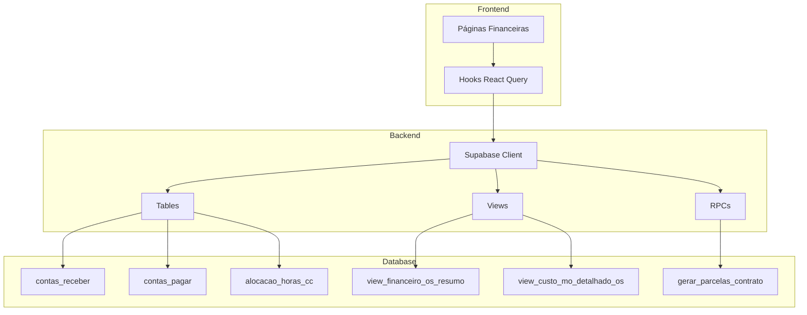

# 📊 Módulo Financeiro - Documentação Técnica Completa

> **Última Atualização:** 2026-01-20  
> **Status:** ✅ Backend Completo | ✅ Frontend Integrado  
> **Supabase Project ID:** `zxfevlkssljndqqhxkjb`

---

## 📋 Índice

1. [Visão Geral](#visão-geral)
2. [Arquitetura](#arquitetura)
3. [Hooks de Data Fetching](#hooks-de-data-fetching)
4. [Páginas do Módulo](#páginas-do-módulo)
5. [Schema de Banco de Dados](#schema-de-banco-de-dados)
6. [Views e Funções SQL](#views-e-funções-sql)
7. [Regras de Negócio](#regras-de-negócio)
8. [Guia de Integração](#guia-de-integração)
9. [Pendências e Roadmap](#pendências-e-roadmap)

---

## Visão Geral

O Módulo Financeiro integra **OS**, **Contratos**, **Presença** e **Centro de Custo** para calcular a lucratividade exata de cada Ordem de Serviço e Cliente.

### Componentes Principais

```
┌─────────────────────────────────────────────────────────────────────┐
│                        MÓDULO FINANCEIRO                            │
├─────────────────────────────────────────────────────────────────────┤
│                                                                     │
│  ┌─────────────┐   ┌─────────────┐   ┌─────────────┐               │
│  │  Dashboard  │   │  Receitas   │   │  Despesas   │               │
│  │  Financeiro │   │ Recorrentes │   │ Recorrentes │               │
│  └─────────────┘   └─────────────┘   └─────────────┘               │
│                                                                     │
│  ┌─────────────┐   ┌─────────────┐   ┌─────────────┐               │
│  │ Fluxo Caixa │   │  Custo MO   │   │ CC Detalhes │               │
│  └─────────────┘   └─────────────┘   └─────────────┘               │
│                                                                     │
│  Integrações: Contratos → Parcelas → Receitas                      │
│               Presença → Alocação → Custo MO                       │
│               Despesas → Centro de Custo → Lucratividade           │
│                                                                     │
└─────────────────────────────────────────────────────────────────────┘
```

---

## Arquitetura

### Fluxo de Dados



---

## Hooks de Data Fetching

### Resumo de Hooks

| Hook | Arquivo | Propósito |
|------|---------|-----------|
| `useFinanceiroDashboard` | `use-financeiro-dashboard.ts` | KPIs agregados do dashboard |
| `useReceitasComparacao` | `use-financeiro-dashboard.ts` | Gráfico receitas previsto vs realizado |
| `useDespesasComparacao` | `use-financeiro-dashboard.ts` | Gráfico despesas previsto vs realizado |
| `useReceitasRecorrentes` | `use-receitas-recorrentes.ts` | Contratos com receitas programadas |
| `useParcelasPendentes` | `use-receitas-recorrentes.ts` | Parcelas em aberto/atrasadas |
| `useReceitasKPIs` | `use-receitas-recorrentes.ts` | KPIs de receitas do mês |
| `useMarcarRecebido` | `use-receitas-recorrentes.ts` | Mutation para baixar parcela |
| `useFaturasRecorrentes` | `use-faturas-recorrentes.ts` | Contas fixas recorrentes |
| `useSalariosPrevistos` | `use-faturas-recorrentes.ts` | Folha de pagamento |
| `useFaturasKPIs` | `use-faturas-recorrentes.ts` | KPIs de despesas do mês |
| `useMarcarPago` | `use-faturas-recorrentes.ts` | Mutation para baixar conta |
| `useFluxoCaixa` | `use-fluxo-caixa.ts` | Projeção diária de fluxo |
| `useFluxoCaixaKPIs` | `use-fluxo-caixa.ts` | KPIs de saldo e projeção |
| `useCalendarioFinanceiro` | `use-fluxo-caixa.ts` | Eventos financeiros 7 dias |
| `useLucratividadeOS` | `use-lucratividade-cc.ts` | Lucratividade por OS |
| `useLucratividadeCC` | `use-lucratividade-cc.ts` | Lucratividade por CC |
| `useLucratividadeCliente` | `use-lucratividade-cc.ts` | Lucratividade por cliente |
| `useLucratividadeKPIs` | `use-lucratividade-cc.ts` | KPIs consolidados |
| `useCustoMODetalhado` | `use-custo-mo.ts` | Custo MO detalhado |
| `useCustoMOPorCC` | `use-custo-mo.ts` | Custo MO agrupado por CC |
| `useCustoMOPorColaborador` | `use-custo-mo.ts` | Custo MO por colaborador |
| `useCustoMOKPIs` | `use-custo-mo.ts` | KPIs de custo de MO |

### Padrão de Uso

```typescript
import { 
  useReceitasRecorrentes, 
  useParcelasPendentes, 
  useReceitasKPIs 
} from '@/lib/hooks/use-receitas-recorrentes';

export function MinhaPage() {
  const { data: receitas, isLoading: receitasLoading } = useReceitasRecorrentes();
  const { data: parcelas, isLoading: parcelasLoading } = useParcelasPendentes();
  const { data: kpis, isLoading: kpisLoading } = useReceitasKPIs();
  
  const isLoading = receitasLoading || parcelasLoading || kpisLoading;
  
  // Fallback para mock se não houver dados
  const dadosReceitas = receitas && receitas.length > 0 ? receitas : mockReceitas;
  
  // ...render
}
```

---

## Páginas do Módulo

### Inventário de Arquivos

| Arquivo | Rota | Status |
|---------|------|--------|
| `financeiro-dashboard-page.tsx` | `/financeiro` | ✅ Integrado |
| `receitas-recorrentes-page.tsx` | `/financeiro/receitas-recorrentes` | ✅ Integrado |
| `faturas-recorrentes-page.tsx` | `/financeiro/faturas-recorrentes` | ✅ Integrado |
| `fluxo-caixa-page.tsx` | `/financeiro/fluxo-caixa` | ✅ Integrado |
| `custo-mao-de-obra-page.tsx` | `/financeiro/custo-mao-de-obra` | ✅ Integrado |
| `centro-custo-detalhes-page.tsx` | `/financeiro/centro-custo/$id` | ✅ Integrado |
| `conciliacao-bancaria-page.tsx` | `/financeiro/conciliacao` | ⏸️ Adiado |

### Rotas (TanStack Router)

```
src/routes/_auth/financeiro/
├── index.tsx              → Dashboard principal
├── receitas-recorrentes.tsx
├── faturas-recorrentes.tsx
├── fluxo-caixa.tsx
├── custo-mao-de-obra.tsx
├── centro-custo/
│   └── $ccId.tsx          → Detalhes do CC
└── conciliacao.tsx
```

---

## Schema de Banco de Dados

### Tabelas Principais

#### `plano_contas`
Estrutura hierárquica de 4 níveis para DRE.

```sql
CREATE TABLE plano_contas (
    id UUID PRIMARY KEY,
    codigo VARCHAR(20) NOT NULL UNIQUE,  -- Ex: "3.1.01.001"
    nome TEXT NOT NULL,
    nivel INTEGER CHECK (nivel BETWEEN 1 AND 4),
    natureza TEXT CHECK (natureza IN ('receita', 'despesa', 'neutro')),
    pai_id UUID REFERENCES plano_contas(id),
    
    -- FLAGS DE AUTOMAÇÃO
    desprezar_lucro BOOLEAN DEFAULT FALSE,
    usar_custo_dia_flutuante BOOLEAN DEFAULT FALSE,
    soma_apenas_painel_geral BOOLEAN DEFAULT FALSE,
    exige_nf BOOLEAN DEFAULT TRUE,
    exige_cc BOOLEAN DEFAULT TRUE
);
```

#### `categorias_financeiras`
Folhas do plano de contas para lançamentos.

```sql
CREATE TABLE categorias_financeiras (
    id UUID PRIMARY KEY,
    plano_conta_id UUID REFERENCES plano_contas(id),
    codigo VARCHAR(30) NOT NULL UNIQUE,
    nome TEXT NOT NULL,
    tipo TEXT CHECK (tipo IN ('pagar', 'receber', 'ambos')),
    setor_padrao_id UUID REFERENCES setores(id)
);
```

#### `contas_receber`
Parcelas de receitas.

| Coluna | Tipo | Descrição |
|--------|------|-----------|
| `id` | UUID | PK |
| `cliente_id` | UUID | FK → clientes |
| `os_id` | UUID | FK → ordens_servico |
| `cc_id` | UUID | FK → centros_custo |
| `contrato_id` | UUID | FK → contratos |
| `categoria_id` | UUID | FK → categorias_financeiras |
| `descricao` | TEXT | Descrição da parcela |
| `vencimento` | DATE | Data de vencimento |
| `valor_previsto` | NUMERIC | Valor esperado |
| `valor_recebido` | NUMERIC | Valor efetivamente recebido |
| `status` | TEXT | em_aberto, recebido, atrasado |
| `parcela_num` | INTEGER | Número da parcela |
| `total_parcelas` | INTEGER | Total de parcelas |

| Coluna | Tipo | Descrição |
|--------|------|-----------|
| `id` | UUID | PK |
| `cc_id` | UUID | FK → centros_custo |
| `categoria_id` | UUID | FK → categorias_financeiras |
| `favorecido_fornecedor` | TEXT | Nome do fornecedor |
| `favorecido_colaborador_id` | UUID | FK → colaboradores (para salários) |
| `descricao` | TEXT | Descrição |
| `vencimento` | DATE | Data de vencimento |
| `valor` | NUMERIC | Valor da conta |
| `status` | TEXT | em_aberto, pago, pendente |
| `recorrente` | BOOLEAN | Se é despesa fixa |
| `recorrencia_frequencia` | TEXT | mensal, trimestral, anual, unica |
| `forma_pagamento` | TEXT | Forma de pagamento |
| `comprovante_url` | TEXT | URL do comprovante |

#### `alocacao_horas_cc`
Rateio de horas por centro de custo.

| Coluna | Tipo | Descrição |
|--------|------|-----------|
| `id` | UUID | PK |
| `registro_presenca_id` | UUID | FK → registros_presenca |
| `cc_id` | UUID | FK → centros_custo |
| `percentual` | NUMERIC | Percentual alocado |
| `valor_calculado` | NUMERIC | Custo calculado |

---

## Views e Funções SQL

### Views Disponíveis

#### `view_financeiro_os_resumo`
Resumo financeiro por OS com lucratividade.

```sql
SELECT * FROM view_financeiro_os_resumo WHERE os_id = 'uuid';
```

**Colunas principais:**
- `receita_prevista`, `receita_realizada`
- `despesa_operacional_total`, `despesa_operacional_paga`
- `custo_mo_total`, `colaboradores_alocados`
- `lucro_bruto_previsto`, `lucro_bruto_realizado`
- `margem_prevista_pct`, `margem_realizada_pct`

#### `view_custo_mo_detalhado_os`
Detalhamento de custo de mão de obra.

```sql
SELECT * FROM view_custo_mo_detalhado_os WHERE cc_id = 'uuid';
```

#### `view_financeiro_cliente_resumo`
Resumo agregado por cliente.

### Funções RPC

#### `gerar_parcelas_contrato(UUID)`
Gera parcelas automaticamente de um contrato.

```typescript
const { data, error } = await supabase
  .rpc('gerar_parcelas_contrato', { p_contrato_id: contratoId });
```

#### `validar_fechamento_centro_custo(UUID)`
Valida se CC pode ser inativado.

```typescript
const { data } = await supabase
  .rpc('validar_fechamento_centro_custo', { p_cc_id: ccId });

if (data?.pode_fechar) {
  // OK para inativar
} else {
  console.log('Pendências:', data?.pendencias);
}
```

---

## Regras de Negócio

### Cálculo de Lucratividade

```
Lucro Bruto = Receita Realizada - (Despesas Pagas + Custo MO)
Margem % = (Lucro Bruto / Receita Realizada) × 100
```

### Custo de Mão de Obra

O custo de MO é calculado a partir de:
1. `colaboradores.custo_dia` - Custo diário do colaborador
2. `registros_presenca` - Presenças registradas
3. `alocacao_horas_cc` - Rateio por centro de custo

```
Custo MO CC = Σ (alocacao_horas_cc.valor_calculado)
```

### Geração de Parcelas

Ao criar contrato, a função `gerar_parcelas_contrato`:
1. Verifica idempotência (não duplica parcelas)
2. Cria entrada se `valor_entrada > 0`
3. Gera N parcelas baseado em `parcelas_total`
4. Calcula vencimentos usando `dia_vencimento`

### Validação de Fechamento CC

Um CC só pode ser inativado se:
- ✅ Todas contas a pagar estão pagas
- ✅ Todas contas a pagar com NF anexada (se exige_nf=TRUE)
- ✅ Todas contas a receber estão recebidas

---

## Guia de Integração

### Adicionar Nova Página Financeira

1. **Criar rota** em `src/routes/_auth/financeiro/`
2. **Criar página** em `src/components/financeiro/`
3. **Importar hooks** necessários
4. **Seguir padrão** de fallback para mock

### Exemplo Completo

```typescript
// src/components/financeiro/minha-pagina.tsx
import { useState } from 'react';
import { PageHeader } from '@/components/shared/page-header';
import { KPICardFinanceiro, KPIFinanceiroGrid } from './kpi-card-financeiro';
import { useReceitasKPIs } from '@/lib/hooks/use-receitas-recorrentes';

// Mock para fallback
const mockKPIs = { total: 0, recebido: 0, pendente: 0 };

export function MinhaPage() {
  const { data: kpis, isLoading } = useReceitasKPIs();
  
  // Fallback para mock
  const dadosKPI = kpis ?? mockKPIs;
  
  return (
    <div className="container mx-auto p-6 space-y-6">
      <PageHeader title="Minha Página" showBackButton />
      
      <KPIFinanceiroGrid columns={3}>
        <KPICardFinanceiro
          title="Total"
          value={dadosKPI.total}
          variant="primary"
          loading={isLoading}
        />
        {/* ... */}
      </KPIFinanceiroGrid>
    </div>
  );
}
```

---

## Pendências e Roadmap

### ✅ Implementado

- [x] Plano de contas hierárquico (4 níveis)
- [x] Categorias financeiras
- [x] Views de lucratividade
- [x] Função de geração de parcelas
- [x] Hooks de data fetching (14 hooks)
- [x] Integração de 6 páginas financeiras
- [x] Design system aplicado
- [x] **CompactTableWrapper** em todas as tabelas financeiras
- [x] **Modal Nova Despesa** com parcelamento e upload de comprovante

### ⏸️ Adiado

- [ ] **Conciliação Bancária** - Requer estrutura de `lancamentos_bancarios`
- [ ] **Importação OFX** - Depende de conciliação

### 📋 Backlog
'
- [ ] Empty states para quando não houver dados
- [ ] Trigger automático de parcelas ao criar contrato
- [ ] Componente `<CategoriaFinanceiraSelect />`
- [ ] Dashboard de lucratividade por cliente
- [ ] Modal Nova Receita (similar ao Nova Despesa)

---

## Relacionamentos (ERD)

```mermaid
erDiagram
    plano_contas ||--o{ categorias_financeiras : "contém"
    plano_contas ||--o{ plano_contas : "pai_id"
    
    categorias_financeiras ||--o{ contas_pagar : "categoria_id"
    categorias_financeiras ||--o{ contas_receber : "categoria_id"
    
    contratos ||--o{ contas_receber : "contrato_id"
    contratos }o--|| clientes : "cliente_id"
    contratos }o--o| ordens_servico : "os_id"
    
    contas_pagar }o--o| centros_custo : "cc_id"
    contas_receber }o--o| centros_custo : "cc_id"
    contas_receber }o--|| clientes : "cliente_id"
    
    centros_custo }o--o| ordens_servico : "os_id"
    alocacao_horas_cc }o--|| centros_custo : "cc_id"
    alocacao_horas_cc }o--|| registros_presenca : "registro_presenca_id"
    registros_presenca }o--|| colaboradores : "colaborador_id"
---

## Modais e Componentes

### Modal Nova Despesa

**Arquivo:** `src/components/financeiro/modals/nova-despesa-modal.tsx`

**Features:**
- Formulário com validação Zod
- Campos: Descrição, Fornecedor, Valor, Categoria, Recorrência
- **Lógica condicional de vencimento:**
  - Recorrência Única → Datepicker completo
  - Recorrência Periódica → Seletor de dia do mês (1-31)
- **Parcelamento** (para despesas únicas): Checkbox + seletor de parcelas (2-48x)
- **Upload de comprovante:** Anexar PDF, JPG, PNG
- Centro de Custo opcional via `<CentroCustoSelector />`

**Uso:**
```tsx
import { NovaDespesaModal } from '@/components/financeiro/modals/nova-despesa-modal';

<NovaDespesaModal 
  open={modalOpen} 
  onOpenChange={setModalOpen}
  onSuccess={() => refetch()}
/>
```

---

**Documento gerado em:** 2026-01-20  
**Mantido por:** Equipe de Desenvolvimento
