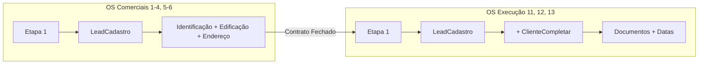

# 📋 Plano de Implementação: Componentes Reutilizáveis de Lead/Cliente

**Data:** 2026-01-08  
**Versão:** v2.1  
**Status:** ⏳ Migração em Andamento (75% Concluído)  
**Prioridade:** 🔴 Alta

---

## 🎯 Resumo Executivo

### ✅ Concluído
- Criados **9 novos componentes** modulares em 2 pastas
- Hook `use-cliente-documentos.ts` atualizado com tipo `ata_eleicao`
- Lógica condicional: Ata de Eleição só para PJ + Condomínio
- Build passa sem erros

### ⏳ Pendente (Migração Gradual)
### ⏳ Pendente (Migração Gradual)
- OS 11 (Laudo Pontual): Substituir `CadastrarLead` por `LeadCadastro`
- OS 12 (Assessoria Anual): Substituir `CadastrarLead` por `LeadCadastro`
- OS 8 (Visita Técnica): Substituir Step 1 (Manual) por `LeadCadastro`
- Refatorar/Remover `cadastrar-lead.tsx` (Legacy)

---

## 🏗 Arquitetura Implementada

```
src/components/os/shared/
├── lead-cadastro/          ← NOVO (6 arquivos)
│   ├── types.ts            → Interfaces TypeScript
│   ├── index.ts            → Exports
│   ├── lead-selector.tsx   → Combobox seleção
│   ├── lead-form-identificacao.tsx
│   ├── lead-form-edificacao.tsx
│   ├── lead-form-endereco.tsx
│   └── lead-cadastro.tsx   → Orquestrador
│
├── cliente-completar/      ← NOVO (3 arquivos)
│   ├── index.ts
│   ├── cliente-documentos-upload.tsx
│   └── cliente-completar.tsx
│
└── steps/
    └── cadastrar-lead.tsx  → EXISTENTE (manter compatibilidade)
```


### Tabela `clientes_documentos` (Já existe!)

```sql
id uuid PK
cliente_id uuid FK NOT NULL
tipo_documento varchar NOT NULL
nome_arquivo varchar NOT NULL
caminho_storage text NOT NULL
mime_type varchar, tamanho_bytes int
uploaded_at timestamptz, uploaded_by uuid
```

### Tabela `clientes` - Campos Faltantes

```sql
-- Campos que precisamos adicionar:
aniversario_gestor date  -- Para lembrete de aniversário
data_contratacao date    -- Data de início do contrato
```

---

## 🏗 Arquitetura Proposta (Dois Níveis)

### Estrutura de Componentes

```
src/components/os/shared/
├── lead-cadastro/                      # NÍVEL 1: Lead (fase comercial)
│   ├── index.ts
│   ├── types.ts
│   ├── lead-cadastro.tsx               # Orquestrador principal
│   ├── lead-selector.tsx               # Combobox de seleção
│   ├── lead-form-identificacao.tsx     # Form: Nome, CPF, Email, Tel
│   ├── lead-form-edificacao.tsx        # Form: Tipo edificação, unidades
│   └── lead-form-endereco.tsx          # Form: CEP, Rua, Cidade
│
├── cliente-completar/                  # NÍVEL 2: Cliente (fase execução)
│   ├── index.ts
│   ├── types.ts
│   ├── cliente-completar.tsx           # Orquestrador principal
│   ├── cliente-documentos-upload.tsx   # Upload de documentos obrigatórios
│   └── cliente-dados-contrato.tsx      # Data contratação, aniversário
│
└── steps/
    └── cadastrar-lead.tsx              # Wrapper (compatibilidade)
```

### Fluxo de Uso



---

## 📝 Mudanças Necessárias

### 1. Alterações no Banco de Dados

```sql
-- 1.1 Adicionar novos tipos de documento
-- (Não precisa de migration, campo é varchar)

-- 1.2 Adicionar campos na tabela clientes
ALTER TABLE public.clientes 
ADD COLUMN IF NOT EXISTS aniversario_gestor date,
ADD COLUMN IF NOT EXISTS data_contratacao date;

-- 1.3 Índice para busca por aniversário (para lembretes)
CREATE INDEX IF NOT EXISTS idx_clientes_aniversario 
ON clientes(aniversario_gestor);
```

### 2. Atualizar `use-cliente-documentos.ts`

```typescript
// Adicionar novo tipo
export type TipoDocumento = 
  | 'contrato_social' 
  | 'comprovante_residencia' 
  | 'documento_foto' 
  | 'logo_cliente'
  | 'ata_eleicao';  // NOVO

export const TIPO_DOCUMENTO_LABELS: Record<TipoDocumento, string> = {
  contrato_social: 'Contrato Social',
  comprovante_residencia: 'Comprovante de Residência',
  documento_foto: 'Documento com Foto',
  logo_cliente: 'Logo do Cliente',
  ata_eleicao: 'Ata de Eleição',  // NOVO
};
```

### 3. Criar Novos Componentes

#### 3.1 `LeadCadastro` (Nível 1)
- Extrair lógica de `cadastrar-lead.tsx` atual
- Componentes focados e pequenos (< 300 linhas cada)
- Ao selecionar lead, edificação e endereço vêm pré-preenchidos

#### 3.2 `ClienteCompletar` (Nível 2)
- Componente para uploads de documentos obrigatórios
- Campos: Data Contratação, Aniversário Gestor
- **Reutiliza** o componente `FileUploadUnificado` existente
- Integra com `use-cliente-documentos.ts`

### 4. Atualizar Componentes de OS

| OS | Etapa 1 | Componentes a Usar |
|----|---------|-------------------|
| OS 1-4 | Identifique o Lead | `LeadCadastro` |
| OS 5-6 | Identifique o Lead | `LeadCadastro` |
| OS 11 | Cadastrar Cliente | `LeadCadastro` + `ClienteCompletar` |
| OS 12 | Cadastro Cliente + Portal | `LeadCadastro` + `ClienteCompletar` |
| OS 13 | Dados do Cliente | `LeadCadastro` + `ClienteCompletar` |

---

## 📁 Arquivos a Criar

### Novos Arquivos

| Arquivo | Descrição | ~Linhas |
|---------|-----------|:-------:|
| `lead-cadastro/index.ts` | Exports | 20 |
| `lead-cadastro/types.ts` | Interfaces TypeScript | 80 |
| `lead-cadastro/lead-cadastro.tsx` | Componente orquestrador | 250 |
| `lead-cadastro/lead-selector.tsx` | Seletor Combobox | 150 |
| `lead-cadastro/lead-form-identificacao.tsx` | Form identificação | 200 |
| `lead-cadastro/lead-form-edificacao.tsx` | Form edificação | 180 |
| `lead-cadastro/lead-form-endereco.tsx` | Form endereço | 150 |
| `cliente-completar/index.ts` | Exports | 10 |
| `cliente-completar/types.ts` | Interfaces | 40 |
| `cliente-completar/cliente-completar.tsx` | Componente principal | 150 |
| `cliente-completar/cliente-documentos-upload.tsx` | Upload documentos | 200 |
| `cliente-completar/cliente-dados-contrato.tsx` | Datas contrato | 120 |

### Arquivos a Modificar

| Arquivo | Modificação |
|---------|-------------|
| `use-cliente-documentos.ts` | Adicionar tipo `ata_eleicao` |
| `cadastrar-lead.tsx` | Refatorar para usar `LeadCadastro` |
| `cadastrar-cliente-obra.tsx` | Refatorar para usar `LeadCadastro` + `ClienteCompletar` |

---

## ✅ Critérios de Aceitação

### Funcionalidades

- [ ] **LeadCadastro**: Ao selecionar lead, edificação e endereço vêm pré-preenchidos
- [ ] **LeadCadastro**: Ao criar lead, salva tudo no campo `endereco` JSONB do cliente
- [ ] **ClienteCompletar**: Upload de 5 tipos de documentos funciona
- [ ] **ClienteCompletar**: Datas de contratação e aniversário são salvas
- [ ] **Compatibilidade**: OS 1-4, 5-6, 11, 12, 13 funcionam com novos componentes
- [ ] **Transição**: Status do cliente muda de `lead` para `ativo` ao fechar contrato

### Design System

- [ ] Usa componentes shadcn/ui
- [ ] Cores do design system (`primary`, `destructive`, `muted`)
- [ ] Responsivo mobile/desktop

### Performance

- [ ] Componentes < 300 linhas cada
- [ ] Carregamento lazy de sub-componentes
- [ ] React Query para cache de dados

---

## 🔄 Plano de Verificação

### Testes Automatizados

1. **Verificar testes existentes**
   ```bash
   npm run test -- --grep clientes
   ```
   - Arquivo: `src/lib/hooks/__tests__/use-clientes.test.ts`

2. **Build deve passar**
   ```bash
   npm run build
   ```
   - Verificar que não há erros de TypeScript

### Testes Manuais

#### Cenário 1: Criar Lead com Edificação (OS 5-6)

1. Navegar para `/os/criar/assessoria-lead`
2. Clicar em "Criar novo cliente"
3. Preencher:
   - Nome: "Condomínio Teste"
   - CNPJ: "00.000.000/0001-00"
   - Email/Telefone válidos
   - Tipo Edificação: "Condomínio Residencial - Apartamentos"
   - Qtd. Unidades: 48, Qtd. Blocos: 2
   - CEP: "01310-100" (deve auto-preencher via ViaCEP)
   - Número: "100"
4. Salvar
5. **Verificar**: Lead criado com dados de edificação no `endereco` JSONB

#### Cenário 2: Selecionar Lead e Ver Dados Preenchidos

1. Na mesma tela, buscar lead criado
2. Selecionar
3. **Verificar**: Campos de Edificação e Endereço preenchidos automaticamente

#### Cenário 3: Completar Cliente (OS-13)

1. Navegar para `/os/criar/start-contrato-obra`
2. Selecionar o lead do cenário 1
3. Preencher Data Contratação e Aniversário Gestor
4. Fazer upload dos documentos obrigatórios:
   - Documento com Foto
   - Comprovante de Residência
   - Contrato Social
5. Avançar
6. **Verificar**: 
   - Documentos salvos em `clientes_documentos`
   - Status do cliente mudou para `ativo`

#### Verificação no Banco

```sql
-- Após Cenário 1 e 2
SELECT id, nome_razao_social, status, 
       endereco->'tipo_edificacao' as tipo,
       endereco->'qtd_unidades' as unidades
FROM clientes 
WHERE nome_razao_social LIKE '%Teste%';

-- Após Cenário 3
SELECT cliente_id, tipo_documento, nome_arquivo 
FROM clientes_documentos 
WHERE cliente_id = '<id-do-cliente>';
```

---

## 🚀 Fases de Implementação

### Fase 1: Preparação do Banco (30 min)

1. Adicionar tipos de documento faltantes no hook
2. Criar migration para campos `aniversario_gestor` e `data_contratacao`

### Fase 2: Criar LeadCadastro (4-5h)

1. Estrutura de pastas e exports
2. Interfaces TypeScript
3. Sub-componentes (identificação, edificação, endereço)
4. Componente orquestrador
5. Integração com hooks existentes

### Fase 3: Criar ClienteCompletar (3-4h)

1. Estrutura e interfaces
2. Componente de upload de documentos
3. Componente de datas do contrato
4. Orquestrador principal

### Fase 4: Refatorar Componentes Existentes (3-4h)

1. `cadastrar-lead.tsx` → usa `LeadCadastro`
2. `cadastrar-cliente-obra.tsx` → usa `LeadCadastro` + `ClienteCompletar`
3. Testar todas as OS afetadas

### Fase 5: Testes e Validação (2h)

1. Executar testes automatizados
2. Executar cenários manuais
3. Verificar dados no banco

---

## ⚠️ Riscos e Mitigações

| Risco | Impacto | Mitigação |
|-------|---------|-----------|
| Quebrar workflows existentes | Alto | Manter wrapper de compatibilidade |
| Dados legados sem edificação | Médio | Tratar null/undefined gracefully |
| Uploads falhando | Médio | Retry automático, feedback ao usuário |

---

## 💡 Sugestão de Arquitetura

```
┌─────────────────────────────────────────────────────────────────┐
│                    ARQUITETURA DE DOIS NÍVEIS                   │
├─────────────────────────────────────────────────────────────────┤
│                                                                 │
│  ┌─────────────────────────────────────────────────────────┐   │
│  │                    OS COMERCIAIS                         │   │
│  │                    (1-4, 5-6)                            │   │
│  │  ┌─────────────────────────────────────────────────┐    │   │
│  │  │              LeadCadastro                        │    │   │
│  │  │  ┌────────────┐ ┌────────────┐ ┌────────────┐   │    │   │
│  │  │  │Identificação│ │ Edificação │ │  Endereço  │   │    │   │
│  │  │  └────────────┘ └────────────┘ └────────────┘   │    │   │
│  │  └─────────────────────────────────────────────────┘    │   │
│  └─────────────────────────────────────────────────────────┘   │
│                                                                 │
│  ┌─────────────────────────────────────────────────────────┐   │
│  │                   OS EXECUÇÃO                            │   │
│  │                   (11, 12, 13)                           │   │
│  │  ┌─────────────────────────────────────────────────┐    │   │
│  │  │              LeadCadastro                        │    │   │
│  │  │             (mesmo acima)                        │    │   │
│  │  └─────────────────────────────────────────────────┘    │   │
│  │                         +                                │   │
│  │  ┌─────────────────────────────────────────────────┐    │   │
│  │  │            ClienteCompletar                      │    │   │
│  │  │  ┌──────────────────┐  ┌──────────────────┐     │    │   │
│  │  │  │  Documentos      │  │  Datas Contrato  │     │    │   │
│  │  │  │  (uploads)       │  │  (aniversário)   │     │    │   │
│  │  │  └──────────────────┘  └──────────────────┘     │    │   │
│  │  └─────────────────────────────────────────────────┘    │   │
│  └─────────────────────────────────────────────────────────┘   │
│                                                                 │
└─────────────────────────────────────────────────────────────────┘
```

---

## 🔄 Guia de Migração

### Estratégia: Migração Gradual

O componente `cadastrar-lead.tsx` (1206 linhas) é usado em **7 arquivos**. Para evitar quebras, a migração será gradual.

### Arquivos que usam `CadastrarLead`

| Arquivo | Prioridade | Complexidade |
|---------|:----------:|:------------:|
| `os-details-workflow-page.tsx` | Alta | Alta |
| `os-details-assessoria-page.tsx` | Alta | Alta |
| `os07-workflow-page.tsx` | Média | Média |
| `os11-workflow-page.tsx` | Média | Média |
| `os12/step-cadastro-cliente-contrato.tsx` | Média | Média |
| `clientes-lista-page.tsx` | Baixa | Baixa |

### Como Usar os Novos Componentes

```tsx
// Importar novos componentes
import { LeadCadastro, type LeadCadastroHandle } from '@/components/os/shared/lead-cadastro';
import { ClienteCompletar, type ClienteCompletarHandle } from '@/components/os/shared/cliente-completar';

// Exemplo de uso
const leadRef = useRef<LeadCadastroHandle>(null);
const clienteRef = useRef<ClienteCompletarHandle>(null);

// LeadCadastro (OS 1-4, 5-6)
<LeadCadastro
  ref={leadRef}
  selectedLeadId={leadId}
  onLeadChange={(id, data) => setLeadId(id)}
  showEdificacao={true}
  showEndereco={true}
/>

// ClienteCompletar (OS 11, 12, 13) - Passar tipoCliente e tipoEmpresa
<ClienteCompletar
  ref={clienteRef}
  clienteId={leadId}
  tipoCliente="juridica"    // 'fisica' | 'juridica'
  tipoEmpresa="condominio"  // Para mostrar Ata de Eleição
  onDocumentosChange={(docs) => setDocumentos(docs)}
/>
```

### Checklist de Migração por Arquivo

- [x] `os-details-workflow-page.tsx` (OS 1-4)
  - Substituir `CadastrarLead` por `LeadCadastro` ✅
  - Adaptar props e callbacks ✅
  
- [x] `os-details-assessoria-page.tsx` (OS 5-6)
  - Substituir `CadastrarLead` por `LeadCadastro` ✅
  - Adaptar props e callbacks ✅

- [ ] `os11-workflow-page.tsx`
  - Adicionar `LeadCadastro` + `ClienteCompletar`
  - Integrar upload de documentos

- [x] `cadastrar-cliente-obra.tsx` (OS-13)
  - Substituir lógica interna por `LeadCadastro` + `ClienteCompletar` ✅

---

## 📚 Referências

- [LEAD_CLIENTE_TECHNICAL_DOCUMENTATION.md](./LEAD_CLIENTE_TECHNICAL_DOCUMENTATION.md)
- [OS_01_04_TECHNICAL_DOCUMENTATION.md](./OS_01_04_TECHNICAL_DOCUMENTATION.md)
- [OS_05_06_TECHNICAL_DOCUMENTATION.md](./OS_05_06_TECHNICAL_DOCUMENTATION.md)
- [OS_10_11_12_13_TECHNICAL_DOCUMENTATION.md](./OS_10_11_12_13_TECHNICAL_DOCUMENTATION.md)

---

**Status:** ⏳ Migração em Andamento (OS 13, 1-4, 5-6 Migrados)  
**Componentes Criados:** 9 arquivos em 2 pastas  
**Build:** ✓ Passa sem erros

