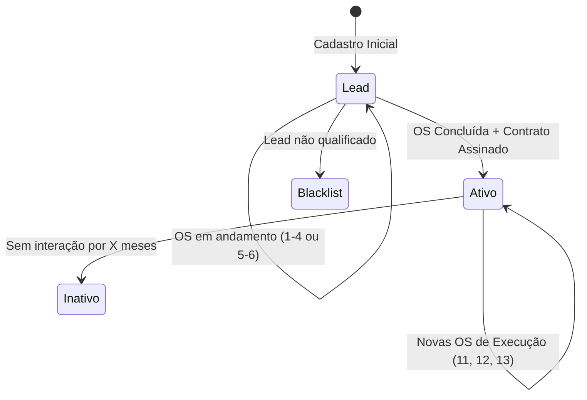
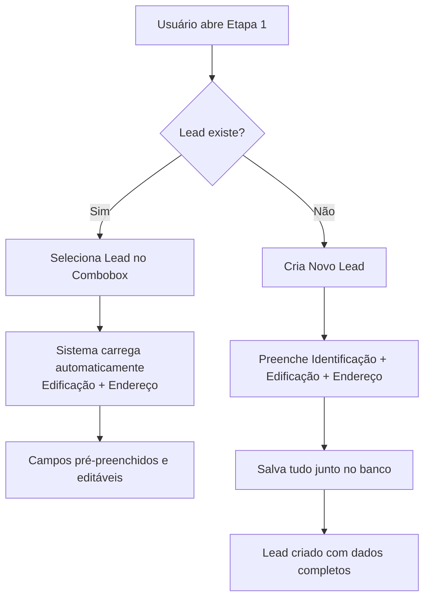

# 📋 Documentação Técnica: Lead/Cliente e Dados de Edificação

**Última Atualização:** 2026-01-08  
**Versão:** v1.0  
**Status:** Implementado (v2.0)  
**Setor:** Cross-Funcional (Administrativo, Obras, Assessoria)

---

## 📌 Visão Geral

Este documento descreve a arquitetura e regras de negócio do **módulo de Lead/Cliente**, incluindo a gestão de **Dados de Edificação** e **Endereço**. Este módulo é fundamental para as OS de Lead (OS 1-4 Obras e OS 5-6 Assessoria), onde a Etapa 1 envolve cadastro ou seleção de um Lead.

### Conceitos-Chave

| Termo | Definição |
|-------|-----------|
| **Lead** | Cliente potencial com status `lead`. Ainda em fase comercial. |
| **Cliente Ativo** | Lead que fechou contrato. Status muda para `ativo` ao concluir OS de Lead. |
| **Edificação** | Imóvel/estrutura associada ao cliente (condomínio, hotel, etc.). |
| **Endereço da Edificação** | Localização física onde o serviço será executado. |

---

## 🔄 Ciclo de Vida do Lead → Cliente



### Enum `cliente_status`

```sql
CREATE TYPE cliente_status AS ENUM ('lead', 'ativo', 'inativo', 'blacklist');
```

| Status | Descrição |
|--------|-----------|
| `lead` | Cliente potencial (default no cadastro) |
| `ativo` | Cliente com contrato ativo |
| `inativo` | Cliente sem interação recente |
| `blacklist` | Cliente desqualificado ou bloqueado |

---

## 🗄 Modelo de Dados Atual

### Tabela `clientes`

```sql
CREATE TABLE public.clientes (
  id uuid PRIMARY KEY DEFAULT gen_random_uuid(),
  nome_razao_social text NOT NULL,
  cpf_cnpj varchar UNIQUE,
  email text,
  telefone varchar,
  status cliente_status NOT NULL DEFAULT 'lead',
  responsavel_id uuid REFERENCES colaboradores(id),
  endereco jsonb,                    -- ⚠️ Armazena Edificação + Endereço
  observacoes text,
  nome_responsavel text,
  tipo_cliente tipo_cliente,         -- 'PESSOA_FISICA' | 'PESSOA_JURIDICA'
  tipo_empresa tipo_empresa,         -- Enum de tipos de empresa
  auth_user_id uuid,                 -- Vinculo com Supabase Auth (Portal)
  portal_convidado_em timestamptz,
  portal_ativo boolean DEFAULT true,
  created_at timestamptz DEFAULT now(),
  updated_at timestamptz DEFAULT now()
);
```

### Estrutura JSONB do Campo `endereco`

Atualmente, o campo `endereco` armazena tanto **dados de endereço** quanto **dados da edificação**:

```typescript
interface EnderecoJsonb {
  // Dados de Endereço
  cep?: string;
  rua?: string;
  numero?: string;
  complemento?: string;
  bairro?: string;
  cidade?: string;
  estado?: string;
  
  // Dados da Edificação (misturados no mesmo JSONB)
  tipo_edificacao?: string;
  qtd_unidades?: string;
  qtd_blocos?: string;
  qtd_pavimentos?: string;
  tipo_telhado?: string;
  possui_elevador?: boolean;
  possui_piscina?: boolean;
  cargo_responsavel?: string;
}
```

> [!WARNING]
> **Problema Atual**: Dados de Edificação e Endereço estão misturados no campo `endereco`. Isso dificulta:
> - Reutilização dos dados ao selecionar um lead
> - Queries específicas por tipo de edificação
> - Separação clara de responsabilidades

---

## 🏗 Componente Legado: `cadastrar-lead.tsx`

### Localização

```
src/components/os/shared/steps/cadastrar-lead.tsx (1206 linhas)
```

### Uso Compartilhado (Estado Atual)

| OS | Etapa | Status Migração |
|----|:-----:|-----------------|
| OS 1-4 (Obras) | 1 | ✅ `LeadCadastro` |
| OS 5-6 (Assessoria) | 1 | ✅ `LeadCadastro` |
| OS 11 | 1 | ⏳ `cadastrar-lead.tsx` |
| OS 13 | 1 | ✅ `LeadCadastro` + `ClienteCompletar` |

### Interface FormDataCompleto (Legado)

```typescript
export interface FormDataCompleto {
  // Identificação do Cliente
  nome: string;
  cpfCnpj: string;
  tipo: 'fisica' | 'juridica';
  tipoEmpresa?: string;
  nomeResponsavel: string;
  cargoResponsavel: string;
  telefone: string;
  email: string;
  
  // Dados da Edificação
  tipoEdificacao: string;
  qtdUnidades: string;
  qtdBlocos: string;
  qtdPavimentos: string;
  tipoTelhado: string;
  possuiElevador: boolean;
  possuiPiscina: boolean;
  
  // Endereço da Edificação
  cep: string;
  endereco: string;
  numero: string;
  complemento: string;
  bairro: string;
  cidade: string;
  estado: string;
}
```

### Comportamento Atual

1. **Buscar Lead**: Combobox com busca por nome, CPF ou CNPJ
2. **Criar Lead**: Modal para cadastrar apenas dados de identificação
3. **Preencher Edificação**: Após selecionar/criar lead, formulário de edificação aparece
4. **Dados Vêm do `endereco` JSONB**: Ao selecionar lead existente, tenta carregar dados de `lead.endereco.*`

### Problema Identificado

Quando um lead é selecionado, os dados de edificação e endereço **devem vir pré-preenchidos**, mas atualmente:
- Se o lead foi criado sem edificação, os campos ficam vazios
- Não há garantia de persistência dos dados de edificação no cliente
- Cada OS repete o preenchimento desses dados

---

## 🚀 Nova Arquitetura: Componentes Modulares

Implementamos uma arquitetura de dois níveis para substituir o monólito `cadastrar-lead.tsx`.

### 1. `LeadCadastro` (Nível 1 - Comercial)

Responsável apenas pela identificação e dados da edificação/endereço. Usado nas fases comerciais.

- **Local:** `src/components/os/shared/lead-cadastro/`
- **Componentes:**
  - `lead-cadastro.tsx`: Orquestrador
  - `lead-selector.tsx`: Combobox de seleção
  - `lead-form-*.tsx`: Formulários segmentados
- **Uso:** OS 1-4, OS 5-6

### 2. `ClienteCompletar` (Nível 2 - Execução/Contrato)

Responsável pelos dados de fechamento de contrato e uploads.

- **Local:** `src/components/os/shared/cliente-completar/`
- **Uso:** OS-13 (Start de Contrato), OS-11, OS-12
- **Funcionalidades:**
  - Data de Contratação e Aniversário do Gestor
  - Upload de Documentos Obrigatórios (RG, Comprovante, Contrato Social)
  - Condicional: Ata de Eleição apenas para PJ Condomínio

---

## 🎯 Requisito de Mudança

### Regra de Negócio Proposta

> **Dados de Edificação e Endereço devem ser cadastrados junto com o Lead e vir pré-preenchidos ao selecionar.**

### Fluxo Desejado



---

## 📊 OS que Utilizam Lead/Cliente

### OS de Lead (Ciclo Comercial)

| OS | Nome | Etapa 1 | Criação de OS | Conversão |
|----|------|---------|---------------|-----------|
| **OS 1-4** | Obras | Identifique o Lead | Etapa 2 → 3 | → OS-13 (Cliente Ativo) |
| **OS 5-6** | Assessoria Lead | Identifique o Lead | Etapa 1 → 2 | → OS-11/12 (Cliente Ativo) |

### OS de Execução (Pós-Venda)

| OS | Nome | Etapa 1 | Pré-Requisito |
|----|------|---------|---------------|
| **OS 11** | Laudo Pontual | Cadastrar Cliente | Gerada via OS-06 |
| **OS 12** | Assessoria Anual | Cadastro Cliente + Portal | Gerada via OS-05 |
| **OS 13** | Start Contrato Obra | Dados do Cliente | Gerada via OS 1-4 |

### Conversão Lead → Cliente Ativo

```typescript
// Ao concluir OS de Lead (1-4 ou 5-6)
await supabase
  .from('clientes')
  .update({ status: 'ativo' })
  .eq('id', clienteId);
```

---

## 🔧 Hooks Relacionados

### `use-clientes.tsx`

Hook principal para CRUD de clientes.

```typescript
// Buscar leads
const { clientes: leads, loading } = useClientes('LEAD');

// Criar cliente
const { mutate: createCliente } = useCreateCliente();

// Atualizar cliente
const { mutate: updateCliente } = useUpdateCliente();
```

### `use-cliente-historico.ts`

Hook para histórico consolidado do cliente.

### `use-cliente-documentos.ts`

Hook para gestão de documentos do cliente.

### `use-cliente-contratos.ts`

Hook para contratos específicos do cliente.

---

## 🎨 Opções de Tipo de Edificação

```typescript
const TIPOS_EDIFICACAO = [
  'Condomínio Comercial',
  'Condomínio Residencial - Casas',
  'Condomínio Residencial - Apartamentos',
  'Hotel',
  'Shopping',
  'Hospital',
  'Indústria',
  'Igreja',
  'Outro'
];
```

### Campos Condicionais

| Tipo de Edificação | Campos Adicionais |
|--------------------|-------------------|
| Condomínio Comercial | Qtd. Unidades |
| Condomínio Residencial - Casas | Qtd. Unidades |
| Condomínio Residencial - Apartamentos | Qtd. Unidades + Qtd. Blocos |
| Outros | Apenas campos padrão |

---

## 🎨 Opções de Tipo de Telhado

```typescript
const TIPOS_TELHADO = [
  'Laje impermeabilizada',
  'Telhado cerâmico',
  'Telhado fibrocimento',
  'Telhado metálico',
  'Não se aplica',
  'Outros'
];
```

---

## ✅ Validações Atuais

### Campos de Identificação (Obrigatórios)

- `nome`: Mínimo 3 caracteres
- `cpfCnpj`: CPF (11 dígitos) ou CNPJ (14 dígitos) válido
- `telefone`: Formato brasileiro válido
- `email`: Formato de email válido

### Campos de Edificação (Obrigatórios)

- `tipoEdificacao`: Seleção obrigatória
- `cep`: CEP válido (8 dígitos)
- `endereco`: Rua/Logradouro
- `numero`: Número do imóvel
- `bairro`: Bairro
- `cidade`: Cidade
- `estado`: UF

### Campos de Edificação (Condicionais)

- `qtdUnidades`: Obrigatório para Condomínios
- `qtdBlocos`: Obrigatório para Condomínio Residencial - Apartamentos

---

## 🧪 Testes Existentes

- `src/lib/hooks/__tests__/use-clientes.test.ts`

---

## 📚 Referências

- [TODAS_OS_E_ETAPAS.md](../sistema/TODAS_OS_E_ETAPAS.md)
- [OS_01_04_TECHNICAL_DOCUMENTATION.md](./OS_01_04_TECHNICAL_DOCUMENTATION.md)
- [OS_05_06_TECHNICAL_DOCUMENTATION.md](./OS_05_06_TECHNICAL_DOCUMENTATION.md)
- [CLIENTE_HISTORICO_COMPLETO_COMPONENT.md](./CLIENTE_HISTORICO_COMPLETO_COMPONENT.md)
- [CENTRO_CUSTO_PER_OS_IMPLEMENTATION.md](./CENTRO_CUSTO_PER_OS_IMPLEMENTATION.md)

---

**Autor:** Sistema Minerva ERP  
**Próximo Passo:** Ver `LEAD_CADASTRO_IMPLEMENTATION_PLAN.md` para plano de implementação
