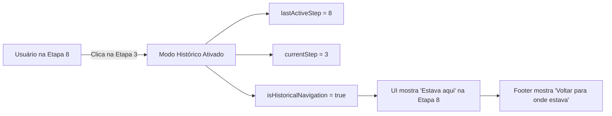
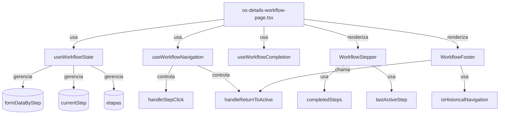
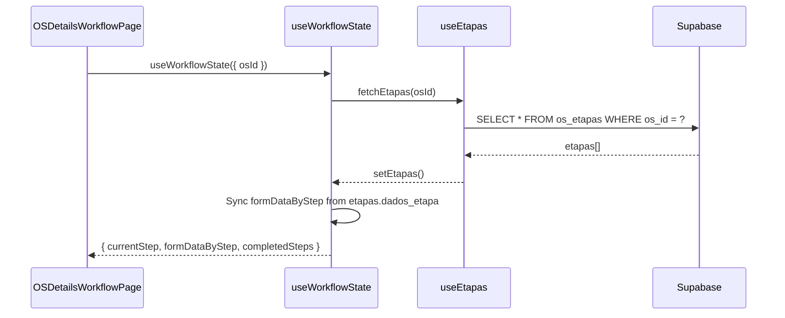
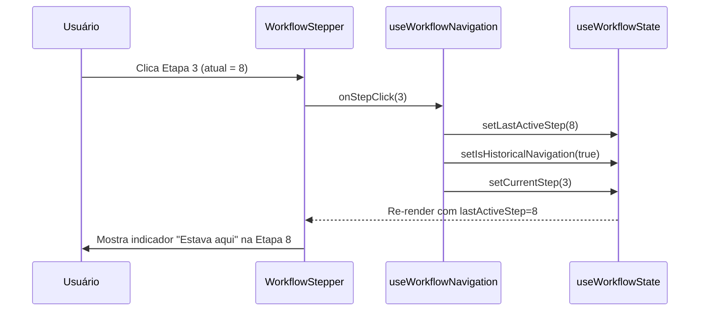
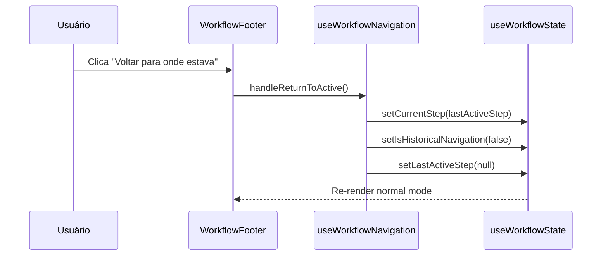

# 📚 Documentação Técnica: Navegação de Histórico no Workflow

> **Versão:** 1.0  
> **Última Atualização:** 2026-01-09  
> **Status:** Implementado em OS 1-4 | Pendente em demais OS

---

## 1. Visão Geral

O sistema de **Navegação de Histórico** permite que usuários visualizem etapas **já preenchidas** ou **ainda pendentes** dentro de um workflow de OS. Esta funcionalidade opera em conjunto com o **Stepper Visual** e permite revisão de dados sem perda de contexto.

### 1.1 Comportamento Esperado



### 1.2 Estados do Sistema

| Estado | Tipo | Descrição |
|--------|------|-----------|
| `currentStep` | `number` | Etapa atualmente visível na tela |
| `lastActiveStep` | `number \| null` | Posição de onde o usuário saiu (etapa ativa real) |
| `isHistoricalNavigation` | `boolean` | Indica se está em modo de visualização histórica |
| `completedSteps` | `number[]` | Array de IDs de etapas concluídas |

---

## 2. Arquitetura de Componentes

### 2.1 Hierarquia de Arquivos

```
src/
├── lib/hooks/
│   ├── use-workflow-state.ts         # 📦 Estado central do workflow
│   ├── use-workflow-navigation.ts    # 🧭 Lógica de navegação
│   └── use-workflow-completion.ts    # ✅ Regras de completude
│
├── components/os/shared/
│   ├── pages/
│   │   └── os-details-workflow-page.tsx  # 🎯 Página principal OS 1-4
│   └── components/
│       ├── workflow-stepper.tsx          # 📊 Stepper visual
│       └── workflow-footer.tsx           # 🦶 Footer com navegação
```

### 2.2 Diagrama de Dependências



---

## 3. Hooks de Navegação

### 3.1 `useWorkflowState`

**Arquivo:** `src/lib/hooks/use-workflow-state.ts`

Este hook é o **núcleo do sistema**, responsável por gerenciar todo o estado do workflow.

#### Estados Gerenciados

```typescript
export function useWorkflowState({ osId, totalSteps, initialStep = 1 }: WorkflowStateOptions) {
  // === NAVEGAÇÃO ===
  const [currentStep, setCurrentStep] = useState(initialStep);
  const [lastActiveStep, setLastActiveStep] = useState<number | null>(null);
  const [isHistoricalNavigation, setIsHistoricalNavigation] = useState(false);

  // === DADOS ===
  const [formDataByStep, setFormDataByStep] = useState<Record<number, any>>({});

  // === INTEGRAÇÃO COM BANCO ===
  const { etapas, saveFormData, fetchEtapas } = useEtapas();
  
  // ...
}
```

#### Lógica de Sincronização com Banco

```typescript
// Sync loaded steps into local state
useEffect(() => {
  if (etapas && etapas.length > 0) {
    setFormDataByStep(prev => {
      const next = { ...prev };
      etapas.forEach((etapa) => {
        // ESTRATÉGIA: Dados do servidor têm prioridade
        if (etapa.dados_etapa && Object.keys(etapa.dados_etapa).length > 0) {
          next[etapa.ordem] = etapa.dados_etapa;
        }
      });
      return next;
    });
  }
}, [etapas]);
```

#### Retorno do Hook

```typescript
return {
  // Estado
  currentStep, setCurrentStep,
  lastActiveStep, setLastActiveStep,
  isHistoricalNavigation, setIsHistoricalNavigation,
  formDataByStep,
  
  // Derivados
  completedSteps,
  etapas,
  
  // Ações
  getStepData,
  setStepData,
  saveStep,
  refreshEtapas
};
```

### 3.2 `useWorkflowNavigation`

**Arquivo:** `src/lib/hooks/use-workflow-navigation.ts`

Hook especializado na lógica de navegação entre etapas.

#### Interface de Configuração

```typescript
export interface WorkflowNavigationOptions {
  totalSteps: number;
  currentStep: number;
  setCurrentStep: (step: number) => void;
  lastActiveStep: number | null;
  setLastActiveStep: (step: number | null) => void;
  isHistoricalNavigation: boolean;
  setIsHistoricalNavigation: (isHistorical: boolean) => void;
  onSaveStep?: (step: number) => Promise<boolean>;
}
```

#### Funções Principais

##### `handleStepClick` - Navegação via Stepper

```typescript
const handleStepClick = (stepId: number) => {
  // Permitir: etapas concluídas, etapa atual, ou qualquer anterior à atual
  if (stepId <= currentStep || (lastActiveStep && stepId <= lastActiveStep)) {
    
    // Navegando para etapa anterior? Ativar modo histórico
    if (stepId < currentStep && !isHistoricalNavigation) {
      setLastActiveStep(currentStep);       // Salvar posição atual
      setIsHistoricalNavigation(true);      // Ativar modo
      toast.info('Modo de visualização histórica', { icon: '👁️' });
    }

    // Retornando para a posição original?
    if (lastActiveStep && stepId === lastActiveStep) {
      setIsHistoricalNavigation(false);     // Desativar modo
      setLastActiveStep(null);              // Limpar marcador
      toast.success('Voltou para onde estava!', { icon: '🎯' });
    }

    setCurrentStep(stepId);
  } else {
    toast.warning('Complete as etapas anteriores primeiro', { icon: '🔒' });
  }
};
```

##### `handleReturnToActive` - Voltar para Posição Ativa

```typescript
const handleReturnToActive = () => {
  if (lastActiveStep) {
    setCurrentStep(lastActiveStep);
    setIsHistoricalNavigation(false);
    setLastActiveStep(null);
    toast.success('Voltou para onde estava!', { icon: '🎯' });
  }
};
```

---

## 4. Componentes Visuais

### 4.1 `WorkflowStepper`

**Arquivo:** `src/components/os/shared/components/workflow-stepper.tsx`

Componente visual que exibe o progresso do workflow e permite navegação.

#### Props

```typescript
export interface WorkflowStepperProps {
  steps: WorkflowStep[];              // Definição das etapas
  currentStep: number;                // Etapa atual
  onStepClick?: (stepId: number) => void;  // Callback de navegação
  completedSteps: number[];           // Etapas concluídas
  lastActiveStep?: number;            // Marcador "Estava aqui"
}
```

#### Lógica de Acessibilidade

```typescript
// Determinar se etapa é acessível (clicável)
const isCompleted = completedSteps.includes(step.id);
const isCurrent = step.id === currentStep;
const isLastActive = lastActiveStep === step.id && currentStep !== step.id;
const isAccessible = isCompleted || isCurrent || step.id < currentStep;
```

#### Estados Visuais

| Estado | Background | Ícone | Descrição |
|--------|------------|-------|-----------|
| `completed` | `bg-success/10` | ✓ Check verde | Etapa finalizada |
| `current` | `bg-primary/20` | ● Círculo azul | Etapa ativa |
| `lastActive` | `bg-warning` | ← Seta + pulse | "Estava aqui" |
| `locked` | `bg-muted` | 🔒 Cadeado | Não acessível |

#### Indicador "Estava Aqui"

```tsx
{isLastActive && (
  <span className="absolute -bottom-4 left-1/2 -translate-x-1/2 
                   text-[7px] text-warning font-semibold whitespace-nowrap">
    Estava aqui
  </span>
)}
```

### 4.2 `WorkflowFooter`

**Arquivo:** `src/components/os/shared/components/workflow-footer.tsx`

Footer com botões de navegação que se adapta ao modo histórico.

#### Props Relevantes

```typescript
interface WorkflowFooterProps {
  readOnlyMode?: boolean;              // Modo histórico ativo?
  onReturnToActive?: () => void;       // Callback para voltar
  onPrevStep: () => void;
  onNextStep: () => void;
}
```

#### Comportamento em Modo Histórico

Quando `readOnlyMode === true`:
- Botão "Próxima Etapa" é substituído por "Voltar para onde estava"
- Botão "Salvar Rascunho" é ocultado
- Campos de formulário ficam em modo leitura (`readOnly={true}`)

---

## 5. Fluxo de Dados

### 5.1 Carregamento Inicial



### 5.2 Navegação para Etapa Anterior



### 5.3 Retorno para Posição Ativa



---

## 6. Integração em Página de Workflow

### 6.1 Setup Mínimo

```tsx
// Em qualquer página de workflow (OS-05, OS-08, etc.)

import { useWorkflowState } from '@/lib/hooks/use-workflow-state';
import { useWorkflowNavigation } from '@/lib/hooks/use-workflow-navigation';
import { useWorkflowCompletion } from '@/lib/hooks/use-workflow-completion';
import { WorkflowStepper } from '@/components/os/shared/components/workflow-stepper';
import { WorkflowFooter } from '@/components/os/shared/components/workflow-footer';

export function OSXXWorkflowPage({ osId }) {
  // 1. Hook de Estado Central
  const {
    currentStep,
    setCurrentStep,
    lastActiveStep,
    setLastActiveStep,
    isHistoricalNavigation,
    setIsHistoricalNavigation,
    formDataByStep,
    setStepData,
    saveStep,
    completedSteps: completedStepsFromHook,
    etapas
  } = useWorkflowState({
    osId,
    totalSteps: TOTAL_STEPS,  // Ex: 6 para OS-11
    initialStep: 1
  });

  // 2. Hook de Navegação
  const {
    handleStepClick,
    handleReturnToActive,
    handlePrevStep
  } = useWorkflowNavigation({
    totalSteps: TOTAL_STEPS,
    currentStep,
    setCurrentStep,
    lastActiveStep,
    setLastActiveStep,
    isHistoricalNavigation,
    setIsHistoricalNavigation,
    onSaveStep: async (step) => {
      if (osId) return await saveStep(step, false);
      return true;
    }
  });

  // 3. Regras de Completude
  const completionRules = {
    1: (data) => !!data.leadId,
    2: (data) => !!data.tipoSolicitacao,
    // ... regras por etapa
  };

  const { completedSteps } = useWorkflowCompletion({
    currentStep,
    formDataByStep,
    completionRules,
    completedStepsFromHook
  });

  // 4. Modo Leitura (histórico ou OS concluída)
  const isReadOnly = isHistoricalNavigation || os?.status === 'concluida';

  return (
    <div>
      {/* Stepper */}
      <WorkflowStepper
        steps={OS_XX_STEPS}
        currentStep={currentStep}
        onStepClick={handleStepClick}
        completedSteps={completedSteps}
        lastActiveStep={lastActiveStep}
      />

      {/* Conteúdo da Etapa */}
      <div>
        {currentStep === 1 && (
          <StepXXX
            data={formDataByStep[1]}
            onDataChange={(data) => setStepData(1, data)}
            readOnly={isReadOnly}
          />
        )}
        {/* ... outras etapas */}
      </div>

      {/* Footer */}
      <WorkflowFooter
        currentStep={currentStep}
        totalSteps={TOTAL_STEPS}
        onPrevStep={handlePrevStep}
        onNextStep={handleNextStep}
        readOnlyMode={isHistoricalNavigation}
        onReturnToActive={handleReturnToActive}
      />
    </div>
  );
}
```

---

## 7. Checklist de Implementação

### Para Adicionar Navegação de Histórico a uma Nova OS:

- [ ] **Hook `useWorkflowState`**: Importar e configurar com `osId` e `totalSteps`
- [ ] **Hook `useWorkflowNavigation`**: Importar e conectar com estados
- [ ] **Componente `WorkflowStepper`**: 
  - [ ] Passar `completedSteps`
  - [ ] Passar `lastActiveStep`
  - [ ] Conectar `onStepClick` com `handleStepClick`
- [ ] **Componente `WorkflowFooter`**:
  - [ ] Passar `readOnlyMode={isHistoricalNavigation}`
  - [ ] Conectar `onReturnToActive` com `handleReturnToActive`
- [ ] **Componentes de Etapa**:
  - [ ] Adicionar prop `readOnly` em todos
  - [ ] Desabilitar inputs quando `readOnly={true}`
- [ ] **Lógica de Completude**:
  - [ ] Definir `completionRules` customizadas
  - [ ] Usar `useWorkflowCompletion` para derivar `completedSteps`

---

## 8. Comparativo de Implementação por OS

| OS | Navegação Histórico | Hooks Utilizados | Status |
|----|---------------------|------------------|--------|
| **OS 1-4** | ✅ Completo | `useWorkflowState` + `useWorkflowNavigation` | Implementado |
| **OS 5-6** | ⚠️ Parcial | Hooks legados | Pendente migração |
| **OS 7** | ❌ Não implementado | - | Pendente |
| **OS 8** | ⚠️ Parcial | `useWorkflowState` básico | Pendente completar |
| **OS 9** | ⚠️ Parcial | - | Pendente |
| **OS 10** | ⚠️ Parcial | - | Pendente |
| **OS 11** | ⚠️ Parcial | - | Pendente |
| **OS 12** | ⚠️ Parcial | - | Pendente |
| **OS 13** | ⚠️ Parcial | - | Pendente |

---

## 9. Referências

- [OS_01_04_TECHNICAL_DOCUMENTATION.md](./OS_01_04_TECHNICAL_DOCUMENTATION.md) - Documentação completa OS 1-4
- [OS_DETAILS_PAGE.md](./OS_DETAILS_PAGE.md) - Página de detalhes da OS
- [TODAS_OS_E_ETAPAS.md](../sistema/TODAS_OS_E_ETAPAS.md) - Visão geral de todas as OS

---

## 10. Changelog

| Versão | Data | Alterações |
|--------|------|------------|
| 1.0 | 2026-01-09 | Documentação inicial baseada em análise do código OS 1-4 |
