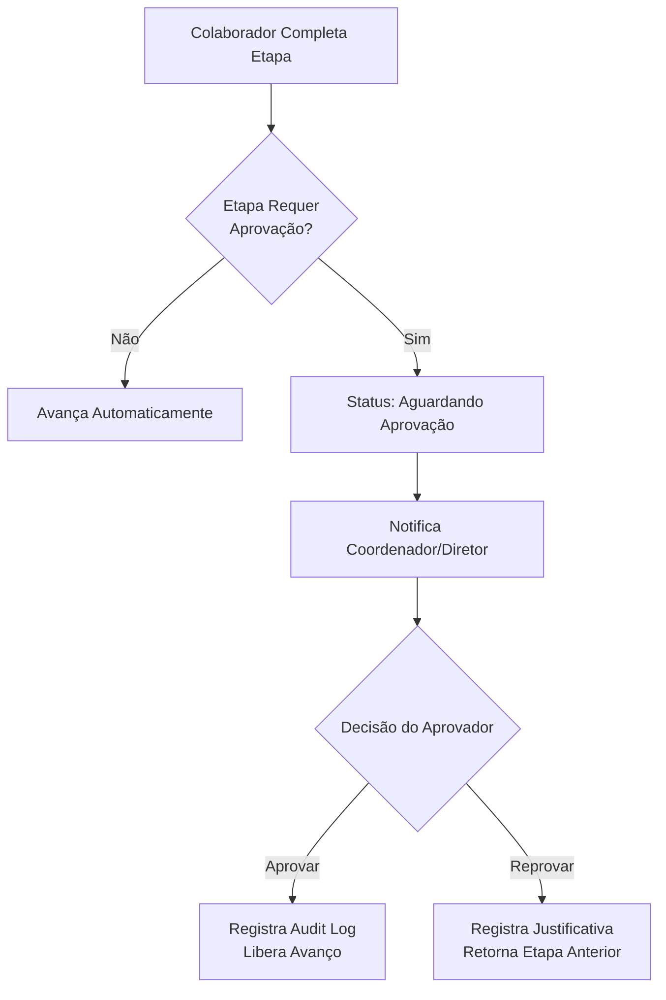

# 📋 Documentação Técnica: OS-01 a OS-04 - Obras

**Última Atualização:** 2026-01-08  
**Versão:** v2.9  
**Status Implementação:** 95% ✅  
**Setor:** Obras

---

## 📌 Visão Geral

As **Ordens de Serviço OS-01 a OS-04** representam o fluxo comercial completo para serviços de **Obras** no sistema Minerva ERP. Estas quatro OS compartilham o mesmo workflow de 15 etapas, diferindo apenas no tipo específico de serviço.

### Tipos de OS Compartilhando o Workflow

| Código | Nome | Descrição |
|--------|------|-----------|
| **OS-01** | Perícia de Fachada | Inspeção técnica e laudo de fachadas |
| **OS-02** | Revitalização de Fachada | Projeto de revitalização e restauração |
| **OS-03** | Reforço Estrutural | Reforço estrutural de edificações |
| **OS-04** | Outros | Outros serviços de obras não categorizados |

---

## 🏗 Arquitetura do Sistema

### 🗂 Estrutura de Arquivos

```
src/
├── components/os/shared/
│   ├── pages/
│   │   └── os-details-workflow-page.tsx     # Componente principal (1997 linhas)
│   ├── components/
│   │   ├── workflow-stepper.tsx             # Stepper visual de progresso
│   │   ├── workflow-footer.tsx              # Botões de navegação e ações
│   │   ├── feedback-transferencia.tsx       # Modal de feedback pós-transferência
│   │   └── aprovacao-modal.tsx              # Modal de aprovação hierárquica
│   └── steps/
│       ├── cadastrar-lead.tsx               # Etapa 1: Cadastro de Lead
│       ├── step-followup-1.tsx              # Etapa 3: Entrevista Inicial
│       ├── step-agendar-apresentacao.tsx    # Etapas 4 e 10: Agendamentos
│       ├── step-preparar-orcamentos.tsx     # Etapa 6: Follow-up Pós-Visita
│       ├── step-memorial-escopo.tsx         # Etapa 7: Memorial (com formatação moeda)
│       ├── step-precificacao.tsx            # Etapa 8: Precificação
│       ├── step-gerar-proposta.tsx          # Etapa 9: Proposta Comercial
│       ├── step-realizar-apresentacao.tsx   # Etapa 11: Apresentação
│       ├── step-analise-relatorio.tsx       # Etapa 12: Follow-up 3
│       ├── step-gerar-contrato.tsx          # Etapa 13: Contrato
│       └── step-contrato-assinado.tsx       # Etapa 14: Assinatura
│ 
├── constants/
│   └── os-workflow.ts                        # Definição das 15 etapas
│
├── lib/
│   ├── hooks/
│   │   ├── use-workflow-state.ts            # Estado do workflow
│   │   ├── use-workflow-navigation.ts       # Navegação entre etapas
│   │   ├── use-workflow-completion.ts       # Validação de completude
│   │   ├── use-transferencia-setor.ts       # Handoffs automáticos (266 linhas)
│   │   ├── use-aprovacao-etapa.ts           # Sistema de aprovação (217 linhas)
│   │   └── use-notificar-coordenador.ts     # Notificações automáticas
│   └── constants/
│       └── os-ownership-rules.ts            # Regras de responsabilidade (506 linhas)
│
└── routes/_auth/os/
    └── details-workflow/$id.tsx             # Rota TanStack Router
```

---

## 🔄 Fluxo de 15 Etapas

### 📊 Tabela Completa de Etapas

| # | Etapa | Responsável | Prazo | Setor | Aprovação Obrigatória |
|:-:|-------|-------------|:-----:|-------|:---------------------:|
| **1** | Identifique o Lead | Administrativo | 1 dia | Administrativo | ❌ |
| **2** | Seleção do Tipo de OS | Administrativo | 1 dia | Administrativo | ❌ |
| **3** | Follow-up 1 (Entrevista Inicial) | Administrativo | 4 dias | Administrativo | ❌ |
| **4** | Agendar Visita Técnica | Administrativo | 3 dias | Administrativo | ❌ |
| **5** | Realizar Visita | Obras | 4 dias | Obras | ❌ |
| **6** | Follow-up 2 (Pós-Visita) | Obras | 2 dias | Obras | ❌ |
| **7** | Memorial (Escopo) | Obras | 1 dia | Obras | ❌ |
| **8** | Precificação | Obras | 1 dia | Obras | ❌ |
| **9** | Gerar Proposta Comercial | Obras | 1 dia | Obras | ✅ |
| **10** | Agendar Apresentação | Administrativo | 1 dia | Administrativo | ❌ |
| **11** | Realizar Apresentação | Administrativo | 1 dia | Administrativo | ❌ |
| **12** | Follow-up 3 (Pós-Apresentação) | Administrativo | 1 dia | Administrativo | ❌ |
| **13** | Gerar Contrato (Upload) | Administrativo | 1 dia | Administrativo | ✅ |
| **14** | Contrato Assinado | Administrativo | 1 dia | Administrativo | ❌ |
| **15** | Iniciar Contrato de Obra | Sistema | -- | Sistema | ❌ |

> **Prazo Total:** 24 dias úteis (sem contar os prazos de aprovação)

---

## 🔀 Handoffs Automáticos (Transferências de Setor)

### Conceito

O sistema detecta mudanças de responsabilidade entre setores e executa **transferências automáticas**, notificando os coordenadores e registrando o histórico.

### Pontos de Handoff Definidos

#### 1️⃣ Etapa 4 → 5: Administrativo → Obras

```typescript
{
  fromStep: 4,  // Agendar Visita Técnica
  toStep: 5,    // Realizar Visita
  toCargo: 'coord_obras',
  toSetor: 'obras',
  description: 'Transferir para Coordenação de Obras para realizar visita técnica'
}
```

**Ações Executadas:**
1. Atualiza `ordens_servico.setor_atual_id` → Obras
2. Atualiza `ordens_servico.responsavel_id` → Coordenador de Obras
3. Cria registro em `os_transferencias`
4. Registra na timeline (`os_atividades`) com tipo `'transferencia_setor'`
5. Notifica Coordenador de Obras

#### 2️⃣ Etapa 9 (Solicitação de Aprovação): Obras → Administrativo
```typescript
{
  fromStep: 9,  // Gerar Proposta Comercial
  toStep: 9,    // Mesma etapa (Aprovação)
  toCargo: 'coord_administrativo',
  toSetor: 'administrativo',
  description: 'Transferir para Coordenação Administrativa para aprovação da proposta'
}
```

**Ações Executadas (ao solicitar aprovação):**
1. Atualiza `ordens_servico.setor_atual_id` → Administrativo
2. Atualiza `ordens_servico.responsavel_id` → Coordenador Administrativo
3. Cria registro em `os_transferencias`
4. Status da etapa muda para `aguardando_aprovacao`

#### 3️⃣ Etapa 9 (Aprovação Confirmada): Administrativo → Administrativo (Avanço)
```typescript
{
  fromStep: 9,
  toStep: 10,   // Agendar Apresentação
  toCargo: 'coord_administrativo',
  toSetor: 'administrativo',
  description: 'Proposta aprovada - Transferir para Coordenação Administrativa'
}
```

#### 4️⃣ Rejeição da Proposta: Administrativo → Obras
```typescript
{
  fromStep: 9,
  toStep: 7,    // Retorno para Memorial
  toCargo: 'coord_obras',
  toSetor: 'obras',
  description: 'Retornar para Obras para revisão do memorial após rejeição'
}
```
**Ações Executadas:**
1. Atualiza `ordens_servico.setor_atual_id` → Obras
2. Reseta status das etapas 7, 8 e 9 para `em_andamento`
3. Retorna fluxo para Etapa 7

### Implementação

**Hook: `use-transferencia-setor.ts`**

```typescript
export function useTransferenciaSetor() {
  const executarTransferencia = async ({
    osId,
    osType,
    codigoOS,
    clienteNome,
    etapaAtual,
    proximaEtapa,
    nomeProximaEtapa
  }: ExecutarTransferenciaParams): Promise<TransferenciaResult> => {
    // 1. Verificar mudança de setor
    const { houveTransferencia, handoff } = verificarMudancaSetor(osType, etapaAtual, proximaEtapa);
    
    // 2. Buscar IDs dos setores e coordenador
    const [setorOrigemId, setorDestinoId] = await Promise.all([...]);
    const coordenador = await buscarCoordenador(setorDestinoSlug);
    
    // 3. Registrar transferência
    await supabase.from('os_transferencias').insert({...});
    
    // 4. Atualizar OS
    await supabase.from('ordens_servico').update({
      setor_atual_id: setorDestinoId,
      etapa_atual_ordem: proximaEtapa,
      responsavel_id: coordenador?.id
    });
    
    // 5. Registrar na timeline
    await supabase.from('os_atividades').insert({
      tipo: 'transferencia_setor',
      descricao: `Transferido para setor ${SETOR_NOMES[setorDestinoSlug]}`,
      metadados: { etapa_origem, etapa_destino, ... }
    });
    
    // 6. Notificar coordenador
    await notificarCoordenador(payload);
  };
}
```

---

## ✅ Sistema de Aprovação Hierárquica

### Etapas com Aprovação Obrigatória

| Etapa | Nome | Aprovador | Fluxo de Rejeição |
|:-----:|------|-----------|-------------------|
| **9** | Gerar Proposta Comercial | Coord. Administrativo | Retorna à Etapa 7 (Memorial). Dados preservados. |
| **13** | Gerar Contrato (Upload) | Diretor | Mantém etapa. |

### Fluxo de Aprovação



### Implementação

**Hook: `use-aprovacao-etapa.ts`**

```typescript
export function useAprovacaoEtapa(osId: string, etapaOrdem: number) {
  // Verificar status de aprovação
  const verificarAprovacao = async () => {
    const { data } = await supabase.rpc('verificar_aprovacao_etapa', {
      p_os_id: osId,
      p_etapa_ordem: etapaOrdem
    });
    // Retorna: requer_aprovacao, status_aprovacao, solicitante, aprovador, etc.
  };

  // Confirmar aprovação (apenas coordenadores/diretores)
  const confirmarAprovacao = async () => {
    const { data } = await supabase.rpc('confirmar_aprovacao', {
      p_os_id: osId,
      p_etapa_ordem: etapaOrdem
    });
    // Avança etapa e registra no audit_log
  };

  // Rejeitar aprovação
  const rejeitarAprovacao = async (motivo: string) => {
    const { data } = await supabase.rpc('rejeitar_aprovacao', {
      p_os_id: osId,
      p_etapa_ordem: etapaOrdem,
      p_motivo: motivo
    });
    // Retorna para etapa anterior e notifica solicitante
  };
}
```

**Cargos Aprovadores:**
```typescript
const CARGOS_APROVADORES = [
  'admin',
  'diretor',
  'coord_obras',
  'coord_assessoria',
  'coord_administrativo'
];
```

**RPC Functions (Database):**
- `verificar_aprovacao_etapa(p_os_id, p_etapa_ordem)` → Retorna status atual
- `solicitar_aprovacao(p_os_id, p_etapa_ordem, p_justificativa)` → Registra solicitação
- `confirmar_aprovacao(p_os_id, p_etapa_ordem)` → Aprova e avança
- `rejeitar_aprovacao(p_os_id, p_etapa_ordem, p_motivo)` → Rejeita e retorna

---

## 🗄 Modelo de Dados

### Tabelas Principais

#### `ordens_servico`

```sql
CREATE TABLE ordens_servico (
  id uuid PRIMARY KEY,
  codigo_os text UNIQUE, -- Gerado via trigger (ex: OS-01-0042)
  tipo_os_id uuid REFERENCES tipos_os,
  cliente_id uuid REFERENCES clientes,
  responsavel_id uuid REFERENCES colaboradores,
  criado_por_id uuid REFERENCES colaboradores,
  status_geral text, -- 'rascunho', 'em_andamento', 'concluida', 'cancelada'
  data_prazo date,
  parent_os_id uuid REFERENCES ordens_servico,
  
  -- v2.7: Controle de transferência
  setor_atual_id uuid REFERENCES setores,
  setor_solicitante_id uuid REFERENCES setores,
  etapa_atual_ordem integer,
  
  created_at timestamptz DEFAULT now(),
  updated_at timestamptz DEFAULT now()
);
```

#### `os_etapas`

```sql
CREATE TABLE os_etapas (
  id uuid PRIMARY KEY,
  os_id uuid REFERENCES ordens_servico,
  ordem integer, -- Número da etapa (1-15)
  nome text,
  status text, -- 'pendente', 'em_andamento', 'concluida', 'bloqueada'
  responsavel_id uuid REFERENCES colaboradores,
  data_prazo date,
  dados_etapa jsonb, -- Dados do formulário salvos
  created_at timestamptz DEFAULT now()
);
```

#### `os_transferencias` (v2.7)

```sql
CREATE TABLE os_transferencias (
  id uuid PRIMARY KEY,
  os_id uuid REFERENCES ordens_servico,
  etapa_origem integer,
  etapa_destino integer,
  setor_origem_id uuid REFERENCES setores,
  setor_destino_id uuid REFERENCES setores,
  transferido_por_id uuid REFERENCES colaboradores,
  coordenador_notificado_id uuid REFERENCES colaboradores,
  transferido_em timestamptz DEFAULT now(),
  motivo text, -- 'avanço_etapa', 'reversão', etc.
  metadados jsonb -- { osType, codigoOS, clienteNome, nomeProximaEtapa }
);
```

#### `os_atividades` (Audit Log - v2.7)

```sql
CREATE TABLE os_atividades (
  id uuid PRIMARY KEY,
  os_id uuid REFERENCES ordens_servico NOT NULL,
  etapa_id uuid REFERENCES os_etapas,
  usuario_id uuid REFERENCES colaboradores NOT NULL,
  tipo varchar, -- 'transferencia_setor', 'comentario', 'status_change', 'aprovacao', 'reprovacao'
  descricao text NOT NULL,
  dados_antigos jsonb,
  dados_novos jsonb,
  metadados jsonb DEFAULT '{}',
  criado_em timestamptz DEFAULT now()
);
```

#### `os_etapas_config` (Configuração de Prazos)

```sql
CREATE TABLE os_etapas_config (
  id uuid PRIMARY KEY,
  tipo_os_id uuid REFERENCES tipos_os,
  ordem integer,
  nome text,
  descricao text,
  prazo_dias_uteis integer, -- Default de SLA
  requer_aprovacao boolean DEFAULT false,
  cargo_aprovador_slug text, -- 'coord_obras', 'diretor', etc.
  created_at timestamptz DEFAULT now()
);
```

### Relacionamentos

```
ordens_servico (1) ──< (N) os_etapas
ordens_servico (1) ──< (N) os_transferencias
ordens_servico (1) ──< (N) os_atividades
os_etapas (1) ──< (N) os_atividades
```

---

## 💾 Estrutura de Dados por Etapa

### Etapa 1: Identifique o Lead

```typescript
interface Etapa1Data {
  leadId?: string; // ID do cliente/lead selecionado
  nome?: string;
  cpfCnpj?: string;
  email?: string;
  telefone?: string;
  tipo?: 'fisica' | 'juridica';
  nomeResponsavel?: string;
  cargoResponsavel?: string;
  // Dados da edificação
  tipoEdificacao?: string;
  qtdUnidades?: string;
  qtdBlocos?: string;
  qtdPavimentos?: string;
  tipoTelhado?: string;
  possuiElevador?: boolean;
  possuiPiscina?: boolean;
  // Endereço
  cep?: string;
  endereco?: string;
  numero?: string;
  complemento?: string;
  bairro?: string;
  cidade?: string;
  estado?: string;
}
```

**Regra de Completude:** `leadId` deve estar preenchido.

**Componente:** `cadastrar-lead.tsx`

**Comportamento:**
- Se `osId` está definido (editando): carrega dados do cliente vinculado
- Se não: mostra Combobox de busca ou opção de criar novo lead
- Ao criar novo lead: insere em `clientes` e retorna `leadId`

---

### Etapa 2: Seleção do Tipo de OS

```typescript
interface Etapa2Data {
  tipoOS?: string; // 'OS 01: Perícia de Fachada', 'OS 02: ...', etc.
}
```

**Regra de Completude:** `tipoOS` deve estar preenchido.

**Componente:** Select interno (renderizado no `os-details-workflow-page.tsx`)

**Mapeamento de Tipos:**
```typescript
const OS_TYPE_CODE_MAP = {
  'OS 01: Perícia de Fachada': 'OS-01',
  'OS 02: Revitalização de Fachada': 'OS-02',
  'OS 03: Reforço Estrutural': 'OS-03',
  'OS 04: Outros': 'OS-04',
};
```

**Comportamento Especial:**
- Ao avançar de Etapa 2 → 3, o sistema **cria a OS** no banco:
  ```typescript
  const osData = {
    tipo_os_nome: mapearTipoOSParaCodigo(etapa2Data.tipoOS),
    cliente_id: etapa1Data.leadId,
    criado_por_id: currentUser.id,
    setor_atual_id: SETOR_SLUG_TO_ID['administrativo'],
    setor_solicitante_id: SETOR_SLUG_TO_ID['administrativo'],
    etapa_atual_ordem: 3
  };
  const response = await ordensServicoAPI.create(osData);
  setInternalOsId(response.ordens_servico.id);
  ```

---

### Etapa 3: Follow-up 1 (Entrevista Inicial)

```typescript
interface Etapa3Data {
  anexos?: ArquivoComComentario[];
  idadeEdificacao?: string;
  motivoProcura?: string;
  quandoAconteceu?: string;
  oqueFeitoARespeito?: string;
  existeEscopo?: string;
  previsaoOrcamentaria?: string;
  grauUrgencia?: string;
  apresentacaoProposta?: string;
  nomeContatoLocal?: string;
  telefoneContatoLocal?: string;
  cargoContatoLocal?: string;
}
```

**Componente:** `step-followup-1.tsx`

**Funcionalidades:**
- Upload de múltiplos arquivos com comentário individual
- Formulário de entrevista comercial
- Salvamento de rascunho habilitado (`DRAFT_ENABLED_STEPS`)

---

### Etapa 4: Agendar Visita Técnica

```typescript
interface Etapa4Data {
  dataAgendamento?: string; // ISO 8601 datetime
}
```

**Componente:** `step-agendar-apresentacao.tsx` (reutilizado)

**Integração:**
- Cria registro na tabela `agendamentos`
- Define `responsavel_id` (executor) e `criado_por` (agendador)
- Categoria: `'Vistoria Técnica'`

---

### Etapa 5: Realizar Visita

```typescript
interface Etapa5Data {
  visitaRealizada?: boolean;
}
```

**Componente:** Switch + Checkbox (renderizado internamente)

**Comportamento:**
- Simples confirmação de realização
- Pode ser expandido para incluir checklist

---

### Etapa 6: Follow-up 2 (Pós-Visita)

```typescript
interface Etapa6Data {
  outrasEmpresas?: string;
  comoEsperaResolver?: string;
  expectativaCliente?: string;
  estadoAncoragem?: string;
  fotosAncoragem?: ArquivoComComentario[];
  quemAcompanhou?: string;
  avaliacaoVisita?: string;
  estadoGeralEdificacao?: string;
  servicoResolver?: string;
  arquivosGerais?: ArquivoComComentario[];
}
```

**Componente:** `step-preparar-orcamentos.tsx`

**Funcionalidades:**
- Upload de fotos técnicas (ancoragem, geral)
- Avaliação qualitativa da visita
- Salvamento de rascunho habilitado

---

### Etapa 7: Memorial (Escopo)

```typescript
interface Subetapa {
  nome: string;
  descricao: string;
  total: string; // Valor numérico
}

interface EtapaPrincipal {
  nome: string;
  subetapas: Subetapa[];
}

interface Etapa7Data {
  objetivo?: string;
  etapasPrincipais?: EtapaPrincipal[];
  planejamentoInicial?: string;
  logisticaTransporte?: string;
  preparacaoArea?: string;
}
```

**Componente:** `step-memorial-escopo.tsx`

**Funcionalidades:**
- Construção do memorial descritivo técnico
- Gestão de etapas e subetapas da obra
- Cálculo automático de totais por etapa
- Salvamento de rascunho habilitado

---

### Etapa 8: Precificação

```typescript
interface Etapa8Data {
  percentualImprevisto?: string;
  percentualLucro?: string;
  percentualImposto?: string;
  percentualEntrada?: string;
  numeroParcelas?: string;
  etapasPrincipais?: EtapaPrincipal[]; // Herdado da Etapa 7
}
```

**Componente:** `step-precificacao.tsx`

**Funcionalidades:**
- Define margens financeiras (imprevisto, lucro, imposto)
- Define condições comerciais (entrada, parcelas)
- Calcula valores automaticamente:
  ```typescript
  const valorMaterialMaoObra = etapas.reduce((sum, etapa) => 
    sum + etapa.subetapas.reduce((s, sub) => s + parseFloat(sub.total || '0'), 0), 0
  );
  const valorImprevisto = valorMaterialMaoObra * (imprevisto / 100);
  const valorLucro = (valorMaterialMaoObra + valorImprevisto) * (lucro / 100);
  const valorComImposto = (valorMaterialMaoObra + valorImprevisto + valorLucro) * (1 + imposto / 100);
  const valorEntrada = valorComImposto * (entrada / 100);
  const valorParcela = (valorComImposto - valorEntrada) / numeroParcelas;
  ```

- Salvamento de rascunho habilitado

---

### Etapa 9: Gerar Proposta Comercial ✅🔒

```typescript
interface Etapa9Data {
  propostaGerada: boolean;
  dataGeracao: string;
  codigoProposta: string;
  validadeDias: string;
  garantiaMeses: string;
  pdfUrl?: string;
}
```

**Componente:** `step-gerar-proposta-os01-04.tsx`

**Fluxo de Geração de PDF (Client-Side v2.0):**
1. Exibe resumo financeiro calculado (herdado de Etapa 7 e 8)
2. Usuário preenche "Validade da Proposta" e "Garantia (meses)"
3. Botão **"Gerar Proposta Comercial"**
4. Hook `usePDFGeneration` gera PDF no **frontend** usando `@react-pdf/renderer`
5. PDF é enviado para **Supabase Storage** (bucket `uploads`)
6. Sistema gera **URL assinada** (válida por 1 hora) para visualização/download
7. Registro criado em `os_documentos` com tipo `'proposta'`

**Template de PDF:** `proposta-template.tsx` (`src/lib/pdf/templates/`)

**Dados enviados para o template:**
```typescript
{
  // Cliente
  clienteCpfCnpj, clienteNome, clienteEmail, clienteTelefone,
  clienteEndereco, clienteBairro, clienteCidade, clienteEstado,
  quantidadeUnidades, quantidadeBlocos,
  
  // Financeiros
  dadosFinanceiros: { precoFinal, numeroParcelas, percentualEntrada, percentualImposto },
  
  // Cronograma (Etapa 7)
  dadosCronograma: { etapasPrincipais, preparacaoArea, planejamentoInicial, logisticaTransporte },
  
  // Garantias
  garantias: ['12 meses para serviços estruturais', ...]
}
```

**⚠️ Aprovação Obrigatória:**
- **Aprovador:** Coordenador de Obras
- **Função RPC:** `verificar_aprovacao_etapa`, `confirmar_aprovacao`
- Após aprovação, libera botão "Avançar"
- Sem aprovação, botão fica **desabilitado**

---

### Etapa 10: Agendar Apresentação

```typescript
interface Etapa10Data {
  dataAgendamento?: string; // ISO 8601 datetime
}
```

**Componente:** `step-agendar-apresentacao.tsx` (reutilizado)

**Integração:**
- Similar à Etapa 4
- Categoria: `'Apresentação Comercial'`

---

### Etapa 11: Realizar Apresentação

```typescript
interface Etapa11Data {
  [key: string]: unknown;
}
```

**Componente:** `step-realizar-apresentacao.tsx`

**Comportamento:**
- Confirmação de realização
- Pode incluir checklist ou protocolo de apresentação

---

### Etapa 12: Follow-up 3 (Pós-Apresentação)

```typescript
interface Etapa12Data {
  propostaApresentada?: string;
  metodoApresentacao?: string;
  clienteAchouProposta?: string;
  clienteAchouContrato?: string;
  doresNaoAtendidas?: string;
  indicadorFechamento?: string;
  quemEstavaNaApresentacao?: string;
  nivelSatisfacao?: string;
}
```

**Componente:** `step-analise-relatorio.tsx`

**Funcionalidades:**
- Análise qualitativa da apresentação
- Avaliação de indicadores de fechamento
- Identificação de objeções

---

### Etapa 13: Gerar Contrato (Upload) ✅🔒

```typescript
interface Etapa13Data {
  [key: string]: unknown; // Dados do contrato
}
```

**Componente:** `step-gerar-contrato.tsx`

**Fluxo:**
1. Upload manual do contrato assinado (PDF) ou Geração Automática
2. Arquivo é salvo no bucket `os-documents`
3. Frontend persiste `contratoPath` em `dados_etapa`
4. URL assinada é gerada dinamicamente para visualização
5. Registra metadados em `os_documentos` com `tipo_documento = 'CONTRATO'`

**⚠️ Aprovação Obrigatória:**
- **Aprovador:** Diretor
- **Função RPC:** `verificar_aprovacao_etapa`, `confirmar_aprovacao`
- Aprovação final antes de concluir venda

---

### Etapa 14: Contrato Assinado

```typescript
interface Etapa14Data {
  [key: string]: unknown;
}
```

**Componente:** `step-contrato-assinado.tsx` (Usa `EtapaCheck`)

**Fluxo:**
- Exibe alerta informativo se não confirmado
- Checkbox de confirmação "Contrato foi assinado"
- Ao confirmar, exibe Card de sucesso com data e opção de desfazer
- Última etapa antes de iniciar execução de obra

---

### Etapa 15: Iniciar Contrato de Obra

### Etapa 15: Iniciar Contrato de Obra

**Tipo:** Semi-automática (Requer Confirmação)

**Componente:** `etapa-start-contrato.tsx`

**Comportamento:**
- Exibe resumo da conclusão comercial
- Botão "Iniciar Contrato de Obra" (Ação explícita)
- Ao clicar, sistema executa em batch:
  1. Cria **OS-13** (Start de Contrato de Obra) vinculada
  2. Atualiza status da OS atual para 'concluida'
  3. Atualiza status do cliente para 'ativo'
  4. Redireciona para a nova OS-13

**Código (aproximado):**
```typescript
// Componente EtapaStartContrato
const handleStart = async () => {
    // 1. Criar OS-13
    const os13 = await createOS13(osId, clienteId);
    
    // 2. Concluir OS Atual e Atualizar Cliente
    await concluirOS(osId);
    
    // 3. Redirecionar
    router.push(`/os/criar/start-contrato-obra?id=${os13.id}`);
};
```

---

## 🎯 Hooks Customizados

### `use-workflow-state.ts`

**Responsabilidade:** Gerencia o estado global do workflow

**Principais Funções:**
```typescript
const {
  currentStep,              // Etapa atual (1-15)
  setCurrentStep,
  lastActiveStep,           // Última etapa ativa (limite de navegação)
  setLastActiveStep,
  isHistoricalNavigation,   // Flag: navegando no histórico?
  setIsHistoricalNavigation,
  formDataByStep,           // { 1: {...}, 2: {...}, ... }
  setStepData,              // Função para atualizar dados de uma etapa
  saveStep,                 // Salvar etapa no banco
  saveFormData,             // Salvar dados_etapa sem avançar
  createEtapa,              // Criar registro de etapa
  completedSteps,           // Array de etapas concluídas (do banco)
  isLoading,
  etapas,                   // Array de os_etapas (do banco)
  refreshEtapas             // Recarregar etapas do banco
} = useWorkflowState({ osId, totalSteps: 15, initialStep: 1 });
```

**Funcionalidades:**
- Carrega dados de `os_etapas` via `ordens_servico/${osId}/etapas`
- Popula `formDataByStep` com `dados_etapa` de cada etapa
- Auto-salva dados ao trocar de etapa (se `osId` existe)
- Detecta se navegação é histórica (voltando) vs. progresso normal

---

### `use-workflow-navigation.ts`

**Responsabilidade:** Gerencia navegação entre etapas

**Principais Funções:**
```typescript
const {
  handleStepClick,       // Navegar clicando no stepper
  handleReturnToActive,  // Voltar para lastActiveStep
  handlePrevStep         // Voltar uma etapa
} = useWorkflowNavigation({
  totalSteps: 15,
  currentStep,
  setCurrentStep,
  lastActiveStep,
  setLastActiveStep,
  isHistoricalNavigation,
  setIsHistoricalNavigation,
  onSaveStep: async (step) => { /* callback de save */ }
});
```

**Regras de Navegação:**
- Pode navegar para trás (histórico) sem restrições
- Não pode pular etapas não concluídas
- Clicking no stepper marca como navegação histórica

---

### `use-workflow-completion.ts`

**Responsabilidade:** Valida completude de etapas

**Principais Funções:**
```typescript
const completionRules = {
  1: (data: Etapa1Data) => !!data.leadId,
  2: (data: Etapa2Data) => !!data.tipoOS,
  // ... demais regras
};

const { completedSteps } = useWorkflowCompletion({
  currentStep,
  formDataByStep,
  completionRules,
  completedStepsFromHook // Fallback para dados do banco
});
```

**Regras de Completude (Frontend):**
- Etapa 1: `leadId` deve existir
- Etapa 2: `tipoOS` deve existir
- Demais etapas: validadas pelo backend (status = 'concluida')

---

### `use-transferencia-setor.ts`

**Responsabilidade:** Detectar e executar handoffs automáticos

**Arquivo:** `src/lib/hooks/use-transferencia-setor.ts` (266 linhas)

**Principais Funções:**
```typescript
const {
  verificarMudancaSetor,
  executarTransferencia,
  isProcessing,
  error
} = useTransferenciaSetor();

// Uso:
const result = await executarTransferencia({
  osId,
  osType: 'OS-01',
  codigoOS: 'OS-01-0042',
  clienteNome: 'Condomínio Exemplo',
  etapaAtual: 4,
  proximaEtapa: 5,
  nomeProximaEtapa: 'Realizar Visita'
});

if (result.success && result.transferencia) {
  // Handoff executado
  setIsTransferenciaModalOpen(true);
  setTransferenciaInfo(result.transferencia);
}
```

**Fluxo Interno:**
1. `verificarMudancaSetor(osType, etapaAtual, proximaEtapa)`
   - Busca em `OS_OWNERSHIP_RULES[osType].handoffPoints`
   - Retorna `{ houveTransferencia: boolean, handoff: HandoffPoint }`

2. Se `houveTransferencia = true`:
   - Busca IDs dos setores origem e destino
   - Busca coordenador do setor destino
   - Insere em `os_transferencias`
   - Atualiza `ordens_servico` (setor_atual_id, responsavel_id, etapa_atual_ordem)
   - Registra em `os_atividades` (tipo: 'transferencia_setor')
   - Notifica coordenador via `use-notificar-coordenador.ts`

3. Exibe modal de feedback: `FeedbackTransferencia`

**Dependências:**
- `use-notificar-coordenador.ts`
- `os-ownership-rules.ts` (constantes de ownership)

---

### `use-aprovacao-etapa.ts`

**Responsabilidade:** Gerenciar aprovação de etapas

**Arquivo:** `src/lib/hooks/use-aprovacao-etapa.ts` (217 linhas)

**Principais Funções:**
```typescript
const {
  aprovacaoInfo,        // { requerAprovacao, statusAprovacao, solicitante, aprovador, ... }
  isLoading,
  isProcessing,
  recarregar,
  solicitarAprovacao,   // Função para solicitar aprovação
  confirmarAprovacao,   // Função para aprovar (só coordenadores/diretores)
  rejeitarAprovacao,    // Função para rejeitar
  podeAprovar           // Boolean: usuário pode aprovar?
} = useAprovacaoEtapa(osId, etapaOrdem);
```

**Fluxo de Uso:**
```typescript
// Etapa 9 (Proposta) - Colaborador solicita aprovação
if (aprovacaoInfo?.requerAprovacao && aprovacaoInfo.statusAprovacao === 'pendente') {
  await solicitarAprovacao('Proposta finalizada');
}

// Coordenador de Obras aprova
if (podeAprovar && aprovacaoInfo?.statusAprovacao === 'solicitada') {
  await confirmarAprovacao();
  // ou
  await rejeitarAprovacao('Valores incorretos, revisar precificação');
}
```

**RPC Functions:**
- `verificar_aprovacao_etapa(p_os_id, p_etapa_ordem)`
  - Retorna: `requer_aprovacao`, `status_aprovacao`, `solicitante_id`, `solicitante_nome`, `aprovador_id`, `aprovador_nome`, `solicitado_em`, `aprovado_em`, `motivo_rejeicao`
  
- `solicitar_aprovacao(p_os_id, p_etapa_ordem, p_justificativa)`
  - Cria log de aprovação solicitada
  - Notifica aprovador
  
- `confirmar_aprovacao(p_os_id, p_etapa_ordem)`
  - Marca etapa como aprovada
  - Avança para próxima etapa automaticamente
  - Registra em `audit_log`
  
- `rejeitar_aprovacao(p_os_id, p_etapa_ordem, p_motivo)`
  - Registra motivo da rejeição
  - Notifica solicitante
  - Retorna para etapa anterior

**Cargos Aprovadores:**
```typescript
const CARGOS_APROVADORES = [
  'admin',
  'diretor',
  'coord_obras',
  'coord_assessoria',
  'coord_administrativo'
];
```

---

## 🔐 Ownership Rules (Regras de Responsabilidade)

**Arquivo:** `src/lib/constants/os-ownership-rules.ts` (506 linhas)

### OS-01 a OS-04 Rule

```typescript
const OS_OBRAS_RULE: OSOwnershipRule = {
  osType: 'OS-01-04',
  osName: 'Obras (Perícia, Revitalização, Reforço, Outros)',
  initiator: 'coord_administrativo',
  totalSteps: 15,
  stageOwners: [
    { range: [1, 4], cargo: 'coord_administrativo', setor: 'administrativo' },
    { range: [5, 8], cargo: 'coord_obras', setor: 'obras' },
    { range: [9, 15], cargo: 'coord_administrativo', setor: 'administrativo' },
  ],
  handoffPoints: [
    {
      fromStep: 4,
      toStep: 5,
      toCargo: 'coord_obras',
      toSetor: 'obras',
      description: 'Transferir para Coordenação de Obras para realizar visita técnica',
    },
    {
      fromStep: 8,
      toStep: 9,
      toCargo: 'coord_administrativo',
      toSetor: 'administrativo',
      autoReturn: true,
      description: 'Retornar para Coordenação Administrativa para gerar proposta',
    },
  ],
};
```

### Funções Utilitárias

```typescript
// Obter cargo dono de uma etapa
getStepOwner('OS-01', 5); 
// → { cargo: 'coord_obras', setor: 'obras' }

// Verificar se há handoff entre etapas
getHandoffPoint('OS-01', 4, 5); 
// → { fromStep: 4, toStep: 5, toCargo: 'coord_obras', toSetor: 'obras', ... }

// Verificar se delegação é necessária
checkDelegationRequired('OS-01', 4, 5, 'coord_administrativo'); 
// → HandoffPoint (precisa delegar para coord_obras)

checkDelegationRequired('OS-01', 4, 5, 'coord_obras'); 
// → null (já é do cargo de destino, não precisa delegar)
```

---

## 📦 Componentes Auxiliares

### `workflow-stepper.tsx`

**Responsabilidade:** Exibe stepper visual de progresso

**Props:**
```typescript
interface WorkflowStepperProps {
  steps: WorkflowStep[];
  currentStep: number;
  completedSteps: number[];
  onStepClick: (step: number) => void;
}
```

**UI:**
- Círculo verde: etapa concluída
- Círculo azul: etapa atual
- Círculo cinza: etapa pendente
- Clickável: navega para etapa (se permitido)

---

### `workflow-footer.tsx`

**Responsabilidade:** Botões de navegação e ações

**Props:**
```typescript
interface WorkflowFooterProps {
  currentStep: number;
  totalSteps: number;
  isHistoricalNavigation: boolean;
  canAdvance: boolean; // Bloqueado se aprovação pendente
  onPrevious: () => void;
  onNext: () => void;
  onReturnToActive: () => void;
  onSaveDraft?: () => void;
  isSaving: boolean;
}
```

**Botões:**
- "Voltar": Sempre habilitado (se não estiver na Etapa 1)
- "Salvar Rascunho": Apenas em etapas permitidas (`DRAFT_ENABLED_STEPS`)
- "Avançar": Bloqueado se:
  - Navegação histórica ativa
  - Etapa requer aprovação e não está aprovada
  - Validação de dados falha

---

### `feedback-transferencia.tsx`

**Responsabilidade:** Modal de feedback pós-transferência

**Props:**
```typescript
interface FeedbackTransferenciaProps {
  isOpen: boolean;
  onClose: () => void;
  transferencia: TransferenciaInfo;
}
```

**UI:**
```
┌─────────────────────────────────────┐
│   Transferência Realizada com       │
│            Sucesso! ✅               │
├─────────────────────────────────────┤
│                                     │
│  Setor Origem: Administrativo       │
│  Setor Destino: Obras               │
│  Próxima Etapa: 5. Realizar Visita  │
│  Coordenador Notificado:            │
│  João Silva                         │
│                                     │
│        [OK, Entendi]                │
└─────────────────────────────────────┘
```

---

### `aprovacao-modal.tsx`

**Responsabilidade:** Modal de aprovação/reprovação

**Props:**
```typescript
interface AprovacaoModalProps {
  isOpen: boolean;
  onClose: () => void;
  etapaNome: string;
  aprovacaoInfo: AprovacaoInfo;
  podeAprovar: boolean;
  onAprovar: () => Promise<void>;
  onRejeitar: (motivo: string) => Promise<void>;
}
```

**UI (Colaborador):**
```
┌─────────────────────────────────────┐
│  Etapa 9: Gerar Proposta Comercial │
├─────────────────────────────────────┤
│  Status: Aguardando Aprovação       │
│  Solicitado em: 04/01/2026 10:30    │
│  Aprovador: Coord. Obras            │
│                                     │
│  Aguardando revisão...              │
└─────────────────────────────────────┘
```

**UI (Coordenador Aprovador):**
```
┌─────────────────────────────────────┐
│  Etapa 9: Gerar Proposta Comercial  │
├─────────────────────────────────────┤
│  Solicitante: Maria Santos          │
│  Solicitado em: 04/01/2026 10:30    │
│                                     │
│  [✅ Aprovar]  [❌ Rejeitar]        │
│                                     │
│  Motivo da Rejeição (se aplicável): │
│  ┌─────────────────────────────┐   │
│  │                             │   │
│  └─────────────────────────────┘   │
└─────────────────────────────────────┘
```

---

## 🌐 Rotas

### TanStack Router

**Rota Principal:**
```
/os/details-workflow/:osId
```

**Arquivo:** `src/routes/_auth/os/details-workflow/$id.tsx`

**Loader:**
```typescript
export const Route = createFileRoute('/_auth/os/details-workflow/$id')({
  loader: ({ params }) => {
    // Pre-fetch OS data
    return { osId: params.id };
  },
  component: OSDetailsWorkflowPageRoute,
});

function OSDetailsWorkflowPageRoute() {
  const { osId } = Route.useParams();
  const navigate = useNavigate();
  
  return (
    <OSDetailsWorkflowPage
      osId={osId}
      onBack={() => navigate({ to: '/os' })}
    />
  );
}
```

---

## 🧪 Testes

### Checklist de Testes

#### ✅ Navegação

- [ ] Criar nova OS (Etapa 1 → 2 → 3)
- [ ] Salvar rascunho em etapas permitidas (3, 6, 7, 8)
- [ ] Navegar para trás (historical navigation)
- [ ] Impedir pulo de etapas não concluídas
- [ ] Voltar para lastActiveStep

#### ✅ Handoffs

- [ ] Transferência Etapa 4 → 5 (Admin → Obras)
  - [ ] `setor_atual_id` atualizado
  - [ ] `responsavel_id` atualizado
  - [ ] Registro em `os_transferencias`
  - [ ] Log em `os_atividades`
  - [ ] Coordenador de Obras notificado
  
- [ ] Transferência Etapa 8 → 9 (Obras → Admin)
  - [ ] Mesmas validações acima

#### ✅ Aprovações

- [ ] Etapa 9: Proposta
  - [ ] Colaborador não pode avançar sem aprovação
  - [ ] Coordenador de Obras pode aprovar
  - [ ] Diretor pode aprovar
  - [ ] Rejeição retorna para etapa anterior
  
- [ ] Etapa 13: Contrato
  - [ ] Apenas Diretor pode aprovar
  - [ ] Aprovação avança para Etapa 14

#### ✅ Criação de OS

- [ ] Etapa 2 → 3: OS criada com sucesso
- [ ] `codigo_os` gerado automaticamente (ex: OS-01-0042)
- [ ] Cliente vinculado corretamente
- [ ] Setor inicial = Administrativo
- [ ] Etapas criadas automaticamente

#### ✅ Conclusão

- [ ] Etapa 14 → 15: OS-13 criada automaticamente
- [ ] `parent_os_id` vinculado
- [ ] OS original marcada como concluída
- [ ] Cliente herdado para OS-13

---

## 🐛 Troubleshooting

### Problema: OS não é criada ao avançar de Etapa 2 → 3

**Causa:** Dados da Etapa 1 ou 2 incompletos

**Solução:**
1. Verificar `formDataByStep[1].leadId` está preenchido
2. Verificar `formDataByStep[2].tipoOS` está preenchido
3. Verificar no console do navegador se há erros na chamada `ordensServicoAPI.create`

**Código de Debug:**
```typescript
console.log('Etapa 1:', formDataByStep[1]);
console.log('Etapa 2:', formDataByStep[2]);
console.log('LeadId válido?', isValidUUID(formDataByStep[1]?.leadId));
```

---

### Problema: Handoff não é executado

**Causa:** `osType` com formato incorreto

**Solução:**
- Verificar se `osType` está no formato `'OS-01'`, `'OS-02'`, etc. (não `'OS 01: ...'`)
- Se necessário, usar a função `mapearTipoOSParaCodigo`:
  ```typescript
  const osType = mapearTipoOSParaCodigo(os.tipo_os_nome);
  ```

**Código de Debug:**
```typescript
console.log('osType usado:', osType);
console.log('Handoff Points:', OS_OWNERSHIP_RULES[osType]?.handoffPoints);
```

---

### Problema: Aprovação não desbloqueia botão "Avançar"

**Causa:** `aprovacaoInfo` não recarregado após aprovação

**Solução:**
1. Chamar `recarregarAprovacao()` após `confirmarAprovacao()`
2. Verificar se `checkApprovalRequirement` está sendo chamado no footer

**Código Correto:**
```typescript
const handleAprovar = async () => {
  await confirmarAprovacao();
  await recarregarAprovacao(); // ✅ Crucial
  toast.success('Aprovado!');
  setIsAprovacaoModalOpen(false);
};
```

---

### Problema: Dados de etapa não salvos

**Causa:** `saveFormData` não está sendo chamado

**Solução:**
- Verificar se `osId` está definido (não salva se ainda não tem OS)
- Chamar `saveFormData(etapaId, dados)` manualmente em componentes customizados
- Verificar no Network tab se há erro 403 (RLS policy)

**Exemplo:**
```typescript
const handleSave = async () => {
  const etapa = etapas?.find(e => e.ordem === currentStep);
  if (etapa && osId) {
    await saveFormData(etapa.id, dadosDoFormulario);
  }
};
```

---

## 📈 Melhorias Futuras

### Curto Prazo
- [ ] Adicionar validação Zod para todas as etapas
- [ ] Implementar auto-save a cada 30 segundos
- [ ] Melhorar UX de upload de arquivos (drag-and-drop)
- [ ] Adicionar preview de PDF antes de gerar

### Médio Prazo
- [ ] Dashboard de OS em andamento por setor
- [ ] Notificações em tempo real (WebSocket/Supabase Realtime)
- [ ] Histórico de alterações (audit log visual)
- [ ] Templates customizáveis de proposta e contrato

### Longo Prazo
- [ ] Integração com assinatura eletrônica (e.g., Clicksign)
- [ ] Workflow builder visual (low-code)
- [ ] Analytics de conversão por etapa
- [ ] App mobile para execução de visitas

---

## 📚 Referências

### Documentação Relacionada

- [TODAS_OS_E_ETAPAS.md](c:\Users\Usuario\OneDrive\Documentos\claude\Minervav2\docs\sistema\TODAS_OS_E_ETAPAS.md) - Visão geral de todas as OS
- [DATABASE_SCHEMA.md](c:\Users\Usuario\OneDrive\Documentos\claude\Minervav2\docs\sistema\DATABASE_SCHEMA.md) - Schema do banco de dados
- [PLAN_OS_ARCHITECTURE_V2.md](c:\Users\Usuario\OneDrive\Documentos\claude\Minervav2\docs\technical\PLAN_OS_ARCHITECTURE_V2.md) - Arquitetura de OS v2
- [VALIDATION_SYSTEM.md](c:\Users\Usuario\OneDrive\Documentos\claude\Minervav2\docs\technical\VALIDATION_SYSTEM.md) - Sistema de validação

### Links Úteis

- [TanStack Router Docs](https://tanstack.com/router/latest)
- [Supabase RPC Functions](https://supabase.com/docs/guides/database/functions)
- [React Hook Form](https://react-hook-form.com/)
- [Zod Validation](https://zod.dev/)

---

**Última Revisão:** 2026-01-04  
**Autor:** Sistema Minerva ERP  
**Versão do Documento:** 1.0.0
