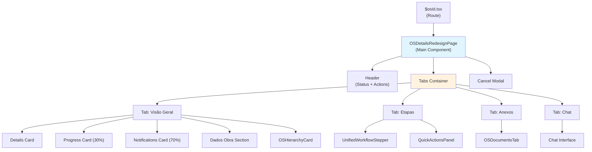
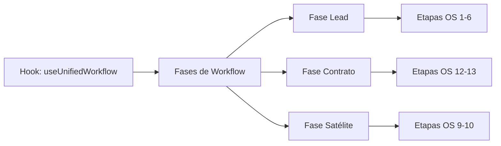
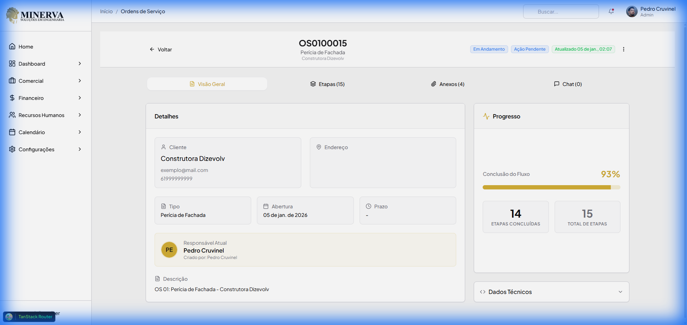
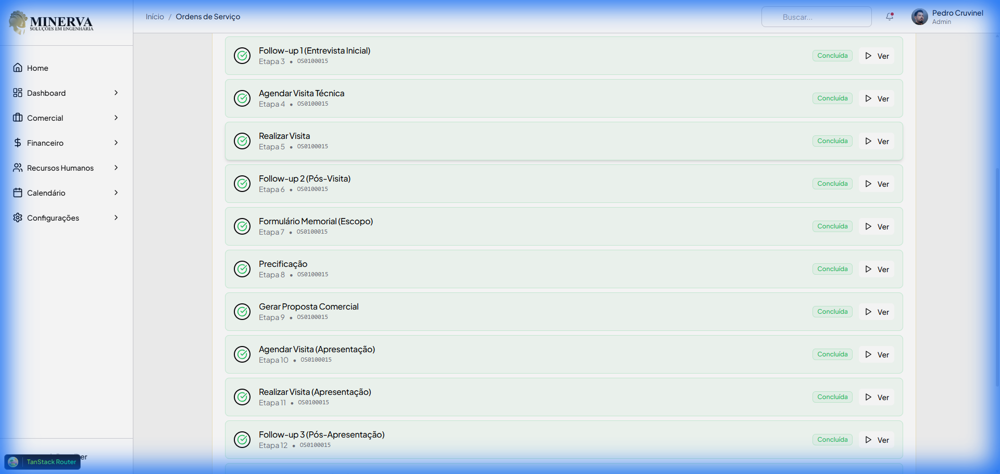
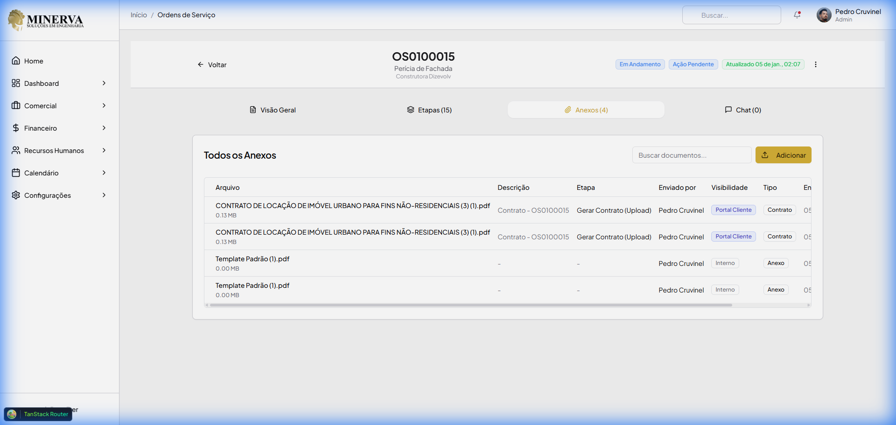
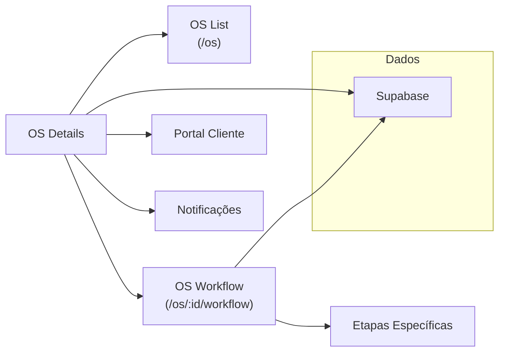

# Documentação Técnica: Página de Detalhes da OS

> **Versão:** 2.0  
> **Última Atualização:** 2026-01-05  
> **Status:** Completo

## Visão Geral

A página de Detalhes da Ordem de Serviço (OS) é a central de informações e gestão de uma OS específica no sistema MinervaV2. Ela oferece uma visualização completa do ciclo de vida da OS, permitindo acompanhar progresso, documentos, comunicação e realizar ações administrativas.

### Rota de Acesso

```
/os/:osId
```

**Exemplo:** `http://localhost:3000/os/6ad4ca49-a16d-4d52-8a82-048751b47040`

---

## Arquitetura de Componentes



---

## Arquivos Principais

| Arquivo | Caminho | Linhas | Descrição |
|---------|---------|--------|-----------|
| [Route]($osId.tsx) | `src/routes/_auth/os/$osId.tsx` | 46 | Rota TanStack Router |
| [OSDetailsRedesignPage](os-details-redesign-page.tsx) | `src/components/os/shared/pages/os-details-redesign-page.tsx` | 1201 | Componente principal |
| [UnifiedWorkflowStepper](unified-workflow-stepper.tsx) | `src/components/os/unified/unified-workflow-stepper.tsx` | 449 | Stepper de etapas |
| [OSDocumentsTab](os-documents-tab.tsx) | `src/components/os/tabs/os-documents-tab.tsx` | 576 | Tab de documentos |
| [OSHierarchyCard](os-hierarchy-card.tsx) | `src/components/os/shared/components/os-hierarchy-card.tsx` | 190 | Card de hierarquia |
| [OSNotificationsCard](os-notifications-card.tsx) | `src/components/os/shared/components/os-notifications-card.tsx` | 152 | Card de notificações |
| [useUnifiedWorkflow](use-unified-workflow.ts) | `src/lib/hooks/use-unified-workflow.ts` | 442 | Hook de workflow |
| [useOSHierarchy](use-os-hierarchy.ts) | `src/lib/hooks/use-os-hierarchy.ts` | - | Hook de hierarquia |

---

## Header e Status

O header exibe informações críticas da OS e ações disponíveis.

### Informações Exibidas

| Campo | Descrição |
|-------|-----------|
| **Código OS** | Identificador único (ex: `OS0100015`) |
| **Tipo OS** | Nome do tipo da OS (ex: "Perícia de Fachada") |
| **Cliente** | Nome do cliente vinculado |
| **Status Geral** | Badge colorido com status atual |
| **Status Situação** | Badge adicional de situação temporal |
| **Última Atualização** | Timestamp da última modificação |

### Status Geral (Possíveis valores)

> **📖 Documentação completa:** [STATUS_SYSTEM.md](./STATUS_SYSTEM.md)

| Status | Classe CSS | Descrição |
|--------|------------|-----------|
| `em_triagem` | `bg-muted text-muted-foreground` | Etapas iniciais (1-2) |
| `em_andamento` | `bg-primary/10 text-primary` | OS em execução |
| `concluido` | `bg-success/10 text-success` | Finalizado |
| `cancelado` | `bg-destructive/10 text-destructive` | Cancelado |

### Status Situação (Ação Pendente)

| Situação | Classe CSS | Descrição |
|----------|------------|-----------|
| `atrasado` | `bg-destructive text-destructive-foreground` | Prazo excedido |
| `aguardando_aprovacao` | `bg-secondary text-secondary-foreground` | Pendente aprovação |
| `aguardando_info` | `bg-warning/20 text-warning` | Aguardando dados |
| `alerta_prazo` | `bg-warning text-warning-foreground` | ≤2 dias restantes |
| `acao_pendente` | `bg-primary/10 text-primary` | Ação necessária |
| `finalizado` | `bg-muted text-muted-foreground` | Concluído |

### Ações do Header

| Ação | Condição | Descrição |
|------|----------|-----------|
| **Voltar** | Sempre | Retorna para lista de OS (`/os`) |
| **Menu (⋮)** | Status ≠ cancelado/concluido | Abre dropdown de ações |
| **Cancelar OS** | Via menu | Abre modal de cancelamento |

---

## Tab 1: Visão Geral (Overview)

A tab padrão que exibe informações gerais da OS em layout responsivo.

### Componentes

#### 1. Card de Cancelamento (Condicional)
Exibido apenas quando `status_geral === 'cancelado'`. Mostra:
- Cancelado por (nome)
- Data e hora do cancelamento
- Motivo do cancelamento

#### 2. Card de Detalhes (Grid 2:1)

| Seção | Campos |
|-------|--------|
| **Cliente** | Nome, email, telefone |
| **Endereço da Obra** | Logradouro, número, bairro, cidade/UF, CEP, complemento (fonte: Etapa 1) |
| **Dados da Obra** | Tipo edificação, blocos, unidades, pavimentos, telhado, piscina/elevador |
| **Tipo** | Nome do tipo de OS |
| **Abertura** | Data de entrada |
| **Prazo** | Data limite com indicador visual de SLA (cores e badges) |
| **Responsável Atual** | Avatar, nome, criado por |
| **Descrição** | Texto descritivo da OS |

#### 3. Card de Progresso (30% da coluna direita)

| Métrica | Descrição |
|---------|-----------|
| **% Conclusão** | Barra de progresso visual |
| **Etapas Concluídas** | Contador numérico |
| **Total de Etapas** | Contador numérico |

#### 4. Card de Notificações (70% da coluna direita)

Componente `OSNotificationsCard` que exibe:
- Notificações relacionadas à OS (últimas 10)
- Ícones por tipo (info, atencao, sucesso, tarefa, aprovacao)
- Título e mensagem completos (sem truncamento)
- Timestamp relativo ("há 5 minutos")
- ScrollArea para navegação

**Query Supabase:**
```typescript
const { data } = await supabase
  .from('notificacoes')
  .select('*')
  .or(`link_acao.ilike.%${osId}%,titulo.ilike.%${codigoOS}%,mensagem.ilike.%${codigoOS}%`)
  .order('created_at', { ascending: false })
  .limit(10);
```

#### 5. Hierarquia de OS

Componente `OSHierarchyCard` que exibe:
- OS Pai (se existir)
- OS Filhas (contratos derivados)
- Links navegáveis entre OS relacionadas

---

## Tab 2: Etapas (Workflow)

Exibe o fluxo de trabalho completo da OS usando o componente `UnifiedWorkflowStepper`.

### UnifiedWorkflowStepper



### Estrutura de Fases

| Fase | Código OS | Descrição |
|------|-----------|-----------|
| **LEAD** | OS-01 a OS-06 | Etapas de prospecção e venda |
| **CONTRATO** | OS-12, OS-13 | Etapas de execução de contrato |
| **SATELITE** | OS-09, OS-10 | Requisições auxiliares |

### Dados por Etapa

| Campo | Tipo | Descrição |
|-------|------|-----------|
| `id` | string | UUID da etapa |
| `nome_etapa` | string | Nome descritivo |
| `status` | enum | pendente/em_andamento/concluida/bloqueada/cancelada |
| `ordemOriginal` | number | Ordem na OS original |
| `ordemUnificada` | number | Ordem no fluxo unificado |
| `osId` | string | UUID da OS dona |
| `osCodigo` | string | Código da OS (ex: OS0100015) |
| `fase` | enum | LEAD/CONTRATO/SATELITE |

### Status Visual das Etapas

| Status | Ícone | Cor | Descrição |
|--------|-------|-----|-----------|
| `concluida` | ✓ CheckCircle2 | success | Etapa finalizada |
| `em_andamento` | ○ Circle | primary | Em execução |
| `bloqueada` | ⊘ AlertTriangle | warning | Aguardando dependência |
| `pendente` | ○ Circle | muted | Aguardando início |
| `cancelada` | ✕ XCircle | destructive | Cancelada |

### Ações nas Etapas

| Botão | Condição | Ação |
|-------|----------|------|
| **Ver** | Status = concluida | Navega para etapa (read-only) |
| **Iniciar** | Status = pendente/em_andamento | Navega para edição |

### QuickActionsPanel

Painel de ações rápidas para criação de OS auxiliares:
- **Requisição de Compras (OS-09)**
- **Requisição de Mão de Obra (OS-10)**

> Exibido apenas para OS do tipo contrato (OS-12, OS-13).

---

## Tab 3: Anexos (Documents)

Gerenciamento completo de documentos anexados à OS.

### Funcionalidades

| Ação | Descrição |
|------|-----------|
| **Listar** | Tabela com todos os documentos |
| **Buscar** | Filtro por nome de arquivo |
| **Upload** | Adicionar novos documentos |
| **Download** | Baixar documento selecionado |
| **Excluir** | Remover documento (com confirmação) |
| **Alterar Visibilidade** | Mudar entre Interno/Portal Cliente |

### Colunas da Tabela

| Coluna | Descrição |
|--------|-----------|
| **Nome** | Nome do arquivo com ícone de tipo |
| **Descrição** | Descrição/observação do documento |
| **Etapa** | Etapa onde foi anexado |
| **Enviado por** | Nome do colaborador |
| **Visibilidade** | Interno / Portal Cliente |
| **Tipo** | Classificação do documento |
| **Data** | Data de upload |
| **Ações** | Download / Excluir |

### Tipos de Documento

| Valor | Label |
|-------|-------|
| `contrato` | Contrato |
| `proposta` | Proposta |
| `tecnico` | Relatório Técnico |
| `financeiro` | Comprovante Financeiro |
| `laudo` | Laudo/Vistoria |
| `planta` | Planta/Projeto |
| `imagem` | Imagem/Foto |
| `outros` | Outros |

### Visibilidade

| Tipo | Ícone | Descrição |
|------|-------|-----------|
| `interno` | Lock | Apenas colaboradores |
| `portal_cliente` | Globe | Visível no portal do cliente |

### Documentos de OS Relacionadas

O componente recebe `relatedOsIds` para exibir documentos de:
- OS Pai (se existir)
- OS Filhas (contratos derivados)

Com indicador visual de origem via `origemOsCodigo`.

---

## Tab 4: Chat

Interface de comunicação em tempo real sobre a OS.

### Características

| Feature | Descrição |
|---------|-----------|
| **Real-time** | Mensagens atualizadas automaticamente |
| **Histórico** | Scroll por todas as mensagens anteriores |
| **Separador de data** | Agrupa mensagens por dia |
| **Avatar** | Foto do usuário remetente |
| **Badge etapa** | Indica etapa associada (se houver) |
| **Anexos** | Botão para enviar arquivos (em desenvolvimento) |

### Estrutura de Mensagem

| Campo | Tipo | Descrição |
|-------|------|-----------|
| `id` | string | UUID do comentário |
| `comentario` | string | Texto da mensagem |
| `tipo` | enum | comentario / sistema |
| `criado_em` | timestamp | Data/hora de envio |
| `usuario_nome` | string | Nome do autor |
| `usuario_avatar_url` | string? | URL do avatar |
| `etapa_nome` | string? | Nome da etapa associada |

### Atalhos de Teclado

| Tecla | Ação |
|-------|------|
| `Enter` | Enviar mensagem |
| `Shift + Enter` | Nova linha |

---

## Modal de Cancelamento

Modal para cancelar uma OS ativa com registro de auditoria.

### Motivos de Cancelamento

| Opção | Descrição |
|-------|-----------|
| Cliente desistiu | Cliente optou por não prosseguir |
| Proposta não aprovada | Proposta comercial recusada |
| Fora do escopo | Não se aplica aos serviços |
| Duplicidade de OS | OS criada em duplicidade |
| Erro no cadastro | Dados incorretos na criação |
| Outro | Campo texto para motivo customizado |

### Dados Registrados no Cancelamento

```typescript
metadata.cancelamento = {
  motivo: string;
  data: string;  // ISO timestamp
  cancelado_por_id: string;  // UUID do usuário
  cancelado_por_nome: string;
}
```

### Trilha de Auditoria

Inserção em `os_atividades`:
```typescript
{
  os_id: string;
  usuario_id: string;
  tipo: 'status_alterado';
  descricao: 'OS cancelada. Motivo: ...';
  metadados: {
    status_anterior: string;
    status_novo: 'cancelado';
    motivo_cancelamento: string;
    cancelado_por: string;
  }
}
```

---

## Integração com Supabase

### Tabelas Utilizadas

| Tabela | Operação | Descrição |
|--------|----------|-----------|
| `ordens_servico` | SELECT/UPDATE | Dados principais da OS |
| `os_etapas` | SELECT | Etapas do workflow |
| `os_comentarios` | SELECT/INSERT | Chat/comentários |
| `os_documentos` | SELECT/INSERT/DELETE | Documentos anexados |
| `os_atividades` | INSERT | Log de auditoria |
| `colaboradores` | SELECT | Dados de usuários |
| `clientes` | SELECT | Dados do cliente |
| `tipos_os` | SELECT | Tipo da OS |

### Views Utilizadas

| View | Descrição |
|------|-----------|
| `os_detalhes_completos` | Dados completos com joins |
| `vw_os_status_completo` | Status calculado e situação |

### RPCs Utilizadas

| RPC | Descrição |
|-----|-----------|
| `registrar_atividade_os` | Registra atividade na OS |

---

## Hooks Utilizados

### useOSHierarchy

Busca hierarquia da OS (pai e filhos):

```typescript
const { parent, children } = useOSHierarchy(osId);
```

### useUnifiedWorkflow

Combina etapas de múltiplas OS em workflow unificado:

```typescript
const {
  phases,       // Array de fases
  allSteps,     // Todas as etapas planas
  currentPhase, // Fase ativa
  currentStep,  // Etapa atual
  totalSteps,   // Total de etapas
  completedSteps, // Etapas concluídas
  loading,
  error
} = useUnifiedWorkflow(osId);
```

### useOSDocumentUpload

Gerencia upload e download de documentos:

```typescript
const {
  documents,
  uploadDocument,
  deleteDocument,
  downloadDocument,
  loading,
  error
} = useOSDocumentUpload(osId);
```

---

## Estados Locais do Componente

| Estado | Tipo | Descrição |
|--------|------|-----------|
| `loading` | boolean | Carregamento inicial |
| `osDetails` | OSDetails | Dados da OS |
| `workflowSteps` | WorkflowStep[] | Etapas do workflow |
| `comments` | Comment[] | Lista de comentários |
| `newComment` | string | Texto do novo comentário |
| `activeTab` | string | Tab ativa (overview/workflow/documents/comments) |
| `showCancelDialog` | boolean | Visibilidade do modal de cancelamento |
| `cancelReason` | string | Motivo selecionado |
| `cancelReasonOther` | string | Motivo customizado |
| `isCancelling` | boolean | Loading do cancelamento |
| `statusSituacao` | string | Status situação calculado |
| `isAutoUpdating` | boolean | Indicador de auto-update |
| `lastUpdate` | Date | Timestamp da última atualização |

---

## Responsividade

O componente é totalmente responsivo com breakpoints:

| Breakpoint | Comportamento |
|------------|---------------|
| Mobile | Tabs abreviadas, grid de 1 coluna |
| Tablet (sm) | Tabs completas, grid de 2 colunas |
| Desktop (lg) | Layout 2:1 para detalhes/progresso |

### Classes Responsivas Chave

```css
/* Tabs */
.hidden.sm:inline  /* Label completo em sm+ */
.sm:hidden         /* Label abreviado em mobile */

/* Grid de detalhes */
.grid-cols-1.lg:grid-cols-3  /* 3 colunas em lg+ */
.lg:col-span-2               /* Detalhes ocupa 2/3 */

/* Grid interno */
.grid-cols-1.md:grid-cols-2  /* 2 colunas em md+ */
```

---

## Performance

### Otimizações Implementadas

| Técnica | Descrição |
|---------|-----------|
| **Fallback Query** | Se view falhar, usa query direta com joins |
| **Lazy Loading** | Documentos carregados pela OSDocumentsTab |
| **Pagination** | Comentários paginados (10 por página) |
| **useMemo** | Cálculo de `relatedOsIds` memoizado |
| **Auto-Update Flag** | Diferencia loading inicial de atualização |

### Skeleton Loading

Durante o carregamento inicial, exibe:
- Header com placeholders animados
- Tabs skeleton
- Cards de progresso e detalhes com shimmer

---

## Screenshots

### Tab Visão Geral


### Tab Etapas


### Tab Anexos


---

## Extensibilidade

### Adicionando Nova Tab

1. Adicionar `TabsTrigger` no `TabsList`
2. Adicionar `TabsContent` correspondente
3. Criar componente dedicado se necessário

### Adicionando Nova Ação no Header

1. Adicionar item em `DropdownMenuContent`
2. Criar handler correspondente
3. Adicionar modal se necessário (seguir padrão AlertDialog)

### Adicionando Novo Status

1. Adicionar case no switch de cores do Badge
2. Mapear label no ternário de exibição
3. Atualizar enum se necessário

---

## Relacionamentos com Outros Módulos



---

## Changelog

| Versão | Data | Alterações |
|--------|------|------------|
| 1.0 | 2026-01-05 | Documentação inicial completa |
| 2.0 | 2026-01-05 | Atualizado: Endereço da Etapa 1, Card Notificações 30/70, Dados Obra, remoção Dados Técnicos |
| 2.1 | 2026-01-05 | Adicionado: Indicador Visual de SLA e correção de Avatar |
