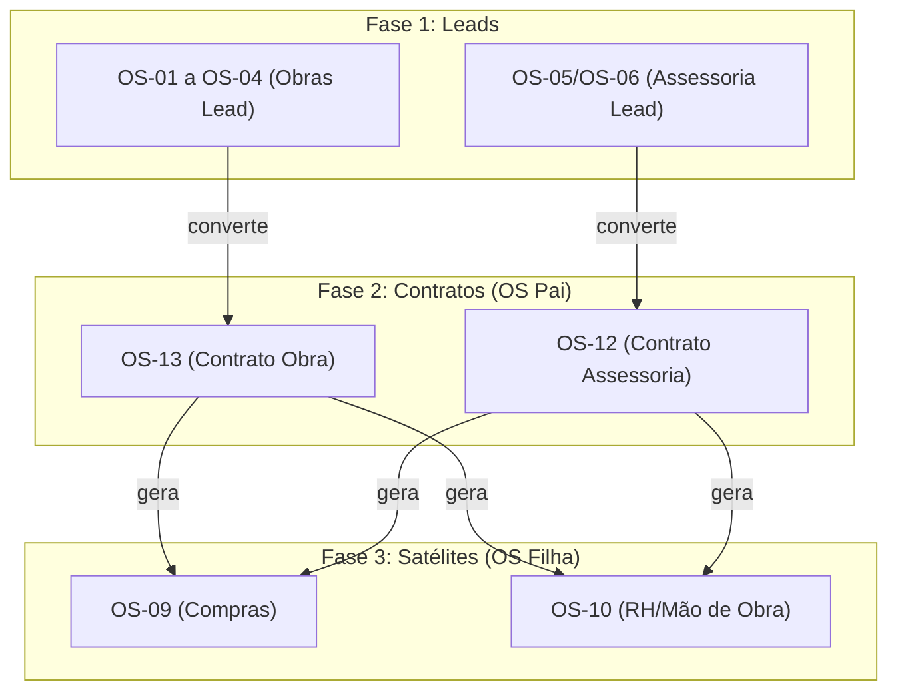
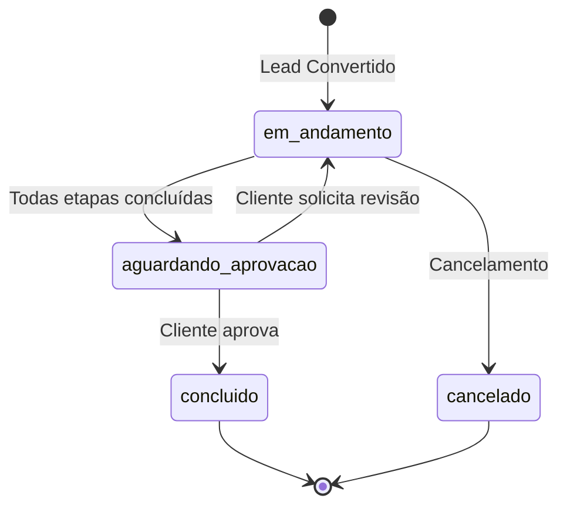

# Plano de Arquitetura OS Pai/Filha v2.0

> **Última Atualização:** 2025-12-04  
> **Versão:** 2.0  
> **Status:** Implementado (Migration 008)

---

## 1. Visão Geral da Arquitetura



### 1.1 Tipos de OS

| Tipo | Nome | Papel | `is_contract_active` |
|------|------|-------|----------------------|
| OS-01 a OS-04 | Leads Obras | Origem | `false` |
| OS-05/OS-06 | Leads Assessoria | Origem | `false` |
| **OS-13** | Start Contrato Obra | **Pai (Contrato)** | `true` |
| **OS-12** | Start Contrato Assessoria | **Pai (Contrato)** | `true` |
| OS-09 | Requisição de Compras | Filha (Satélite) | `false` |
| OS-10 | Requisição de Mão de Obra | Filha (Satélite) | `false` |

---

## 2. Relacionamento via `parent_os_id`

A coluna `parent_os_id` na tabela `ordens_servico` é a **chave de hierarquia**:

```
Lead (OS-01) ──[parent_os_id]──► Contrato (OS-13) ──[parent_os_id]──► Satélite (OS-09)
                                                   └──[parent_os_id]──► Satélite (OS-10)
```

### 2.1 Consultas SQL de Navegação

**Buscar todos os satélites de um Contrato:**
```sql
SELECT * FROM ordens_servico
WHERE parent_os_id = '<id-do-contrato-os-13>';
```

**Buscar o Contrato de origem de um Satélite:**
```sql
SELECT * FROM ordens_servico
WHERE id = (
  SELECT parent_os_id FROM ordens_servico WHERE id = '<id-do-satelite>'
);
```

**Árvore completa (Lead → Contrato → Satélites):**
```sql
WITH RECURSIVE os_tree AS (
  SELECT id, codigo_os, parent_os_id, tipo_os_id, 1 AS nivel
  FROM ordens_servico WHERE id = '<id-raiz>'
  
  UNION ALL
  
  SELECT o.id, o.codigo_os, o.parent_os_id, o.tipo_os_id, t.nivel + 1
  FROM ordens_servico o
  INNER JOIN os_tree t ON o.parent_os_id = t.id
)
SELECT * FROM os_tree ORDER BY nivel;
```

---

## 3. Fluxo de Negócio: Lead → Contrato

### 3.1 Conversão de Lead (OS-01/04) para Contrato (OS-13)

**Gatilho:** Usuário completa a última etapa do workflow de Lead.

**Ações do Backend:**

1. **Criar nova OS-13 (Contrato):**
   ```sql
   INSERT INTO ordens_servico (
     tipo_os_id,
     cliente_id,
     responsavel_id,
     criado_por_id,
     parent_os_id,           -- 👈 Referência ao Lead original
     is_contract_active,     -- 👈 Flag de contrato
     status_geral,
     descricao
   ) VALUES (
     (SELECT id FROM tipos_os WHERE codigo = 'OS-13'),
     <cliente_id_do_lead>,
     <responsavel_id>,
     <usuario_logado_id>,
     <id_da_os_lead>,        -- 👈 ID da OS-01
     true,                   -- 👈 É um contrato ativo
     'em_andamento',
     'Contrato gerado a partir do Lead ' || <codigo_os_lead>
   );
   ```

2. **Criar Centro de Custo vinculado:**
   ```sql
   INSERT INTO centros_custo (
     nome,
     cliente_id,
     tipo_os_id,
     ativo
   ) VALUES (
     'CC - ' || <nome_cliente> || ' - ' || <codigo_os_contrato>,
     <cliente_id>,
     (SELECT id FROM tipos_os WHERE codigo = 'OS-13'),
     true
   );
   ```

3. **Atualizar `cc_id` na OS-13:**
   ```sql
   UPDATE ordens_servico
   SET cc_id = <id_do_centro_custo_criado>
   WHERE id = <id_da_os_13>;
   ```

4. **Atualizar status do Lead original:**
   ```sql
   UPDATE ordens_servico
   SET status_geral = 'concluido'
   WHERE id = <id_da_os_lead>;
   ```

---

## 4. Fluxo de Negócio: Contrato → Satélites

### 4.1 Geração de OS-09 (Requisição de Compras)

**Gatilho:** Usuário preenche formulário de requisição de compras na OS-13.

**Ações do Backend:**

1. **Criar nova OS-09:**
   ```sql
   INSERT INTO ordens_servico (
     tipo_os_id,
     cliente_id,
     responsavel_id,
     criado_por_id,
     parent_os_id,           -- 👈 Referência ao Contrato
     cc_id,                  -- 👈 Usa o mesmo CC do Contrato Pai
     status_geral,
     descricao
   ) VALUES (
     (SELECT id FROM tipos_os WHERE codigo = 'OS-09'),
     <cliente_id_do_contrato>,
     <responsavel_compras>,
     <usuario_logado_id>,
     <id_da_os_13>,          -- 👈 ID do Contrato Pai
     <cc_id_do_contrato>,
     'em_andamento',
     'Requisição de compras para ' || <codigo_os_contrato>
   );
   ```

2. **Inserir itens na tabela `os_requisition_items`:**
   ```sql
   INSERT INTO os_requisition_items (
     os_id,                  -- 👈 Vínculo direto com OS-09
     tipo,
     descricao,
     quantidade,
     unidade_medida,
     preco_unitario,
     prazo_necessidade,
     cep, logradouro, numero, bairro, cidade, uf
   ) VALUES (
     <id_da_os_09>,          -- 👈 Usa os_id, NÃO os_etapa_id
     'Material',
     'Cimento CP-II 50kg',
     100,
     'UN',
     35.00,
     '7 dias',
     ...
   );
   ```

### 4.2 Geração de OS-10 (Requisição de Mão de Obra)

**Gatilho:** Usuário preenche formulário de requisição de RH na OS-13.

**Ações do Backend:**

1. **Criar nova OS-10:**
   ```sql
   INSERT INTO ordens_servico (
     tipo_os_id,
     cliente_id,
     responsavel_id,
     criado_por_id,
     parent_os_id,
     cc_id,
     status_geral,
     descricao
   ) VALUES (
     (SELECT id FROM tipos_os WHERE codigo = 'OS-10'),
     <cliente_id_do_contrato>,
     <responsavel_rh>,
     <usuario_logado_id>,
     <id_da_os_13>,
     <cc_id_do_contrato>,
     'em_andamento',
     'Requisição de mão de obra para ' || <codigo_os_contrato>
   );
   ```

2. **Inserir vagas na tabela `os_vagas_recrutamento`:**
   ```sql
   INSERT INTO os_vagas_recrutamento (
     os_id,                  -- 👈 Vínculo com OS-10
     cargo_funcao,
     quantidade,
     salario_base,
     habilidades_necessarias,
     urgencia
   ) VALUES (
     <id_da_os_10>,
     'Pedreiro',
     3,
     2500.00,
     'Experiência com alvenaria estrutural',
     'alta'
   );
   ```

---

## 5. Regras de Negócio

### 5.1 Validações

| Regra | Descrição |
|-------|-----------|
| **R1** | Um Lead só pode gerar UM Contrato (relação 1:1) |
| **R2** | Um Contrato pode gerar N Satélites (relação 1:N) |
| **R3** | Satélites herdam o `cc_id` do Contrato Pai |
| **R4** | `is_contract_active = true` apenas para OS-12 e OS-13 |
| **R5** | `os_requisition_items` deve ter `os_id` OU `os_etapa_id` (nunca ambos nulos) |

### 5.2 Estados de um Contrato



---

## 6. Estruturas de Dados

### 6.1 Novas Colunas em `ordens_servico`

| Coluna | Tipo | Default | Descrição |
|--------|------|---------|-----------|
| `is_contract_active` | boolean | `false` | Identifica contratos faturáveis |
| `dados_publicos` | jsonb | `'{}'` | Dados para formulários externos (OS-07) |

### 6.2 Tabela `os_vagas_recrutamento`

Vinculada à OS-10 para gerenciar vagas de recrutamento.

| Coluna | Tipo | Descrição |
|--------|------|-----------|
| `cargo_funcao` | text | Nome do cargo (Pedreiro, Servente, etc.) |
| `quantidade` | int | Número de vagas |
| `salario_base` | numeric | Salário oferecido |
| `status` | text | `aberta`, `em_selecao`, `preenchida`, `cancelada` |
| `urgencia` | text | `baixa`, `normal`, `alta`, `critica` |

---

## 7. Implementação Frontend

### 7.1 Componentes Necessários

1. **Botão "Converter para Contrato"** - No workflow de Lead (OS-01/04)
2. **Botão "Nova Requisição de Compras"** - No dashboard do Contrato (OS-13)
3. **Botão "Nova Requisição de RH"** - No dashboard do Contrato (OS-13)
4. **Card de Hierarquia** - Exibe visualmente Lead → Contrato → Satélites

### 7.2 Hook Sugerido

```typescript
// hooks/use-os-hierarchy.ts
export function useOsHierarchy(osId: string) {
  // Busca parent_os_id recursivamente
  // Retorna { lead, contrato, satelites }
}
```

---

## 8. Migration Aplicada

**Arquivo:** `supabase/migrations/008_os_parent_child_architecture.sql`

**Alterações:**
- ✅ `ordens_servico.is_contract_active`
- ✅ `ordens_servico.dados_publicos`
- ✅ `os_requisition_items.os_id` (FK nullable)
- ✅ `os_requisition_items.os_etapa_id` alterada para nullable
- ✅ Constraint `chk_requisition_item_vinculo`
- ✅ Nova tabela `os_vagas_recrutamento`

---

**Referências:**
- [DATABASE_SCHEMA.md](../sistema/DATABASE_SCHEMA.md) - Schema completo v2.6
- Migration 001: parent_os_id já existente
