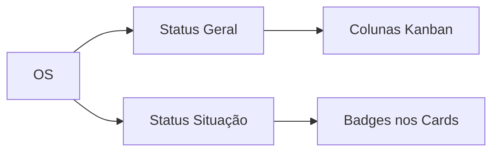
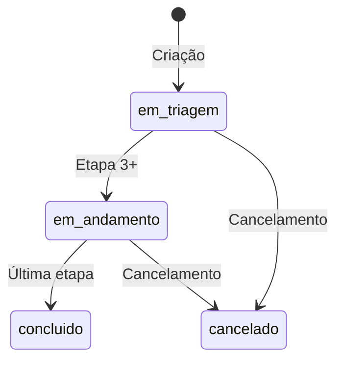

# 📊 Documentação Técnica: Sistema de Status de OS

> **Última atualização:** 2026-01-07  
> **Versão:** 1.0  
> **Status:** Produção

Este documento define a arquitetura e padronização visual do sistema de status de Ordens de Serviço no MinervaV2.

---

## 1. Visão Geral

O sistema de status de OS utiliza **dois níveis complementares**:

| Nível | Nome | Propósito | Armazenamento |
|-------|------|-----------|---------------|
| **1** | Status Geral | Ciclo de vida da OS | Coluna `status_geral` (enum) |
| **2** | Status Situação | Ação necessária na etapa atual | Coluna `status_situacao` (enum) |



---

## 2. Status Geral (Ciclo de Vida)

### 2.1 Valores do Enum

```sql
-- Enum: os_status_geral
CREATE TYPE os_status_geral AS ENUM (
    'em_triagem',
    'em_andamento',
    'aguardando_info',      -- Legado (manter compatibilidade)
    'aguardando_aprovacao', -- Legado (manter compatibilidade)
    'concluido',
    'cancelado'
);
```

### 2.2 Tabela de Referência Visual

| Valor | Label | Background | Texto | Ícone | Uso |
|-------|-------|------------|-------|-------|-----|
| `em_triagem` | Em Triagem | `bg-muted` | `text-muted-foreground` | FileSearch | Etapas 1-2 |
| `em_andamento` | Em Andamento | `bg-primary/10` | `text-primary` | Play | Execução ativa |
| `concluido` | Concluído | `bg-success/10` | `text-success` | CheckCircle2 | Finalizado |
| `cancelado` | Cancelado | `bg-destructive/10` | `text-destructive` | XCircle | Cancelado |

### 2.3 Uso no Kanban

O Kanban usa `status_geral` para definir as **colunas**:

```tsx
// action-kanban.tsx
const colunas = useMemo(() => ({
    emTriagem: os.filter(o => o.status_geral === 'em_triagem'),
    emAndamento: os.filter(o => 
        ['em_andamento', 'aguardando_info', 'aguardando_aprovacao'].includes(o.status_geral)
    ),
    concluido: os.filter(o => o.status_geral === 'concluido'),
    cancelado: os.filter(o => o.status_geral === 'cancelado'),
}), [os]);
```

### 2.4 Transições Válidas



---

## 3. Status Situação (Ação Pendente)

### 3.1 Valores do Enum

```sql
-- Enum: os_status_situacao
CREATE TYPE os_status_situacao AS ENUM (
    'acao_pendente',
    'aguardando_aprovacao',
    'aguardando_info',
    'atrasado',
    'alerta_prazo',
    'finalizado'
);
```

### 3.2 Tabela de Referência Visual

| Valor | Label | Background | Texto | Prioridade |
|-------|-------|------------|-------|:----------:|
| `atrasado` | Atrasado | `bg-destructive` | `text-destructive-foreground` | 1 (máxima) |
| `aguardando_aprovacao` | Aguard. Aprovação | `bg-secondary` | `text-secondary-foreground` | 2 |
| `aguardando_info` | Aguard. Info | `bg-warning/20` | `text-warning` | 3 |
| `alerta_prazo` | Alerta Prazo | `bg-warning` | `text-warning-foreground` | 4 |
| `acao_pendente` | Ação Pendente | `bg-primary/10` | `text-primary` | 5 |
| `finalizado` | Finalizado | `bg-muted` | `text-muted-foreground` | 6 (mínima) |

### 3.3 Regras de Cálculo Automático

A situação é calculada com base em:

| Regra | Condição | Resultado |
|-------|----------|-----------|
| 1 | `status_geral IN ('concluido', 'cancelado')` | `finalizado` |
| 2 | `data_prazo_etapa < CURRENT_DATE` | `atrasado` |
| 3 | `requer_aprovacao = true AND etapa_status = 'pendente'` | `aguardando_aprovacao` |
| 4 | `data_prazo_etapa <= CURRENT_DATE + 2` | `alerta_prazo` |
| 5 | Manual pelo usuário | `aguardando_info` |
| 6 | Default | `acao_pendente` |

### 3.4 Uso como Badge

```tsx
// Componente SituacaoBadge
import { STATUS_SITUACAO_CONFIG, type StatusSituacao } from '@/lib/types';

function SituacaoBadge({ situacao }: { situacao?: StatusSituacao }) {
    if (!situacao || situacao === 'finalizado') return null;
    
    const config = STATUS_SITUACAO_CONFIG[situacao];
    
    return (
        <Badge className={config.className}>
            {config.label}
        </Badge>
    );
}
```

---

## 4. Tipos TypeScript

### 4.1 Definição em `types.ts`

```typescript
// src/lib/types.ts

// Status Geral (ciclo de vida)
export type OSStatus =
  | 'em_triagem'
  | 'em_andamento'
  | 'aguardando_info'
  | 'aguardando_aprovacao'
  | 'concluido'
  | 'cancelado';

// Status Situação (ação na etapa)
export type StatusSituacao =
  | 'acao_pendente'
  | 'aguardando_aprovacao'
  | 'aguardando_info'
  | 'atrasado'
  | 'alerta_prazo'
  | 'finalizado';

// Configuração visual dos badges
export const STATUS_SITUACAO_CONFIG: Record<StatusSituacao, { 
    label: string; 
    className: string 
}> = {
  'atrasado': { 
    label: 'Atrasado', 
    className: 'bg-destructive text-destructive-foreground' 
  },
  'aguardando_aprovacao': { 
    label: 'Aguard. Aprovação', 
    className: 'bg-secondary text-secondary-foreground' 
  },
  'aguardando_info': { 
    label: 'Aguard. Info', 
    className: 'bg-warning/20 text-warning' 
  },
  'alerta_prazo': { 
    label: 'Alerta Prazo', 
    className: 'bg-warning text-warning-foreground' 
  },
  'acao_pendente': { 
    label: 'Ação Pendente', 
    className: 'bg-primary/10 text-primary' 
  },
  'finalizado': { 
    label: 'Finalizado', 
    className: 'bg-muted text-muted-foreground' 
  },
};
```

---

## 5. Banco de Dados

### 5.1 Coluna em `ordens_servico`

```sql
-- A coluna foi adicionada via migration
ALTER TABLE ordens_servico 
ADD COLUMN status_situacao os_status_situacao DEFAULT 'acao_pendente';

-- Índice para performance
CREATE INDEX idx_os_status_situacao ON ordens_servico(status_situacao);
```

### 5.2 View de Status Completo

A view `vw_os_status_completo` expõe ambos os status:

```sql
SELECT 
    os.id,
    os.status_geral,       -- Ciclo de vida
    os.status_situacao,    -- Ação pendente (da coluna)
    -- Flags computadas para conveniência
    CASE WHEN prazo < CURRENT_DATE THEN true ELSE false END AS is_atrasado,
    CASE WHEN prazo <= CURRENT_DATE + 2 THEN true ELSE false END AS is_alerta_prazo
FROM ordens_servico os
...
```

---

## 6. Componentes que Utilizam Badges de Status

### 6.1 Dashboard Principal

| Componente | Arquivo | status_geral | status_situacao | Descrição |
|------------|---------|:------------:|:---------------:|-----------|
| **ActionKanban** | `src/components/dashboard/action-kanban.tsx` | ✅ Colunas | ✅ Badges | Kanban principal do dashboard com 4 colunas |
| **ManagerTable** | `src/components/dashboard/manager-table.tsx` | ✅ Coluna | ✅ Coluna | Tabela de gestão com filtros de status |
| **DashboardPage** | `src/components/dashboard/dashboard-page.tsx` | ✅ | ❌ | Página principal do dashboard |
| **DashboardColaborador** | `src/components/dashboard/dashboard-colaborador.tsx` | ✅ | ❌ | Dashboard específico para colaboradores |
| **RecentOSList** | `src/components/dashboard/recent-os-list.tsx` | ✅ Badge | ❌ | Lista de OSs recentes |
| **OSStatusChart** | `src/components/dashboard/os-status-chart.tsx` | ✅ Gráfico | ❌ | Gráfico de status de OSs |

---

### 6.2 Dashboard Executivo (Controladoria)

| Componente | Arquivo | status_geral | status_situacao | Descrição |
|------------|---------|:------------:|:---------------:|-----------|
| **WorkloadKanban** | `src/components/dashboard/executive/workload-kanban.tsx` | ❌ | ✅ Badges | Kanban de carga por coordenador |

---

### 6.3 Páginas de Detalhes de OS

| Componente | Arquivo | status_geral | status_situacao | Descrição |
|------------|---------|:------------:|:---------------:|-----------|
| **OSDetailsRedesignPage** | `src/components/os/shared/pages/os-details-redesign-page.tsx` | ✅ Header | ✅ Header | Página principal de detalhes |
| **OSDetailsPage** | `src/components/os/shared/pages/os-details-page.tsx` | ✅ Badge | ❌ | Página legada de detalhes |
| **OSDetailsWorkflowPage** | `src/components/os/shared/pages/os-details-workflow-page.tsx` | ✅ Badge | ❌ | Workflow OS 1-4 |
| **OSDetailsAssessoriaPage** | `src/components/os/assessoria/os-5-6/pages/os-details-assessoria-page.tsx` | ✅ Badge | ❌ | Workflow OS 5-6 |
| **LinkedOSDetailModal** | `src/components/os/linked-os-detail-modal.tsx` | ✅ Badge | ❌ | Modal de OS vinculada |

---

### 6.4 Workflows de OS

| Componente | Arquivo | status_geral | status_situacao | Descrição |
|------------|---------|:------------:|:---------------:|-----------|
| **OS07WorkflowPage** | `src/components/os/assessoria/os-7/pages/os07-workflow-page.tsx` | ✅ | ❌ | Aprovação de Reforma |
| **OS08WorkflowPage** | `src/components/os/assessoria/os-8/pages/os08-workflow-page.tsx` | ✅ | ❌ | Visita Técnica |
| **OS09WorkflowPage** | `src/components/os/administrativo/os-9/pages/os09-workflow-page.tsx` | ✅ | ✅ | Requisição de Compras |
| **OS10WorkflowPage** | `src/components/os/administrativo/os-10/pages/os10-workflow-page.tsx` | ✅ | ❌ | Mão de Obra / RH |
| **OS11WorkflowPage** | `src/components/os/assessoria/os-11/pages/os11-workflow-page.tsx` | ✅ | ❌ | Laudo Pontual |
| **OS12WorkflowPage** | `src/components/os/assessoria/os-12/pages/os12-workflow-page.tsx` | ✅ | ❌ | Assessoria Anual |

---

### 6.5 Listagens e Tabelas

| Componente | Arquivo | status_geral | status_situacao | Descrição |
|------------|---------|:------------:|:---------------:|-----------|
| **OSListPage** | `src/components/os/shared/pages/os-list-page.tsx` | ✅ Filtro | ❌ | Listagem geral de OSs |
| **OSTable** | `src/components/os/shared/components/os-table.tsx` | ✅ Coluna | ❌ | Tabela reutilizável de OS |
| **OSHierarchyCard** | `src/components/os/shared/components/os-hierarchy-card.tsx` | ✅ Badge | ❌ | Card de hierarquia OS |
| **QuickActionsPanel** | `src/components/os/unified/quick-actions-panel.tsx` | ✅ | ❌ | Ações rápidas |

---

### 6.6 Módulo de Clientes

| Componente | Arquivo | status_geral | status_situacao | Descrição |
|------------|---------|:------------:|:---------------:|-----------|
| **ClienteTabHistoricoOS** | `src/components/clientes/tabs/cliente-tab-historico-os.tsx` | ✅ Badge | ❌ | Histórico de OS do cliente |
| **ClienteHistoricoCompleto** | `src/components/clientes/ClienteHistoricoCompleto.tsx` | ✅ Badge | ❌ | Histórico completo do cliente |

---

### 6.7 Módulo Financeiro

| Componente | Arquivo | status_geral | status_situacao | Descrição |
|------------|---------|:------------:|:---------------:|-----------|
| **TabHistoricoCompras** | `src/components/financeiro/compras/tab-historico-compras.tsx` | ✅ Badge | ❌ | Histórico de compras |
| **SheetDetalhesRequisicao** | `src/components/financeiro/compras/sheet-detalhes-requisicao.tsx` | ✅ Badge | ❌ | Detalhes de requisição |

---

### 6.8 Módulo Assessoria

| Componente | Arquivo | status_geral | status_situacao | Descrição |
|------------|---------|:------------:|:---------------:|-----------|
| **AnaliseReformas** | `src/components/assessoria/analise-reformas.tsx` | ✅ Badge | ❌ | Análise de reformas |

---

### 6.9 Portal do Colaborador

| Componente | Arquivo | status_geral | status_situacao | Descrição |
|------------|---------|:------------:|:---------------:|-----------|
| **MinhasOSPage** | `src/app/colaborador/minhas-os/page.tsx` | ✅ Badge | ❌ | "Minhas OSs" do colaborador |
| **ColaboradorDashboard** | `src/app/colaborador/dashboard/page.tsx` | ✅ Badge | ❌ | Dashboard do colaborador |

---

### 6.10 Resumo de Uso

| Tipo de Status | Total de Componentes | Principais Locais |
|----------------|:--------------------:|-------------------|
| `status_geral` | ~25+ | Dashboard, Listagens, Workflows |
| `status_situacao` | 5 | ActionKanban, ManagerTable, WorkloadKanban, OSDetailsRedesignPage, OS09 |

> **Nota:** Componentes marcados com ❌ podem ser candidatos para adicionar badges de `status_situacao` no futuro.

## 7. Referências

- [DESIGN_SYSTEM.md](./DESIGN_SYSTEM.md) - Cores e componentes base
- [OS_DETAILS_PAGE.md](./OS_DETAILS_PAGE.md) - Página de detalhes
- [SLA_APPROVAL_TRANSFER.md](./SLA_APPROVAL_TRANSFER.md) - Sistema de prazos

---

## 8. Changelog

| Versão | Data | Alterações |
|--------|------|------------|
| 1.1 | 2026-01-07 | Adicionada seção 6 completa listando todos os componentes que usam badges de status |
| 1.0 | 2026-01-07 | Documentação inicial - separação Status Geral / Situação |
