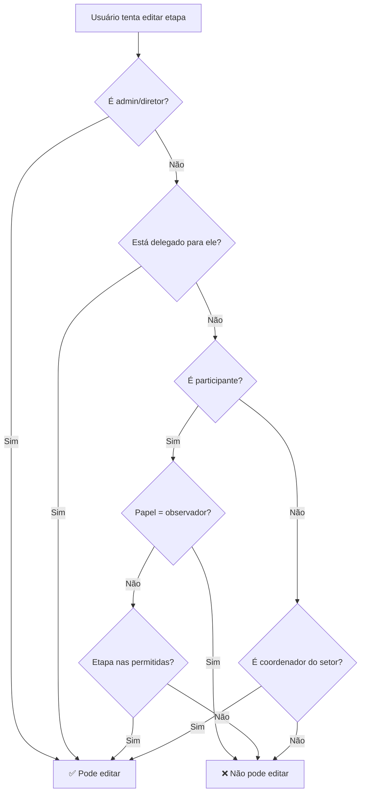

# 📋 Sistema de Responsabilidade por Setor

> **Versão:** 1.0  
> **Data:** 2026-01-14  
> **Status:** ✅ Produção  
> **Dependências:** Supabase, os-ownership-rules.ts

---

## 1. Visão Geral

O **Sistema de Responsabilidade por Setor** controla quem pode editar cada etapa de uma OS baseado em:

1. **Setor da Etapa** - Definido por `os-ownership-rules.ts`
2. **Coordenador do Setor** - Responsável padrão
3. **Delegação** - Coordenador pode delegar para outro do mesmo setor
4. **Participantes** - Usuários adicionados manualmente com papéis específicos

---

## 2. Arquitetura

```
┌─────────────────────────────────────────────────────────────────────┐
│                        WorkflowAccordion                            │
│  ┌─────────────────────────────────────────────────────────────┐   │
│  │ AccordionTrigger                                             │   │
│  │   "Etapa 1: Identificação do Cliente"                       │   │
│  │   "Setor: Administrativo • Responsável: João (delegado)"    │   │
│  └─────────────────────────────────────────────────────────────┘   │
└─────────────────────────────────────────────────────────────────────┘
                                │
                                ▼
┌─────────────────────────────────────────────────────────────────────┐
│                     useOSResponsabilidade                           │
│  • getResponsavelEtapa() → Busca responsável atual                 │
│  • delegarEtapa() → Delega para outro colaborador                  │
│  • podeEditarEtapa() → Verifica permissão                          │
└─────────────────────────────────────────────────────────────────────┘
                                │
                                ▼
┌─────────────────────────────────────────────────────────────────────┐
│                       Supabase RPCs                                 │
│  • delegar_etapa()                                                  │
│  • revogar_delegacao()                                              │
│  • pode_editar_etapa()                                              │
└─────────────────────────────────────────────────────────────────────┘
```

---

## 3. Tabelas do Banco

### os_participantes

```sql
CREATE TABLE os_participantes (
  id UUID PRIMARY KEY DEFAULT gen_random_uuid(),
  ordem_servico_id UUID REFERENCES ordens_servico(id),
  colaborador_id UUID REFERENCES colaboradores(id),
  papel TEXT CHECK (papel IN ('responsavel', 'participante', 'observador')),
  setor_id UUID REFERENCES setores(id),
  etapas_permitidas INTEGER[],  -- null = todas do setor
  adicionado_por_id UUID REFERENCES colaboradores(id),
  adicionado_em TIMESTAMPTZ DEFAULT NOW(),
  observacao TEXT
);
```

### os_etapas_responsavel

```sql
CREATE TABLE os_etapas_responsavel (
  id UUID PRIMARY KEY DEFAULT gen_random_uuid(),
  etapa_id UUID REFERENCES os_etapas(id),
  responsavel_id UUID REFERENCES colaboradores(id),
  delegado_por_id UUID REFERENCES colaboradores(id),
  delegado_em TIMESTAMPTZ DEFAULT NOW(),
  motivo TEXT,
  ativo BOOLEAN DEFAULT TRUE
);
```

---

## 4. Hooks

### useOSResponsabilidade

Hook principal para gestão de responsabilidade.

```tsx
const {
  participantes,
  delegacoes,
  delegarEtapa,
  revogarDelegacao,
  podeEditarEtapa,
  getResponsavelEtapa,
} = useOSResponsabilidade(osId);
```

### useEtapaPermissoes

Hook simplificado para verificar permissões de uma etapa.

```tsx
const { podeEditar, responsavel, setor } = useEtapaPermissoes(osId, etapaOrdem);
```

### useEnrichedSteps

Enriquece steps estáticos com dados de responsabilidade.

```tsx
const enrichedSteps = useEnrichedSteps(osId, steps, 'OS-08');
```

---

## 5. Componentes

| Componente | Descrição |
|------------|-----------|
| `StepResponsibilityHeader` | Cabeçalho com setor e responsável |
| `StepResponsibilityInfo` | Versão inline do header |
| `StepResponsibilityBadge` | Badge compacto |
| `DelegacaoModal` | Modal para delegar etapa |
| `OSParticipantesPanel` | Painel de gestão de participantes |

---

## 6. Interface WorkflowStepDefinition

```typescript
interface WorkflowStepDefinition {
  id: number;
  title: string;
  short?: string;
  
  // Campos de responsabilidade (v3.1)
  setor?: 'administrativo' | 'obras' | 'assessoria';
  setorNome?: string;
  responsavelId?: string;
  responsavelNome?: string;
  responsavelCargo?: string;
  isDelegado?: boolean;
  podeEditar?: boolean;
  podeDelegar?: boolean;
  
  /** @deprecated Use setorNome */
  responsible?: string;
}
```

---

## 7. Uso nas OS

### Exemplo de Definição de Steps

```typescript
const STEPS: WorkflowStepDefinition[] = [
  { 
    id: 1, 
    title: 'Identificação do Cliente',
    setor: 'administrativo',
    setorNome: 'Administrativo',
  },
  { 
    id: 2, 
    title: 'Realizar Visita',
    setor: 'assessoria',
    setorNome: 'Assessoria',
  },
];
```

### OS Atualizadas

- ✅ OS-05/06 (12 etapas)
- ✅ OS-07 (5 etapas)
- ✅ OS-08 (7 etapas)

---

## 8. Regras de Permissão



---

## 9. Arquivos Relevantes

| Arquivo | Descrição |
|---------|-----------|
| `src/lib/types/os-responsabilidade.ts` | Tipos TypeScript |
| `src/lib/hooks/use-os-responsabilidade.ts` | Hook principal |
| `src/lib/hooks/use-etapa-permissoes.ts` | Hook simplificado |
| `src/lib/hooks/use-enriched-steps.ts` | Enriquecer steps |
| `src/components/os/shared/components/step-responsibility-header.tsx` | Header de responsabilidade |
| `src/components/os/shared/components/delegacao-modal.tsx` | Modal de delegação |
| `src/components/os/shared/components/os-participantes-panel.tsx` | Painel de participantes |
| `supabase/migrations/20260114_create_os_responsabilidade_*.sql` | Migrations do banco |

---

---

## 10. Implementação da Delegação (Update Jan/2026)

### Componente OSHeaderDelegacao

Componente centralizado para delegação, capaz de operar em modo autônomo (buscando dados do banco) ou controlado.

- **Localização**: `src/components/os/shared/components/os-header-delegacao.tsx`
- **Funcionalidades**:
  - Busca automática de colaboradores elegíveis por setor.
  - Seleção múltipla de etapas.
  - Delegação em lote.
  - Visualização de delegações ativas.

### Integração na Página de Detalhes

A funcionalidade foi integrada ao menu de opções da `OSDetailsRedesignPage`, permitindo acesso rápido sem poluir a interface principal.

- **Trigger**: Item "Delegar Etapas" no menu dropdown (três pontos).
- **Modal**: Utiliza o componente `OSHeaderDelegacao` dentro de um `Dialog`.
- **Acessibilidade**: Inclui `DialogDescription` e navegação via teclado.

### Correções Implementadas

- **Query de Etapas**: Utiliza a coluna `os_id` (anteriormente `ordem_servico_id`) para compatibilidade com o schema atual.
- **Tipagem**: Uso de `cargo_slug` do `currentUser` para verificação de permissões.

---

**Última Atualização:** 2026-01-14
